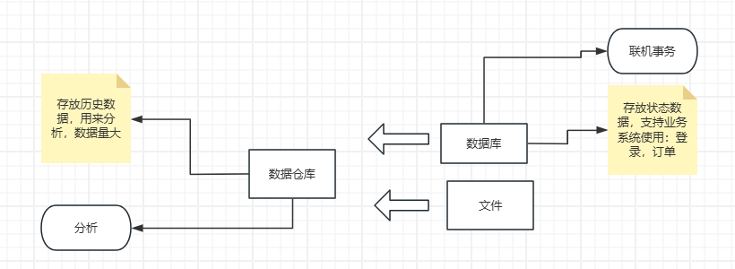
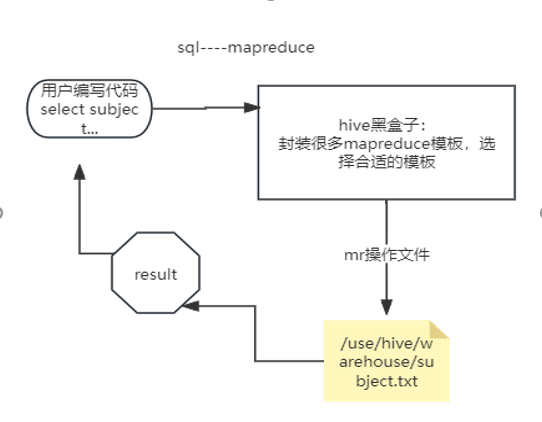
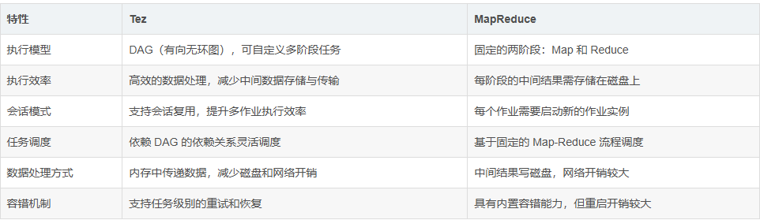
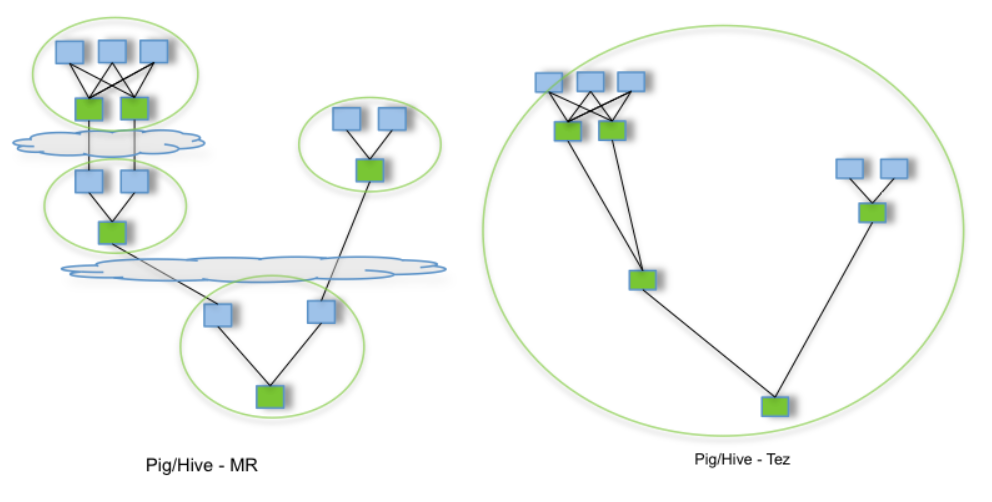
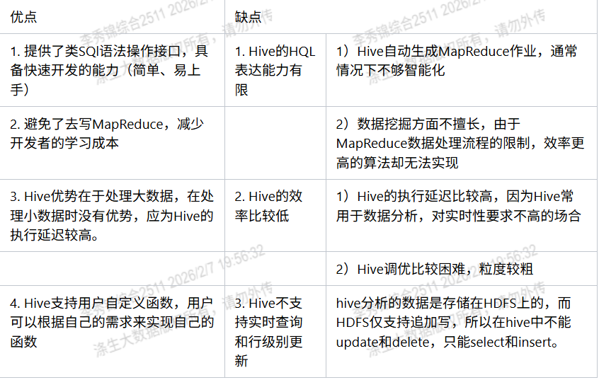
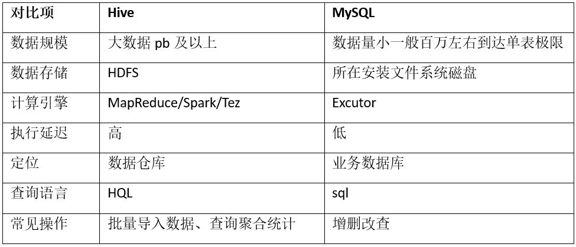
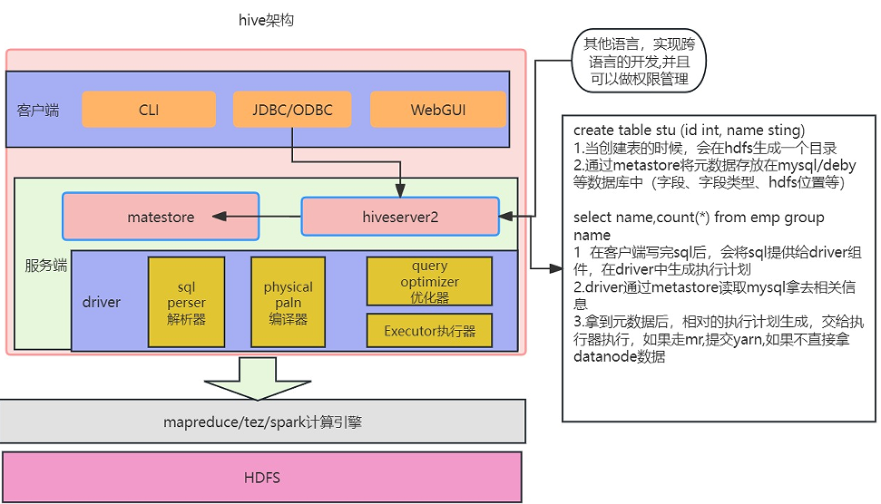
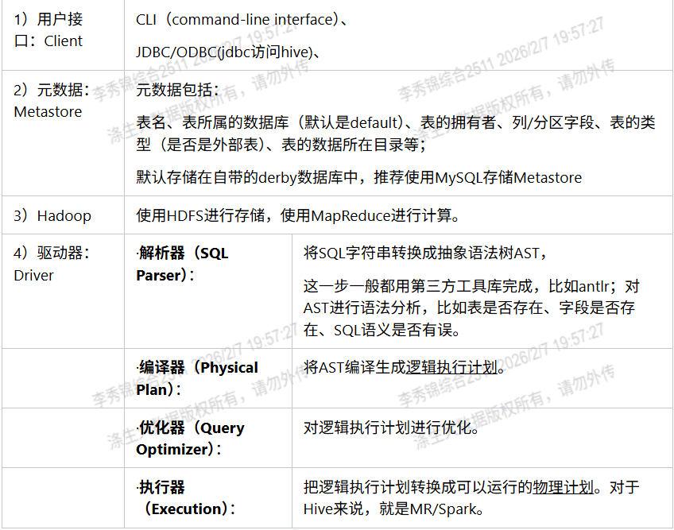
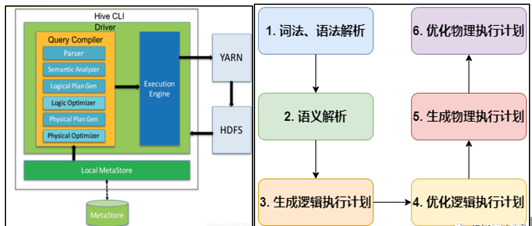
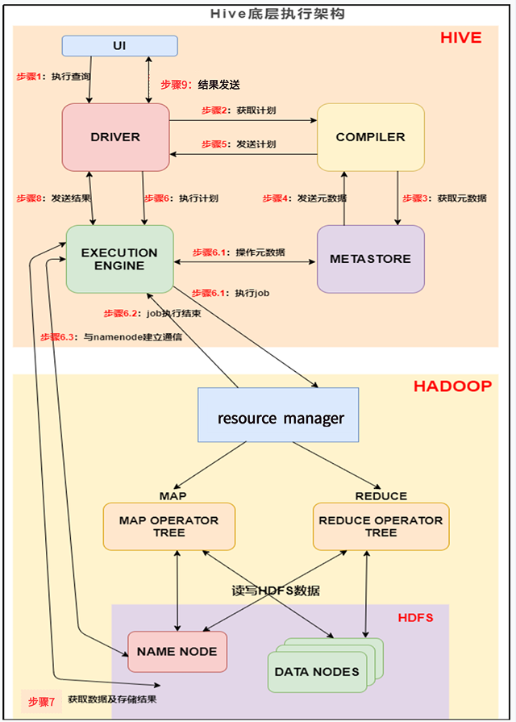

# 1.Hive入门及基础概念

## 1.1 Hive背景概述(☆了解)

### 1.1.1.什么是Hive？

&emsp;&emsp;互联网时代，搜索引擎、电子商务、社交网络等会产生庞大的数据量，数据存储和分析面临挑战，存储扩容困难，统计分析复杂。为了解决庞大数据的处理挑战，我们有了HDFS来存储海量数据、MapReduce来对海量数据进行分布式并行计算、Yarn来实现资源管理和作业调度。但是MapReduce编程不方便，HDFS上的文件没有Schema，统计分析比较困难，为了解决这个问题，Facebook一帮大牛开发了Hive。

&emsp;&emsp;什么是Hive呢？<span style="color:red">Hive是一种数据仓库工具</span>。首先要明确的是，Hive只是一种工具。那么这种工具是用来干什么的呢？<span style="color:red">可以用Hive将结构化的数据文件映射为一张数据库表，并提供完整的SQL查询功能，可以将SQL语句转换为MapReduce任务运行。所以Hive本身并不具备存储功能，要将它和数据库区分开。</span>



### 1.1.2.为什么要用Hive？

&emsp;&emsp;那么Hive是在什么场景下出现的呢？事实上，只要我们搞清楚了Hive的来源和初衷，就能深刻地理解Hive是干什么的。Hive是Facebook开发构建于Hadoop集群之上的数据仓库应用，它<mark>提供了类似于SQL语法的HQL语句作为数据访问接口</mark>，这使得普通分析人员在应用Hadoop的过程中更加容易学习。至于Facebook为什么使用Hadoop和Hive组建其数据仓库，大致的原因如下：

(1) Facebook的数据仓库一开始是构建于MySQL之上的，但是随着数据量的增加，某些查询需要几小时甚至几天才能完成。  
(2) 当数据量接近1TB的时候，MySQL后台进程宕掉，这时Facebook决定将数据仓库转移到Oracle。当然这次转移过程也是付出了很大代价的，比如支持的SQL方言不同、修改以前的运行脚本等。  
(3) Oracle应付几TB的数据还是没有问题的，但是在开始收集用户点击流的数据（每天大约400GB）之后，Oracle也开始撑不住了，由此又要考虑新的数据仓库方案。  
(4) 内部开发人员花了几周的时间建立了一个并行日志处理系统Cheetah，这样勉强可以在24小时内处理完一天的点击流数据。  
(5) Cheetah也存在许多缺点。后来偶然发现了Hadoop项目，并开始试着将日志数据同时载入Cheetah和Hadoop进行对比，发现Hadoop在处理大规模数据时更具优势。后来将所有的工作流都从Cheetah转移到Hadoop，并基于Hadoop做了很多有价值的分析。  
(6) 后来为了使大多数人能够使用Hadoop，便开发了Hive。Hive提供了类似于SQL的查询接口，非常方便。与此同时还开发了一些其他工具。

&emsp;&emsp;总体上看，Hive有两个典型的特点：其一Hive是建立在Hadoop上的数据仓库基础架构；其二较低的学习代价便可以让用户在Hadoop中存储、查询和分析大规模数据。简单地理解：<span style="color:red">如果你只需完成大规模数据分析这件事情，那么，你只需有一套Hadoop环境加上一个Hive数据库，只要你懂SQL，而不必懂MapReduce程序如何编程及Hadoop底层如何工作，你的SQL需求将被自动编译到整个集群中去进行分布式计算，以提高分析效率</span>。

### 1.1.3.Hive的本质

下面通过一个案例，来快速了解一下Hive。例如：需求，统计课程的个数。

(1) 在Hadoop课程中我们用MapReduce程序实现的，当时需要写Mapper、Reducer和Driver三个类，并实现对应逻辑，相对繁琐。

```txt
subject score  
hive 95  
spark 80  
java 94  
hadoop1 67 
```

(2) 如果通过Hive HQL实现，一行就搞定了，简单方便，容易理解。

```sql
select subject,count(*) from disheng_tmp group by subject; 
```

&emsp;&emsp;在编写MapReduce程序计算存储在HDFS上的数据文件时，MR的编写非常繁琐麻烦，并且其中许多的代码都是重复的，为了解决上述编写MapReduce的复杂繁琐问题，Hive出现了。Hive的本质：对Hadoop做了封装，提供了SQL来操作Hadoop。



(1) Hive处理的数据存储在HDFS  
(2) <span style="color:red">Hive分析数据底层的实现是MapReduce（也可配置为Spark或者Tez）</span>  
(3) 执行程序运行在Yarn上  
(4) 是一种特殊的Hadoop的客户端，最终的计算和存储还是由Hadoop来完成的，Hive实际上是一个翻译的角色，Hive的使用依赖于Hadoop。

这里再附上官网定义：

**老版本：**

&emsp;&emsp;Hive是一个基于Apache Hadoop的数据仓库。对于数据存储与处理，Hadoop提供了主要的扩展和容错能力。Hive设计的初衷是：对于大量的数据，使得数据汇总，查询和分析更加简单。它提供了SQL，允许用户更加简单地进行查询，汇总和数据分析。同时，Hive的SQL给予了用户多种方式来集成自己的功能，然后做定制化的查询，例如用户自定义函数（User Defined Functions，UDFs）。

**新版本：**

&emsp;&emsp;Apache Hive是一个分布式、容错的数据仓库系统，能够支持大规模数据分析。Hive元存储库（HMS）作为元数据的中央存储库，可轻松对其进行分析以做出明智的数据驱动型决策，因此它成为许多数据湖架构中的关键组件。Hive构建于Apache Hadoop之上，通过HDFS支持S3、ADLS、GS等存储系统。该系统允许用户使用SQL语言读写和管理PB级数据。

## 1.2 Hive发展历程(☆了解)

### 1.2.1.Hive各版本迭代时间及功能

&emsp;&emsp;由Facebook开源贡献给Apache基金会，目前市场上常用的版本包括Hive-0.13.1、Hive1.2.1、Hive-2.3.9等版本。在最新的Hive-3.1.2版本中，对于<span style="color:red">Hive Query Language（简称HQL）</span>的用法进行了一些更新，如支持嵌套查询、多行注释等，同时对于操作的性能也有不小的提升。这里列出其中几个重大版本发布里程碑：

> 2013年1月，0.11.0版本发布，支持Cube，支持窗口函数，更好的YARN支持  
> 2013年5月，0.11.0版本发布，新的ORC格式，更强大的窗口分析函数，实现新的HiveServer2；Hcatalog合并入Hive成为Hive的一个模块  
> 2014年4月，0.11.0版本发布，Stinger计划完成，性能提升100倍，支持Hive on Tez，CBO（Cost-based optimizer）/Vectorization提升执行效率  
> 2014年11月，0.14版本发布，支持insert/update/delete ACID  
> 2015年2月，1.0版本发布，基于0.14版本，作为1.x版本的基准分支，提供向后兼容和bugfix  
> 2015年3月，1.1版本发布，支持Hive on Spark  
> 2016年2月，2.0.0版本发布，重大新Feature（HPLSQ/LLAP/HBaseMetastore/HOS优化/CBC优化等），存在与1.x版本的不兼容（废弃JDK6仅支持JDK7+，废弃Hadoop1.x版本支持，废弃MapReduce更多支持Spark/Tez等）  
> 2018年5月，3.0.0版本发布。在3.x的版本中Tez完全取代了MapReduce，且支持两种查询模式：Container和LLAP；Hive CLI不再支持（被beeline取代）；SQL Standard Authorization不再支持，且默认建的表就已经是ACID表；支持"批查询"（TEZ）或者"交互式查询"（LLAP-实时长期处理，将数据预取、缓存到基于yarn运行的守护进程，从而减少IO）目前迭代更新最多的还是hive3.x的版本。  
> 2019年5月，Hive3.1发布，在Hive3.1中，改进了多个功能：更好地支持Cloud环境，如AWS和Azure。增强了对Hadoop生态系统的支持，尤其是对HBase、Hive LLAP（Live Long and Process）等组件的集成能力。  
> 2020年及以后，Hive3.x的持续优化：Hive3.x系列在性能、ACID支持以及与Spark、Presto等大数据处理引擎的集成上继续发展。Hive开始支持更多的云原生架构，特别是与Kubernetes、Docker的紧密集成，进一步提升了扩展性。

这里附上当前hive的版本清单：http://archive.apache.org/dist/hive/

### 1.2.2.Tez与MapReduce的比较

&emsp;&emsp;<mark>Apache TEZ项目的目标是构建一个应用框架，允许使用复杂的任务有向无环图（DAG）来处理数据</mark>。它目前构建在Apache Hadoop YARN之上。虽然Tez基于Hadoop YARN运行，但它在设计和执行模型上与MapReduce有很大不同：



通过允许像Apache Hive和Apache Pig这样的项目运行复杂的任务DAG，Tez可以处理那些之前需要多个MapReduce作业的数据，现在可以在一个Tez作业中完成，如下所示。

 


可以看出，<span style="color:red">tez引擎的性能比mapreduce强不少，但是真实的项目tez引擎却用的很少</span>，主要原因：

<mark>1）兼容性问题：许多企业在hive版本发展历程中，完成自己的架构建设，大部分都是mapreduce引擎，同时，依赖于其他工具和库的兼容性，为了运行可靠，不会轻易升级到tez。  
2）社区支持：社区支持虽然Hive3是最新版本，但Hive2的社区支持仍然较为活跃。许多文档、案例和常见问题解答、论坛等资源依然围绕着Hive2展开。因此，对于新手用户来说，选择Hive2会更易于获取帮助与教程。</mark>

## 1.3 Hive的优缺点(☆了解)

### 1.3.1.Hive的优缺点

#### 1）优点

(1) 操作接口采用类SQL语法，提供快速开发的能力（简单、容易上手）。  
(2) 避免了去写MapReduce，减少开发人员的学习成本。

#### 2）缺点

(1) Hive的<span style="color:red">执行延迟比较高</span>，因此Hive常用于数据分析，对实时性要求不高的场合。  
(2) <span style="color:red">Hive分析的数据是存储在HDFS上，HDFS不支持随机写，只支持追加写，所以在Hive中不能高效update和delete</span>。



### 1.3.2.Hive和数据库比较

&emsp;&emsp;由于Hive采用了SQL的查询语言HQL，有些人很容易将Hive理解为数据库。其实从专业角度来说，Hive并不是数据库。从结构上来看，Hive和数据库除了拥有类似的查询语言，再无类似之处。数据库可以用在Online的应用中，但是Hive是为数据仓库而设计的。清楚这一点，有助于从应用角度理解Hive的特性。

#### (1) 数据存储位置

&emsp;&emsp;Hive是建立在Hadoop之上的。<span style="color:red">所有Hive的数据都是存储在HDFS中的</span>；而数据库则可以将数据保存在块设备或者本地文件系统中。

#### (2) 查询语言

&emsp;&emsp;由于SQL被广泛地应用在数据仓库中，因此专门针对Hive的特性设计了类SQL的查询语言HQL，熟悉SQL开发的开发者可以很方便地使用Hive进行开发。

#### (3) 索引

&emsp;&emsp;<mark>Hive在加载数据的过程中不会对数据进行任何处理，甚至不会对数据进行扫描，因此也没有对数据中的某些key建立索引。</mark>Hive要访问数据中满足条件的特定值时，需要暴力扫描整个数据，因此访问延迟较高。由于MapReduce的引入，Hive可以并行访问数据，因此即使没有索引，对于大数据量的访问，Hive仍然可以体现出优势。值得一提的是，Hive在0.8版本之后引入了图索引。在数据库中，通常会针对一列或者几列建立索引，因此对于少量的、特定条件的数据的访问，数据库可以有很高的效率和较低的延迟。由于数据的访问延迟较高，决定了Hive不适合在线数据查询。

#### (4) 数据格式

&emsp;&emsp;<mark>Hive中没有定义专门的数据格式，数据格式可以由用户指定。用户定义数据格式需要指定三个属性：列分隔符（通常为空格、"\t"、"\x001"）、行分隔符（"\n"）及读取文件数据的方法（Hive中默认有三种文件格式：TextFile、SequenceFile及RCFile）。由于在加载数据的过程中不需要从用户定义的数据格式到Hive定义的数据格式的转换，因此，Hive在加载过程中不会对数据本身进行任何修改，而只是将数据内容复制或者移动到相应的HDFS目录中</mark>。而在数据库中，不同的数据库有不同的存储引擎，而且定义了自己的数据格式。所有数据都会按照一定的组织存储，因此，数据库加载数据的过程会比较耗时。

#### (5) 执行

&emsp;&emsp;Hive中大多数查询的执行是通过Hadoop提供的MapReduce来实现的（类似select * from的查询可以不需要MapReduce，Fetch抓取参数设置），而数据库通常有自己的执行引擎。

#### (6) 数据更新

&emsp;&emsp;由于Hive是针对数据仓库应用设计的，而数据仓库的内容是读多写少的，因此，Hive中不支持对数据的改写和添加，所有数据都是在加载的时候确定好的。而数据库中的数据通常是需要修改的，因此可以使用INSERT INTO VALUES添加数据，使用UPDATE...SET修改数据。

#### (7) 延迟

&emsp;&emsp;之前提到，Hive在查询数据的时候由于没有索引，需要扫描整张表，因此延迟较高。另外一个导致Hive执行延迟高的因素是MapReduce框架，由于MapReduce本身具有较高的延迟，因此在利用MapReduce执行Hive查询时，也会有较高的延迟。相对地，数据库的执行延迟较低。当然，这个低是有条件的，即数据规模较小。当数据规模大到超过数据库的处理能力的时候，Hive的并行计算显然能体现出优势。

#### (8) 可扩展性

&emsp;&emsp;由于Hive是建立在Hadoop之上的，因此Hive的可扩展性和Hadoop的可扩展性是一致的；而数据库由于ACID语义的严格限制，扩展性非常有限。目前最先进的并行数据库Oracle在理论上的扩展能力也只有100台左右。

#### (9) 数据规模

&emsp;&emsp;由于Hive建立在集群上并且可以利用MapReduce进行并行计算，因此可以支持很大规模的数据；而数据库可以支持的数据规模较小，一般最大为20个节点左右。

下面表格中的几点尤为重要：  


## 1.4 Hive架构组成(☆☆理解)

&emsp;&emsp;由图中可以看出，Hive是建立在Hadoop基础上的，是针对Hadoop MapReduce开发的技术。Hive的组件包括客户端组件和服务端组件。下面我们对这些组件进行逐一说明。


### 1.4.1.客户端组件

- <span style="color:red">CLI: Command Line Interface命令行接口</span>。最常用的客户端组件就是CLI，CLI启动的时候，会同时启动一个Hive副本。  
Client是Hive的客户端，用于连接HiveServer。在启动Client模式的时候，需要指出HiveServer所在的节点，并且在该节点启动HiveServer。图上所示的架构图里没有写上Thrift客户端，但是Hive架构的许多客户端接口都是建立在Thrift客户端之上的，包括JDBC和ODBC接口。  
- <span style="color:red">Web GUI: Hive客户端提供了一种通过网页访问Hive所提供的服务的方式</span>。这个接口对应Hive的HWI（Hive Web Interface）组件，使用前要启动HWI服务。

### 1.4.2.服务端组件

- <span style="color:red"> Driver组件：该组件包括解析器、编译器、优化器、执行器，其作用是完成HiveQL（类SQL）查询语句的词法分析、语法分析、编译、优化及查询计划的生成。</span>生成的查询计划存储在HDFS中，并在随后由MapReduce调用执行。  
- <span style="color:red">MetaStore组件：元数据服务组件，这个组件存储Hive的元数据。Hive的元数据存储在关系数据库里，Hive支持的关系数据库有Derby、MySQL等</span>。Hive中的元数据包括表的名字、表的列和分区及其属性、表的属性（是否为外部表等）、表的数据所在目录等。元数据对于Hive十分重要，因此Hive支持把MetaStore服务独立出来，安装到远程的服务器集群里从而解耦Hive服务和MetaStore服务，保证Hive运行的健壮性。关于MetaStore组件，我们下面再展开讲解一下：

Hive的MetaStore组件是Hive元数据的集中存放地。<span style="color:red">MetaStore组件包括两个部分：MetaStore服务和后台数据的存储。</span>

&emsp;&emsp;后台数据存储的介质就是关系数据库。例如Hive默认的嵌入式磁盘数据库Derby还有MySQL数据库。MetaStore服务是建立在后台数据存储介质之上，并且可以和Hive服务进行交互的服务组件。

&emsp;&emsp;默认情况下，MetaStore服务和Hive服务是安装在一起的，运行在同一个进程当中，也可以把MetaStore服务从Hive服务中剥离出来独立安装在一个集群里，Hive远程调用MetaStore服务。

&emsp;&emsp;我们可以把元数据这一层放到防火墙之后，当客户端访问Hive服务时就可以连接到元数据这一层从而提供更好的管理性能和安全保障。使用远程的MetaStore服务，可以让MetaStore服务和Hive服务运行在不同的进程里，这样既保证了Hive的稳定性，又提升了Hive服务的效率。

- <span style="color:red">hiveServer2服务：hiveServer2服务是Facebook开发的一个软件框架，它用来进行可扩展且跨语言服务的开发。</span>Hive集成了该服务，可以让不同的编程语言调用Hive的接口。

&emsp;&emsp;正常的hive仅允许使用HiveQL执行查询、更新等操作，并且该方式比较笨拙单一。幸好Hive提供了轻客户端的实现，通过HiveServer或者HiveServer2，客户端可以在不启动CLI的情况下对Hive中的数据进行操作，两者都允许远程客户端使用多种编程语言如Java、Python向Hive提交请求、取回结果，使用jdbc协议连接hive的thrift server服务器，它可以实现远程访问。



## 1.5 Hive底层执行原理(☆☆重点记忆)

### 1.5.1.Hive HQL编译过程(了解即可)

编译HQL的任务是在上节中介绍的COMPILER（编译器组件）中完成的。Hive将SQL转化为MapReduce任务，整个编译过程分为六个阶段：



【阶段1】词法、语法解析: Antlr 定义HQL 的语法规则, 完成HQL 词法, 语法解析, 将HQL 转化为抽象语法树 AST Tree;  
【阶段2】语义解析：遍历AST Tree，抽象出查询的基本组成单元QueryBlock；  
【阶段3】生成逻辑执行计划：遍历QueryBlock，翻译为执行操作树OperatorTree；  
【阶段4】优化逻辑执行计划：逻辑层优化器进行OperatorTree变换，合并Operator，达到减少MapReduceJob，减少数据传输及shuffle数据量；  
【阶段5】生成物理执行计划：遍历OperatorTree，翻译为MapReduce任务；  
【阶段6】优化物理执行计划：物理层优化器进行MapReduce任务的变换，生成最终的执行计划。

### 1.5.2 Hive SQL编译举例(了解即可)

下面对这六个阶段详细解析：

为便于理解，我们拿一个简单的查询语句进行展示，对5月23号的员工维表（该表包括员工号id、部门名称dept、薪水salary等字段）进行查询：

```sql
select * from dim.dim_emp where dt = '2021-05-23';
```

**阶段一：词法、语法解析：根据Antlr定义的sql语法规则，将相关sql进行词法、语法解析，转化为抽象语法树AST Tree:**

```txt
ABSTRACT SYNTAX TREE:
TOK_QUERY  
TOK_FROM  
TOK_TABREF  
    TOK_TABNAME  
    dim  
    dim_emp  
TOK_insert  
    TOK_DESTINATION  
    TOK_DIR  
    TOK_TMP_FILE  
    TOK_SELECT  
    TOK_SELEXPR  
    TOK_ALLCOLREF  
    TOK_WHERE  
    =  
        TOK_TABLE_OR_COL  
        dt  
        '2021-05-23' 
```

&emsp;&emsp;更具体地讲，<mark>SQL输入是个字符串，Hive需要先把字符串分解成自己能明白的结构，用到的工具就是解析器生成器Antlr，该工具产生解析代码、生成AST抽象语法树</mark>。

&emsp;&emsp;补充说明：AST的好处是，你不再纠结于Token的解析和排列问题，你只需要在一个固定结构的树上抽取信息，比如SELECT根节点下你必然能找到SELECT_expr子节点（就是Projection部分的信息）。

**阶段二：语义解析：遍历AST Tree，抽象出查询的基本组成单元QueryBlock:**

&emsp;&emsp;遍历完整个AST，Hive把它关心的信息分类组织排列到一个结构中，但是还没有进行元信息绑定和检查整理，而这个绑定整理的过程叫Semantics Analyze（语义分析）。

&emsp;&emsp;这里首先需要从Hive元数据库中查询到相关的元信息。对上面的查询，Hive知道了用户希望从emp表中查询数据，那么Hive调用MetastoreClient接口，从Metadata Service中抽取了emp表的元信息，所谓元信息最基本地包含了表schema，比如id是Integer类型，dept是string类型，这些信息都会注入本次执行Hive的符号解析空间，同时被注入的符号还有内建函数（比如我们用的sum）和UDF等等。

&emsp;&emsp;<span style="color:red">AST Tree生成后由于其复杂度依旧较高，不便于翻译为mapreduce程序，需要进行进一步抽象和结构化，形成QueryBlock。QueryBlock是一条SQL最基本的组成单元，包括三个部分：输入源，计算过程，输出。简单来讲一个QueryBlock就是一个子查询。</span>

**阶段三：生成逻辑执行计划：遍历QueryBlock，翻译为执行操作树OperatorTree:**

&emsp;&emsp;Hive最终生成的MapReduce任务，Map阶段和Reduce阶段均由OperatorTree组成。基本的操作符包括：

&emsp;&emsp;TableScanOperator、SelectOperator、FilterOperator、JoinOperator、GroupByOperator、ReduceSinkOperator。

&emsp;&emsp;Operator在Map Reduce阶段之间的数据传递都是一个流式的过程。每一个Operator对一行数据完成操作后之后将数据传递给childOperator计算。

&emsp;&emsp;由于Join/GroupBy/OrderBy均需要在Reduce阶段完成，所以在生成相应操作的Operator之前都会先生成一个ReduceSinkOperator，将字段组合并序列化为Reduce Key/value, Partition Key。

&emsp;&emsp;逻辑执行计划可以简单地认为就是，按照顺序在单机上跑是能跑出结果的一个计算计划。

**阶段四：优化逻辑执行计划**

&emsp;&emsp;Hive中的逻辑查询优化可以大致分为以下几类：

&emsp;&emsp;投影修剪；推导传递谓词；谓词下推；将Select-Select，Filter-Filter合并为单个操作；多路Join；查询重写以适应某些列值的Join倾斜。

**阶段五：生成物理执行计划**

<span style="color:red">生成物理执行计划即是将逻辑执行计划生成的OperatorTree转化为MapReduceJob的过程</span>，主要分为下面几个阶段：

1. 对输出表生成MoveTask，它的作用是将运行SQL生成的MapReduce任务结果文件放到SQL中指定的存储查询结果的路径中  
2. 从OperatorTree的其中一个根节点向下深度优先遍历  
3. ReduceSinkOperator标示Map/Reduce的界限，多个Job间的界限   
4. 遍历其他根节点，遇过碰到JoinOperator合并MapReduceTask  
5. 生成StatTask更新元数据  
6. 剪断Map与Reduce间的Operator的关系

**阶段六：优化物理执行计划**

Hive中的物理优化可以大致分为以下几类：

1. 分区修剪（Partition Pruning）   
2. 基于分区和桶的扫描修剪（Scan pruning）   
3. 如果查询基于抽样，则扫描修剪   
4. 在某些情况下，在map端应用Group By  
5. 在mapper上执行Join   
6. 优化Union，使Union只在map端执行  
7. 在多路Join中，根据用户提示决定最后留哪个表  
8. 删除不必要的ReduceSinkOperators   
9. 对于带有Limit子句的查询，减少需要为该表扫描的文件数  
10. 对于带有Limit子句的查询，通过限制ReduceSinkOperator生成的内容来限制来自mapper的输出  
11. 减少用户提交的SQL查询所需的Tez作业数量  
12. 如果是简单的提取查询，避免使用MapReduce作业

经过以上六个阶段，SQL就被解析映射成了集群上的MapReduce任务。

&emsp;&emsp;第一章节我们介绍了hive整体架构，这整个架构之间也有一些列的工作流程。hive通过给用户提供的一系列交互接口，接收到的用户的指令（SQL），使用自己的Driver，结合元数据（MetaStore），将这些指令翻译成MapReduce，提交到Hadoop中执行，最后，将执行返回的结果输出到用户交互接口中。

### 1.5.3.执行基本流程(☆☆重点记忆)


上图的基本流程是：

步骤1：界面如命令行或Web UI将查询发送到Driver（任何数据库驱动程序如JDBC、ODBC,等等）来执行。

步骤2：DRIVER为查询创建会话句柄，并将查询发送到COMPILER（编译器）生成执行计划；

步骤3和4：编译器从元数据存储中获取本次查询所需要的元数据，该元数据用于对查询树中的表达式进行类型检查，以及基于查询谓词修剪分区；

步骤5：编译器生成的计划是分阶段的DAG，每个阶段要么是map/reduce作业，要么是一个元数据或者HDFS上的操作。将生成的计划发给DRIVER。

如果是map/reduce作业，该计划包括map operator trees和一个reduce operator tree，执行引擎将会把这些作业发送给MapReduce。

步骤6、6.1、6.2和6.3：<span style="color:red">执行引擎将这些阶段提交给适当的组件。在每个task（mapper/reducer）中，从HDFS文件中读取与表或中间输出相关联的数据，并通过相关算子树传递这些数据。最终这些数据通过序列化器写入到一个临时HDFS文件中（如果不需要reduce阶段，则在map中操作）。临时文件用于向计划中后面的map/reduce阶段提供数据。</span>

步骤7：执行引擎接收数据节点（data node）的结果

步骤8：执行引擎发送这些合成值到Driver

步骤9：Driver将结果发送到hive接口

<mark>最终的临时文件将移动到表的位置，对于用户的查询，临时文件的内容由执行引擎直接从HDFS读取，然后通过Driver发送到UI。</mark>
