# 10.文件存储格式和压缩

## 10.1 行式存储和列式存储
存储格式即是指表的数据是如何在HDFS上组织排列的，Hive 的数据存储，是 Hive 操作数据的基础。选择一个合适的底层数据存储文件格式，即使在不改变当前 HiveHQL 的情况下，性能也能得提升。这种优化方式对学过 MySQL 等关系型数据库的小伙伴并不陌生，选择不同的数据存储引擎，代表着不同的数据组织方式，对于数据库的表现会有不同的影响。

下表为学生成绩表，我们结合表来说明行列存储方式。

### 10.1.1 行存储的特点
<span style="color:red">行存储模式就是把一整行存在一起，包含所有的列，这是最常见的模式。这种结构能很好的适应动态的查询。</span>

水平的行存储结构:
采用行式存储时，数据在磁盘上的组织结构为：上面表的存储如下：


比如：
`select id from tableA` 和 `select id,name, score from tableA whre id=’’`
这样两个查询其实查询的开销差不多，都需要把所有的行读进来过一遍，拿出需要的列。而且这种情况下，属于同一行的数据都在同一个 HDFS 块上，重建一行数据的成本比较低。

但是这样做有两个主要的弱点：
1.  当一行中有很多列，而我们只需要其中很少的几列时，我们也不得不把一行中所有的列读进来，然后从中取出一些列。这样大大降低了查询执行的效率。
2.  基于多个列做压缩时，由于不同的列数据类型和取值范围不同，压缩比不会太高。

### 10.1.2 列存储的特点
垂直的列存储结构:
采用列式存储时，数据在磁盘上的组织结构为：


<span style="color:red">列存储是将每列单独存储或者将某几个列作为列组存在一起。</span>

好处：
1.  列存储在执行查询时可以避免读取不必要的列。
2.  而且一般同列的数据类型一致，取值范围相对多列混合更小，在这种情况下压缩数据能达到比较高的压缩比。

弱点：
这种结构在<mark>重建行时比较费劲</mark>，尤其当一行的多个列不在一个 HDFS 块上的时候。比如我们从第一个 DataNode 上拿到 column A，从第二个 DataNode 上拿到了 column B，又从第三个 DataNode 上拿到了 column C，当要把 A，B，C 拼成一行时，就需要把这三个列放到一起重建出行，需要比较大的网络开销和运算开销。

### 10.1.3 行/列存储举例
**Hive中常用的存储格式有TEXTFILE 、SEQUENCEFILE、AVRO、RCFILE、ORCFILE、PARQUET等，其中TEXTFILE 、SEQUENCEFILE和AVRO是行式存储，RCFILE、ORCFILE、PARQUET是列式存储。**

<mark>传统的关系型数据库，如 Oracle、DB2、MySQL、SQL SERVER 等采用行式存储(Row-based)，在基于行式存储的数据库中，数据是按照行数据为基础逻辑存储单元进行存储的， 一行中的数据在存储介质中以连续存储形式存在。</mark><span style="color:red">列式存储(Column-based)是相对于行式存储来说的，新兴的 Hbase等分布式数据库均采用列式存储。在基于列式存储的数据库中， 数据是按照列为基础逻辑存储单元进行存储的，一列中的数据在存储介质中以连续存储形式存在。</span>

## 10.2 六种类型的存储格式
### 10.2.1 六种类型的存储格式
Apache Hive支持Apache Hadoop中使用的几种熟悉的文件格式，如TextFile，RCFile，SequenceFile，AVRO，ORC和Parquet格式。Cloudera Impala也支持这些文件格式。在建表时使用`STORED AS (TextFile|RCFile|SequenceFile|AVRO|ORC|Parquet)`来指定存储格式。

**行式存储：**
*   **TextFile**：每一行都是一条记录，每行都以换行符（\ n）结尾。数据不做压缩，磁盘开销大，数据解析开销大。可结合Gzip、Bzip2使用（系统自动检查，执行查询时自动解压），但使用这种方式，hive不会对数据进行切分，从而无法对数据进行并行操作。
*   **SequenceFile**：是Hadoop API提供的一种二进制文件支持，其具有使用方便、可分割、可压缩的特点。支持三种压缩选择：NONE, RECORD, BLOCK。 Record压缩率低，一般建议使用BLOCK压缩。
*   **AVRO**：是开源项目，为Hadoop提供数据序列化和数据交换服务。Avro是一种用于支持数据密集型的二进制文件格式。它的文件格式更为紧凑，若要读取大量数据时，Avro能够提供更好的序列化和反序列化性能。如果频繁的增加字段比较适应，Avro据说设计出来的最大目的是为了满足模式演进，也是早年间诞生的一种数据格式，使用的也不多。

**列式存储：**
*   **RCFile**：是一种<span style="color:red">行列存储相结合的存储方式</span>。首先，其将数据按行分块，保证同一个record在一个块上，避免读一个记录需要读取多个block。其次，块数据列式存储，有利于数据压缩和快速的列存取。
*   **ORC文件格式**：提供了一种将数据存储在Hive表中的高效方法。这个文件系统实际上是为了克服其他Hive文件格式的限制而设计的。Hive从大型表读取，写入和处理数据时，使用ORC文件可以提高性能。
*   **Parquet**：是一个面向列的二进制文件格式。Parquet对于大型查询的类型是高效的。对于扫描特定表格中的特定列的查询，Parquet特别有用。Parquet使用压缩Snappy，gzip;目前Snappy默认。

### 10.2.2 TextFile 存储格式详解
**TEXTFILE介绍**
<span style="color:red">TEXTFILE 即正常的文本格式，是Hive默认文件存储格式</span>（看具体安装参数，如果不修改才是默认：hive.default.fileformat），因为大多数情况下源数据文件都是以text文件格式保存（便于查看验数和防止乱码）。此种格式的表文件在HDFS上是明文，可用`hadoop fs -cat`命令查看，从HDFS上get下来后也可以直接读取。

TEXTFILE 存储文件默认每一行就是一条记录，可以指定任意的分隔符进行字段间的分割。但这个格式无压缩，需要的存储空间很大。虽然可结合Gzip、Bzip2、Snappy等使用，使用这种方式，Hive不会对数据进行切分，从而无法对数据进行并行操作。

一般只有与其他系统由数据交互的接口表采用TEXTFILE 格式，其他事实表和维度表都不建议使用。该格式属于默认格式，数据不做压缩，磁盘开销大，数据解析开销大。对应hive API为：`org.apache.hadoop.mapred.TextInputFormat`和`org.apache.hive.ql.io.HiveIgnoreKeyTextOutputFormat`。

文本文件是Hive默认使用的文件格式，文本文件中的一行内容，就对应Hive表中的一行记录。
可通过以下建表语句指定文件格式为文本文件:
```sql
create table textfile_table
(column_specs)
stored as textFile;
```

### 10.2.3 RC File 存储格式详解
**RC File 介绍**
<span style="color:red">RCFile（Record Columnar File）存储结构遵循的是“先水平划分，再垂直划分”的设计理念。RCFile结合了行存储和列存储的优点</span>：首先，RCFile保证同一行的数据位于同一节点，因此元组重构的开销很低；其次，像列存储一样，RCFile能够利用列维度的数据压缩，并且能跳过不必要的列读取。

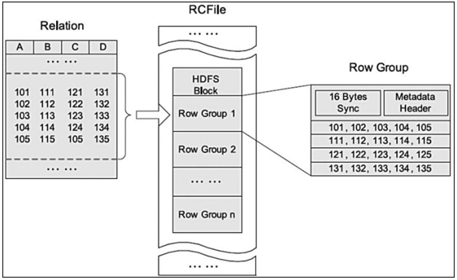

如上图是HDFS内RCFile的存储结构。每个HDFS块中，RCFile以行组为基本单位来组织记录。对于一张表，所有行组大小都相同。一个HDFS块会有一个或多个行组。一个行组包括三个部分。第一部分是行组头部的同步标识，主要用于分隔HDFS块中的两个连续行组；第二部分是行组的元数据头部，用于存储行组单元的信息，包括行组中的记录数、每个列的字节数、列中每个域的字节数；第三部分是表格数据段，即实际的列存储数据。

某些列式存储同一列可能存在不同的block上，在查询的时候，Hive重组列的过程会浪费很多IO开销。而RCFile由于相同的列都是在一个HDFS块上，所以相对列存储而言会节省很多资源。

RCFile采用游程编码，相同的数据不会重复存储，很大程度上节约了存储空间，尤其是字段中包含大量重复数据的时候。RCFile不支持任意方式的数据写操作，仅提供一种追加接口，这是因为底层的HDFS当前仅仅支持数据追加写文件尾部。

当处理一个行组时，RCFile无需全部读取行组的全部内容到内存。相反，它仅仅读元数据头部和给定查询需要的列。因此，它可以跳过不必要的列以获得列存储的I/O优势。例如：`select c from table where a>1`
针对行组来说，会对一个行组的a列进行解压缩，如果当前列中有a>1的值，然后才去解压缩c。若当前行组中不存在a>1的列，那就不用解压缩c，从而跳过整个行组。

### 10.2.4 ORC File 存储格式详解
**ORC定义**
<span style="color:red">ORC File，它的全名是Optimized Row Columnar (ORC) file，其实就是对RCFile做了一些优化</span>。据官方文档介绍，这种文件格式可以提供一种高效的方法来存储Hive数据。它的设计目标是来克服Hive其他格式的缺陷。运用ORC File可以提高Hive的读、写以及处理数据的性能。和RCFile格式相比，ORC File格式有以下优点：
1.  因为ORC较其他文件格式压缩比高，查询任务的输入数据量减少，使用的Task也就减少了。所以提升了数据查询速度和处理性能。
2.  支持各种复杂的数据类型，比如： datetime, decimal, 以及一些复杂类型(struct, list, map, and union)。
3.  在文件中存储了一些轻量级的索引数据，如：row group index、bloom filter index等，可以用于where条件过滤。
4.  ORC 扩展了 RCFile 的压缩，除了 Run-length（游程编码），引入了字典编码和 Bit 编码。

**ORC File文件结构**
ORC File包含一组组的行数据，称为stripes，除此之外，ORC File的file footer还包含一些额外的辅助信息。在ORC File文件的最后，有一个被称为postscript的区，它主要是用来存储压缩参数及压缩页脚的大小。

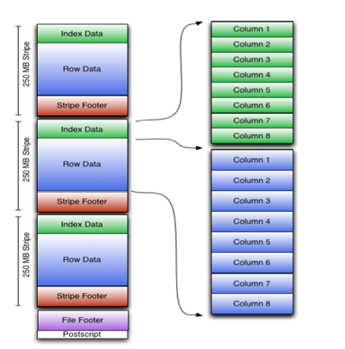

在默认情况下，一个stripe的大小为250MB。大尺寸的stripes使得从HDFS读数据更高效。
下图显示出可<span style="color:red">ORC File文件结构</span>：
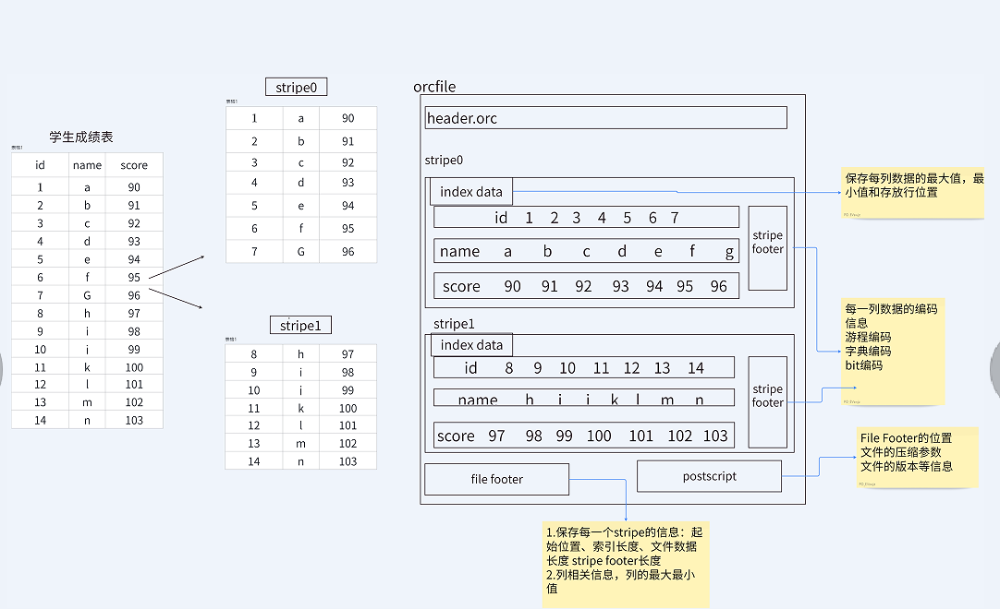

*   Postscripts中存储该表的行数，压缩参数，压缩大小，列等信息；
*   FileFooter中包含该表的统计结果，以及各个Stripe的位置信息；
*   Stripe Footer中包含该stripe的元数据信息,另外也会存储相关的编码信息；
*   IndexData :一个轻量级的index，中保存了该stripe上数据的位置信息，总行数等信息；
*   RowData：<span style="color:red">存的是具体的数据，先取部分行，然后对这些行按列进行存储</span>。对每个列进行了编码，分成多个Stream来存储。

Hive读取数据的时候，会找到文件尾部读PostScript，从里面解析到File Footer长度，再读FileFooter，从里面解析到各个Stripe信息，再读各个Stripe，即从后往前读。

**Stripe结构**
从上图我们可以看出，每个Stripe都包含index data、row data以及stripe footer。Stripe footer包含流位置的目录；Row data在表扫描的时候会用到。
<mark>Index data包含每列的最大和最小值以及每列所在的行。行索引里面提供了偏移量，它可以跳到正确的压缩块位置。具有相对频繁的行索引，使得在stripe中快速读取的过程中可以跳过很多行，尽管这个stripe的大小很大。在默认情况下，最大可以跳过10000行。</mark>拥有通过过滤谓词而跳过大量的行的能力，你可以在表的 secondary keys 进行排序，从而可以大幅减少执行时间。比如你的表的主分区是交易日期，那么你可以对次分区（state、zip code以及last name）进行排序。

**Hive里面如何用ORCFile**
在建Hive表的时候我们就应该指定文件的存储格式。所以你可以在HiveSQL语句里面指定用ORCFile这种文件格式，如下：
```sql
CREATE TABLE ...
STORED AS ORC 
[TBLPROPERTIES (property_name=property_value, ...)]
```
所有关于ORCFile的参数都是在HiveSQL语句的TBLPROPERTIES字段里面出现，他们是：
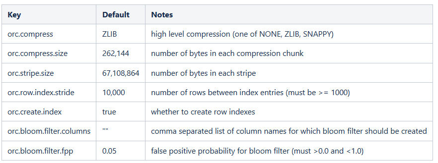

下面的例子是建立一个没有启用压缩的ORCFile的表：
```sql
create table Addresses ( 
  name string, 
  street string, 
  city string, 
  state string, 
  zip int 
) stored as orc
 tblproperties ("orc.compress"="NONE");
```
一般表的存储格式自带 InputFormat/OutputFormat 以及默认 Serde 类型,orc默认的信息如下：


### 10.2.5 Parquet存储格式详解
**Parquet的简介**
Parquet 是主流的列式存储格式，最早是由 Twitter 和 Cloudera 合作开发，2015 年 5 月从 Apache 孵化器里毕业成为 Apache 顶级项目，支持大部分的计算框架。

Parquet 最初的设计动机是存储嵌套式数据，比如Protocolbuffer，thrift，json等，将这类数据存储成列式格式，以方便对其高效压缩和编码，且使用更少的IO操作取出需要的数据。总的来说Parquet与orc相比的主要优势是对嵌套结构的支持，orc的多层级嵌套表达复杂底层未采用google dremel类似实现，性能和空间损失较大。

Parquet仅仅是一种存储格式，它是语言、平台无关的，并且不需要和任何一种数据处理框架绑定。这也是parquet相较于orc的仅有优势：支持嵌套结构。Parquet 没有太多其他可圈可点的地方,比如它不支持update操作(数据写成后不可修改),不支持ACID等。

Parquet文件是以二进制方式存储的，所以是不可以直接读取的，文件中包括该文件的数据和元数据，因此Parquet格式文件是自解析的。

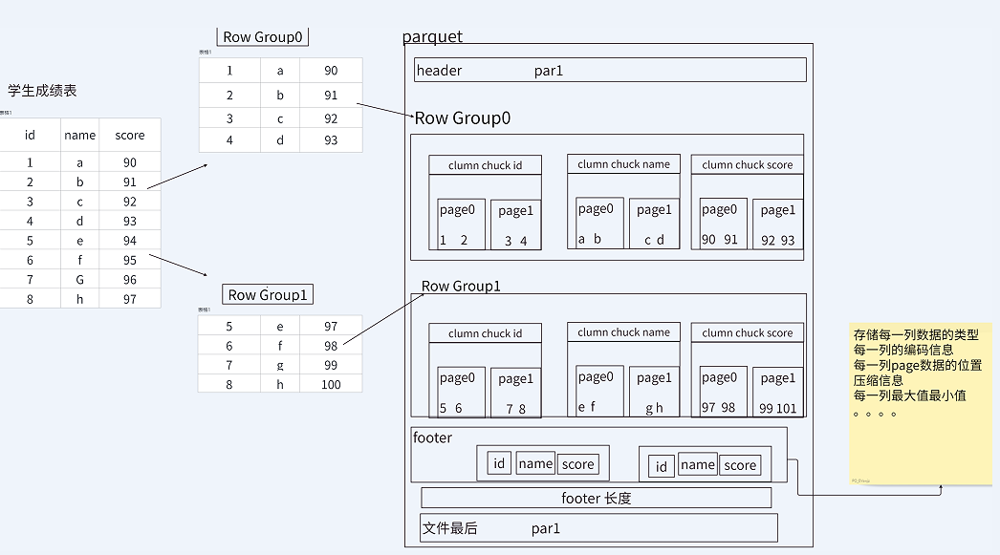

**Parquet文件结构**
Parquet文件由一个文件头（header）就是是该文件的Magic Code，用于校验它是否是一个Parquet文件。
一个或多个紧随其后的行组（Row Group）、Row Group由列块（Column Chuck）、页（Page）组成。
一个用于结尾的文件尾（footer）构成。

*   **行组（Row Group）**： Parquet 在水平方向上将数据划分为行组，默认行组大小与 HDFS Block 块大小对齐，Parquet 保证一个行组会被一个 Mapper 处理。
*   **列块（Column Chunk）**： 行组中每一列保存在一个列块中，一个列块具有相同的数据类型，不同的列块可以使用不同的压缩算法。
*   **页（Page）**： Parquet 是页存储方式，每一个列块包含多个页，一个页是最小的编码的单位，同一列块的不同页可以使用不同的编码方式。

可通过以下建表语句指定文件格式为文本文件:
```sql
Create table parquet_table
(column_specs)
stored as parquet
tblproperties (property_name=property_value, ...);
```
支持的参数如下：
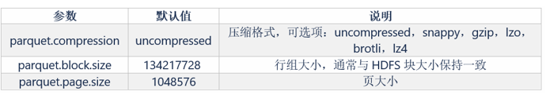

**Parquet vs ORC**
ORC和Parquet都是高效的列式存储格式，它们在存储和处理大规模数据时具有一定的优势。虽然它们在很多方面都有相似之处，但它们在实现细节和使用场景上还是有一些不同的。

<span style="color:red">Parquet 与 ORC 的不同点总结</span>以下：
1.  **嵌套结构支持**：Parquet 能够很完美的支持嵌套式结构，而在这一点上 ORC 支持的并不好，表达起来复杂且性能和空间都损耗较大。
2.  **更新与 ACID 支持**：ORC 格式支持 update 操作与 ACID，而 Parquet 并不支持。
3.  **压缩与查询性能**：在压缩空间与查询性能方面，Parquet 与 ORC 总体上相差不大。可能 ORC 要稍好于 Parquet。
4.  **查询引擎支持**：<span style="color:red">这方面 Parquet 可能更有优势，支持 Hive、Impala、Presto 等各种查询引擎，而 ORC 与 Hive 接触的比较紧密，而与 Impala 适配的并不好。</span>之前我们说 Impala 不支持 ORC，直到 CDH 6.1.x 版本也就是 Impala3.x 才开始以 experimental feature 支持 ORC 格式。
5.  **适用场景**：<span style="color:red">Orc适用于MapReduce；Parquet适用Spark、impala。</span>

总之，ORC和Parquet都是高效的列式存储格式，它们在压缩、编码、数据类型和模式定义、数据读写和查询等方面都有各自的特点和优劣。选择哪种格式，取决于具体的应用场景和需求。

## 10.3 压缩的使用
使用数据压缩好处是可以最大程度的减少文件所需的磁盘空间和网络I/O的开销,尤其文本文件一般压缩率可以高达40%左右,对于集群来说带宽是稀有资源，所有网络传输性能的提升很重要 。但是使用压缩和解压缩会增加CPU的开销。

### 10.3.1 Hadoop压缩概述
HIVE底层是hdfs和mapreduce实现存储和计算的。所以HIVE可以使用hadoop自带的InputFormat和Outputformat实现从不同的数据源读取文件和写出不同格式的文件到文件系统中。同理，HIVE也可以使用hadoop配置的压缩方法对中间结果或最终数据进行压缩。

hive中的压缩算法主要取决于hadoop版本。不同的版本会系统不同的压缩编码和解码器。可以在hadoop下的core-site.xml文件中配置压缩方式,hive使用的也是这个配置文件。
```xml
<property> 
        <name>io.compression.codecs</name> 
        <value>org.apache.adoop.io.compress.GzipCodec,org.apache.hadoop.io.compress.DefaultCodec,com.hadoop.compression.lzo.LzoCodec,com.hadoop.compression.lzo.LzopCodec,org.apache.hadoop.io.compress.BZip2Codec</value> 
</property>
```
可以通过如下命令查看hive中已经配置好的压缩算法。使用set命令可以查看所有hive配置文件中的属性值以及hive安装环境的hadoop文件的属性值。hive中默认压缩是关闭的，可以通过`set hive.exec.compress.output`来查看
```sql
hive (fdm_sor)> set io.compression.codecs;
io.compression.codecs=org.apache.hadoop.io.compress.GzipCodec,
org.apache.hadoop.io.compress.DefaultCodec,
com.hadoop.compression.lzo.LzoCodec,
com.hadoop.compression.lzo.LzopCodec,
org.apache.hadoop.io.compress.Snappy
```
如上查询的结果是对应的算法在hadoop底层的类：
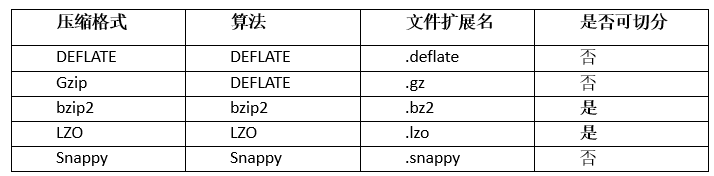

压缩性能的比较：
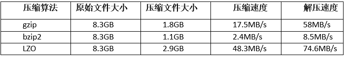

GZip和BZip2压缩格式是所有最近的hadoop版本支持的，而且linux本地的库也支持这种格式的压缩和解压缩。
Snappy是最近添加的压缩格式，可以自己添加这种压缩格式。
LZO是经常用到的压缩格式。

<span style="color:red">GZip 和 BZip2压缩可以保证最小的压缩文件，但是过于消耗时间；Snappy和LZO压缩和解压缩很快，但是压缩的文件较大。所以如何选择压缩格式，需要根据具体的需求决定。（I/O,CPU）</span>
<mark>BZip2和LZO支持压缩文件分割。</mark>

*   **gzip压缩**
    *   **优点**：<span style="color:red">压缩率比较高，而且压缩/解压速度也比较快；</span>hadoop本身支持，在应用中处理gzip格式的文件就和直接处理文本一样；有hadoop native库；大部分linux系统都自带gzip命令，使用方便。
    *   **缺点**：<span style="color:red">不支持split。</span>
    *   **应用场景**：当每个文件压缩之后在130M以内的（1个块大小内），都可以考虑用gzip压缩格式。譬如说一天或者一个小时的日志压缩成一个gzip文件，运行mapreduce程序的时候通过多个gzip文件达到并发。hive程序，streaming程序，和java写的mapreduce程序完全和文本处理一样，压缩之后原来的程序不需要做任何修改。

*   **bzip2压缩**
    *   **优点**：<span style="color:red">支持split；具有很高的压缩率，比gzip压缩率都高；</span>hadoop本身支持，但不支持native；在linux系统下自带bzip2命令，使用方便。
    *   **缺点**：<span style="color:red">压缩/解压速度慢；</span>不支持native。
    *   **应用场景**：适合对速度要求不高，但需要较高的压缩率的时候，可以作为mapreduce作业的输出格式；或者输出之后的数据比较大，处理之后的数据需要压缩存档减少磁盘空间并且以后数据用得比较少的情况；或者对单个很大的文本文件想压缩减少存储空间，同时又需要支持split，而且兼容之前的应用程序（即应用程序不需要修改）的情况。
  
*   **lzo压缩**
    *   **优点**：压缩/解压速度也比较快，合理的压缩率；<span style="color:red">支持split</span>，是hadoop中最流行的压缩格式；支持hadoop native库；可以在linux系统下安装lzop命令，使用方便。
    *   **缺点**：<span style="color:red">压缩率比gzip要低一些；hadoop本身不支持，需要安装；</span>在应用中对lzo格式的文件需要做一些特殊处理（为了支持split需要建索引，还需要指定inputformat为lzo格式）。
    *   **应用场景**：一个很大的文本文件，压缩之后还大于200M以上的可以考虑，而且单个文件越大，lzo优点越越明显。

*   **snappy压缩**
    *   **优点**：高速压缩速度和合理的压缩率；支持hadoop native库。
    *   **缺点**：<span style="color:red">不支持split；压缩率比gzip要低；hadoop本身不支持，需要安装；</span>linux系统下没有对应的命令。
    *   **应用场景**：当mapreduce作业的map输出的数据比较大的时候，作为map到reduce的中间数据的压缩格式；或者作为一个mapreduce作业的输出和另外一个mapreduce作业的输入。


在Hive表中和计算过程中，保持数据的压缩，对磁盘空间的有效利用和提高查询性能都是十分有益的。

### 10.3.2 Hive表数据进行压缩
在Hive中，不同文件类型的表，声明数据压缩的方式是不同的。

1）**TextFile**
若一张表的文件类型为TextFile，若需要对该表中的数据进行压缩，多数情况下，无需在建表语句做出声明。直接将压缩后的文件导入到该表即可，Hive在查询表中数据时，可自动识别其压缩格式，进行解压。
方法1：
```sql
CREATE TABLE ds_hive.ch10_order_detail_txtfile_gz1(
  `id` string COMMENT '订单id',
  `user_id` string COMMENT '用户id',
  `product_id` string COMMENT '商品id',
  `province_id` string COMMENT '省份id',
  `create_time` string COMMENT '下单时间',
  `product_num` int COMMENT '商品件数',
  `total_amount` decimal(16,2) COMMENT '下单金额'
  )
 comment '用户表'
stored as textfile
;
-- 直接放入压缩的数据
hadoop fs -put 000000_0.gz /user/hive/warehouse/ds_hive.db/ch10_order_detail_txtfile_gz1
 
select *  from  ds_hive.ch10_order_detail_txtfile_gz1  limit 10;
```
方法2：
```sql
--设置hive输出压缩
set hive.exec.compress.output=true;
set mapred.output.compress=true;
set mapred.output.compression.codec=org.apache.hadoop.io.compress.GzipCodec;
set io.compression.codecs=org.apache.hadoop.io.compress.GzipCodec;
CREATE TABLE ds_hive.ch10_order_detail_txtfile_gz(
  `id` string COMMENT '订单id',
  `user_id` string COMMENT '用户id',
  `product_id` string COMMENT '商品id',
  `province_id` string COMMENT '省份id',
  `create_time` string COMMENT '下单时间',
  `product_num` int COMMENT '商品件数',
  `total_amount` decimal(16,2) COMMENT '下单金额'
  )
 comment '用户表'
stored as textfile
;
 
----导入数据：
INSERT OVERWRITE TABLE  ds_hive.ch10_order_detail_txtfile_gz
select
 id         
,user_id    
,product_id 
,province_id
,create_time
,product_num
,total_amount
from ds_hive.ch10_order_detail_txtfile
;
```
查看对应的文件：
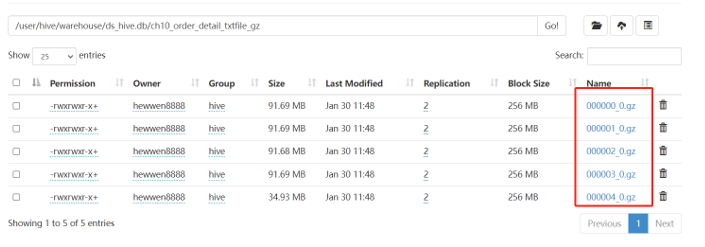

2）**ORC**
若一张表的文件类型为ORC，若需要对该表数据进行压缩，<span style="color:red">需在建表语句中声明压缩格式</span>如下：
```sql
CREATE TABLE ds_hive.ch10_order_detail_txtfile_orc(
  `id` string COMMENT '订单id',
  `user_id` string COMMENT '用户id',
  `product_id` string COMMENT '商品id',
  `province_id` string COMMENT '省份id',
  `create_time` string COMMENT '下单时间',
  `product_num` int COMMENT '商品件数',
  `total_amount` decimal(16,2) COMMENT '下单金额'
  )
 comment '用户表'
stored as orc
tblproperties ("orc.compress"="snappy")
;
 
 
INSERT OVERWRITE TABLE  ds_hive.ch10_order_detail_txtfile_orc
select
 id         
,user_id    
,product_id 
,province_id
,create_time
,product_num
,total_amount
from ds_hive.ch10_order_detail_txtfile
;
```
3）**Parquet**
若一张表的文件类型为Parquet，若需要对该表数据进行压缩，<span style="color:red">需在建表语句中声明压缩格式</span>如下：
```sql
create table orc_table
(column_specs)
stored as parquet
tblproperties ("parquet.compression"="snappy");
```

### 10.3.3 计算过程中使用压缩
1）**单个MR的中间结果进行压缩**
单个MR的中间结果是指Mapper输出的数据，对其进行压缩可降低shuffle阶段的网络IO，可通过以下参数进行配置：
```sql
--开启MapReduce中间数据压缩功能
set mapreduce.map.output.compress=true;
--设置MapReduce中间数据数据的压缩方式（以下示例为snappy）
set mapreduce.map.output.compress.codec=org.apache.hadoop.io.compress.SnappyCodec;
```
2）**单条SQL语句的中间结果进行压缩**
单条SQL语句的中间结果是指，两个MR（一条SQL语句可能需要通过MR进行计算）之间的临时数据，可通过以下参数进行配置：
```sql
--是否对两个MR之间的临时数据进行压缩
set hive.exec.compress.intermediate=true;
--压缩格式（以下示例为snappy）
set hive.intermediate.compression.codec= org.apache.hadoop.io.compress.SnappyCodec;
```

## 10.4 序列化和反序列化
### 10.4.1 Hive SerDe
上文我们详细讲解了hive的各种存储格式及他们的特别，各种不同的存储格式形式了不同的文件格式，他们之间存在一个交互的过程，当然我们在查询或者存储数据的时候也和客户端存在一个交互的过程，这个时候我们需要一样东西来解决各种文件传输过程中差异性，<span style="color:red">Hive SerDe（Serialization/Deserialization）就是Hive 中用于序列化和反序列化数据的框架，用来解决此类问题，允许 Hive 将数据从一种格式转换为另一种格式，以便在 Hive 中进行查询和分析。</span>SerDe 是 Hive 中一个非常重要的组件，因为它允许 Hive 与各种数据格式进行交互，包括 CSV、JSON、Avro、ORC、Parquet 等。

SerDe说明hive如何去处理一条记录，包括Serialize/Deserilize两个功能， <mark>Serialize把hive使用的java object转换成能写入hdfs的字节序列，或者其他系统能识别的流文件。Deserilize把字符串或者二进制流转换成hive能识别的java object对象。</mark>比如：select语句会用到DeSerialize对象， 把hdfs数据解析出来；insert语句会使用serilize，数据写入hdfs系统，需要把数据序列化。

Serde是用于序列化和反序列化，序列化和反序列化的目的是什么呢？

序列化的目的是Hive格式输出成为特定格式，包括：
（1）分隔符（tab、逗号、CTRL-A）
（2）Thrift 协议

反序列化的目的是HDFS格式读入Hive内存中，包括：
（1）Java Integer/String/ArrayList/HashMap
（2）Hadoop Writable类
（3）用户自定义类

读写行数据流程如下:
`HDFS files --> InputFileFormat --> <key, value> --> Deserializer --> Row object`
`Row object --> Serializer --> <key, value> --> OutputFileFormat --> HDFS files`

<span style="color:red">当向hdfs写数据的时候，先经过序列化，将数据转化成字节序列,然后以指定的格式(outputformat) 输出到hdfs. 而从hdfs读数据时，则是一个相反的过程。</span>

### 10.4.2 SerDe所处的位置
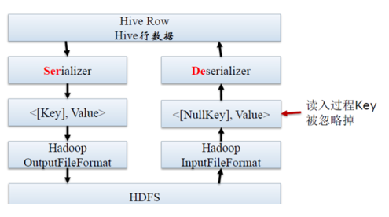

### 10.4.3 Hive 的 SerDe 分类
1）**Hive 内置的 SerDe 类型**
*   **LazySimpleSerDe**：这个是默认的 SerDe 类型，用于处理简单的文本数据格式，如 CSV等。
*   **OrcSerDe**：OrcSerDe是一种基于ORC文件格式的序列化/反序列化库，它主要用于高效地存储和处理大规模数据集。
*   **ParquetHiveSerDe**：Parquet文件格式：ParquetHiveSerDe采用Parquet文件格式进行序列化和反序列化操作，该格式是一种高度优化的列式存储格式，提高查询效率并减少存储空间。
*   **AvroSerDe**：AvroSerDe是一种序列化/反序列化库，它用于将数据从Hadoop文件系统中的二进制格式转换为可读取的结构化数据，并将结果写回到Hadoop文件系统。与其他序列化/反序列化库不同，AvroSerDe支持动态模式定义，可以在运行时生成或修改模式，从而实现高度灵活性和可扩展性。
*   **JsonSerDe**：JsonSerDe是一种序列化/反序列化库，它用于将JSON格式的数据转换为可读取的结构化数据。
*   **MetadataTypedColumnsetSerDe**：MetadataTypedColumnsetSerDe主要是按行进行序列化和反序列化操作，也就是将数据记录逐行解析为结构化数据，并将其转换为可以进行二进制或文本编码的格式，以便于存储到文件系统中或传输到其他系统中。

2）**自定义SerDe 类型**
如果 Hive 的自定义 Serde 类型不能满足你的需求，你可以自己定义自己的 SerDe 类型。

### 10.4.4 Serde 建表使用
我们来看看前面课程建表的具体情况，啥都不加，简写模式
```sql
hive (default)>
create table if not exists ds_hive.ch10_emp(
    id int,
    name string
)
PARTITIONED BY ( `data_date` string Comment '按天分区 yyyyMMdd');
```
<span style="color:red">所在集群配置：建表默认orc格式存储</span>
可以看出，<span style="color:red">orc格式默认了OrcSerde</span>
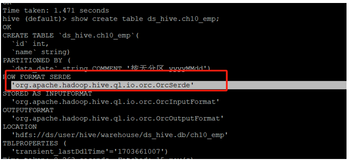
相当于：
```sql
hive (default)>
create table if not exists ds_hive.ch10_emp(
    id int,
    name string)
PARTITIONED BY ( `data_date` string Comment '按天分区 yyyyMMdd')
ROW FORMAT SERDE
'org.apache.hadoop.hive.ql.io.orc.OrcSerde'
STORED AS INPUTFORMAT
'org.apache.hadoop.hive.ql.io.orc.OrcInputFormat'
OUTPUTFORMAT
'org.apache.hadoop.hive.ql.io.orc.OrcOutputFormat';
```
我们再来建一个textfile存储格式的表：
```sql
create table if not exists ds_hive.ch10_emp2(
    id int,
    name string)
row format delimited fields terminated by '\t'
stored as textfile;
```
<span style="color:red">textfile默认为LazySimpleSerDe。</span>

总的来说，Hive SerDe 是 Hive 中非常重要的一个组件，它允许 Hive 与各种数据格式进行交互，并且可以定义数据的结构和模式。如果你需要在 Hive 中处理非标准数据格式，SerDe 可能是一个非常有用的工具。