# 11.HQL优化及性能调优

## 11.1 HQL优化利器:执行计划
我们大家总是在聊优化优化，那么怎么优化？相信每个人都有自己的一套方法论。在我看来的话，可能就是存储、模型、sql、以及集群资源层面的一些优化。这里给大家提供一种优化思路：
1.  先找问题，比如数据倾斜问题
2.  问题解决，下面进行sql层面的优化
3.  集群资源或者参数方面的优化
4.  最后考虑模型，逻辑的优化

### 11.1.1 什么是执行计划
所谓执行计划，顾名思义，就是对一个查询任务（sql），做出一份怎样去完成任务的详细方案。举个生活中的例子，我从上海要去新疆，我可以选择坐飞机、坐高铁、坐火车，甚至于自驾。具体到线路更是五花八门，现在我准备选择自驾了，具体什么路线怎样去划算（时间&费用），这是一件值得考究的事情。HIVE（我们的自驾工具）提供了EXPLAIN命令来展示一个查询的执行计划（什么路线），这个执行计划对于我们了解底层原理，hive 调优，排查数据倾斜等很有帮助。

<span style="color:red">Explain呈现的执行计划，由一系列Stage组成，这一系列Stage具有依赖关系，每个Stage对应一个MapReduce Job，或者一个文件系统操作等。</span>

若某个Stage对应的一个MapReduce Job，其Map端和Reduce端的计算逻辑分别由Map Operator Tree和Reduce Operator Tree进行描述，Operator Tree由一系列的Operator组成，一个Operator代表在Map或Reduce阶段的一个单一的逻辑操作，例如TableScan Operator，Select Operator，Join Operator等。

### 11.1.2 语法
`explain +可选参数+查询语句`
`[EXTENDED|CBO|AST|DEPENDENCY|AUTHORIZATION|LOCKS|VECTORIZATION|ANALYZE] query`

*   **explain**：查看执行计划的基本信息；
*   **explain Formatted**：将执行计划按格式输出json格式
*   **explain dependency**：查看执行计划中输入源相关的额外信息；以一个大JSON的方式展示处理，其中包含了input_tables 和 input_partitions两个字段，分别底层扫描的表和对应扫描的分区（如果表是分区表）
*   **explain extended**：查看执行计划的扩展信息；
*   **explain cbo**：输出由Calcite优化器生成的计划。CBO 从 Hive 4.0.0 版本开始支持；
*   **explain ast**：输出查询的抽象语法树，主要用于开发或者高级用户通过查看抽象语法树发现问题。AST 在 Hive 2.1.0 版本删除了，存在bug，转储AST可能会导致OOM错误，将在4.0.0版本修复；
*   **explain authorization**：查看SQL操作相关权限的信息；（存在授权失败的情况也会展示）从 Hive 0.14.0 开始支持[HIVE-5961]
*   **explain locks**：这对于了解系统将获得哪些锁以运行指定的查询很有用。LOCKS 从 Hive 3.2.0 开始支持[HIVE-17683]
*   **explain vectorization**：查看SQL的向量化描述信息，从 Hive 2.3.0 开始支持；
*   **explain analyze**：用实际的行数注释计划。从 Hive 2.2.0 开始支持；

### 11.1.3 案例实操
**案例1：简单的sql**
```sql
explain
select
id
,user_id
,product_id
from ds_hive.ch12_order_detail_orc t1
where substr(create_time,1,10)>='2023-01-01';
```
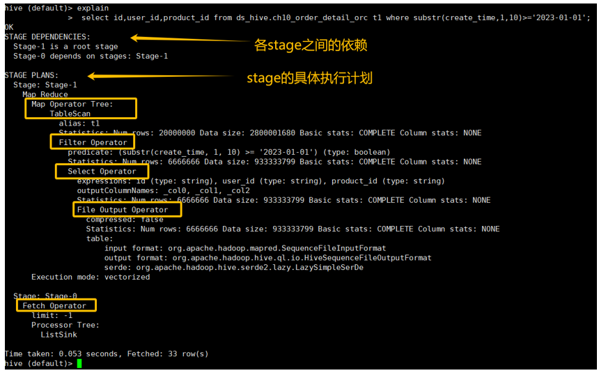
大概能得到如下信息:
*   **stage-1**：
    1. **Map Operator Tree，首先进行表扫描（Table scan）**，预计扫描的行20000000 ，涉及的数据大小 2800001680，表别名为 t1 (这里没有给别名，如果给别名就是别名)
    2. **Filter Operator，行过滤操作**,过滤的表达式是 `substr(create_time, 1, 10) >= '2023-01-01'` ，预计处理的行是6666666 ，涉及的数据大小 933333799
    3. **Select Operator，列过滤操作**. <span style="color:red">这个阶段，我建议采用这样的方式，先读最深的缩进</span>。所以读起来是这样，
        **File Output：**
        1.  处理的表，输入格式（input format）是`org.apache.hadoop.mapred.SequenceFileInputFormat`，
        输出格式是`org.apache.hadoop.hive.ql.io.HiveSequenceFileOutputFormat` 
        文件的序列化格式`org.apache.hadoop.hive.serde2.lazy.LazySimpleSerDe`
        2.  输出的文件预计是 6666666 行，数据大小是 933333799
        3.  输出没有压缩
        ；
        4.  一共输出了6666666列，由于mapreduce中所有的列都是按占位符来表示，所以这里都是用`_col[0-20]`
        5.  输出每一列表述的数据格式（expressions)
*   **stage-0**:
    1.  Fetch Operator这表示客户端的取数操作

本表是ORC的格式，为什么解释计划给出来的SequenceFileInputForma？文件预计 n 行（输入/输出） 是怎么来的？
其实执行计划是Hive根据统计信息所进行的简单描述，不是完全准确的执行计划，但是对了解其中的细节，对于这个sql的执行还是有很大的帮助。

**两个部分**
*   **stage dependencies** ： 各个stage之间的依赖性
*   **stage plan** ：各个stage的执行计划

**Stage理解**
<span style="color:red">结合对前面讲到的Hive对查询的一系列执行流程的理解，那么在一个查询任务中会有一个或者多个Stage.每个Stage之间可能存在依赖关系。没有依赖关系的Stage可以并行执行。</span>

Stage是Hive执行任务中的某一个阶段，那么这个阶段可能是一个MR任务，也可能是一个抽取任务，也可能是一个Map Reduce Local ,也可能是一个Limit。

**何时划分Stage**

当Hive已经制定好完整的“产品加工流程图”（逻辑计划Operator Tree），准备交给具体车间（MR/Tez/Spark引擎）生产时，车间主任（编译器）需要根据设备特点，将流程图拆解成一个个可并行执行的“生产班组任务”（Task）。<span style="color:red">这个拆解的过程，就是Stage划分</span>。

<span style="color:red">Stage划分的界限决定于ReduceSinkOperator，在遇到ReduceSinkOperator之前的Operator都划分到Map阶段，同时也标识这Map阶段的结束。该ReduceSinkOperator到下一个ReduceSinkOperator阶段中间的部分划分为Reduce阶段。</span>一个MR任务代表一个Stage（当然也包括其他非MR，如FetchTask、MoveTask、CopyTask）。

**划分规则(按照MR为例子)**：
* R1 (TS%): 开始安排生产（读到表数据），先成立一个Map班组（MapWork）。
* R2 (TS%.*RS): 流水线遇到了第一个“装配点”（ReduceSink），Map班组的工作到此为止。同时成立一个Reduce班组（ReduceWork）来负责装配。
* R3 (RS%.*RS%): 流水线上又遇到了一个新的“装配点”。这意味着需要另起一条独立的流水线了。所以，为前面的工序生成一个完整的MR任务（一个MapRedTask，即一个Stage），然后从新的装配点开始，规划下一个Stage。
* R4 (FS%): 生产完成，需要把成品移动到仓库（FileSink）。这对应一个搬运任务（MoveTask）。
* R5 (UNION%): 如果多条小流水线（子查询）都没有“装配点”（都是map-only），就把它们合并成一条大流水线，统一管理，提高效率。

**常见Operator**
*   **TableScan**：表扫描操作
    *   alias：表名称
*   **Select Operator**：选取操作
    *   expressions：需要的字段名称及字段类型
    *   outputColumnNames：输出的列名称
*   **Group By Operator**：分组聚合操作
    *   aggregations：显示聚合函数信息
    *   mode：有 hash：随机聚合，就是hash partition；partial：局部聚合；final：最终聚合
    *   outputColumnNames：聚合之后输出列名
    *   Statistics：表统计信息，包含分组聚合之后的数据条数，数据大小等
*   **Reduce Output Operator**：输出到reduce操作
    *   sort order：值为空 不排序；值为 + 正序排序，值为 - 倒序排序；值为 ± 排序的列为两列，第一列为正序，第二列为倒序
*   **Filter Operator**：过滤操作
    *   predicate：过滤条件，如sql语句中的where id>=1，则此处显示(id >= 1)
*   **Map Join Operator**：join 操作
    *   condition map：join方式 ，如Inner Join 0 to 1 Left Outer Join0 to 2
    *   keys: join 的条件字段
    *   outputColumnNames：join 完成之后输出的字段
    *   Statistics：join 完成之后生成的数据条数，大小等
*   **File Output Operator**：文件输出操作
    *   compressed：是否压缩
*   **Fetch Operator** 客户端获取数据操作
    *   limit，值为 -1 表示不限制条数，其他值为限制的条数

### 11.1.4 调优初体验
**案例2：带聚合的sql：**
```sql
set hive.map.aggr=false; --关闭map端聚合
explain
select t1.province_id,count(*) as cnt
     from ds_hive.ch12_order_detail_orc t1
group by t1.province_id;
```
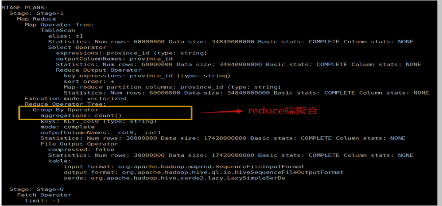
开启map端聚合并生效，则map端有Group By Operator，从而减少数据量。
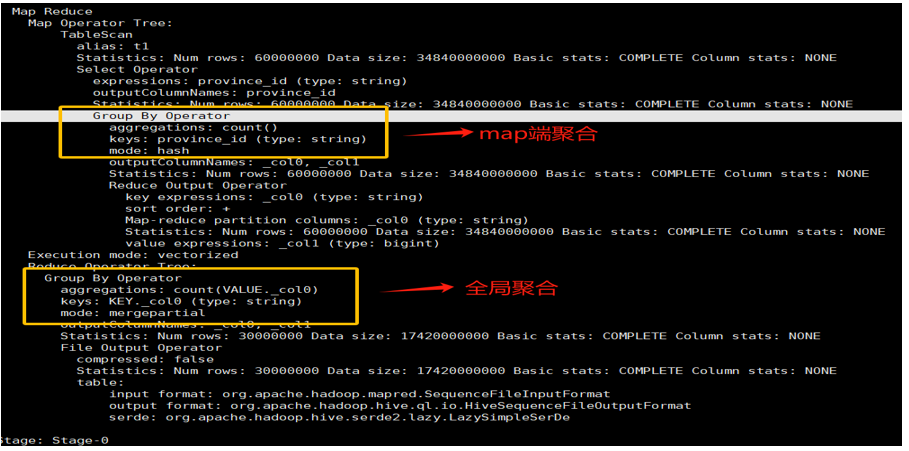

**思考**：我们在查看执行计划时你更关注哪些内容？

## 11.2 数据倾斜优化
此知识点是面试必考，必须掌握。对于mapreduce 计算框架，数据量大不是问题，数据倾斜是个问题。

**数据准备**
订单表：建表语句、加载数据语句
```sql
--订单表处理
CREATE TABLE if not exists  ds_hive.ch12_order_detail_orc(
  `id` string COMMENT '订单id',
  `user_id` string COMMENT '用户id',
  `product_id` string COMMENT '商品id',
  `province_id` string COMMENT '省份id',
  `create_time` string COMMENT '下单时间',
  `product_num` int COMMENT '商品件数',
  `total_amount` decimal(16,2) COMMENT '下单金额'
  )
 comment '订单表表'
stored as orc
;
INSERT into TABLE  ds_hive.ch12_order_detail_orc
select
 id         
,user_id    
,product_id 
,province_id
,create_time
,product_num
,total_amount
from ds_hive.ch10_order_detail_txtfile
;
drop table if exists order_detail;
 
INSERT into TABLE  ds_hive.ch12_order_detail_orc
select
 id         
,user_id    
,product_id 
,province_id
,create_time
,product_num
,total_amount
from ds_hive.ch10_order_detail_txtfile
;
```
省份信息表：建表语句、加载数据语句
```sql
hive (default)>
 drop table if exists ds_hive.ch10_province_info_textfile;
create table ds_hive.ch10_province_info_textfile(
    id            string comment '省份id',
    province_name string comment '省份名称'
)
row format delimited fields terminated by '\t'
stored as textfile
;
load data  local inpath "/home/hewwen8888/data/province_info.txt"  overwrite into table ds_hive.ch10_province_info_textfile
;
 
---省份表处理
drop table if exists ds_hive.ch12_province_info_orc;
create table ds_hive.ch12_province_info_orc(
    id            string comment '省份id',
    province_name string comment '省份名称'
)
stored as orc
TBLPROPERTIES ('orc.compress'='NONE')
;
 
INSERT OVERWRITE TABLE ds_hive.ch12_province_info_orc
select
 id         
,province_name    
from ds_hive.ch10_province_info_textfile
;
insert into ds_hive.ch12_province_info_orc
select
null   as id
,'测试数据'  as province_name
;
 
---测试数据倾斜的表
create table ds_hive.ch12_province_info_orc_dabiao
as
select
 id         
,province_name    
from ds_hive.ch10_province_info_textfile
union all
select
id     
,product_id    as province_name    
from ds_hive.ch10_order_detail_txtfile
;
```

### 11.2.1 数据倾斜的原因
<span style="color:red">数据倾斜（Data Skew）指的是在数据处理过程中，数据在不同节点或不同任务之间分布不均匀的现象。</span>这种不均匀分布会使部分节点或任务的负载远高于其他节点或任务，从而影响整个系统的性能和效率。

数据产生倾斜的原理：
数据倾斜问题，通常是指参与计算的数据分布不均，即某个key或者某些key的数据量远超其他key，导致在shuffle阶段，大量相同key的数据被发往同一个Reduce，进而导致该Reduce所需的时间远超其他Reduce，成为整个任务的瓶颈。

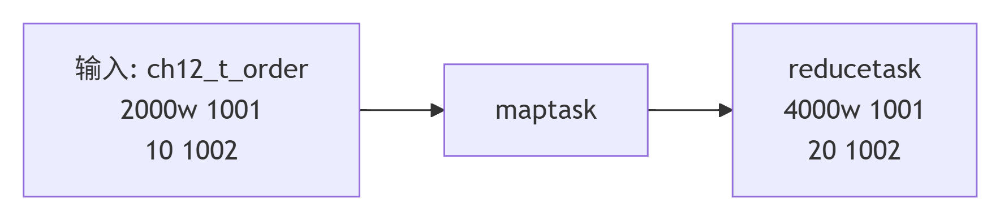

1.  **key分布不均匀**，本质上就是业务数据有可能会存在倾斜
2.  **某些SQL语句本身就有数据倾斜**

| 关键词 | 情形 | 后果 |
| :--- | :--- | :--- |
| Join | 其中一个表较小，但是key集中;两张表都是大表，key不均 | 分发到某一个或几个Reduce上的数据远高于平均值 |
| group by | group by 维度过小，某值的数量过多 | 处理某值的reduce非常耗时 |
| Count(distinct ) | 某值的数量过多，多次distinct | 处理某值的reduce非常耗时，造成数据膨胀 |

### 11.2.2 数据倾斜的表现
*   任务进度长时间维持在99%（或100%），查看任务监控页面，发现只有少量（1个或几个）reduce子任务未完成。<span style="color:red">因为其处理的数据量和其他reduce差异过大。</span>
*   单一reduce的记录数与平均记录数差异过大，通常可能达到3倍甚至更多。最长时长远大于平均时长。

从yarn日志查看：
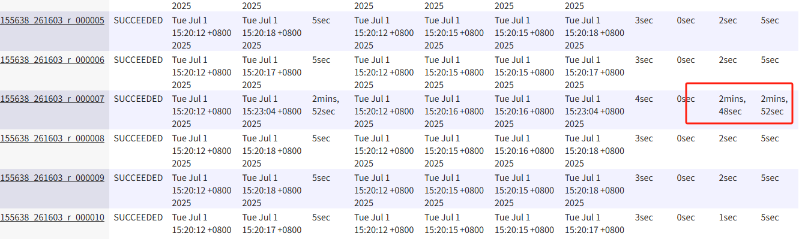

### 11.2.3.处理数据倾斜
#### group by 产生倾斜的问题
上文已经提过开启map端聚合，对于开启map端聚合后，数据会现在Map端完成部分聚合工作。这样一来即便原始数据是倾斜的，经过Map端的初步聚合后，发往Reduce的数据也就不再倾斜了。最佳状态下，Map-端聚合能完全屏蔽数据倾斜问题。

1）**map聚合**
```sql
set hive.map.aggr=true; （默认是 true）
explain
select province_id       
        ,count(*) as cnt
   from ds_hive.ch12_order_detail_orc1 t1
   group by province_id
;
 
--此sql倾斜运行过慢，比较耗资源，不要频繁运行
set hive.map.aggr=false; （默认是 true）
explain
select province_id       
        ,count(*) as cnt
   from ds_hive.ch12_order_detail_orc1 t1
   group by province_id
;
```
查看两者可以看出来map端聚合比没有map聚合快了将几十倍，但是并不是所有map端聚合都能完全屏蔽，我们用到结合另外另外一个参数一起使用，开启负载均衡。

2）**开启负载均衡，减少reduce 拉取的数据量。**
`set hive.groupby.skewindata=true;` （默认是 false）
原理是生成的查询计划会有两个 MR Job。第一个 MR Job 中，Map 的输出结果集合会随机分布到 Reduce 中，每个 Reduce 做部分聚合操作，并输出结果，这样处理的结果是相同的 Group By Key 有可能被分发到不同的 Reduce 中，从而达到负载均衡的目的；第二个 MR Job 再根据预处理的数据结果按照 Group By Key 分布到 Reduce 中（这个过程可以保证相同的 Group By Key 被分布到同一个 Reduce 中），最后完成最终的聚合操作。

如果开启负载均衡：
```sql
set hive.groupby.skewindata=true;
explain
select province_id       
        ,count(*) as cnt
   from ds_hive.ch12_order_detail_orc1 t1
   group by province_id
;
 
set hive.groupby.skewindata=false;
explain
select province_id       
        ,count(*) as cnt
   from ds_hive.ch12_order_detail_orc1 t1
   group by province_id
;
```
<span style="color:red">启动两个MR任务，第一个MR按照随机数分区，将数据分散发送到Reduce，完成部分聚合，第二个MR按照分组字段分区，完成最终聚合。</span>

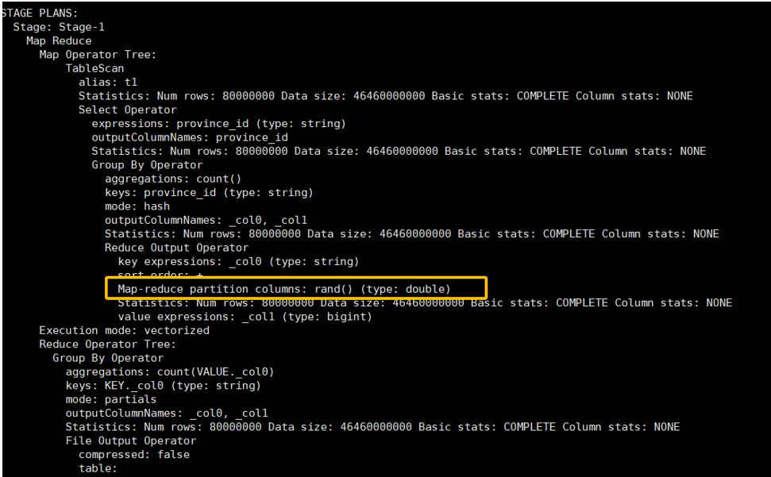
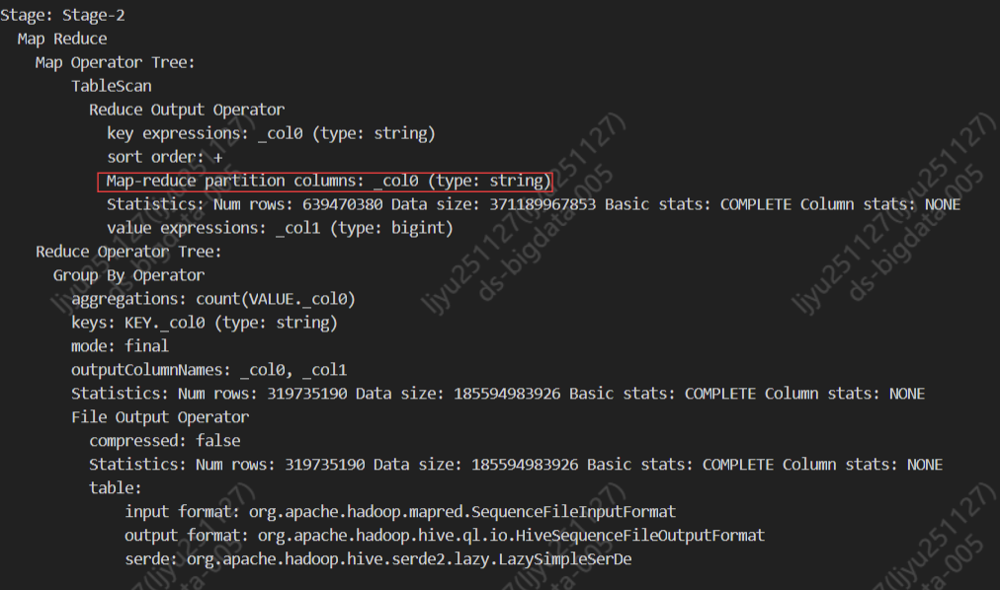
#### Join导致的数据倾斜
前文提到过，<span style="color:red">未经优化的join操作，默认是使用common join算法，也就是通过一个MapReduce Job完成计算。Map端负责读取join操作所需表的数据，并按照关联字段进行分区，通过Shuffle，将其发送到Reduce端，相同key的数据在Reduce端完成最终的Join操作</span>。

如果关联字段的值分布不均，就可能导致<span style="color:red">大量相同的key进入同一Reduce，从而导致数据倾斜问题。</span>

由join导致的数据倾斜问题，有如下三种解决方案：

1）**map join**
<mark>使用map join算法，join操作仅在map端就能完成，没有shuffle操作，没有reduce阶段，自然不会产生reduce端的数据倾斜</mark>。该方案适用于<span style="color:red">大表join小表时</span>发生数据倾斜的场景。

相关参数如下：
`set hive.auto.convert.join=true;`（默认是 true）
```sql
hive (default)>
create table ds_hive.ch12_order_detail_qingxie_join1
as
    SELECT t1.id
           ,t2.province_name
      from ds_hive.ch12_order_detail_orc t1
 left join ds_hive.ch12_province_info_orc  t2
        on t1.province_id=t2.id
;
 
set hive.auto.convert.join=false;
hive (default)>
create table ds_hive.ch12_order_detail_qingxie_join1
as
    SELECT t1.id
           ,t2.province_name
      from ds_hive.ch12_order_detail_orc t1
 left join ds_hive.ch12_province_info_orc  t2
        on t1.province_id=t2.id
;
```
`province_id`字段是存在倾斜的，若不经过优化，通过观察任务的执行过程，是能够看出数据倾斜现象的。

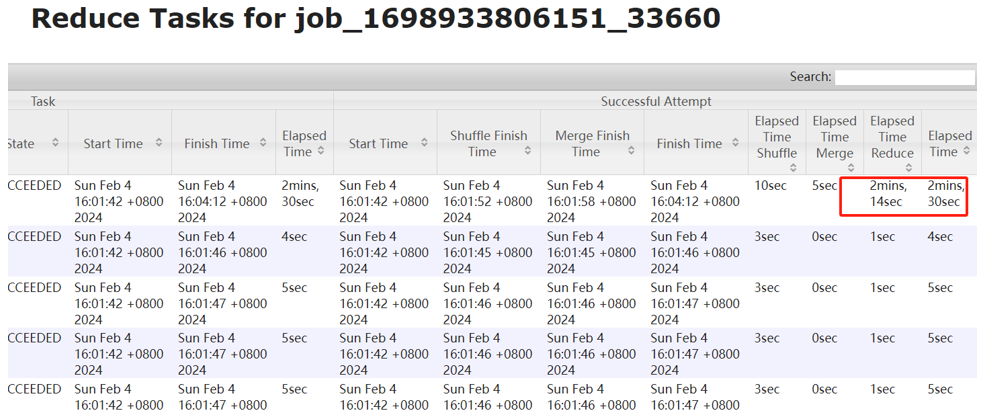

点开yarn-ui，找到倾斜的reduce，我们点开这个reduce的logs：
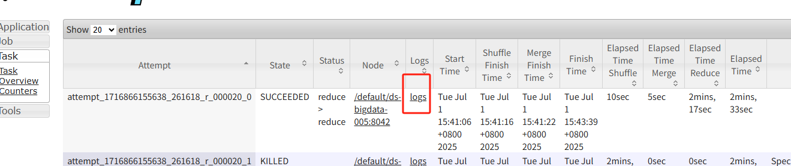

点击here，可以找到这个倾斜的关联key值：
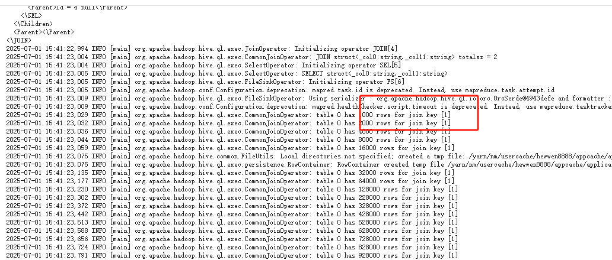

2）**skew join**
并不是所有的join都能满足mapjoin,这里我们又出现一种优化方案，那就是skew,<span style="color:red">skew join的原理是，为倾斜的大key单独启动一个map join任务进行计算，其余key进行正常的common join</span>。但是他只能进行某种特定的inner join优化，原理图如下：
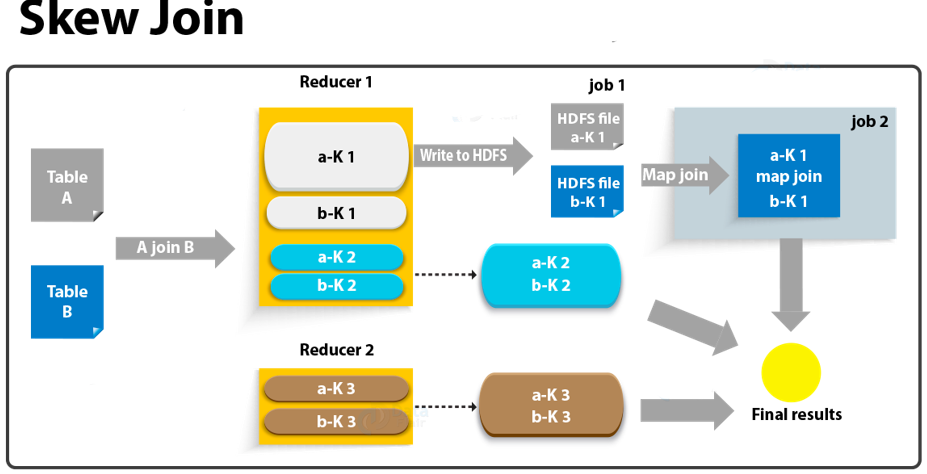

相关参数如下：
```sql
--启用skew join优化
set hive.optimize.skewjoin=true;
--触发skew join的阈值，若某个key的行数超过该参数值，则触发
set hive.skewjoin.key=1000000;
```
这种方案对参与join的源表大小没有要求，但是<mark>对两表中倾斜的key的数据量有要求，要求一张表中的倾斜key的数据量比较小（方便走mapjoin）</mark>。
```sql
set hive.auto.convert.join=false;
create table ds_hive.ch12_order_detail_qingxie_join2
as
    SELECT t1.id
           ,t2.province_name
      from ds_hive.ch12_order_detail_orc t1
 join ds_hive.ch12_province_info_orc_dabiao  t2
       on t1.province_id=t2.id
;
--打开skewjoin
set hive.optimize.skewjoin=true;
create table ds_hive.ch12_order_detail_qingxie_join2
as
    SELECT t1.id
           ,t2.province_name
      from ds_hive.ch12_order_detail_orc t1
       join ds_hive.ch12_province_info_orc_dabiao  t2
        on t1.province_id=t2.id
;
```
3）**调整SQL语句**
若参与join的两表<span style="color:red">均为大表</span>，其中一张表的数据是倾斜的，此时也可通过以下方式对SQL语句进行相应的调整。
1.  <span style="color:red">如果是空值关联造成的倾斜，把空值的key变成一随机数(随机值类型需要跟key的类型一致)，把倾斜的数据分到不同的reduce上</span>，由于null值关联不上，处理后并不影响最终结果。**注意**：join的字段类型一定要一致，否则数据不会分到不同的reduce上。
2.  如果热点词，可以考虑<span style="color:red">分批处理，最后union all在一起</span>。

调整SQL语句如下：
```sql
hive (default)>
set hive.auto.convert.join=true;
set hive.optimize.skewjoin=true;
 
------空值处理
drop table  if exists ds_hive.ch12_order_detail_qingxie_join3;
create table ds_hive.ch12_order_detail_qingxie_join3
as
    SELECT t1.id
           ,t2.province_name
      from ds_hive.ch12_order_detail_orc_null t1
 left join ds_hive.ch12_province_info_orc_dabiao  t2
        --on t1.province_id=t2.id
        on CASE WHEN t1.province_id IS NULL THEN  CONCAT('ds',RAND()) ELSE t1.province_id END=t2.id
;
 
set hive.auto.convert.join=true;
set hive.optimize.skewjoin=true;
--热点值处理：打开mapjoin,打开skewjoin，两张表关联依旧倾斜
drop table  if exists ds_hive.ch12_order_detail_qingxie_join3;
create table ds_hive.ch12_order_detail_qingxie_join3
as
    SELECT t1.id
           ,t2.province_name
      from ds_hive.ch12_order_detail_orc t1
 left join ds_hive.ch12_province_info_orc_dabiao  t2
       on t1.province_id=t2.id
;
 
drop table  if exists ds_hive.ch12_order_detail_qingxie_join3;
create table ds_hive.ch12_order_detail_qingxie_join3
as
    SELECT t1.id
           ,t2.province_name
      from ds_hive.ch12_order_detail_orc t1
 left join ds_hive.ch12_province_info_orc  t2
       on t1.province_id=t2.id
where  t1.province_id<>1 --不等于1的情况
union all
    SELECT t1.id
           ,t2.province_name
      from ds_hive.ch12_order_detail_orc t1
 left join ds_hive.ch12_province_info_orc  t2
        on CASE WHEN t1.province_id IS NULL THEN  CONCAT('ds',RAND()) ELSE t1.province_id END=t2.id
where  t1.province_id=1  --等于1的情况为倾斜原因，用随机数切分reduce
;
 
--如果key不固定
drop table  if exists ds_hive.ch12_order_detail_qingxie_join3;
create table ds_hive.ch12_order_detail_qingxie_join3
as
    SELECT t1.id
           ,t2.province_name
      from ds_hive.ch12_order_detail_orc t1
 left join ds_hive.ch12_province_info_orc  t2
       on t1.province_id=t2.id
where  t1.province_id in (select province_id from ds_hive.ch12_order_detail_orc  group by province_id having count(*)>2000000)
union all
    SELECT t1.id
           ,t2.province_name
      from ds_hive.ch12_order_detail_orc t1
 left join ds_hive.ch12_province_info_orc  t2
        on t1.province_id=t2.id
where  t1.province_id in (select province_id from ds_hive.ch12_order_detail_orc  group by province_id having count(*)<=2000000)
;
```

#### count distinct 数据倾斜
在执行下面的SQL时，即使设置了reduce个数也没用，它会忽略设置的reduce个数，而强制使用1。这唯一的Reduce Task需要Shuffle大量的数据，并且进行排序聚合等处理，这使得它成为整个作业的IO和运算瓶颈。
```sql
--------全局聚合回到一个reduce中执行
select count(distinct user_id) as user_cnt
  from ds_hive.ch12_order_detail_orc
;
 
-------先聚合，在统计
select count(*)
from
(
select user_id
 from ds_hive.ch12_order_detail_orc
group by user_id
) t1
;
```
**案例**：参考 6.2 Count Distinct 的原理.

**补充**：窗口函数数据倾斜怎么处理？
类似操作：随机分区，手动分区，单独处理倾斜键位

## 11.3 HQL语法优化
### 11.3.1 列裁剪与分区裁剪
在生产环境中，会面临列很多或者数据量很大时，如果使用`select *` 或者不指定分区进行全列或者全表扫描时效率很低。Hive在读取数据时，可以只读取查询中所需要的列，忽视其他的列，这样做可以节省读取开销（中间表存储开销和数据整合开销）

1.  **列裁剪**：在查询时只读取需要的列。
2.  **分区裁剪**：在查询中只读取需要的分区。

**遵循一个原则**：尽量少的读入数据，尽早地数据收敛！

### 11.3.2 提前数据收敛
<span style="color:red">在子查询中，有些条件能先过滤的尽量先过滤，比如能放在子查询里先过滤，减少子查询输出的数据量</span>。
```sql
-- 优化前脚本
select
     a.字段a,a.字段b,b.字段a,b.字段b
from 
(
    select 字段a,字段b
    from table_a
    where dt = date_sub(current_date,1)
) a 
left join 
(
    select 字段a,字段b
    from table_b
    where dt = date_sub(current_date,1)
) b 
    on a.字段a = b.字段a
where a.字段b <> ''
and b.字段b <> 'xxx'
;
 
-- 优化脚本 （数据收敛）
select
     a.字段a,a.字段b,b.字段a,b.字段b
from 
(
    select 字段a,字段b
    from table_a
    where dt = date_sub(current_date,1)
    and 字段b <> ''
) a 
left join 
(
    select 字段a,字段b
    from table_b
    where dt = date_sub(current_date,1)
    and 字段b <> 'xxx'
) b 
    on a.字段a = b.字段a
;
```

### 11.3.3 HQL语法优化之聚合优化
#### Map端聚合
Hive中未经优化的分组聚合，是通过一个MapReduce Job实现的。Map端负责读取数据，并按照分组字段分区，通过Shuffle，将数据发往Reduce端，各组数据在Reduce端完成最终的聚合运算。

Hive对分组聚合的优化主要围绕着减少Shuffle数据量进行，具体做法是map-side聚合。所谓map-side聚合，在Hive的Map阶段开启预聚合，先在Map阶段预聚合，然后在Reduce阶段进行全局的聚合。map-side聚合能有效减少shuffle的数据量，提高分组聚合运算的效率。

示例SQL：
```sql
hive (default)> set hive.map.aggr=true;
explain
select t1.province_id,count(*) as cnt from ds_hive.ch12_order_detail_orc t1
group by t1.province_id
;
```
具体原理参考: 6.2.4 聚合原理及优化思路

#### group by代替distinct
在Hive中，DISTINCT关键字用于对查询结果进行去重，以返回唯一的值。其主要作用是消除查询结果中的重复记录，使得返回的结果集中每个值只出现一次。

具体而言，当你在Hive中使用SELECT DISTINCT时，系统会对指定的列或表达式进行去重操作。尽管Hive中的DISTINCT关键字对于去重查询是非常有用的，但在某些情况下可能存在一些缺点：性能开销、数据倾斜、内存需求等。

**实例说明distinct的问题**:
`select count(distinct province_id) from ds_hive.ch12_order_detail_orc ;`
针对上述说的问题，我们可以修改对应的sql来进行优化， count+groupby 或者sum+groupby的方案来优化，在第一阶段选出全部的非重复的字段id，在第二阶段再对这些已消重的id进行计数
```sql
-- 每天去重到细粒度的（日），再聚合到粗粒度（省份）
select count(province_id)
from (select  province_id
        from ds_hive.ch12_order_detail_orc
        group by  province_id
        )t
;
```

### 11.3.4 HQL语法优化之Join优化
1.  **利用map join特性**：使用mapjoin进行小表大表的关联操作，减少数据传输,消灭了reduce，效率很高。
2.  **分桶表mapjoin**：map join对分桶表还有特别的优化。由于分桶表是基于一列进行hash存储的，因此非常适合抽样（按桶或按块抽样）。
3.  **多表join时key相同**：多个join时将关联条件一样的写到一起,不要join过多，如果join过多（5~6以上）可以落临时表
```sql
-- 案例：多个join时将关联条件一样的写到一起
-- 优化前：混合写法
SELECT *
FROM orders o
JOIN users u ON o.user_id = u.user_id
JOIN products p ON o.product_id = p.product_id
JOIN user_address ua ON o.user_id = ua.user_id;  -- 这个JOIN键与第一个相同

-- 优化后：将相同键的JOIN放在一起
SELECT *
FROM orders o
JOIN users u ON o.user_id = u.user_id
JOIN user_address ua ON o.user_id = ua.user_id  -- 相同键的JOIN连续
JOIN products p ON o.product_id = p.product_id;  -- 不同键的JOIN放在后面
```

### 11.3.5 谓词下推
<span style="color:red">谓词下推（predicate pushdown）是指，尽量将过滤操作前移，以减少后续计算步骤的数据量。</span>数仓实际开发中经常会涉及到多表关联，这个时候就会涉及到on与where的使用。一般在面试的时候会提问：条件写在where里和写在on有什么区别？

相关参数为：
`set hive.optimize.ppd = true;` （是否启动谓词下推（predicate pushdown）优化）

1）**示例SQL语句**
```sql
-- 右外关联
hive (default)>
explain
    SELECT t1.id
           ,t2.province_name
      from ds_hive.ch12_order_detail_orc t1
right join ds_hive.ch12_province_info_orc  t2
        on t1.province_id=t2.id
  where t1.product_num=20 and t2.province_name='江苏'
;
 
-- 左外关联
explain
    SELECT t1.id
           ,t2.province_name
      from ds_hive.ch12_order_detail_orc t1
left join ds_hive.ch12_province_info_orc  t2
        on t1.province_id=t2.id  and t2.province_name='江苏'
  where t1.product_num=20
;
```
2）**关闭谓词下推优化**
```sql
--是否启动谓词下推（predicate pushdown）优化
set hive.optimize.ppd = false;
--为了测试效果更加直观，关闭cbo优化
set hive.cbo.enable=false;
--为了测试效果更加直观，关闭mapjoin
set hive.auto.convert.join=false;
```
通过执行计划可以看到，当我们把谓词下推关闭以后，数据是所有数据关联以后才进行过滤的，这样如果量表数据量大，就大大降低了我们的执行效率。

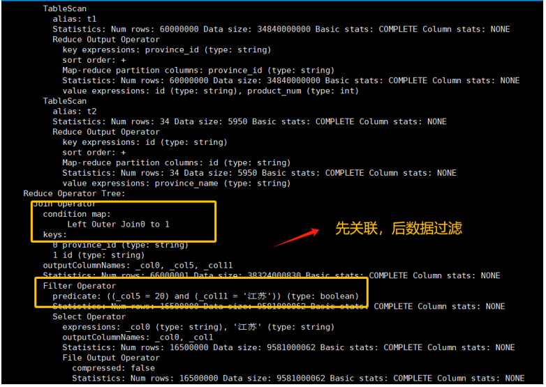

3）**开启谓词下推优化**
```sql
--是否启动谓词下推（predicate pushdown）优化
set hive.optimize.ppd = true;
--为了测试效果更加直观，关闭cbo优化
set hive.cbo.enable=false;
```
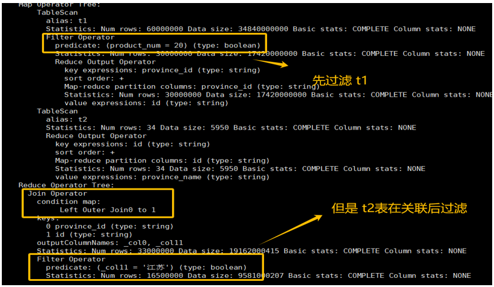
通过执行计划可以看出，过滤操作位于执行计划中的join操作之前。大大减少了关联的数据量。对整体执行效率有很大提升。

4）**开启谓词执行做关联，优化一下SQL**
```sql
--是否启动谓词下推（predicate pushdown）优化
set hive.optimize.ppd = true;
--为了测试效果更加直观，关闭cbo优化
set hive.cbo.enable=false;
explain
    SELECT t1.id
           ,t2.province_name
      from ds_hive.ch12_order_detail_orc t1
left join ds_hive.ch12_province_info_orc  t2
        on t1.province_id=t2.id and t2.province_name='江苏'  ----t2条件改在on里
  where t1.product_num=20
;
```
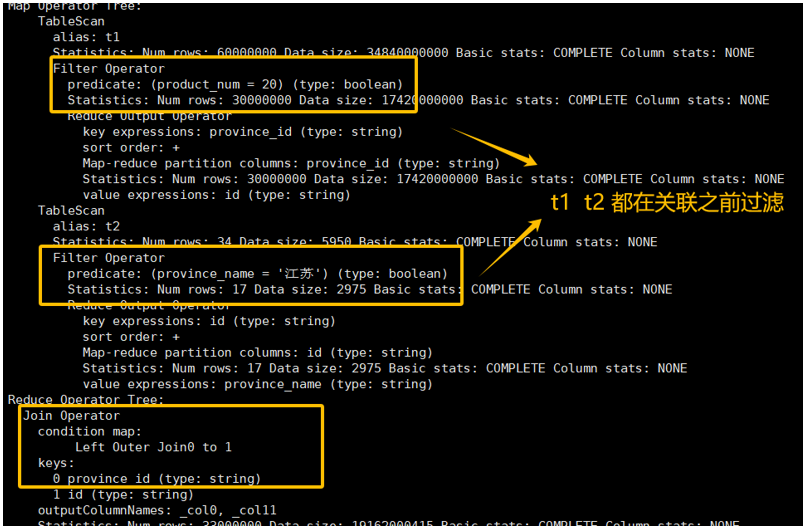

**结论**：
*   <span style="color:red">对于Join(Inner Join)、Full outer Join，条件写在on后面，还是where后面，join谓词下推都生效，Full outer Join都不生效；</span>
*   <span style="color:red">对于left outer Join ，右侧的表写在on后面、左侧的表写在where后面，谓词下推生效；</span>
*   <span style="color:red">对于Right outer Join，左侧的表写在on后面、右侧的表写在where后面，谓词下推生效；</span>

官网定义解释：https://cwiki.apache.org/confluence/display/Hive/OuterJoinBehavior 翻译如下图：
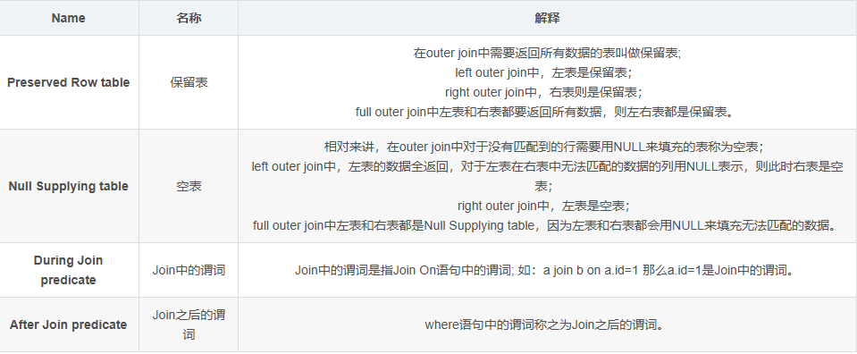

根据官网定义，上面的规则可以改写为:
*   **保留表**的谓词写在join中不能下推，需要用where；
*   **空表**的谓词写在join之后不能下推，需要用on；
*   在 **join**关联情况下，过滤条件无论在join中还是where中谓词下推都生效；
*   在 **full join**关联情况下，过滤条件无论在join中还是where中谓词下推都不生效。

### 11.3.6 sort by代替order by
HiveSQL中的order by就是将结果按某字段全局排序，这会导致所有map端数据都进入一个reducer中，在数据量大时可能会长时间计算不完。


| 特性 | **ORDER BY** | **SORT BY** |
|------|--------------|--------------|
| **排序范围** | 全局排序 | 局部排序（Reducer 内部） |
| **数据流** | 所有数据进入一个 Reducer | 数据分发到多个 Reducer |
| **结果** | 全局有序 | 每个 Reducer 内部有序 |
| **性能** | 数据量大时慢，单 Reducer 瓶颈 | 并行排序，性能好 |
| **使用场景** | 需要全局有序的结果 | 需要部分有序或作为中间步骤 |

<mark>如果使用sort by，那么还是会视情况启动多个reducer进行排序，并且保证每个reducer内局部有序。为了控制map端数据分配到reducer的key，往往还要配合distribute by一同使用。如果不加distribute by的话，map端数据就会随机分配到reducer</mark>。举个例子：
```sql
-- 原脚本
create table ds_hive.ch12_order_detail_orc_orderby
as
select  *
from ds_hive.ch6_t_goods
order by cast(price as int)
limit 10000
-- 优化脚本
create table ds_hive.ch12_order_detail_orc_sortby
as
select
*
from
(
select  *
from ds_hive.ch6_t_goods
distribute by category -- 按category类别分发，否则会随机分发
sort by cast(price as int)
limit 10000
) t1
order  by cast(price as int)
limit 10000
;
```
**注意**:<span style="color:red">实际企业运维可以通过参数 `set hive.mapred.mode=strict` 来设置严格模式，这个时候使用 orderby 全局排序必须加 limit</span>；建议如果不是非要全局有序的话，局部有序的话建议使用 sort by,它会视情况启动多个 reducer 进行排序，并且保证每个 reducer 内局部有序。为了控制map 端数据分配到 reducer 的 key，往往还要配合 distribute by 一同使用。如果不加 distribute by 的话，map 端数据就会随机分配到 reducer。

由于hive版本优化，<span style="color:red">我们只要写sort+limit等于sort+order+limit:</span>
```sql
create table ds_hive.ch12_order_detail_orc_sortby
as
select  *
from ds_hive.ch6_t_goods
distribute by category  -- 按category类别分发，否则会随机分发
sort by cast(price as int)
limit 10000
;
```

## 11.4 HIVE参数调优
### 11.4.1 map 数和reduce数
1）**控制hive任务中的map数**
合适的map数，会让资源分配的更平均，让我们的代码运行更快，通常情况下，作业会通过input的目录产生一个或者多个map任务。我们可以通过调整参数来控制运行过程中的map数。

Hive Map的数量主要取决于以下几个因素：
*   **输入文件的个数**：Hive作业会根据输入目录产生的map任务数量来决定，这通常与输入文件的个数有关。
*   **输入文件的大小**：如果单个输入文件非常大，或者整个作业的任务逻辑比较复杂，导致Map阶段执行缓慢时，可以增加Map数以减少每个Map处理的文件数据量。
*   **集群设置的文件块大小**：在Hive中可以通过`set dfs.block.size`命令查看并设置集群的默认文件块大小。这个参数通常是固定的，不能被用户自定义修改。

*   **map任务输入时小文件进行合并，减少map数**
   <span style="color:red"> 如果小文件多，在map输入时，一个小文件产生一个map任务，这样会产生多个map任务；启动和初始化多个map会消耗时间和资源，所以hive默认是将小文件合并成大文件。</span>
    在map执行前合并小文件，减少map数：CombineHiveInputFormat具有对小文件进行合并的功能（系统默认的格式）。HiveInputFormat没有对小文件合并功能。
    ```sql
    -------小文件合并
    set hive.input.format= org.apache.hadoop.hive.ql.io.CombineHiveInputFormat;
    -------关闭小文件合并大文件（不推荐调整）
    set hive.input.format=org.apache.hadoop.hive.ql.io.HiveInputFormat;
    ```
    案例实操：
    ```sql
    hive (default)>
    select
    name
    ,count(*)  as cnt
    from ds_hive.ch4_t_par_emp
    group by name
    ;
    ```
    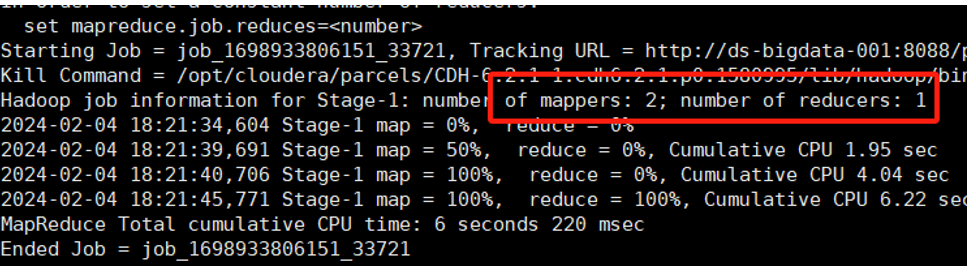
    ```sql
    hive (default)>
    -------关闭小文件合并大文件（制作演示作用，不推荐调整）
    set hive.input.format=org.apache.hadoop.hive.ql.io.HiveInputFormat;
    select
    name
    ,count(*)  as cnt
    from ds_hive.ch4_t_par_emp
    group by name
    ;
    ```
    3个文件，产生3个map：
    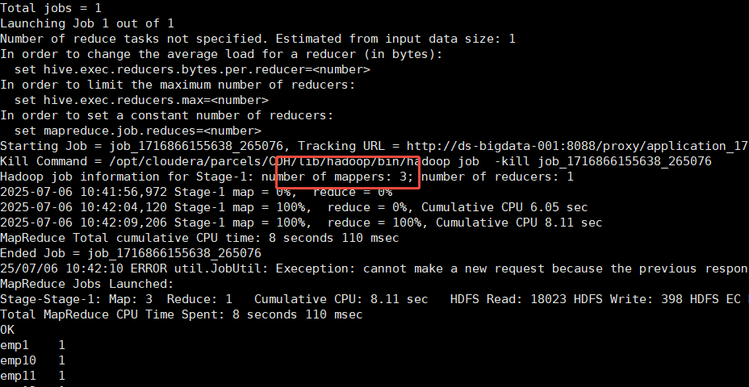

*   **在Map-Reduce的任务结束时合并小文件的设置**：如果map输出的小文件过多，hive 默认是开启map 输出合并。
    ```sql
    -- 在map-only任务结束时合并小文件，默认true
    set hive.merge.mapfiles = true;
    -- 在map-reduce任务结束时合并小文件，默认false
    set hive.merge.mapredfiles = true;
    -- 合并文件的大小，默认256M
    set hive.merge.size.per.task = 268435456;
    -- 当输出文件的平均大小小于该值时，启动一个独立的map-reduce任务进行文件merge
    set hive.merge.smallfiles.avgsize = 16777216;
    ```
*   **调整参数大小，决定map数据**
    当input的文件都很大，任务逻辑复杂，map执行非常慢的时候，可以考虑增加Map数，来使得每个map处理的数据量减少，从而提高任务的执行效率。
    参数
	
    | 参数 | 值 | 说明 |
    |------|----|------|
    | **blocksize** | 128MB | HDFS 块大小 |
    | **minSize** | 1B | 最小切片大小 |
    | **maxSize** | 256MB | 最大切片大小（默认） |
	
最大切片大小（默认）
<span style="color:red">增加map的方法为：根据computeSliteSize(Math.max(minSize,Math.min(maxSize,blocksize)))=数据切分大小，调整maxSize最大值。让maxSize最大值低于blocksize就可以增加map的个数。</span>

**案例实操**：
```sql
-- 1）执行查询
hive (default)>
select
name
,count(*)  as cnt
from ds_hive.ch4_t_par_emp
group by name
;
```
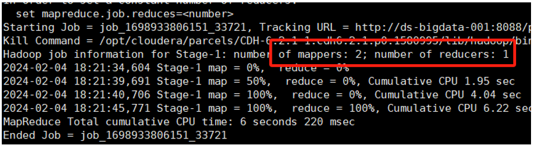
```
-- 2）设置最大切片值为200个字节
-- 文件大小: 128MB = 134,217,728 字节
-- 切片大小: 200 字节
hive (default)>
set mapreduce.input.fileinputformat.split.maxsize=200;
select
name
,count(*)  as cnt
from ds_hive.ch4_t_par_emp
group by name
;
```
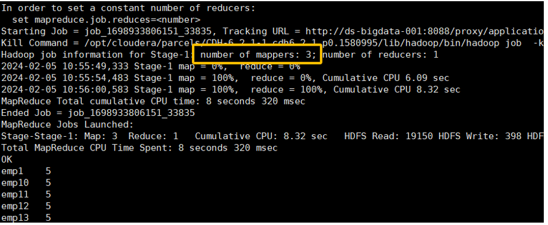

2）**控制hive任务中的reduce数**
reduce个数的设定极大影响任务执行效率，在设置reduce个数的时候需要考虑这两个原则：使大数据量利用合适的reduce数；使每个reduce任务处理合适的数据量。

在不指定reduce个数的情况下，Hive会猜测确定一个reduce个数，基于以下，两个设定：
*   参数1：`hive.exec.reducers.bytes.per.reducer`（每个reduce任务处理的数据量，在Hive 0.14.0及更高版本中默认为256M）
*   参数2：`hive.exec.reducers.max`（每个任务最大的reduce数，在Hive 0.14.0及更高版本中默认为1009）

计算reducer数的公式： `N = min( 参数2，总输入数据量 / 参数1 )`

在生产中，一般不调整这两个参数，这两个参数是 如果我们不指定hive的reduce个数，hive程序通过上面两个参数进行动态计算 决定reduce的个数。

`mapred.reduce.tasks` （默认是-1，代表hive自动根据输入数据设置reduce个数）

一般在生产中对reduce的个数也不做太多调整，但是<span style="color:red">有时候reduce的个数太多，导致输出到hdfs上的小文件太多。</span> 此时就可以通过调小`mapreduce.job.reduces`的个数，来减少hdfs上输出文件的个数。

**reduce个数并不是越多越好**，启动和初始化reduce会消耗时间和资源；另外，有多少个reduce,就会有多少个输出文件，如果生成了很多个小文件，那么如果这些小文件作为下一个任务的输入，则也会出现小文件过多的问题。

### 11.4.2 job并行运行设置
带有子查询的hql，如果子查询间没有依赖关系，可以开启任务并行，设置任务并行最大线程数。
*   `hive.exec.parallel` （默认是false， true：开启并行运行）
*   `hive.exec.parallel.thread.number` （最多可以并行执行多少个作业， 默认是 8）

**测试并行运算**：
*   **关闭并行运行**，发现没有依赖的子查询不会同步执行
    ```sql
    -- 关闭并行运行, 默认是false
    set hive.exec.parallel=false;
    explain
        SELECT t1.province_id
               ,t1.cnt_1
               ,t2.cnt_2
          from(select province_id,count(*) as cnt_1 from ds_hive.ch12_order_detail_orc  group by province_id)t1
     left join(select province_id,count(*) as cnt_2 from ds_hive.ch12_order_detail_orc  group by province_id) t2
            on t1.province_id=t2.province_id
    limit 10
    ;
    ```
    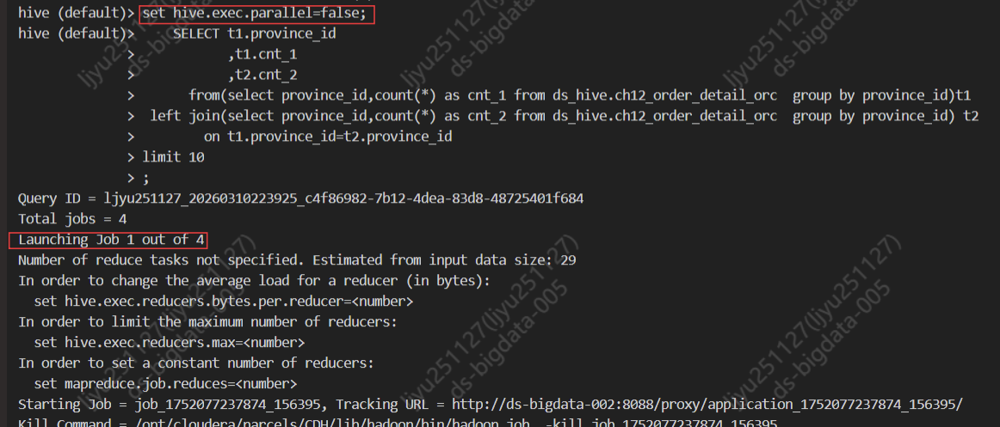

*   **开启并行运行**，发现没有依赖的子查询会同步执行
    ```sql
    -- 开启并行运行
    set hive.exec.parallel=true;
        SELECT t1.province_id
               ,t1.cnt_1
               ,t2.cnt_2
          from(select province_id,count(*) as cnt_1 from ds_hive.ch12_order_detail_orc  group by province_id)t1
     left join(select province_id,count(*) as cnt_2 from ds_hive.ch12_order_detail_orc  group by province_id) t2
            on t1.province_id=t2.province_id
    limit 10
    ;
    ```
    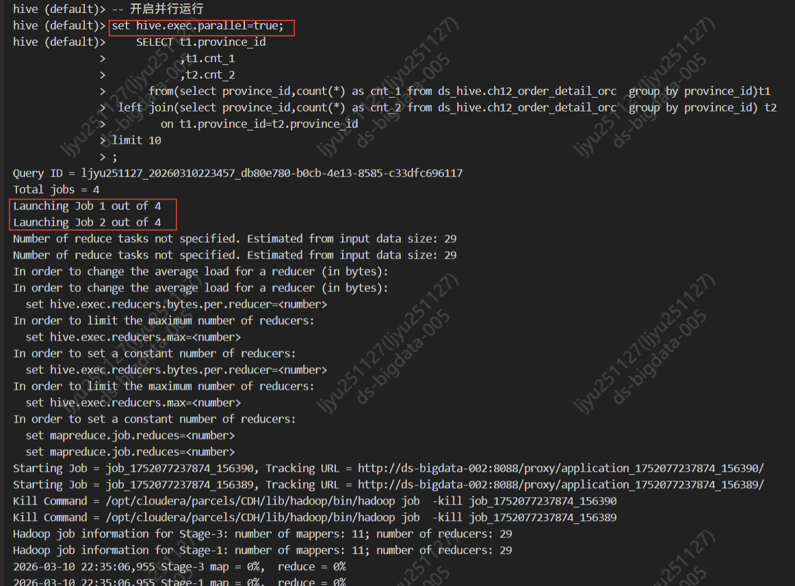

### 11.4.3 Fetch抓取
Fetch抓取是指，Hive中对某些情况的查询可以不必使用MapReduce计算。例如：`select * from emp;`在这种情况下，Hive可以简单地读取emp对应的存储目录下的文件，然后输出查询结果到控制台。

相关参数如下：
```sql
--是否在特定场景转换为fetch 任务
--设置为none表示不转换
--设置为minimal表示支持select *，分区字段过滤，Limit等
--设置为more表示支持select 任意字段,包括函数，过滤，和limit等
set hive.fetch.task.conversion=more;
```

### 11.4.4 本地模式
**优化说明**
<span style="color:red">大多数的Hadoop Job是需要Hadoop提供的完整的可扩展性来处理大数据集的。不过，有时Hive的输入数据量是非常小的。在这种情况下，为查询触发执行任务消耗的时间可能会比实际job的执行时间要多的多。对于大多数这种情况，Hive可以通过本地模式在单台机器上处理所有的任务。对于小数据集，执行时间可以明显被缩短。</span>

相关参数如下：
```sql
--开启自动转换为本地模式
set hive.exec.mode.local.auto=true; 
--设置local MapReduce的最大输入数据量，当输入数据量小于这个值时采用local  MapReduce的方式，默认为134217728，即128M
set hive.exec.mode.local.auto.inputbytes.max=50000000;
--设置local MapReduce的最大输入文件个数，当输入文件个数小于这个值时采用local MapReduce的方式，默认为4
set hive.exec.mode.local.auto.input.files.max=10;
```

### 11.4.5 严格模式
Hive可以通过设置某些参数防止危险操作：

1）**分区表不使用分区过滤**
将`hive.strict.checks.no.partition.filter`设置为true时，对于分区表，除非where语句中含有分区字段过滤条件来限制范围，否则不允许执行。换句话说，就是用户不允许扫描所有分区。进行这个限制的原因是，通常分区表都拥有非常大的数据集，而且数据增加迅速。没有进行分区限制的查询可能会消耗令人不可接受的巨大资源来处理这个表。

2）**使用order by没有limit过滤**
将`hive.strict.checks.orderby.no.limit`设置为true时，对于使用了order by语句的查询，要求必须使用limit语句。因为order by为了执行排序过程会将所有的结果数据分发到同一个Reduce中进行处理，强制要求用户增加这个limit语句可以防止Reduce额外执行很长一段时间（开启了limit可以在数据进入到Reduce之前就减少一部分数据）。

3）**笛卡尔积**
将`hive.strict.checks.cartesian.product`设置为true时，会限制笛卡尔积的查询。对关系型数据库非常了解的用户可能期望在执行JOIN查询的时候不使用ON语句而是使用where语句，这样关系数据库的执行优化器就可以高效地将WHERE语句转化成那个ON语句。不幸的是，Hive并不会执行这种优化，因此，如果表足够大，那么这个查询就会出现不可控的情况。

### 11.4.6 CBO优化
**优化说明**
CBO是指Cost based Optimizer，即基于计算成本的优化。

<span style="color:red">在Hive中，计算成本模型考虑到了：数据的行数、CPU、本地IO、HDFS IO、网络IO等方面。Hive会计算同一SQL语句的不同执行计划的计算成本，并选出成本最低的执行计划。目前CBO在hive的MR引擎下主要用于join的优化，例如多表join的join顺序。</span>

相关参数为：
`set hive.cbo.enable=true;` （是否启用cbo优化）

```sql
--是否启用cbo优化
set hive.cbo.enable=true;
```
**总结**
CBO优化对于执行计划中join顺序是有影响的，其之join顺序提前，如果某张表的数据量较小，将其提前，会有更大的概率使得中间结果的数据量变小，从而使整个计算任务的数据量减小，也就是使计算成本变小。