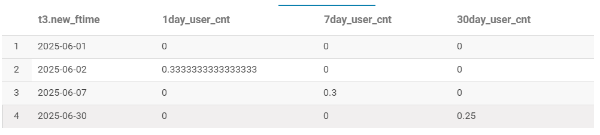
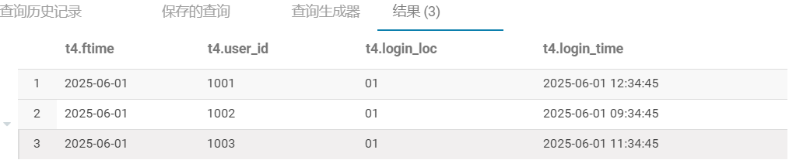
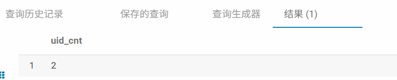
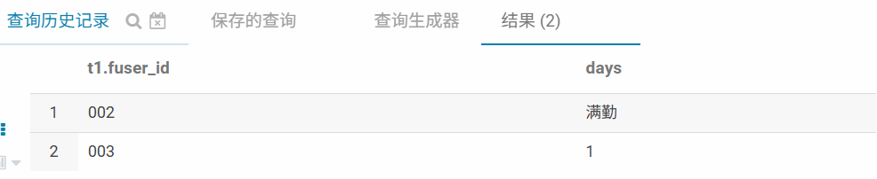
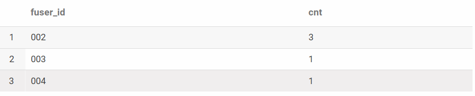
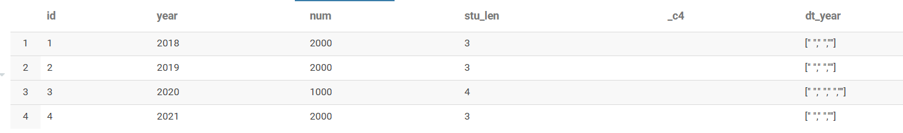
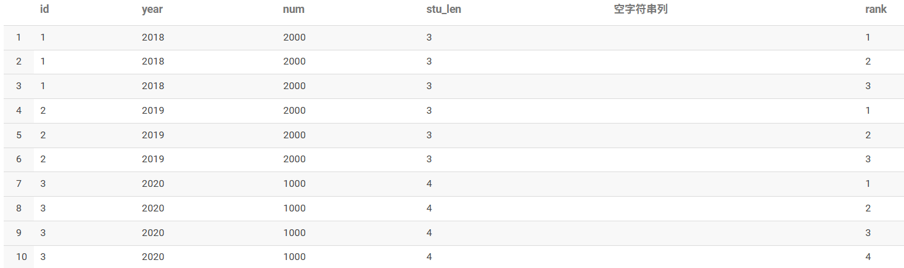
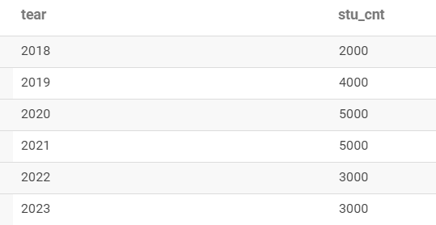
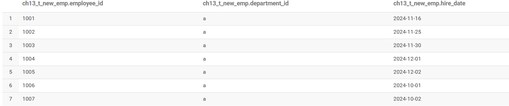
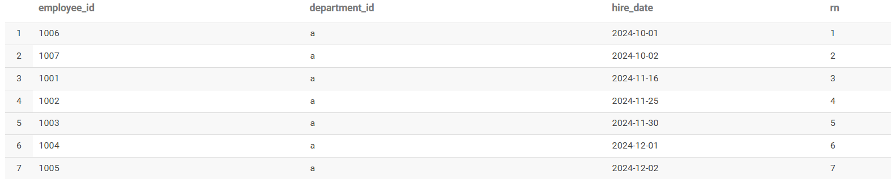

# 12.企业SQL面试题

## 题目1：腾X面试题（留存、topN）
用HiveSQL实现
（1）全量用户登录日志表`t_login_all`，字段信息`ftime`（登录日期）、`openid`（登录帐号）
新增用户登录日志表`t_login_new`，字段信息`ftime`（登录日期）、`openid`（登录帐号）
求每天新增用户次日、7天、30天留存率。
（说明：7天留存是指当天有登录且第7天还登录的用户）


**分析**：留存问题

```sql
select
 t3.new_ftime
,count(case when t3.diff=1  then t3.openid end)/count(t3.openid)  as 1day_user_cnt
,count(case when t3.diff=6  then t3.openid end)/count(t3.openid)  as 7day_user_cnt
,count(case when t3.diff=29  then t3.openid end)/count(t3.openid) as 30day_user_cnt
from
(
 select t1.openid
         ,t1.ftime  new_ftime
         ,t2.ftime  all_ftime
         ,datediff(t1.ftime,t2.ftime )  as diff
 from(select distinct ftime,openid from ds_hive.ch13_t_login_new)  t1
 left join (select distinct ftime,openid from ds_hive.ch13_t_login_all) t2
    on t1.openid=t2.openid
 where datediff(t1.ftime,t2.ftime )<=30
 ) t3
group by t3.new_ftime
;
```
运行结果：
第一小题：


（2）消息流水表`t_chat_all`，
字段信息：`Ftime`（日期）、`send_user id`（发消息用户id）、`receive_user_id`（接收消息用户id）、`chat_id`（消息id）、`send_time`（发消息时间）
用户登录流水日志表`t_user_login_all`,
字段信息：`Ftime`（日期）、`user_id`（用户id）、`login_id`（登录id）、`login_loc`（登录区服）、`login_time`（登录时间）
求：有收发消息且当天登录的用户中，最近登录时间、登录区服，输出`ftime`，`user_id`，`login_loc`，`login_time`

第二小题：

**分析**：topN问题，窗口函数
```sql
-- timu1_user_login有收发消息且当天登录的所有用户记录
with  timu1_user_login as(
select
        t2.user_id
       ,t2.ftime
       ,t3.login_loc
       ,t3.login_time
from
  (
     select   distinct
              user_id
             ,ftime
       from
     (
        select send_user_id as user_id,ftime  from ds_hive.ch13_t_chat_all
        union all
        select receive_user_id as user_id,ftime  from ds_hive.ch13_t_chat_all
      ) t1
  )  t2 --当天所有活跃（有收发消息）的用户列表
join
 (
    select distinct ftime,user_id,login_loc,login_time from ds_hive.ch13_t_user_login_all
  ) t3
 on t2.user_id=t3.user_id and t2.ftime=t3.ftime
 )

select   t4.ftime
        ,t4.user_id
        ,t4.login_loc
        ,t4.login_time
  from
 (
   select
         ftime
        ,user_id
        ,login_loc
        ,login_time
        ,row_number() over(partition by user_id order by ftime desc )  as num
    from timu1_user_login
  ) t4
where t4.num=1
;
```
运行结果：


---

## 题目2：快X面试题(json解析、谓词下推)
表：`user:uid,age,date`
`order:order_id,order_money,location,date`，其中`location:{"city","xx"}`
双十一场景，找出北京市双十一（11.1~11.12），年龄范围在20-25岁的人中的人数，人均销售额大于1000的人数

**分析**：json解析、谓词下推
```sql
select count(t3.uid)   as uid_cnt
from
(select t1.uid
        ,get_json_object(t1.location,'$.city')  as city
        ,t2.age
        ,sum(t1.order_money)                    as sum_order_money
   from ds_hive.ch13_timu2_order t1
left join ds_hive.ch13_timu2_user t2
       on t1.uid=t2.uid and t2.age>=20 and t2.age<=25
  where t1.order_date>='2025-11-01' and t1.order_date<='2025-11-12'
group by  t1.uid
          ,get_json_object(t1.location,'$.city')
          ,t2.age
 having  sum_order_money>1000
 ) t3
;
```

运行结果：


## 题目3：字X面试题（连续问题）
有一张用户签到表【`ds_hive.ch13_user_attendence`】，标记每天用户是否签到
（说明：该表包含所有用户所有工作日的出勤记录） ，包含三个字段：
日期【`fdate`】
用户id【`fuser_id`】
用户当天是否签到【`fis_sign_in`：0否1是】

问题1：请计算截至当前每个用户已经连续签到的天数（输出表仅包含当天签到的所有用户，计算其连续签到天数）
问题2：请计算每个用户历史以来最大的连续签到天数（输出表为用户签到表中所有出现过的用户，计算其历史最大连续签到天数）

**分析**：连续问题，只有工作日需要记录
```sql
-- 问题1
select
       t1.fuser_id
      ,(case when datediff t2.fdate is null  and t3.fdate is not null then '满勤'
            when  datediff t2.fdate is null then '1'
            else  datediff(t1.fdate,t2.fdate)  end)  as days
from
(
    select fuser_id
           ,fdate
     from ds_hive.ch13_user_attendence
    where fdate=current_date() 
    and fis_sign_in='1'
) t1
left join
 (
 select fuser_id
        ,max(fdate)  as fdate
 from ds_hive.ch13_user_attendence
where fdate<=current_date()   
and fis_sign_in='0'
group by fuser_id
)
  t2
  on t1.fuser_id=t2.fuser_id
left join
(
 select fuser_id
        ,min(fdate)  as fdate
 from ds_hive.ch13_user_attendence
where fdate<=current_date() 
and fis_sign_in='1'
group by fuser_id
) t3
on t1.fuser_id=t3.fuser_id
;
```

```sql
-- 问题1 方法二：
with timu_user_attendence_tmp3 as (
select t1.fuser_id
       ,t1.rank_dt
       ,count(*) as cnt
 from
     (
      SELECT
        fuser_id, 
        fdate,
        fis_sign_in,
        date_add(fdate,ROW_NUMBER() OVER (PARTITION BY fuser_id ORDER BY fdate desc)) AS rank_dt
    FROM
        ds_hive.ch13_user_attendence
    WHERE
        fis_sign_in = 1 
 ) t1
 group by t1.fuser_id,t1.rank_dt
)
 
select fuser_id
       ,cnt
  from timu_user_attendence_tmp3
  where rank_dt=date_add(current_date(),1)
;
```
```sql
-- 问题2
with timu_user_attendence_tmp4 as (
select t1.fuser_id
       ,t1.rank_dt
       ,count(*) as cnt
 from
     (
      SELECT
        fuser_id, 
        fdate,
        fis_sign_in,
        date_add(fdate,ROW_NUMBER() OVER (PARTITION BY fuser_id ORDER BY fdate desc)) AS rank_dt
    FROM
        ds_hive.ch13_user_attendence
    WHERE
        fis_sign_in = 1 
 ) t1
 group by t1.fuser_id,t1.rank_dt
)
 
select  fuser_id
        ,max(cnt) as max_cnt
  from timu_user_attendence_tmp4
 group by fuser_id;
```
运行结果
第一小题：

第二小题：



## 题目4：华X面试题（列转行）
有一个录取学生人数表，记录的是每年录取学生人数和入学学生的学制以下是表结构：
```sql
CREATE TABLE admit(
id int(11) ,
year int(255)          COMENT  '入学年度',
num int(255)             COMENT '录取学生人数',
stu_len varchar(255)  CONENT '学生学制'
);
```
`year` 表示学生入学年度，`num` 表示对应年度录取人数，`stu_len`表示录取学生的学制
说明: 例如录取年度2018学制3，表示该批学生在校年份为2018 ~ 2019、2019 ~ 2020,2020 ~ 2021
```
id      year          num      stu_len
1       2018         2000         3
2       2019         2000         3
3       2020         1000         4
4       2021         2000         3
```
根据以上示例计算出每年在校人数,写出SQL语句:

**分析**：列转行、爆炸函数
```sql
with timu4_stu_tmp1 as(
select
id
,year
,num
,stu_len
,space(cast(stu_len-1 as int)) 
,split(space(cast(stu_len-1 as int)),'') as dt_year
from ds_hive.ch13_t_stu_school
),
timu4_stu_tmp2 as(
select   id
         ,year
         ,num
         ,stu_len
         ,`空字符串列`
         ,row_number() over(partition by id order by year) as rank
    from timu4_stu_tmp1
   lateral view explode(dt_year) ex as `空字符串列`
 )
 select year+rank-1   as tear
        ,sum(num) as stu_cnt
   from timu4_stu_tmp2
group by  year+rank-1;
```
<span style="color:red">LATERAL VIEW explode(数组字段) 虚拟表别名 AS 列别名</span>
运行结果：
timu4_stu_tmp1：




---

## 题目5：字X面试题（性能优化）
有一张员工入职时间表 `ds_hive.ch13_t_new_emp`，如下：

要求：按照部门已入职员工的入职时间排序，给每位员工编号。

```sql
select
      employee_id
     ,department_id
     ,hire_date
     ,row_number() over(partition by department_id  order by hire_date )    as rn
from ds_hive.ch13_t_new_emp
```


 -----优化后的sql
```sql
with ch13_t_new_emp_tmp1 as (
 select 
employee_id   
,department_id 
,hire_date  
,substr(hire_date,1,7)  as months
,row_number() over(partition by  department_id,substr(hire_date,1,7) order by  hire_date) as num
 from  ds_hive.ch13_t_new_emp
),
ch13_t_new_emp_tmp2 as(
 select 
  t2.department_id
 ,t2.months
 ,lag(t2.cnt,1,0) over(partition by t2.department_id order  by  t2.months) lag_cnt
 from
 (
  select 
         t1.department_id
        ,t1.months
        ,sum(t1.cnt) over(partition by t1.department_id order  by  t1.months rows between unbounded preceding and current row) cnt
   from 
       (
          select 
                 department_id
                 ,substr(hire_date,1,7)  as months
                 ,count(employee_id) as cnt
           from  ds_hive.ch13_t_new_emp
          group by department_id
                  ,substr(hire_date,1,7) 
         ) t1
   )t2
 )
 select t1.employee_id 
         ,t2.department_id
         ,t1.hire_date
         ,num+lag_cnt     as num
 from ch13_t_new_emp_tmp1 t1
 left join ch13_t_new_emp_tmp2 t2
  on t1.department_id=t2.department_id
  and t1.months=t2.months
;
```