# 2.Hive安装详解

## 2.1 三种模式安装详解

### 2.1.1 前置条件
由于Hive是一款基于Hadoop的数据仓库软件，通常部署运行在Linux系统之上。因此不管使用何种方式配置Hive Metastore，必须要先保证下面两点：
- 服务器的基础环境正常（防火墙，主机名，JDK环境等）
- Hadoop集群健康可用

Hive的部署模式主要有三种，核心区别如下表：

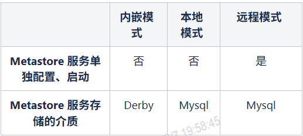

#### 1. 内嵌模式
&emsp;&emsp;内嵌模式是Hive的默认部署方式，此模式下，<mark>元数据存储在内嵌的Derby数据库中，是Hive最简单的部署方式</mark>。使用Derby存储方式时，运行hive会在当前目录生成一个Derby文件和一个metastore_db目录。
**弊端**：一次只支持一个客户端的连接，<span style="color:red">不适合生产环境只适合练习，只适合测试环境</span>。
#### 2. 本地模式
&emsp;&emsp;本地模式下，metastore使用独立数据库存储元数据，这里的独立数据库通常<span style="color:red">使用MySQL数据库</span>。当涉及元数据操作时，Hive服务中的元数据服务模块通过JDBC和存储于DB里的元数据数据库进行交互。使用mysql做元数据的存储，操作mysql数据库做元数据的管理，可以多个hive client一起使用，并且可以共享元数据。
**弊端**：每次启动hive，都启动一个metastore服务。
**JDBC**（Java Database Connectivity）是Java语言中用来规范客户端程序如何访问数据库的应用程序接口（API），它提供了一套标准的方法，让Java程序能与各种不同的数据库（如MySQL、Oracle、SQL Server等）进行对话。
#### 3. 远程模式
&emsp;&emsp;<span style="color:red">远程模式下使用mysql做元数据的存储，metastore服务也独立出来自己在一个单独JVM中运行</span>。优点便于元数据库信息的保密，因为只需要在运行metastore的机器上配置元数据库连接信息，客户端只需要配置metastore连接信息即可。
**弊端**：会引发单点问题，例如metastore服务挂了，其它hive客户端就获取不到元数据信息了。企业环境推荐使用此种模式。

注：
1）Hive官网地址
http://hive.apache.org/
2）文档查看地址
https://cwiki.apache.org/confluence/display/Hive/GettingStarted
3）下载地址
http://archive.apache.org/dist/hive/
4）直接从我们项目的百度云盘下载

### 2.1.2.前置条件
由于Hive是一款基于Hadoop的数据仓库软件，通常部署运行在Linux系统之上。因此不管使用何种方式配置Hive Metastore，必须要先保证下面两点：

服务器的基础环境正常（防火墙，主机名，JDK环境等）
Hadoop集群健康可用
### 2.1.3 Hive内嵌模式安装步骤

#### 1. 下载Hive的安装包
Hive的安装包可以从官网的下载地址直接下载，也可以从我们提供的百度网盘直接获取。下载完成后，直接将安装包上传到服务器的`/opt/ds/software`目录下。
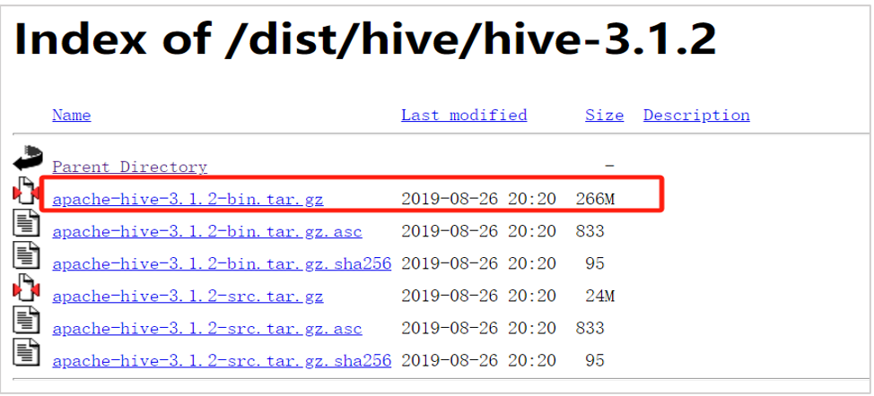

#### 2. 解压安装
```
cd /opt/ds/software
tar -zxf apache-hive-3.1.2-bin.tar.gz
```
嵌入模式下，无需对Hive配置文件进行修改，初始化数据库之后，只需要启动Hive安装包下的bin目录下的Hive程序即可；
```
cd /opt/ds/software/apache-hive-3.1.2-bin/.bin/hive
```
第一次启动，有如下的报错：
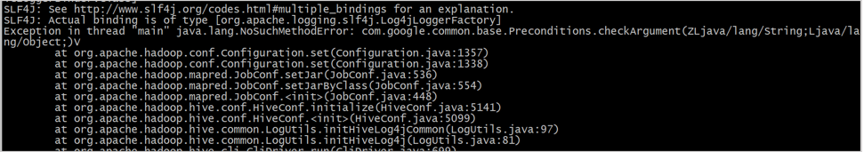
**错误原因**：hive自带的依赖jar包版本和hadoop种的不一致，导致报错。
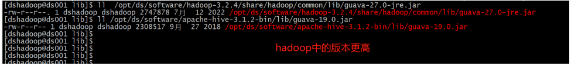
**解决方式**：删除hive中低版本jar包，将hadoop中高版本的复制到hive的lib中。
```shell
rm -rf /opt/ds/software/apache-hive-3.1.2-bin/lib/guava-19.0.jar
cd /opt/ds/software/apache-hive-3.1.2-bin/lib/
cp /opt/ds/software/hadoop-3.2.4/share/hadoop/common/lib/guava-27.0-jre.jar .
```
再次启动即可正常运行；

#### 3. 验证使用
Hive的验证，我们只需要做一些简单的操作即可，下面就是简单的创建了一个测试表t1；
```
create table t1(id int); #建表语句
show tables; #查看系统中的所有表（当前库）
desc t1; #查看表信息
insert into t1 values("ds_table"); #插入一条数据
```
执行结果示例：
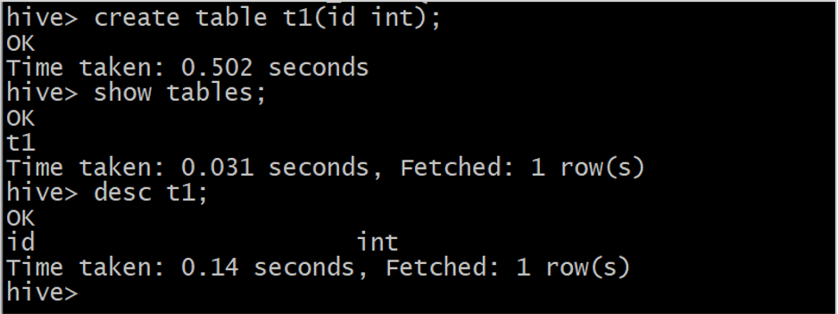
**重点说明**：Hive的metastore只管理元数据，实际的数据是存储在hdfs上的`/user/hive/warehouse/`（默认值，可自定义修改）目录下；
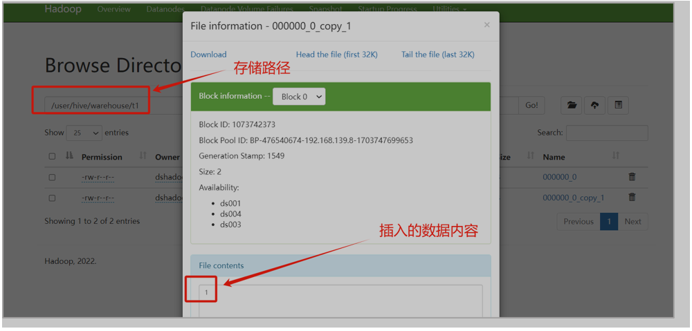

### 2.1.4 Hive本地和远程模式安装
本地和远程模式的部署，差别不大，这里就不演示本地模式的具体部署，<span style="color:red">直接部署远程模式</span>。

#### 1. 需要先安装MySQL服务
检测并卸载自带的mariadb
```shell
rpm -qa | grep -i -E mysql\ mariadb
rpm -qa | grep -i -E mysql\ mariadb | xargs -n1 sudo rpm -e --nodeps
```
下载安装包到本地安装目录并解压
```
tar -xvf mysql-5.7.33-1.el7.x86_64.rpm-bundle.tar
yum install -y mysql-community-{server,client,common,libs}-*;
```
等待安装完成，初始化数据目录
```
mysqld --defaults-file=/etc/my.cnf --initialize-insecure --user=mysql
```
初始化完成，启动mysql服务
```
systemctl start mysqld
# systemctl status mysqlc
```
终端输入mysql客户端命令，进入mysql，修改root密码。
```
mysql
mysql> ALTER USER 'root'@'localhost' IDENTIFIED BY 'adbgN3DS#Y6';
```

#### 2. 配置hive相关配置
拷贝MySQL的JDBC驱动至hive下的lib/
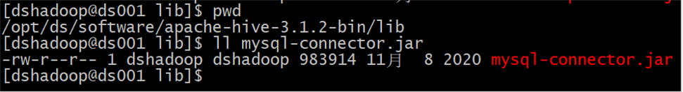
编辑hive的配置文件hive-site.xml
```shell
cd /opt/ds/software/apache-hive-3.1.2-bin/conf
cp hive-default.xml.template hive-site.xml
vim hive-site.xml
```
添加配置内容：
```xml
<configuration>
<!-- jdbc连接的URL -->
<property>
    <name>javax.jdo.option.ConnectionURL</name>
    <value>jdbc:mysql://192.168.139.8:3306/metastore?useSSL=false</value>
</property>
<!-- jdbc连接的Driver -->
<property>
    <name>javax.jdo.option.ConnectionDriverName</name>
    <value>com.mysql.jdbc.Driver</value>
</property>
<!-- jdbc连接的username -->
<property>
    <name>javax.jdo.option.ConnectionUserName</name>
    <value>root</value>
</property>
<!-- jdbc连接的password -->
<property>
    <name>javax.jdo.option.ConnectionPassword</name>
    <value>adbgN3DS#Y6</value>
</property>
<!-- Hive元数据存储版本的验证 -->
<property>
    <name>hive.metastore.schema.verification</name>
    <value>false</value>
</property>
<!-- 元数据存储授权 -->
<property>
    <name>hive.metastore.event.db.Notification.api.auth</name>
    <value>false</value>
</property>
<!-- Hive默认在HDFS的工作目录 -->
<property>
    <name>hive.metastore.warehouse.dir</name>
    <value>/user/hive/warehouse</value>
</property>
<!-- 远程模式部署metastore 服务地址 -->
<property>
    <name>hive.metastore.uris</name>
    <value>thrift://192.168.139.8:9083</value>
</property>
<!-- 指定hiveserver2连接的主机名 -->
<property>
    <name>hive.server2.Thrift.bind.host</name>
    <value>192.168.139.8</value>
</property>
<!-- 指定hiveserver2连接的端口号 -->
<property>
    <name>hive.server2.Thrift.port</name>
    <value>10000</value>
</property>
</configuration>
```

#### 3. 创建Hive的元数据库并初始化
登录mysql手动创建数据库
```sql
CREATE DATABASE metastore CHARACTER SET utf8 COLLATE utf8_bin;
```
初始化hive元数据库
```shell
cd /opt/ds/software/apache-hive-3.1.2-bin
./bin/schematool -initSchema -dbType mysql -verbose
```
初始化成功提示：
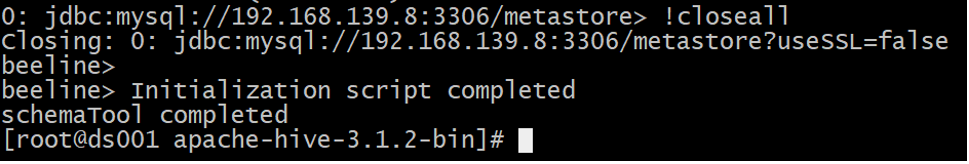
启动hive metastore服务
```shell
cd /opt/ds/software/apache-hive-3.1.2-bin
nohup ./bin/hive --service metastore > ./logs/hive.log 2>&1 &
```

#### 4. 验证hive使用
```
create table t1(id int); #建表语句
show tables; #查看系统中的所有表（当前库）
desc t1; #查看表信息
insert into t1 values("ds_table"); #插入一条数据
```

#### 5. 验证hive元数据库metastore
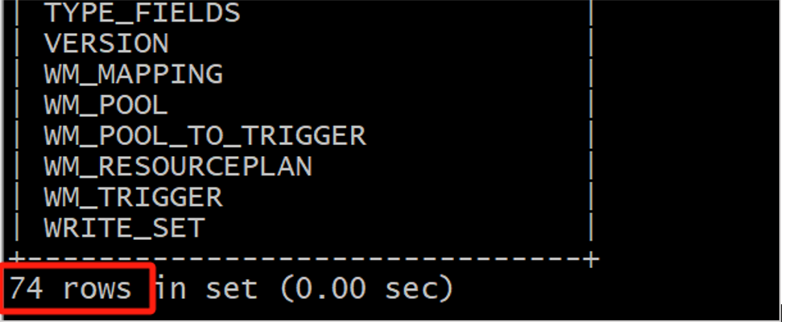
查看元数据库中存储的库信息
```sql
select * from DBS;
```
执行结果示例：
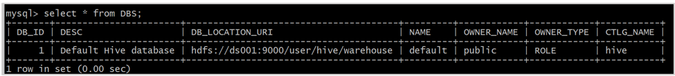
查看元数据库中存储的表信息
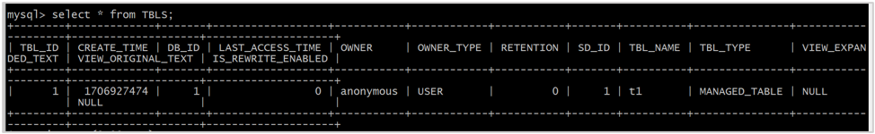


## 2.2 Hive客户端的使用
Hive客户端是一种用于与Hive服务进行交互的工具或接口。它提供了一种可以通过命令行或图形界面与Hive进行交互的方式。它允许用户执行各种HiveQL查询、创建和管理表、加载和导出数据等操作。

以下是一些常见的Hive客户端：
- **Hive命令行界面 (CLI)**：这是Hive自带的默认客户端，它提供了一个命令行界面，可以直接在终端中输入HiveQL查询和命令。通过CLI，用户可以与Hive进行交互，并查看查询结果。
- **第三方Web界面**：Hue是一个开源的Web界面，用于Hadoop生态系统中的各种工具和应用程序。它提供了一个用户友好的界面，可以通过浏览器访问Hive，并执行查询、管理表和查看查询结果等操作。
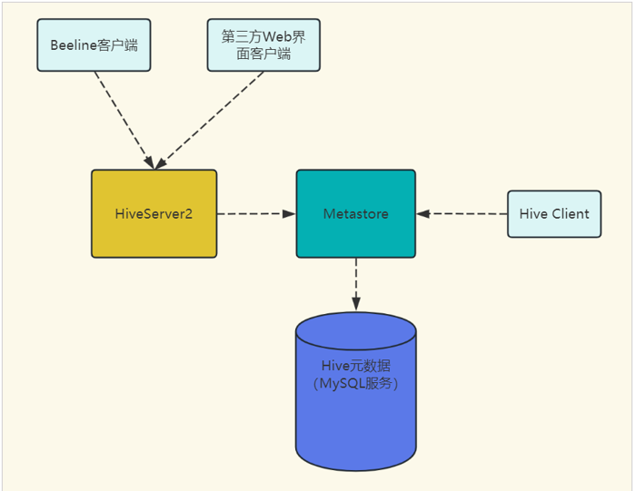

### 2.2.1 Hive Client的使用
```shell
cd /opt/ds/software/apache-hive-3.1.2-bin/bin
./hive
```
或者配置hive的全局环境变量，这样就可以在任意目录下执行hive cli命令
```
vim /etc/profile
export HIVE_HOME=/opt/ds/software/apache-hive-3.1.2-bin
export PATH=$PATH:$HADOOP_HOME/sbin:$HIVE_HOME/bin
source /etc/profile
```

### 2.2.2 Hive Beeline 客户端的使用
Hive Beeline是JDBC的客户端，是先通过JDBC协议和Hiveserver2建立连接，所以使用它之前必须启用HiveServer2服务。
HiveServer2服务也是一个独立的Java进程，它的启用比较简单，只需要在配置项中添加对应的服务配置，然后启动服务进程即可。

在`hive-site.xml`中添加：
```xml
<!--指定hiveserver2连接的主机名-->
<property>
    <name>hive.server2.Thrift.bind.host</name>
    <value>192.168.139.8</value>
</property>
<!--指定hiveserver2连接的端口号-->
<property>
    <name>hive.server2.Thrift.port</name>
    <value>10000</value>
</property>
```

#### 启动服务进程
```
cd /opt/ds/software/apache-hive-3.1.2-bin
nohup ./bin/hive --service hiveserver2 >logs/hiveserver2.log 2>&1 &
```
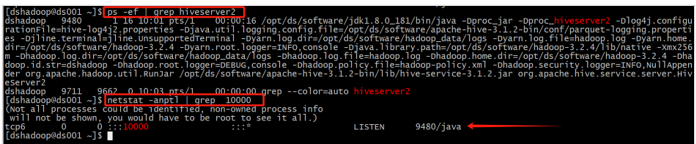

#### Beeline链接hive的方式：
```
beeline -u jdbc:hive2://<HiveServer2主机>:<HiveServer2端口号>/default
# 有用户鉴权的
beeline -u jdbc:hive2://<HiveServer2主机>:<HiveServer2端口号>/default -n <用户名> -p <密码>
```
**第一登录报错处理**：
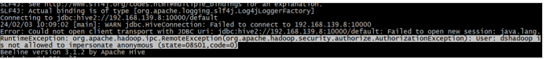
**报错原因**：上述报错的原因是hiveserver2增加了权限控制，当前用户登录权限的校验失败，这里需要在hadoop添加对应的配置项；
配置文件路径：`/opt/ds/software/hadoop-3.2.4/etc/hadoop/core-site.xml`
说明：这里只添加namenode所在节点的配置即可，然后需要重启namenode。
```xml
<property>
    <name>hadoop.proxyuser.dshadoop.hosts</name>
    <value>*</value>
</property>
<property>
    <name>hadoop.proxyuser.dshadoop.groups</name>
    <value>*</value>
</property>
```
再次启动即可链接成功；
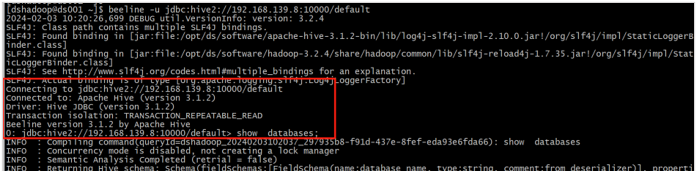
感兴趣的可以看一下官网对这一块的说明：https://hadoop.apache.org/docs/current/hadoop-project-dist/hadoop-common/Superusers.html

## 2.3 开发平台使用

**划重点**：该工具是使用图形化界面，访问hive数据库里面的表、进行查询分析。在企业内部基本都有自己的数据探查平台(Adhoc)，也称即席查询平台。
参考使用文档：http://wiki.dsbigdata.com/pages/viewpage.action?pageId=10558201
我们这个平台接入了多种查询引擎供大家练习使用：

### 2.3.1 开发平台使用
1. 打开链接，一定要选择开发平台

2. 使用客户端进行Hive HQL脚本编写，窗口查询如下：
   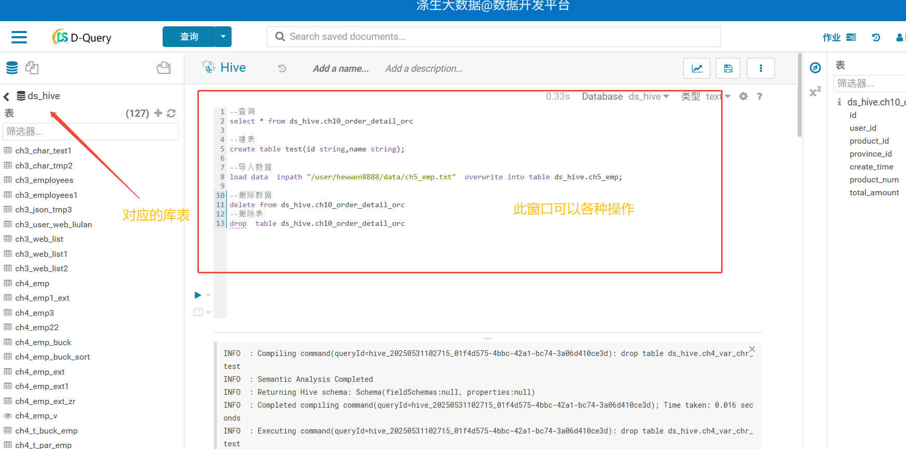
   还可以上传文件操作：
   **第一步**：上传文件，并验证数据(这里上传的是hdfs路径)。
  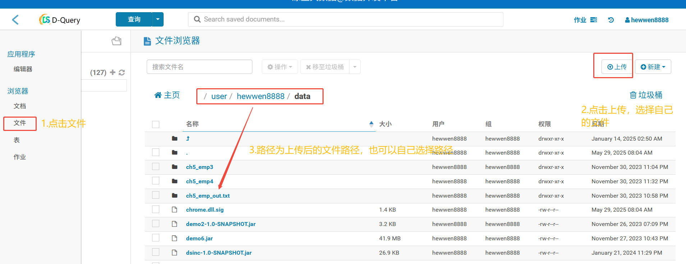
   **第二步**：使用客户端建表后，再使用探数平台装载数据。
   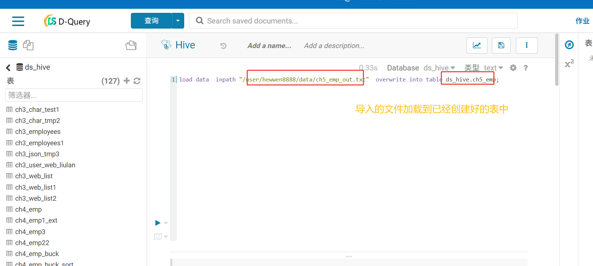
   **第三步**：使用客户端进行数据查询。
   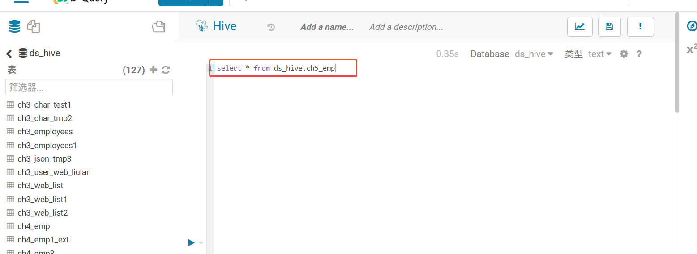

### 2.3.2 客户端的配置
打开对应的跳板机，输入账号密码，这里需要验证码验证：

打开看见对应的个人资产，点击操作的使用登录。
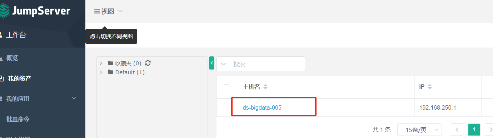
如果麻烦也可以在xshell中配置具体的登录地址：
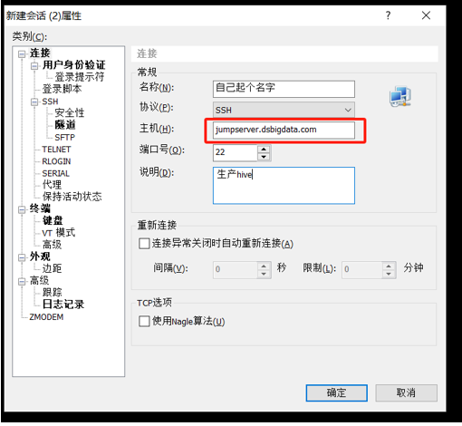
服务器：jumpserver.dsbigdata.com
账号密码为登录我们wiki的账号。