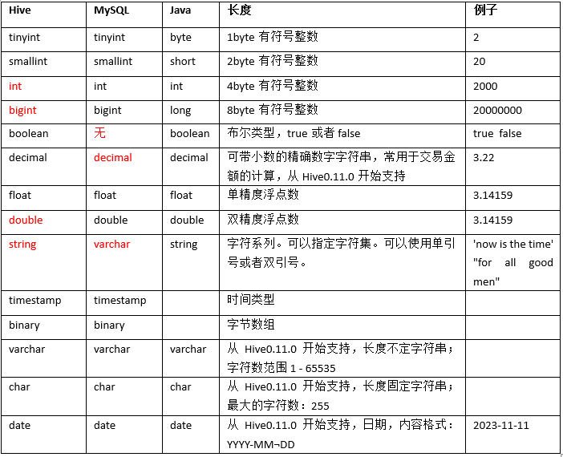
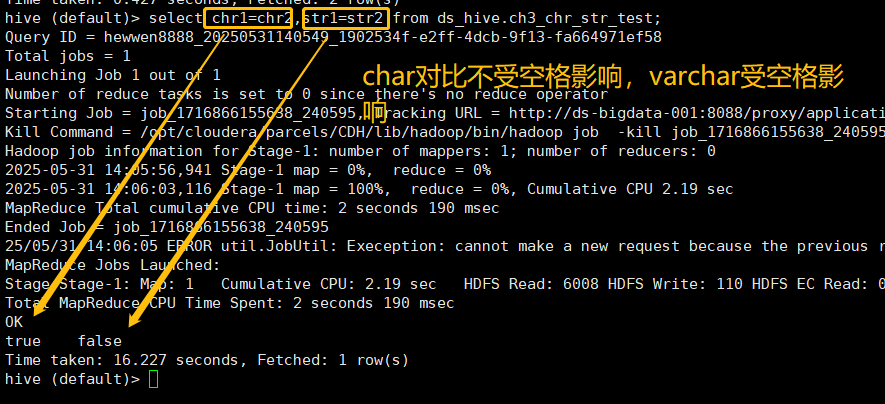
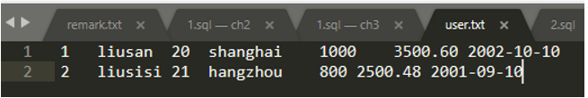
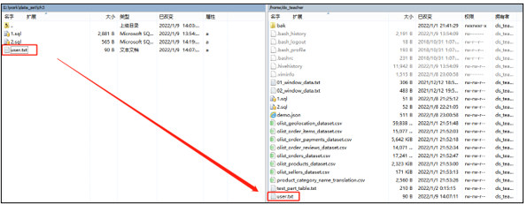
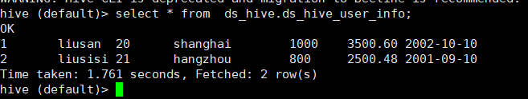
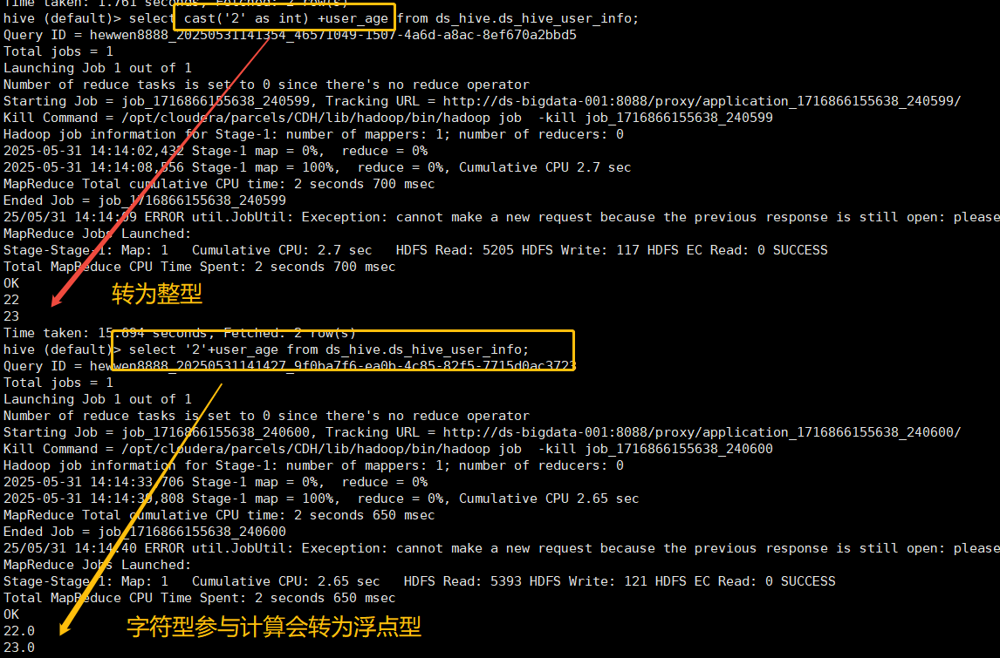
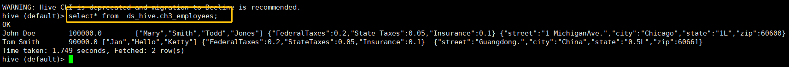
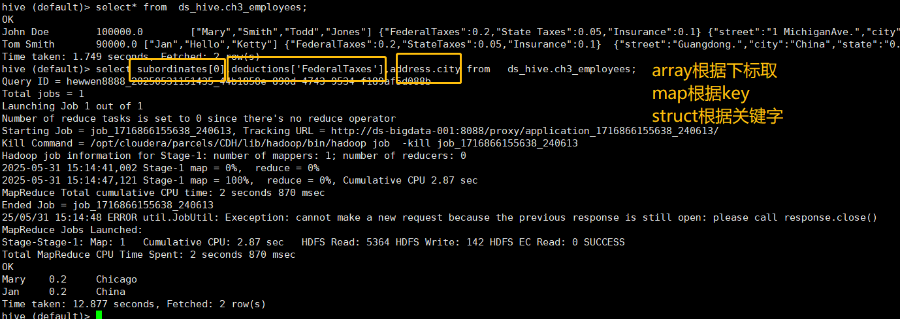
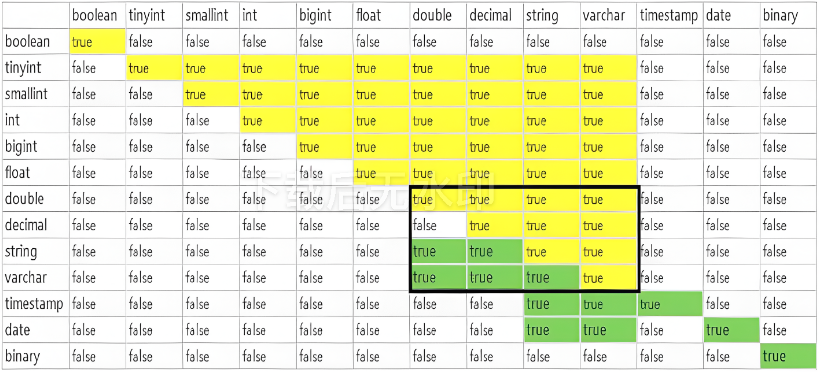
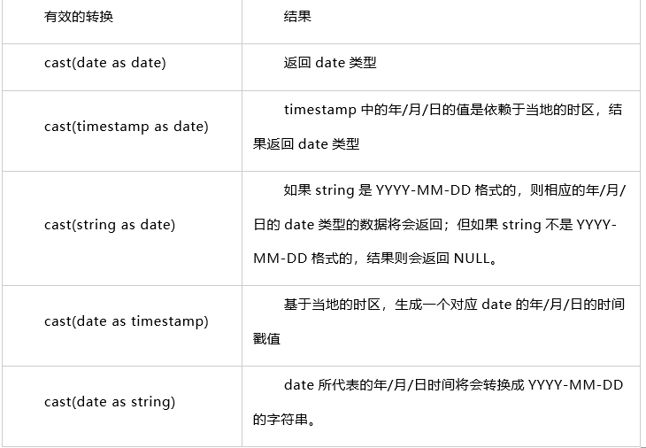

# 3.Hive数据类型详解

## 3.1 基本数据类型(☆☆理解)
### 3.1.1 基本数据类型详解 (☆☆理解)

Hive中的数据类型指的是表中列的字段类型，主要分为两类：基础数据类型、集合数据类型。

【备注：数据类型英文字母大小写不敏感】



#### 1. 数字类型

**整数类型**

Hive有4种带符号的整数类型：TINYINT, SMALLINT, INT, BIGINT，分别对应Java中的byte, short, int, long。字节长度分别为1, 2, 4, 8字节。在使用整数字面量时，默认情况下为INT，如果要声明为其他类型，通过后缀来标识。

**浮点数类型**：

浮点数默认会当作DOUBLE型

单精度，也就是 float ，在 32 位机器上用 4 个字节来存储的；而双精度double是用 8 个字节来存储的，这是它们最本质的区别。由于存储位不同，它们能表示的数值的范围就不同，也就是能准确表示的数的位数就不同。

- float的精度是6位有效数字，取值范围是10的-38次方到10的38次方，float占用4字节空间。

- double的精度是15位有效数字，取值范围是10的-308次方到10的308次方, double占用8字节空间。

- DECIMAL(10,2)代表最多10位数字，后2位是小数。此时也就是说，小数点前最多有10位数字，如果超过一位则会变成null。

- 如果不指定参数，那么默认是DECIMAL(10,0)，即没有小数位，此时0.82会变成1。

#### 2. 字符串类型

**关于varchar与char的说明**:

（1）varchar属于可变长的字符类型，范围1-65535；而char属于固定长度的字符类型，最大长度255。

（2）假定声明了varchar(20)与char(20)两种数据类型，当存入的字符占用小于20时，声明为varchar的字符只占用足够表示它的那些字符空间；而char则仍然占满20个字节空间，用空格填充。

**关于string的说明**:

对于Hive的string类型相当于数据库的varchar类型，该类型是一个可变的字符串，不过它不能声明其中最多能存储多少个字符，理论上它可以存储2GB的字符数。可以用单引号（'）或双引号（"）定义，这个类型是以后我们定义字符串的常用类型。

**char和varchar区别对比**：

建表：

```sql
create table ds_hive.ch3_chr_str_test(chr1 char(10), chr2 char(20), str1 varchar(10), str2 varchar(20))
```

插入数据：

```sql
insert into ds_hive.ch3_chr_str_test values('aa','aa  ','bb','bb  ')
```

对比区别：

```sql
select chr1=chr2, str1=str2 from ds_hive.ch3_chr_str_test;
```



#### 3. 日期与时间戳

**TIMESTAMP**：存储纳秒级别的时间戳，同时Hive提供了一些内置函数用于在TIMESTAMP与Unix时间戳（秒）和字符串之间做转换。

**Date**：Hive中的Date只支持YYYY-MM-DD格式的日期，其余写法都是错误的，如需带上时分秒，请使用timestamp。

获取当前timestamp：

```sql
current_timestamp() --返回值: timestamp
```

获取当前日期：

```sql
current_date() --返回值：date
```

获取当前时间戳：

```sql
unix_timestamp()
```

获取指定字符串的Unix时间戳：

```sql
select unix_timestamp('2023-12-05 09:00:00');
```

将指定时间戳转化为日期格式（企业常用，一般指定时间维度动态参数）：

```sql
from_unixtime(unix_timestamp('2023-12-05 09:00:00'), 'yyyy-MM-dd')
```

### 3.1.2 基础数据类型应用示例 (☆☆理解)

这里给大家举个例子，演示一下各个数据类型的使用。

我们有个文本文件ch3_user.txt：每行表示一条用户信息，每行数据中间用tab分隔开。



我们现在利用这个文件来新建对应的表，将其存储到hive中进行分析。

**（1）首先通过winscp上传到服务器上面**：



**（2）新建表**：

```sql
Use ds_hive;
CREATE TABLE ds_hive.ds_hive_user_info ( 
  user_id int comment '用户id', 
  user_name string comment '用户姓名', 
  user_age int comment '用户年龄', 
  user_city string comment '城市名称', 
  user_city_person bigint comment '城市人口', 
  consume_amount decimal(20,2) comment '用户消费金额', 
  user_birthday date comment '用户出生年月' 
) comment '用户信息表' 
row format delimited 
fields terminated by '\t' 
stored as textfile;
```

--思考为什么用textfile?

**（3）载入实验数据**：

```sql
---这个路径要查看你自己的文件到底在哪个目录下
load data local inpath '/home/hewwen8888/data/ch3_user.txt' overwrite into table ds_hive.ds_hive_user_info
```

查看实验数据：



**（4）使用实验数据**：

```sql
hive (default)> select '2'+user_age from ds_hive.ds_hive_user_info;
hive (ds_hive)> select cast('2' as int) +user_age from ds_hive.ds_hive_user_info;
```



## 3.2 复杂数据类型详解（集合数据类型）

Hive有三种复杂数据类型array、map和struct。array和map与Java中的array和map类似，而struct由一组称为成员的不同数据组成，其中每个成员可以具有不同的类型。

| 类型 | 描述 | 示例 | 应用场景 |
|------|------|------|----------|
| **ARRAY** | 数组，由一系列相同数据类型的元素组成，这些元素可以通过下标来访问。比如有一个ARRAY类型的变量fruits，它是由['apple','orange','mango']组成，那么我们可以通过fruits[1]来访问元素orange，因为ARRAY类型的下标是从0开始的。 | topN | 存储列表数据 |
| **MAP** | 字典，包含key->value键值对，可以通过key来访问元素。比如"userlist"是一个map类型，其中username是key，password是value；那么我们可以通过userlist['username']来得到这个用户对应的password。 | 存储账号、登录信息 | 键值对存储 |
| **STRUCT** | 结构体，可以包含不同数据类型的元素。这些元素可以通过"点语法"的方式来得到所需要的元素，比如user是一个STRUCT类型，那么可以通过user.address得到这个用户的地址。 | 复杂对象存储 | 嵌套结构 |

###  3.2.1 复杂数据类型应用示例

**（1）创建带有复杂结构的测试表ds_hive.ch3_employees**：

```sql
CREATE TABLE ds_hive.ch3_employees( 
  name STRING, 
  salary FLOAT, 
  subordinates ARRAY<STRING>, 
  deductions MAP<STRING, FLOAT>, 
  address STRUCT<street:STRING, city:STRING, state:STRING, zip:INT> 
) 
ROW FORMAT DELIMITED FIELDS TERMINATED BY ','    -- 列分隔符 
COLLECTION ITEMS TERMINATED BY '_'  -- STRUCT 和 ARRAY 的分隔符 
MAP KEYS TERMINATED BY ':' -- MAP中的key与value的分隔符 
LINES TERMINATED BY '\n'   -- 行分隔符
stored as textfile;
```

查看数据，假设某表有如下一行，我们用JSON格式来表示其数据结构。在Hive下访问的格式为：

```json
{ 
  "name": "John Doe", 
  "salary": 100000.0, 
  "subordinates": ["Mary Smith", "Todd Jones"],  //列表Array, subordinates[1]="Todd Jones"
  "deductions": {              //键值Map, deductions['Federal Taxes']=0.2      
    "Federal Taxes": 0.2, 
    "State Taxes": 0.05, 
    "Insurance": 0.1 
  }, 
  "address": {                                     //结构Struct, address.city="Chicago" 
    "street": "1 Michigan Ave.", 
    "city": "Chicago", 
    "state": "IL", 
    "zip": 60600 
  } 
}
```

基于上述数据结构，我们在Hive里创建对应的表，并导入数据。

**（2）创建本地测试文件ch3_employees.txt**：

```
John Doe,100000.0,Mary Smith_Todd Jones,Federal Taxes:0.2_State Taxes:0.05_Insurance:0.1,1 Michigan Ave._Chicago_IL_60600
Tom Smith,90000.0,Jan_Hello Ketty,Federal Taxes:0.2_State Taxes:0.05_Insurance:0.1,Guang dong._China_0.5L_60661
```

注意，STRUCT和ARRAY里的元素间关系都可以用同一个字符表示，这里用“_”。

**（3）导入文本数据到测试表，访问三种集合列里的数据**，以下分别是ARRAY，MAP，STRUCT的访问方式。

```sql
load data local inpath "/home/hewwen8888/data/ch3_employees.txt" overwrite into table ds_hive.ch3_employees;
select subordinates[1], deductions['Federal Taxes'], address.city from ds_hive.ch3_employees;
```

查看导入的数据：



查看取数的结果：



**通过集合类型来定义列的好处是什么？**

在大数据系统中，不遵循标准格式的一个好处就是可以提供更高吞吐量的数据。当处理的数据的数量级是T或者P时，以最少的"头部寻址"来从磁盘上扫描数据是非常必要的。按数据集进行封装的话可以通过减少寻址次数来提高查询的速度。而如果根据外键关系关联的话则需要进行磁盘间的寻址操作，这样会有非常高的性能消耗。

## 3.3 数据类型转换

### 隐式转换

Hive在需要的时候将会对numeric类型的数据进行隐式转换。比如我们对两个不同数据类型的数字进行比较，假如一个数据类型是INT型，另一个是SMALLINT类型，那么SMALLINT类型的数据将会被隐式转换地转换为INT类型，这个到底和Java中的一样。但是我们不能隐式地将一个INT类型的数据转换成SMALLINT或TINYINT类型的数据，这将会返回错误，除非你使用了CAST操作。

**隐式类型转换规则如下**：

（1）任何整数类型都可以隐式地转换为一个范围更广的类型，如tinyint可以转换成int，int可以转换成bigint。

（2）所有整数类型、float和string类型都可以隐式地转换成double。

（3）tinyint、smallint、int都可以转换为float。

（4）boolean类型不可以转换为任何其它的类型。



### 显式转换

我们可以用CAST来显式的将一个类型的数据转换成另一个数据类型。

**语法**：`cast(expr as <type>)`

**返回值**：Expected "=" to follow "type"

**说明**：返回转换后的数据类型

**举个例子**：假如我们一个员工表employees，其中有name、salary等字段；salary是字符串类型的。有如下的查询：

**案例实操**：

```sql
hive (default)> select '1' + 2, cast('1' as int) + 2;
 
_c0    _c1
3.0    

SELECT name, salary FROM employees
WHERE cast(salary AS FLOAT) < 100000.0;
```

这样salary将会显示的转换成float。如果salary是不能转换成float，这时候cast将会返回NULL！

**对cast有以下几点需要说明的**：

- 如果将浮点型的数据转换成int类型的，内部操作是通过round()或者floor()函数来实现的，而不是通过cast实现！

- 对于Date类型的数据，只能在Date、Timestamp以及String之间进行转换。

下表将进行详细的说明：



## 3.4 数据类型企业实战(☆☆☆实操)
### 3.4.1 需求背景

企业一般会通过埋点来收集页面的浏览和点击数据，收集的数据会以json格式保存在文本中，这个时候我们就需要将数据清洗入库，然后分析，本次需求带领大家对阿里移动电商数据集做了初步的数据分析，通过数据分析我们能对业务做出更好的洞察并进一步采取Action。

### 3.4.2 数据描述

假设我们有一张用户点击网站表，是一个json格式的文本，name是用户的姓名，age是用户的年龄，websites是用户点击的页面数据，是一个json格式的字符串，存储点击页面和时间，具体结构如下：

```json
{
  "name": "zhangsan",
  "age": 30,
  "websites": [
    {"website":"baidu.com","time":"2021-10-01"},
    {"website":"google.com","time":"2021-10-01"},
    {"website":"google.com","time":"2021-10-01"}
  ]
}
```

**具体数据**：

```json
{"name": "zhangsan","age": 30,"websites": [{"website":"baidu.com","time":"2021-10-01"},{"website":"google.com","time":"2021-10-01"},{"website":"google.com","time":"2021-10-01"}]}
{"name": "lisi","age": 28,"websites": [{"website":"baidu.com","time":"2021-10-01"},{"website":"google.com","time":"2021-10-01"},{"website":"google.com","time":"2021-10-01"}]}
```

### 3.4.3 需求描述

1. 我们将文本数据落表，表结构如下
2. 并统计用户点击网站的数量。

**PS**：<span style="color:red">企业一般会用json格式将数据保存为文本格式，</span>多用来处理用户的浏览和点击等，比如淘宝网的浏览，游戏网页的点击等场景，此类数据一般量级较大，我们一般命名为用户行为数据，保存的文本格式的数据的数据入库，并进行清洗。

### 3.4.4 需求开发

**1. 数据准备**

```sql
create table ds_hive.ch3_web_list(text string);
insert into ds_hive.ch3_web_list
values('{"name": "zhangsan","age": 30,"websites": [{"website":"baidu.com","time":"2021-10-01"},{"website":"google.com","time":"2021-10-01"},{"website":"google.com","time":"2021-10-01"}]}');
insert into ds_hive.ch3_web_list
values('{"name": "lisi","age": 28,"websites": [{"website":"baidu.com","time":"2021-10-01"},{"website":"google.com","time":"2021-10-01"},{"website":"google.com","time":"2021-10-01"}]}');
```

解析json，形成三个字段，需要用到两个函数get_json_object()或json_tuple()这两个内置函数：
get_json_object()：每个字段单独调用
json_tuple()：一次调用多个字段

```sql
select
  get_json_object(text,'$.name') as name,
  get_json_object(text,'$.age') as age,
  get_json_object(text,'$.websites') as websites
from ds_hive.ch3_web_list;
```
或者
```sql
select json_tuple(text,'name','age','websites') as (name,age,websites)
from ds_hive.ch3_web_list;
```

**2. 按照'|'进行切分分成两个json字符串组成的数组**

需要用到regexp_replace函数

#将字符串A中的符合java正则表达式B的部分替换为C。

`regexp_replace(string A, string B, string C)`

```sql
select
  get_json_object(text,'$.name') as name,
  get_json_object(text,'$.age') as age,
  split(
    regexp_replace(
      regexp_replace(
        get_json_object(text,'$.websites'),
        '\\[|\\]',
        ''
      ),
      '\\}\\,\\{',
      '\\}\\|\\{'
    ),
    '\\|'
  ) as websites
from ds_hive.ch3_web_list;
```
这段SQL:
步骤1：获取 websites 字段
步骤2：去掉方括号 [和 ]
步骤3：将 },{替换为 }|{
步骤4：用 |分割成数组
**3. 将数组中两个字符串变成两行数据，需要用到explode语法**

explode的基础语法为：`explode(Array OR Map)`

<span style="color:red">explode()函数接收一个array或者map类型的数据作为输入，然后将array或map里面的元素按照每行的形式输出，即将hive一列中复杂的array或者map结构拆分成多行显示，也被称为列转行函数。</span>

**方法1：根据数组下标拿到数据,只拿该数组第一个数据[0]**

```sql
select
  t1.name,
  t1.age,
  split(
    regexp_replace(
      regexp_replace(websites, '\\[|\\]',''),
      '\\}\\,\\{',
      '\\}\\|\\{'
    ),
    '\\|'
  )[0] as website1
from (
  select 
    get_json_object(text,'$.name') as name,
    get_json_object(text,'$.age') as age,
    get_json_object(text,'$.websites') as websites
  from ds_hive.ch3_web_list
) t1;
```

**方法2：爆炸函数炸开数组，获取该数组的所有数据**

```sql
SELECT
  get_json_object(text,'$.name') as name,
  get_json_object(text,'$.age') as age,
  web as json
FROM ds_hive.ch3_web_list 
LATERAL VIEW explode(
  split(
    regexp_replace(
      regexp_replace(
        get_json_object(text,'$.websites'),
        '\\[|\\]',
        ''
      ),
      '\\}\\,\\{',
      '\\}\\|\\{'
    ),
    '\\|'
  )
) tmp_table AS web;
```

**4. 再用get_json_object进行解析其中的website和time数据**

**方法1**：

```sql
select
  t2.name,
  t2.age,
  get_json_object(website1,'$.website') as website,
  get_json_object(website1,'$.time') as time
from (
  select
    t1.name,
    t1.age,
    split(
      regexp_replace(
        regexp_replace(websites, '\\[|\\]',''),
        '\\}\\,\\{',
        '\\}\\|\\{'
      ),
      '\\|'
    )[0] as website1
  from (
    select 
      get_json_object(text,'$.name') as name,
      get_json_object(text,'$.age') as age,
      get_json_object(text,'$.websites') as websites
    from ds_hive.ch3_web_list
  ) t1
) t2;
```

**方法2**：

```sql
SELECT
  get_json_object(text,'$.name') as name,
  get_json_object(text,'$.age') as age,
  get_json_object(web, '$.website') as website,
  get_json_object(web, '$.time') as time
FROM ds_hive.ch3_web_list 
LATERAL VIEW explode(
  split(
    regexp_replace(
      regexp_replace(
        get_json_object(text,'$.websites'),
        '\\[|\\]',
        ''
      ),
      '\\}\\,\\{',
      '\\}\\|\\{'
    ),
    '\\|'
  )
) tmp_table AS web;
```

**5. 将数据插入用户点击表**

```sql
Create table ds_hive.ch3_user_web_liulan
As
SELECT
  get_json_object(text,'$.name') as name,
  get_json_object(text,'$.age') as age,
  get_json_object(web, '$.website') as website,
  get_json_object(web, '$.time') as time
FROM ds_hive.ch3_web_list 
LATERAL VIEW explode(
  split(
    regexp_replace(
      regexp_replace(
        get_json_object(text,'$.websites'),
        '\\[|\\]',
        ''
      ),
      '\\}\\,\\{',
      '\\}\\|\\{'
    ),
    '\\|'
  )
) tmp_table AS web;
```

**6. 查询用户点击网站的数量**

```sql
Select name, count(distinct website) 
from ds_hive.ch3_user_web_liulan 
group by name;
```