# 4.Hive 数据库与表管理

## 4.1 数据库操作
<span style="color:red">DDL(Data Definition Language)是数据定义语言，用于创建、修改、删除数据库和表结构。</span>
数据库操作一般在企业里涉及数据安全问题，一般不会让数据开发有数据库操作的权限，我们用到最多的就是查询数据库。

### 4.1.1 创建数据库

**1）语法**

```sql
CREATE DATABASE [IF NOT EXISTS] database_name
[COMMENT database_comment]
[LOCATION hdfs_path]
[WITH DBPROPERTIES (property_name=property_value, ...)];
```

**2）创建一个数据库**，数据库在HDFS上的默认存储路径是/user/hive/warehouse/*.db。

```sql
hive (default)> create database db_hive;
```

**3）避免要创建的数据库已经存在错误**，增加if not exists判断。（标准写法）

```sql
hive (default)> create database if not exists db_hive;
FAILED: Execution Error, return code 1 from org.apache.hadoop.hive.ql.exec.DDLTask. Database db_hive already exists
 
hive (default)> create database if not exists db_hive;
```

### 4.1.2 查询数据库

**1）显示数据库**

```sql
hive> show databases;
```

**2）过滤显示查询的数据库**

```sql
hive> show databases like 'db_hive*';
OK
db_hive
db_hive_2
```

### 4.1.3 使用数据库

```sql
hive (default)> use db_hive;
```

### 4.1.4 修改数据库

用户可以使用alter database命令为某个数据库的dbproperties设置键-值对属性值，来描述这个数据库的属性信息。数据库的其他元数据信息都是不可更改的，包括数据库名和数据库所在的目录位置。

```sql
hive (default)> alter database db_hive set dbproperties('createtime'=20231125);
```

**1）查看Hive中基本信息。**

```sql
hive> desc database db_hive;
 
db_name comment location    owner_name  owner_type  parameters
db_hive     hdfs://hadoop102:8020/user/hive/warehouse/db_hive.db    root    USER
```

**2）查看Hive中详细信息。(多了个创建时间)**

```sql
hive> desc database extended db_hive;
db_name comment location        owner_name      owner_type      parameters
db_hive         hdfs://hadoop102:8020/user/hive/warehouse/db_hive.db    root USER    {createtime=20170830}
```

### 4.1.5 删除数据库

**1）删除空数据库**

```sql
hive> drop database db_hive2;
```

**2）如果删除的数据库不存在，最好采用 if exists判断数据库是否存在**

```sql
hive> drop database db_hive2;
FAILED: SemanticException [Error 10072]: Database does not exist: db_hive
hive> drop database if exists db_hive2;
```

**3）如果数据库不为空，可以采用cascade命令，强制删除**

```sql
hive> drop database db_hive;
FAILED: Execution Error, return code 1 from org.apache.hadoop.hive.ql.exec.DDLTask. InvalidOperationException(message:Database db_hive is not empty. One or more tables exist.)
hive> drop database db_hive cascade;
```

## 4.2 表操作

<span style="color:red">Hive有四种表：外部表，内部表，分区表，分桶表</span>。分别对应不同的需求。又可将他们分为两组内部表和外部表、分区表和分桶表，其中分区表在企业中用的最多，可以说百分之八九十的表都是分区表。

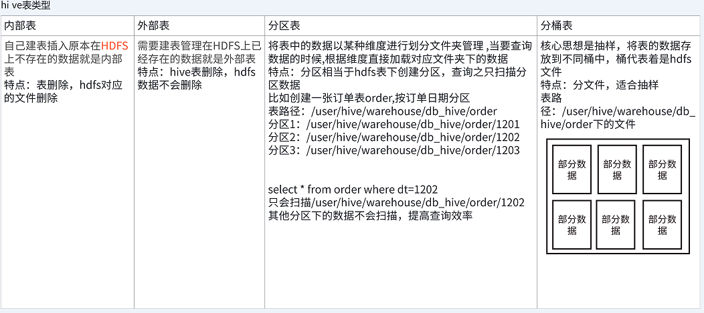

### 4.2.1 创建表

**1）普通创建表**，用的最多，也是需要重点的一种

**建表语法**

```sql
CREATE [EXTERNAL] TABLE [IF NOT EXISTS] table_name
[(col_name data_type [COMMENT col_comment], ...)]
[COMMENT table_comment]
[PARTITIONED BY (col_name data_type [COMMENT col_comment], ...)]
[CLUSTERED BY (col_name, col_name, ...)
[SORTED BY (col_name [ASC|DESC], ...)] INTO num_buckets BUCKETS]
[ROW FORMAT row_format]
[STORED AS file_format]
[LOCATION hdfs_path]
[TBLPROPERTIES (property_name=property_value, ...)]
```

**字段解释说明**：

（1）create table创建一个指定名字的表。如果相同名字的表已经存在，则抛出异常；用户可以用if not exists选项来忽略这个异常。

（2）external关键字可以让用户创建一个外部表，在建表的同时可以指定一个指向实际数据的路径（location），在删除表的时候，内部表的元数据和数据会被一起删除，而外部表只删除元数据，不删除数据。

（3）comment：为表和列添加注释。

（4）partitioned by创建分区表。

（5）clustered by创建分桶表。

（6）sorted by不常用，对桶中的一个或多个列另外排序。

（7）row format delimited

```sql
-- 分隔符设置
-- 字段间分隔符
DELIMITED [FIELDS TERMINATED BY char]
-- 集合间分隔符
[COLLECTION ITEMS TERMINATED BY char]
-- map k v 间分隔符
[MAP KEYS TERMINATED BY char]
-- 行分隔符
[LINES TERMINATED BY char]
--序列化和反序列化设置
SERDE serde_name [WITH SERDEPROPERTIES (property_name=property_value, property_name=property_value, ...)]
```

用户在建表的时候可以自定义SerDe或者使用自带的SerDe。如果没有指定row format或者row format delimited，将会使用自带的SerDe。在建表的时候，用户还需要为表指定列，用户在指定表的列的同时也会指定自定义的SerDe，Hive通过SerDe确定表的具体的列的数据。

<span style="color:red">SerDe是Serialize/Deserilize的简称，Hive使用Serde进行对象的序列与反序列化。</span>

（8）stored as指定存储文件类型

常用的存储文件类型：sequencefile（二进制序列文件）、textfile（文本）、rcfile（列式存储格式文件）。

如果文件数据是纯文本，可以使用stored as textfile。如果数据需要压缩，使用stored as sequencefile。

（9）location：指定表在HDFS上的存储位置。

**建表案例**：

```sql
-- 建表参数演示：
CREATE TABLE IF NOT EXISTS ds_hive.ch4_user_demo1( 
 id           int                                                           comment '用户id',
 name         STRING                                                       comment '姓名',
 age          int                                                          comment '年龄',
 subordinates ARRAY<STRING>                                                comment '下属',
 deductions   MAP<STRING, FLOAT>                                           comment '税务种类',
 address      STRUCT<street:STRING, city:STRING, state:STRING, zip:INT>    comment '地址'
) 
COMMENT '用户表'
PARTITIONED BY(data_dt STRING)
ROW FORMAT DELIMITED FIELDS TERMINATED BY ','    -- 列分隔符 
COLLECTION ITEMS TERMINATED BY ''  -- STRUCT 和 ARRAY 的分隔符 
MAP KEYS TERMINATED BY ':' -- MAP中的key与value的分隔符 
LINES TERMINATED BY '\n'   -- 行分隔符
stored as orc
LOCATION 'hdfs://ds/user/hive/warehouse/ds_hive.db/ch4_user_demo1';
```

上面的很多参数，我们在建表的时候都可以省略，简化版，当然如果ds_hive没权限，我们在测试库建表，以ds_stu1为例：

```sql
CREATE TABLE IF NOT EXISTS ds_stu1.ch4_user_demo1( 
 id           int                                                           comment '用户id',
 name         STRING                                                       comment '姓名',
 age          int                                                          comment '年龄',
 subordinates ARRAY<STRING>                                                comment '下属',
 deductions   MAP<STRING, FLOAT>                                           comment '税务种类',
 address      STRUCT<street:STRING, city:STRING, state:STRING, zip:INT>    comment '地址'
);
```

**2）create table as select建表**

该语法允许用户利用select查询语句的结果，直接建表，表的结构和查询语句的结构保持一致，并且包含查询语句里的所有内容。

```sql
CREATE TABLE [IF NOT EXISTS] table_name
[AS select_statement]
[COMMENT table_comment]
[ROW FORMAT row_format]
[STORED AS file_format]
[LOCATION hdfs_path]
[TBLPROPERTIES (property_name=property_value, ...)]
```

as：后跟查询语句，根据查询结果创建表。

**3）create table like建表**

<span style="color:red">该语法允许用户复制一张已经存在的表的结构，但是和上面的CTAS语法不同，该语法创建出来的表中不包含数据。</span>

```sql
CREATE TABLE [IF NOT EXISTS] table_name
LIKE table_name
[COMMENT table_comment]
[ROW FORMAT row_format]
[STORED AS file_format]
[LOCATION hdfs_path]
[TBLPROPERTIES (property_name=property_value, ...)]
```

<span style="color:red">like允许用户复制现有的表结构，但是不复制数据。</span>

### 4.2.2 内部表&外部表

#### 4.2.2.1 基本理论与实操

**建表**：<span style="color:red">内部表不需要指定location；外部表：指定 external， location</span>

**删表**：内部表：元数据和数据都删除；外部表：只删除元数据

**1）内部表理论**

<span style="color:red">默认创建的表都是所谓的内部表</span>。因为这种表，Hive会（或多或少地）控制着数据的生命周期。Hive默认情况下会将这些表的数据存储在由配置项hive.metastore.warehouse.dir（默认路径，/user/hive/warehouse）所定义的目录的子目录下。当我们删除一个管理表时，Hive也会删除这个表中数据。内部表不适合和其他工具共享数据。

**2）案例实操**

**（0）原始数据**

在/home/hewwen8888/data路径上，创建ch4_emp.txt文件，并输入如下内容。

```txt
[root@hadoop102 datas]$ vim ch4_emp.txt
1001    emp1
1002    emp2
1003    emp3
1004    emp4
1005    emp5
1006    emp6
1007    emp7
1008    emp8
1009    emp9
```

**（1）普通创建内部表**，创建内部表，不需要指定 location，在数据库下面产生表目录

```sql
hive (default)>
create table if not exists ds_hive.ch4_emp(
    id int,
    name string
)
row format delimited fields terminated by '\t'
stored as textfile;
```

**上传数据**

```sql
hive (default)> load data local inpath "/home/hewwen8888/data/ch4_emp.txt" overwrite into table ds_hive.ch4_emp;
```

**（2）根据查询结果创建表**（查询的结果会添加到新创建的表中）

```sql
hive (default)>
create table if not exists ds_hive.ch4_emp2 as select id, name from ds_hive.ch4_emp;
```

指定格式：

```sql
create table if not exists ds_hive.ch4_emp2
stored as textfile as
select id, name from ds_hive.ch4_emp;
```

**（3）根据已经存在的表结构创建表**

```sql
hive (default)> create table if not exists ds_hive.ch4_emp3 like ds_hive.ch4_emp;
```

**（4）查询表的类型**

```sql
hive (default)> desc formatted ds_hive.ch4_emp2;
 
Table Type:             MANAGED_TABLE
```

**（5）删除管理表，并查看表数据是否还存在**

```sql
hive (default)> drop table ds_hive.ch4_emp2;
```

**3）外部表理论**

因为表是外部表，所以Hive并非认为其完全拥有这份数据。删除该表并不会删除掉这份数据，不过描述表的元数据信息会被删除掉。

**案例实操**

**(1)打开集群namenodeUI**：

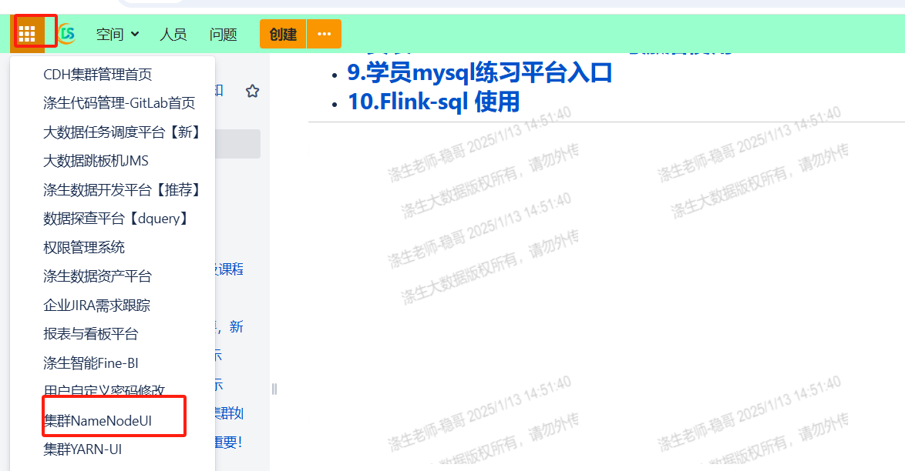

**(2)找到上小节创建内部表的路径，下载文件**：

**a.上传数据到HDFS**

```bash
[root@hadoop102 datas]$ hadoop fs -mkdir -p /user/hive/warehouse/ds_hive.db/external_ch4_emp
/user/hive/warehouse/ds_hive.db/external_ch4_emp
 
[root@hadoop102 datas]$ hadoop fs -put ch4_emp.txt /user/hive/warehouse/ds_hive.db/external_ch4_emp
```

**b.建表语句，创建外部表，指定location。**

```sql
hive (default)>
create external table if not exists ds_hive.external_ch4_emp1(
   id int,
    name string
)
row format delimited fields terminated by '\t'
stored as textfile
location '/user/hive/warehouse/ds_hive.db/external_ch4_emp1';
```

**c.查看创建的表**

```sql
hive (default)> show tables;
```

**b.查看表格式化数据**

```sql
hive (default)> desc formatted ds_hive.external_ch4_emp;
 
Table Type:             EXTERNAL_TABLE
```

**e.删除外部表**

```sql
hive (default)> drop table ds_hive.external_ch4_emp;
```

外部表删除后，HDFS中的数据还在，但是metadata中teacher的元数据已被删除。

```sql
hive (default)> show tables;
OK
tab_name
stu
student
student3
tch
```

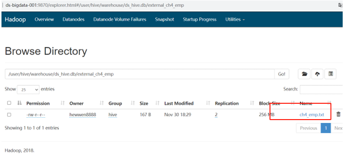

**问题**：<span style="color:red">假设我把一张外部表的路径指定到一个内部表上，那我分别对两张表插入数据、删除数据的时候，对另外一张表的影响</span>？

重新建一个外部表，路径映射到上面建的内部表的路径上

```sql
create external table if not exists ds_hive.ch4_emp_03_w(
    id int,
    name string
)
row format delimited fields terminated by '\t'
stored as textfile
location '/user/hive/warehouse/ds_hive.db/ch4_emp_01';
```

**向内部表插入数据**：

```sql
insert into table ds_hive.ch4_emp_01
select
1     as id
,'张三'   as name;
```

select * from ds_hive.ch4_emp_03_w;

1.我们看到外部表数据文件同步变化

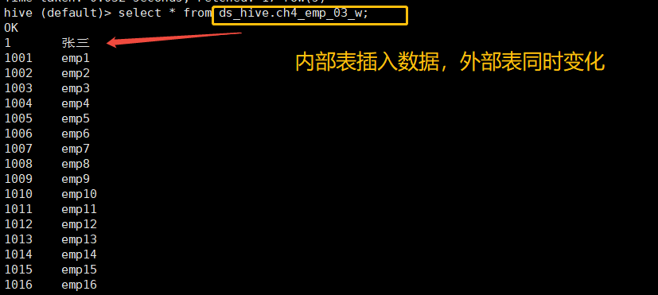

**2.向外部表插入数据**：

```sql
insert into table ds_hive.ch4_emp_03_w
select
2     as id
,'李四'   as name;
```

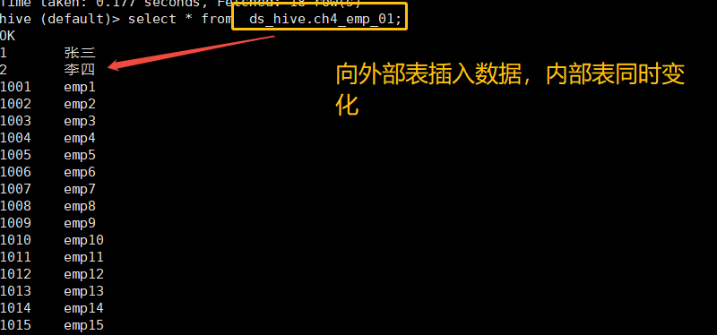

我们看到外部表数据文件同步变化。

**3.删除内部表**

```sql
drop table ds_hive.ch4_emp_01
```

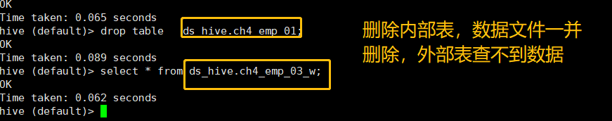

#### 4.2.2.2 内部表、外部表的区别(☆☆☆重点掌握)

先来说下Hive中内部表与外部表的区别：

**1. 数据管理责任**

- <mark>内部表：Hive完全负责管理内部表的数据和元数据。当内部表被删除时，Hive不仅会删除表的元数据，还会删除存储在HDFS或其他底层文件系统上的数据文件。这意味着数据的生命周期与表的生命周期紧密绑定。</mark>

- <mark>外部表：对于外部表，Hive仅管理表的元数据。因此，当外部表被删除时，Hive只会删除表的元数据，而不会删除实际的数据文件。这允许数据在不同的Hive表和应用程序之间共享。</mark>

**2. 数据存储位置**

- <span style="color:red">内部表：默认情况下，内部表的数据会存储在Hive的默认仓库目录（如/user/hive/warehouse）下，或者根据创建表时指定的LOCATION子句存储在特定目录下。</span>这些位置通常由Hive控制和管理。

- 外部表：外部表的数据必须明确指定一个LOCATION，该位置可以是HDFS、S3等支持的文件系统中的任意路径。这个位置通常不由Hive控制，而是由用户或外部系统确定。

**3. 适用场景**

- <span style="color:red">内部表：适用于临时数据存储或需要Hive完全管理的场景</span>。由于内部表的数据和表结构紧密相连，适合用于那些生命周期较短且不需要与其他系统共享的数据集。

- <span style="color:red">外部表：适用于需要与多个Hive表或外部系统共享数据的场景</span>。外部表使得数据可以在不同的Hive查询和分析任务之间重用，同时避免了因误删表而导致的数据丢失风险。

**4. 表的修改**

- 内部表：对内部表的修改会将修改直接同步给元数据。

- 外部表：而对外部表的表结构和分区进行修改，则需要修复（MSCK REPAIR TABLE table_name;）

需要注意的是<span style="color:red">传统数据库对表数据验证是 schema on write（写时模式），而 Hive 在load时是不检查数据是否符合schema的，hive 遵循的是 schema on read（读时模式），只有在读的时候hive才检查、解析具体的数据字段、schema。</span>读时模式的优势是load data 非常迅速，因为它不需要读取数据进行解析，仅仅进行文件的复制或者移动。写时模式的优势是提升了查询性能，因为预先解析之后可以对列建立索引，并压缩，但这样也会花费要多的加载时间。

#### 4.2.2.3 内部表、外部表的生产应用(☆☆理解记忆)

具体的使用场景：

1. <mark>做etl处理时，通常会选择内部表做中间表，因为清理时，会将HDFS上的文件同时删除</mark>。

2. 如果怕误删数据，可以选择外部表，因为不会删除文件，方便恢复数据。

3. 如果对数据的处理都是通过hql语句完成，选择内部表，如果有其他工具一同处理，选择外部表。

4. 每天采集的Nginx日志和埋点日志，在存储的时候建议使用外部表，因为日志数据是采集程序实时采集进来的，一旦被误删，恢复起来非常麻烦。而且外部表方便数据的共享。

5. 抽取过来的业务数据，其实用外部表或者内部表问题都不大，就算被误删，恢复起来也是很快的，如果需要对数据内容和元数据进行紧凑的管理，那还是建议使用内部表。

6. 在做统计分析时候用到的中间表，结果表可以使用内部表，因为这些数据不需要共享，使用内部表更为合适。并且很多时候结果分区表我们只需要保留最近3天的数据，用外部表的时候删除分区时无法删除数据。

### 4.2.3 分区表&分桶表(☆☆☆重点掌握)

#### 4.2.3.1 分区表

Hive中的分区就是把一张大表的数据按照业务需要分散的存储到多个目录，每个目录就称为该表的一个分区。

创建分区表的好处是查询时，不用全表扫描，查询时只要指定分区，就可查询分区下面的数据。分区表可以是内部表，也可以是外部表。

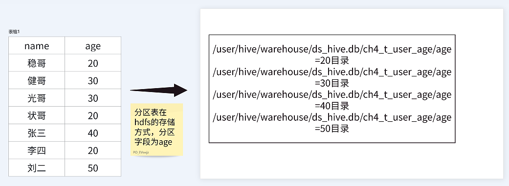

**1. 分区表基本语法**

**创建分区表**

```sql
--建表格式
CREATE [EXTERNAL] TABLE par_test(
col_name data_type ...)
COMMENT 'This is the par_test table'
PARTITIONED BY(day STRING, hour STRING)
[ROW FORMAT DELIMITED FIELDS TERMINATED BY '\t' ]
[LOCATION '/user/hainiu/data/'];
```
```sql
--建表
hive (default)>
create table if not exists ds_hive.ch4_t_par_emp(
    id int,
    name string
)
partitioned by (day string)
row format delimited fields terminated by '\t' -- 字段之间用制表符（\t）分隔
stored as textfile;
```

**2. 分区表读写数据**

**1）写数据**

**（1）load**

```sql
hive (default)>
load data local inpath "/home/hewwen8888/data/ch4_emp.txt" overwrite into table ds_hive.ch4_t_par_emp partition(day='20250602');
```

**（2）insert**

将day='20220401'分区的数据插入到day='20220402'分区，可执行如下装载语句

```sql
insert overwrite table ds_hive.ch4_t_par_emp partition (day = '20250602')
select id,name
from ds_hive.ch4_t_par_emp where day='20240110';
```

**2）读数据**

查询分区表数据时，可以将分区字段看作表的伪列，可像使用其他字段一样使用分区字段。

```sql
select id,name,day
from ds_hive.ch4_t_par_emp where day='20250602';
```

**3. 分区表基本操作**

**1）查看所有分区信息**

```sql
hive> show partitions ds_hive.ch4_t_par_emp;
```

**2）增加分区**

**（1）创建单个分区**

```sql
hive (default)>
alter table ds_hive.ch4_t_par_emp add partition(day='20250603');
```

**（2）同时创建多个分区**（分区之间不能有逗号）

```sql
hive (default)>
alter table ds_hive.ch4_t_par_emp add partition(day='20250605') partition(day='20250606');
```

思考：那能不能手动在hdfs添加一个分区目录，并上上传文件数据，那么在分区表中能否查到新的分区数据呢？

**3）删除分区**

**（1）删除单个分区**

```sql
hive (default)>
alter table ds_hive.ch4_t_par_emp drop partition (day='20250604');
```

**（2）同时删除多个分区**（分区之间必须有逗号）

```sql
hive (default)>
alter table ds_hive.ch4_t_par_emp
drop partition (day='20250605'), partition(day='20250606');
```

**4）修复分区**

Hive将分区表的所有分区信息都保存在了元数据中，只有元数据与HDFS上的分区路径一致时，分区表才能正常读写数据。<span style="color:red">若用户手动创建/删除分区路径，Hive都是感知不到的，这样就会导致Hive的元数据和HDFS的分区路径不一致</span>。再比如，若分区表为外部表，用户执行drop partition命令后，分区元数据会被删除，而HDFS的分区路径不会被删除，同样会导致Hive的元数据和HDFS的分区路径不一致。

若出现元数据和HDFS路径不一致的情况，可通过如下几种手段进行修复。

**（1）add partition**

若手动创建HDFS的分区路径，Hive无法识别，可通过add partition命令增加分区元数据信息，从而使元数据和分区路径保持一致。

**（2）drop partition**

若手动删除HDFS的分区路径，Hive无法识别，可通过drop partition命令删除分区元数据信息，从而使元数据和分区路径保持一致。

**（3）msck**

若分区元数据和HDFS的分区路径不一致，还可使用msck命令进行修复，一下是改命令的用法说明。

```sql
hive (default)> msck repair table table_name [add/drop/sync partitions];
```

**说明**：

- msck repair table table_name add partitions：该命令会增加HDFS路径存在但元数据缺失的分区信息。

- msck repair table table_name drop partitions：该命令会删除HDFS路径已经删除但元数据仍然存在的分区信息。

- msck repair table table_name sync partitions：该命令会同步HDFS路径和元数据分区信息，相当于同时执行上述的两个命令。

- msck repair table table_name：等价于msck repair table table_name add partitions命令。

**二级分区表**

思考：如果一天内的日志数据量也很大，如何再将数据拆分?答案是二级分区表，例如可以在按天分区的基础上，再对每天的数据按小时进行分区。

**二级分区表建表语句**

```sql
hive (default)>
create table if not exists ds_hive.ch4_t_par_emp2(
    id int,
    name string
)
partitioned by (day string, hour string)
row format delimited fields terminated by '\t'
stored as textfile;
```

**数据装载语句**

```sql
hive (default)>
load data local inpath "/home/hewwen8888/data/ch4_emp.txt" overwrite into table ds_hive.ch4_t_par_emp2 partition(day='20250602', hour='14');
```

**查询分区数据**

```sql
hive (default)> select * from ds_hive.ch4_t_par_emp2 where hour ='14' and day='20250602';
```

**动态分区**

<span style="color:red">hive分区表中插入数据时，如果需要创建的分区很多，比如以表中某个字段进行分区存储，则需要复制粘贴修改很多sql去执行，效率低。因为hive是批处理系统，所以hive提供了一个动态分区功能，其可以基于查询参数的位置去推断分区的名称，从而建立分区。</span>

<span style="color:red">动态分区是指向分区表insert数据时，被写往的分区不由用户指定，而是由每行数据的最后一个字段的值来动态的决定。使用动态分区，可只用一个insert语句将数据写入多个分区。</span>

**1）动态分区相关参数**

**（1）动态分区功能总开关**（默认true，开启）

```sql
set hive.exec.dynamic.partition=true;
```

**（2）严格模式和非严格模式**

<mark>动态分区的模式，默认strict（严格模式），要求必须指定至少一个分区为静态分区，nonstrict（非严格模式）允许所有的分区字段都使用动态分区</mark>。

```sql
set hive.exec.dynamic.partition.mode=nonstrict
```

**（3）一条insert语句可同时创建的最大的分区个数**，默认为1000。

```sql
set hive.exec.max.dynamic.partitions=1000
```

**（4）单个Mapper或者Reducer可同时创建的最大的分区个数**，默认为100。

```sql
set hive.exec.max.dynamic.partitions.pernode=100
```

**（5）一条insert语句可以创建的最大的文件个数**，默认100000。

```sql
hive.exec.max.created.files=100000
```

**（6）当查询结果为空时且进行动态分区时，是否抛出异常**，默认false。

```sql
hive.error.on.empty.partition=false;
```

**2）案例实操**

**需求**：将dept表中的数据按照日期（day字段），插入到目标表dept_partition的相应分区中。

**（1）创建目标分区表**

```sql
create table if not exists ds_hive.ch4_t_par_emp_dny_01(
    id int,
    name string
)
partitioned by (day string)
row format delimited fields terminated by '\t'
stored as textfile;
```

**（2）设置动态分区**

```sql
set hive.exec.dynamic.partition.mode=nonstrict;
insert overwrite table ds_hive.ch4_t_par_emp_dny_01
partition(day)
select
id
,name
,day
from ds_hive.ch4_t_par_emp_01;
```

**要点**：<span style="color:red">因为dpartition表中只有两个字段，所以当我们查询了三个字段时（多了day字段），所以系统默认以最后一个字段day为分区名，因为分区表的分区字段默认也是该表中的字段，且依次排在表中字段的最后面。所以分区需要分区的字段只能放在后面，不能把顺序弄错。如果我们查询了四个字段的话，则会报错，因为该表加上分区字段也才三个。要注意系统是根据查询字段的位置推断分区名的，而不是字段名称。
</span>
**（3）查看目标分区表的分区情况**

```sql
hive (default)> show partitions ds_hive.ch4_t_par_emp_dny_01;
```

**注意**：使用insert...select 往表中导入数据时，查询的字段个数必须和目标的字段个数相同，不能多，也不能少，否则会报错。但是如果字段的类型不一致的话，则会使用null值填充，不会报错。而使用load data形式往hive表中装载数据时，则不会检查。如果字段多了则会丢弃，少了则会null值填充。同样如果字段类型不一致，也是使用null值填充。

**（4）多个分区字段时，实现半自动分区**

```sql
create table if not exists ds_hive.ch4_t_par_emp_dny_02(
    id int,
    name string
)
partitioned by (day string, dept string)
row format delimited fields terminated by '\t'
stored as textfile;
 
 
 
insert overwrite table ds_hive.ch4_t_par_emp_dny_02
partition(day='20250601', dept)         #day分区为静态分区，dept为动态分区，以查询的day 字段为分区名
select
id
,name
,dept
from ds_hive.ch4_t_par_emp_04;
```

**（5）多个分区字段时，全部实现动态分区插入数据**

```sql
insert overwrite table ds_hive.ch4_t_par_emp_dny_02
partition(day, dept)                    #严格模式必须有一个是静态分区，如果没有报错
select
id
,name
,day
,dept
from ds_hive.ch4_t_par_emp_04;
 
set hive.exec.dynamic.partition.mode=nonstrict;             #打开非严格模式
insert overwrite table ds_hive.ch4_t_par_emp_dny_02
partition(day, dept)
select
id
,name
,day
,dept
from ds_hive.ch4_t_par_emp_04;
```

**注意**：字段的个数和顺序不能弄错。

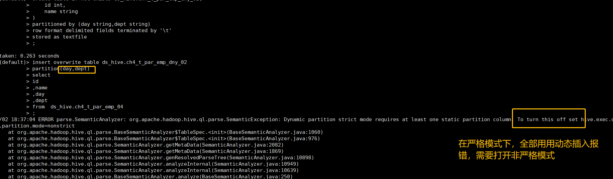

**(6)一条insert语句可同时创建的最大的分区个数，默认为1000，我们将参数改到最小**

```sql
set hive.exec.dynamic.partition.mode=nonstrict;
set hive.exec.max.dynamic.partitions=2;               #设置最大一次性能插入2个分区
insert overwrite table ds_hive.ch4_t_par_emp_dny_02
partition(day, dept)
select
id
,name
,day
,dept
from ds_hive.ch4_t_par_emp_04;
```

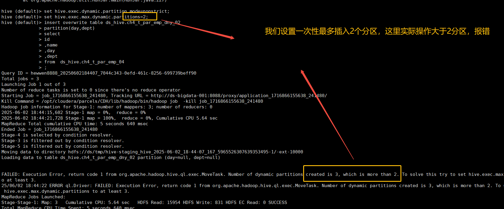

#### 4.2.3.2 分桶表

分区提供一个隔离数据和优化查询的便利方式。不过，并非所有的数据集都可形成合理的分区。对于一张表或者分区，Hive 可以进一步组织成桶，也就是更为细粒度的数据范围划分，分区针对的是数据的存储路径，分桶针对的是数据文件。

<span style="color:red">分桶表的基本原理是，首先为每行数据计算一个指定字段的数据的hash值，去取模指定分桶数，最后将取模运算结果相同的行，写入同一个文件中，这个文件就称为一个分桶（bucket）。</span>

**分桶表基本语法**

**1）建表语句**

```sql
##通用格式
CREATE [EXTERNAL] TABLE [db_name.]table_name 
[(col_name data_type, ...)] 
CLUSTERED BY (col_name) 
INTO N BUCKETS;

hive (default)>
create table ds_hive.ch4_emp_buck(
    id int,
    name string
)
clustered by(id) into 4 buckets
row format delimited fields terminated by '\t'
stored as textfile;
```

**2）数据装载**

**导入数据到分桶表中**

说明：Hive新版本load数据可以直接跑MapReduce，老版的Hive需要将数据传到一张表里，再通过查询的方式导入到分桶表里面。

```sql
hive (default)>
load data local inpath '/home/hewwen8888/data/ch4_emp.txt' into table ds_hive.ch4_emp_buck;
-- 代替
insert overwrite table ds_hive.ch4_emp_buck
select
id
,name
from ds_hive.ch4_t_par_emp
where day='20240110';
```

**查看创建的分桶表中是否分成4个桶**

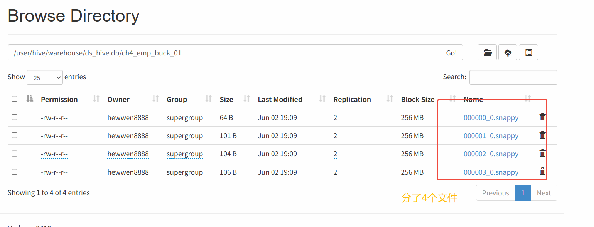

### 4.2.4 修改表

#### 4.2.4.1 重命名表

**2）实操案例**

```sql
hive (default)> alter table ds_hive.ch4_emp rename to ds_hive.ch4_emp1;
```

内部表修改了表名之后，表对应的存储文件地址也跟着改，相当于作了HDFS的目录重命名。

外部表不会改对应的location地址。

#### 4.2.4.2 增加/修改/替换列信息

**1）语法**

**（1）更新列**

更新列，列名可以随意修改，列的类型只能小改大，不能大改小（遵循自动转换规则）。

```sql
ALTER TABLE table_name CHANGE [COLUMN] col_old_name col_new_name column_type [COMMENT col_comment]
```

**（2）增加和替换列**

```sql
ALTER TABLE table_name ADD|REPLACE COLUMNS (col_name data_type [COMMENT col_comment], ...)
```

注：ADD是代表新增一个字段，字段位置在所有列后面（partition列前），<span style="color:red">REPLACE则是表示替换表中所有字段，REPLACE使用的时候，字段的类型要跟之前的类型对应上，数量可以减少或者增加，其实就是包含了更新列，增加列，删除列的功能。
</span>
**2）实操案例**

**（1）查询表结构**

```sql
hive (default)> desc ds_hive.ch4_emp1;
```

**（2）添加列**

```sql
hive (default)> alter table ds_hive.ch4_emp1 add columns(age int);
```

**（3）查询表结构**

```sql
hive (default)> desc ds_hive.ch4_emp1;
```

**（4）更新列**

```sql
hive (default)> alter table ds_hive.ch4_emp1 change column age ages double;
```

**（5）查询表结构**

```sql
hive (default)> desc ds_hive.ch4_emp1;
```

**思考**：增加列，表里的新增字段的数据怎么处理？
ADD：安全，只是追加 NULL 列
**总结**：<span style="color:red">修改的都是元数据信息，数据文件不会修改</span>。

### 4.2.5 删除表
**DROP TABLE** - 删表
- 删整个表（元数据+数据文件）
- 外部表只删元数据，数据文件保留


```sql
hive (default)> drop table ds_hive.ch4_emp1;
```

### 4.2.6 清除表
**TRUNCATE TABLE** - 清表
- 只清空表里所有数据
- 表结构还在
- 只能用于内部表，外部表不能用

```sql
hive (default)> truncate table ds_hive.ch4_emp1;
```

## 4.3 视图与物化视图

### 4.3.1 视图

#### 4.3.1.1 视图介绍

视图是一个虚拟的表，不同于直接操作数据表，视图是依据SELECT语句来创建的，所以操作视图时会根据创建视图的SELECT语句生成一张虚拟表，然后在这张虚拟表上做SQL操作，并且只能查询。视图中不缓冲记录，也没有提高查询性能。

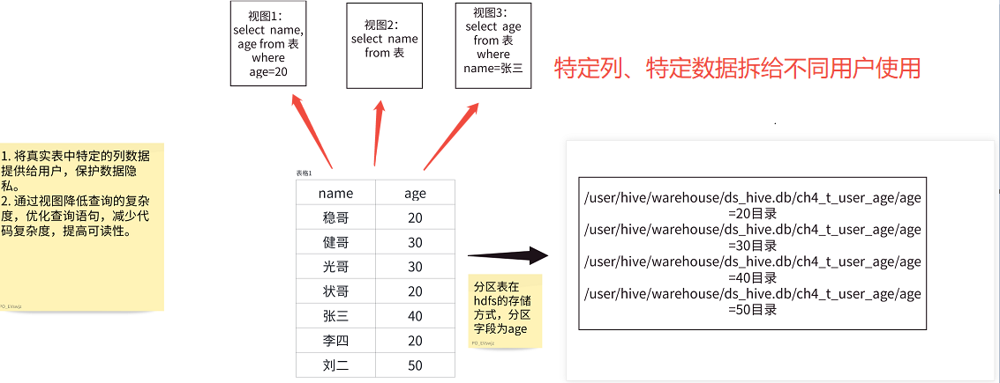

那既然已经有数据表了，为什么还需要视图呢？主要有以下几点原因：

1. 通过定义视图可以将频繁使用的SELECT语句保存以提高效率。

2. 通过定义视图可以使用户看到的数据更加清晰。

3. 通过定义视图可以不对外公开数据表全部字段，增强数据的保密性。

4. 通过定义视图可以降低数据的冗余。

#### 4.3.1.2 视图操作

**创建视图**

基本语法如下：

```sql
CREATE VIEW <视图名称>(<列名1>,<列名2>,...) AS <SELECT语句>

----【1】创建视图：
create view ch4_emp_v as select id,name
from ds_hive.ch4_emp;
----【2】查看视图定义： 
show create table ch4_emp_v; 
----【3】删除视图： 
drop view ch4_emp_v; 
----【4】更改视图定义： 
alter view ch4_emp_v as select name from ds_hive.ch4_emp;
```

#### 4.3.1.3 视图在企业生产中的实际应用

**1. 数据筛选**：主要应用场景是，数据开发负责的数据需要对数据分析师、数据运营等其他身份的用户进行数据共享。为了减少用户的使用和理解的成本，经常会把多个表做简单的join和筛选，这样有两个好处：(1)通过join操作把多个表的信息合并，用户直接查询即可；（2）通过where条件，减少了数据透出的范围，保障了数据的安全性。

**2. 跨域数据共享**：在大公司中，经常涉及到跨事业部之间的数据合作，每个事业部对自己的数据安全性都把控得很严格，需要经过一系列的流程才能获取到其他事业部的数据。一个典型的数据合作流程如下：

(1) 需求方提出需求单，说明需求的背景信息、合作收益、需求数据内容、数据交付时间等。

(2) 需求方与外事业部的数据产品进行对接，经过各级领导的审批，确认可以获取数据。

(3) 外事业部的数据开发接收到其事业部的数据产品的需求，进行数据开发。这里大部分情况下开发的是视图。

(4) 将开发完成的视图存储到该事业部中间库，我们从该中间库将数据同步到自己的中间库。这两步基本上也是使用视图完成。因为不需要占据存储，仅用于权限隔离。

(5) 将我们事业部中间库的数据，通过视图或者内部表的形式存储到业务库，进行后续的使用。

### 4.3.2 物化视图

在Hive 3.0.0 中，引入物化视图和基于这些物化的自动查询重写。普通视图（View）是虚拟表，仅保存查询逻辑（如 SELECT 语句），不存储实际数据。每次查询视图时，Hive 都会动态执行底层查询逻辑。虽然简化了复杂查询的编写，但无法避免重复计算的开销。物化视图是物理存储的查询结果集。它将计算结果持久化到磁盘，后续查询可直接读取预计算的数据，避免了重复执行复杂的计算步骤，尤其适用于聚合、多表连接等耗时操作。

- 视图是虚拟的，逻辑存在的，只有定义没有存储数据；
- 物化视图是真实的，物理存在的，里面存储着预计算的数据；
- 视图的目的是简化降低查询的复杂度，而物化视图的目的是提高查询性能；

在Hive中创建物化视图的语法与CTAS语句语法非常相似，支持分区列、自定义存储处理程序或传递表属性等常见功能。

```sql
CREATE MATERIALIZED VIEW [IF NOT EXISTS] [db_name.]materialized_view_name
  [DISABLE REWRITE]
  [COMMENT materialized_view_comment]
  [PARTITIONED ON (col_name, ...)]
  [CLUSTERED ON (col_name, ...) | DISTRIBUTED ON (col_name, ...) SORTED ON (col_name, ...)]
  [
    [ROW FORMAT row_format]
    [STORED AS file_format]
      | STORED BY 'storage.handler.class.name' [WITH SERDEPROPERTIES (...)]
  ]
  [LOCATION hdfs_path]
  [TBLPROPERTIES (property_name=property_value, ...)]
AS
<query>;
```

**补充说明**：

1. 物化视图创建后，select查询执行数据自动落地，"自动"也即在query的执行期间，任何用户对该物化视图是不可见的，执行完毕之后物化视图可用；

2. 默认情况下，创建好的物化视图可被用于查询优化器optimizer查询重写，在物化视图创建期间可以通过DISABLE REWRITE参数设置禁止使用；

3. 默认SerDe和storage format为hive.materializedview.serde、 hive.materializedview.fileformat；