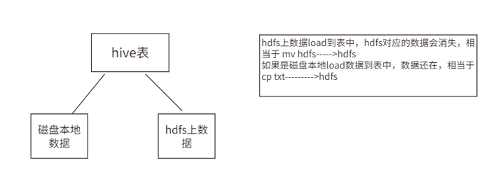
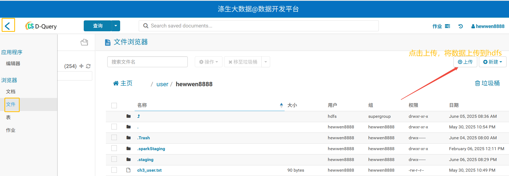

# 5.DML数据操作

## 5.1 加载数据

### 5.1.1 LOAD加载数据

向表添加数据除了可以使用insert语法，还可以用hadoop put的方式向表中添加数据。当然还有一种比较简单的用法就是可以直接通过load的方式加载数据。



语法：
```sql
LOAD DATA [LOCAL] INPATH 'filepath' [OVERWRITE] INTO TABLE tablename [PARTITION (partcol1=val1, partcol2=val2 ...)]
LOAD DATA [LOCAL] INPATH 'filepath' [OVERWRITE] INTO TABLE tablename [PARTITION (partcol1=val1, partcol2=val2 ...)] [INPUTFORMAT 'inputformat' SERDE 'serde'] (3.0 or later)
```

参数说明：
1. load data：表示加载数据
2. local：表示从本地加载数据到Hive表；否则从HDFS加载数据到Hive表
3. inpath：表示加载数据的路径
4. <span style="color:red">overwrite：表示覆盖表中已有数据，否则表示追加</span>
5. into table：表示加载到哪张表
6. partition：表示上传到指定分区

#### 实操案例

1. 创建表
```sql
create table if not exists ds_hive.ch5_emp(
    id int,
    name string
)
row format delimited fields terminated by '\t'  -- 列之间用Tab分隔
stored as textfile;
```

2. 加载本地文件到hive
```sql
load data local inpath "/home/hewwen8888/data/ch5_emp_out.txt" overwrite into table ds_hive.ch5_emp;
```
<span style="color:red">注意：从本地导入数据的时候，相当于复制原来文件还会保留。</span>

3. 加载HDFS文件到hive中
```sql
hadoop fs -put /home/hewwen8888/data/ch5_emp.txt /user/hewwen8888/data;

load data inpath "/user/hewwen8888/data/ch5_emp_out.txt" overwrite into table ds_hive.ch5_emp;
```
<span style="color:red">注意：从hdfs导入数据的时候，相当于移动，原来文件还移到hive表的路径，原来路径下文件不保留。</span>



4. 文件分割符和表的分隔符一致性对比操作
创建文件逗号分隔
vim ch5_emp.txt
1001,emp1
1002,emp2
1003,emp3
1004,emp4
1005,emp5
1006,emp6
1007,emp7
1008,emp8
1009,emp9
1010,emp10
1011,emp11
1012,emp12
1013,emp13
1014,emp14
1015,emp15
1016,emp16
<span style="color:red">这个时候我们在用上述ds_hive.ch5_emp导入数据就会为空，显示全为NULL</span>，必须建表以逗号分隔
hive (default)>
create table if not exists ds_hive.ch5_emp2(
    id int,
    name string
)
row format delimited fields terminated by ','
stored as textfile -- 补充：这里的类型和你导入的文件类型必须一致
;
导入数据，显示成功
load data local inpath "/home/hewwen8888/data/ch5_emp.txt"  overwrite into table ds_hive.ch5_emp1;
注意：建表分隔符必须和文件分隔符保持一致。

5. 分区表导入操作
```sql
create table if not exists ds_hive.ch5_emp3(
    id int,
    name string
)
partitioned by (day string)
row format delimited fields terminated by ','
stored as textfile;

load data local inpath "/home/hewwen8888/data/ch5_emp.txt" overwrite into table ds_hive.ch5_emp3 partition (day='20250603');
```

### 5.1.2 INSERT插入数据（最常用）

语法：
1. 通过select，将select数据<span style="color:red">覆盖</span>表或分区的语法格式
```sql
INSERT OVERWRITE TABLE tablename1 [PARTITION (partcol1=val1, partcol2=val2 ...) [IF NOT EXISTS]]
```

2. 通过select，将select数据<span style="color:red">追加</span>到表或分区的语法格式
```sql
INSERT INTO TABLE tablename1 [PARTITION (partcol1=val1, partcol2=val2 ...)]
```

3. 直接插入值
```sql
INSERT INTO TABLE tablename [PARTITION (partcol1[=val1], partcol2[=val2] ...)] VALUES values_row [, values_row ...]
```

4. 导出查询结果
```sql
INSERT OVERWRITE [LOCAL] DIRECTORY directory1
  [ROW FORMAT row_format] [STORED AS file_format] (Note: Only available starting with Hive 0.11.0)
  SELECT ... FROM ...
```

说明：
1. 当加了IF NOT EXISTS，如果存在分区就跳过下面的select语句
2. INSERT OVERWRITE会覆盖表或分区数据，但覆盖分区时增加IF NOT EXISTS，如果分区已经存在则不会覆盖
3. INSERT INTO向表或分区追加数据，不影响历史数据

#### 实操案例

1. 创建表
```sql
create table if not exists ds_hive.ch5_emp_insert1(
    id int,
    name string
);
```

2. 基本模式插入数据
```sql
insert into table ds_hive.ch5_emp_insert1 values(1,'wanger'),(2,'zhaoliusan');

insert into table ds_hive.ch5_emp_insert1
select
id
,trim(name) as name --对name字段使用trim()函数去除首尾的空格
from ds_hive.ch5_emp
where id>=1005;
-- 追加文件

insert overwrite table ds_hive.ch5_emp_insert1
select
id
,trim(name) as name
from ds_hive.ch5_emp;
-- 覆盖原文件
```
<span style="color:red">注意：insert into是追加文件，但是insert overwrite会将原来的文件覆盖。频繁使用insert into，数据量小会产生小文件，overwrite又会清掉之前的数据，所以使用的时候，要想好自己的具体场景。</span>

3. 根据查询结果插入分区表
```sql
create table if not exists ds_hive.ch5_emp_insert2(
    id int,
    name string
)
partitioned by (day string);

insert overwrite table ds_hive.ch5_emp_insert2
partition (day='20250603')
select
id
,trim(name) as name
from ds_hive.ch5_emp;
```

4. into和overwrite对外部表的底层影响
```sql
create external table if not exists ds_hive.ch5_emp_insert3(
    id int,
    name string
)
partitioned by (day string)
location '/user/hewwen8888/data/ch5_emp_insert3';

insert into table ds_hive.ch5_emp_insert3
partition(day='20260603')
select
id
,trim(name) as name
from ds_hive.ch5_emp;

insert overwrite table ds_hive.ch5_emp_insert3
partition(day='20260603')
select
id
,trim(name) as name
from ds_hive.ch5_emp;
```
注意：<span style="color:red">外部表底层数据文件同样，into是追加文件，overwrite会覆盖原来文件
</span>

5. 根据查询结果创建表
```sql
create table if not exists ds_hive.ch5_emp3
as select id, name from ds_hive.ch5_emp;
```

### 5.1.3 Import&Export

export命令能够导出一张表或分区的数据和元数据信息到一个输出位置，而且导出数据能够被移动到另外一个hadoop集群或hive实例，而且能够经过import命令导入数据。一般用在数据迁移的场景。

语法：
```sql
EXPORT TABLE tablename [PARTITION (part_column="value"[, ...])]
  TO 'export_target_path' [ FOR replication('eventid') ]
 
IMPORT [[EXTERNAL] TABLE new_or_original_tablename [PARTITION (part_column="value"[, ...])]]
  FROM 'source_path'
  [LOCATION 'import_target_path']
```

<span style="color:red">注意：先用export导出后，再将数据导入。并且因为export导出的数据里面包含了元数据，因此import要导入的表不可以存在，否则报错。</span>

示例：
```sql
export table ds_hive.ch5_emp to '/user/hewwen8888/data/export/emp';

import table ds_hive.ch5_emp_import1 from '/user/hewwen8888/data/export/emp';
```

Export和Import主要用于两个Hadoop平台集群之间Hive表迁移，不能直接导出到本地。

<span style="color:red">关于 FOR replication('eventid')的额外说明：</span>
只有在部署了 Hive Replication​ 功能的生产环境中才会使用。它允许在两个 Hive 元数据存储（Metastore）之间同步表结构、分区和数据。eventid用于追踪和管理复制操作的事件顺序和状态。在个人开发或普通数据处理中，您不会用到它。

## 5.2 企业实战

### 5.2.1 需求背景

母婴用品是淘宝的热门购物类目，随着国家鼓励二胎、三胎政策的推进，会进一步促进了母婴类目商品的销量。随之引起各大母婴品牌更加激烈的争夺，越来越多的母婴品牌管窥到行业潜在的商机，纷纷加入母婴电商，行业竞争越来越激烈。本项目会基于"淘宝母婴购物"数据集进行可视化分析，帮助开发者更好地做出数据洞察。

### 5.2.2 数据介绍

#### 数据说明

1. 用户基本信息表：tianchi_mum_baby

| 字段 | 字段说明 | 说明 |
|------|----------|------|
| user_id | 用户标识 | 抽样&字段脱敏 |
| birthday | 婴儿出生日期 | 由user_id填写，有可能不真实,格式:YYYYMMDD |
| gender | 婴儿性别（0 男孩，1 女孩，2性别不明） | 由user_id填写，有可能不真实 |

2. 商品交易信息表：tianchi_mum_baby_trade_history

| 字段 | 字段说明 | 说明 |
|------|----------|------|
| user_id | 用户标识 |  |
| auction_id | 交易ID |  |
| category_1 | 商品一级类目ID |  |
| category_2 | 商品二级类目ID |  |
| buy_amount | 购买数量 |  |
| order_dt | 订单发生日期 | 格式：YYYYMMDD |

### 5.2.3 需求描述

1. 将提供的两张表说明建hive表，并将提供的两份数据集分别入库
2. <span style="color:red">建立分区表，分区条件为订单发生年份</span>，按订单发生日期分别将订单数据插入到各自的分区中
3. 统计2022年1月份到2024年12月份之间，每月男、女的购买人数

### 5.2.4 需求开发

#### 问题1：创建表并导入数据

1. 创建用户表
```sql
create table if not exists ds_hive.ch5_sz_t_user(
user_id string comment '用户标识',
birthday string comment '婴儿出生日期',
gender string comment '婴儿性别（0 男孩，1 女孩，2性别不明）'
)
row format delimited fields terminated by ','
stored as textfile;
```

2. 创建订单表
```sql
CREATE TABLE ds_hive.ch5_sz_t_order(
user_id string COMMENT '用户id',
auction_id string COMMENT '交易ID',
category_1 string COMMENT '商品一级类目ID',
category_2 string COMMENT '商品二级类目ID',
buy_amount string COMMENT '购买数量',
order_dt string COMMENT '订单发生日期'
)
COMMENT '母婴订单表'
row format delimited fields terminated by ','
stored as textfile;
```

3. 导入数据
```sql
-- 本地
load data local inpath '/home/hewwen8888/data/ch5_mum_baby.csv' overwrite into table ds_hive.ch5_sz_t_user;
load data local inpath '/home/hewwen8888/data/ch5_mum_baby_trade_history.csv' overwrite into table ds_hive.ch5_sz_t_order;

-- hdfs
load data inpath '/user/hewwen8888/data/ch5_mum_baby.csv' overwrite into table ds_hive.ch5_sz_t_user;
load data inpath '/user/hewwen8888/data/ch5_mum_baby_trade_history.csv' overwrite into table ds_hive.ch5_sz_t_order;
```

#### 问题2：创建分区表并导入数据

1. 创建订单分区表
```sql
CREATE TABLE ds_hive.ch5_sz_t_order_d(
user_id string COMMENT '用户id',
auction_id string COMMENT '交易ID',
category_1 string COMMENT '商品一级类目ID',
category_2 string COMMENT '商品二级类目ID',
buy_amount string COMMENT '购买数量',
order_dt string COMMENT '订单发生日期'
)
COMMENT '母婴订单表'
PARTITIONED BY(data_dt STRING)
stored as orc;
```

2. 导入数据
```sql
-- 开启动态分区
set hive.exec.dynamic.partition.mode=nonstrict;

insert overwrite table ds_hive.ch5_sz_t_order_d
partition(data_dt)
select
user_id,
auction_id,
category_1,
category_2,
buy_amount,
order_dt,
substr(order_dt,1,4) as data_dt --截取年份数据作为分区依据
from ds_hive.ch5_sz_t_order;
```

#### 问题3：统计每月男女购买人数

```sql
select
    substr(t1.order_dt,1,6) as month_dt,
    t2.gender,
    count(distinct t2.user_id) as user_cnt
from ds_hive.ch5_sz_t_order_d t1
join ds_hive.ch5_sz_t_user t2
on t1.user_id=t2.user_id
where t1.data_dt>='20220101' and t1.order_dt>='20220101' and t1.order_dt<='20241231'
group by substr(t1.order_dt,1,6), t2.gender;
```