# 6. HQL查询详解
## 6.1 基本查询
### 6.1.1 数据准备
本章使用电商场景的三张表：
- 用户表 (`ch6_t_user`)：用户ID、用户名、邮箱、注册与登录时间。
- 订单表 (`ch6_t_order`)：订单ID、用户ID、商品ID、数量、下单与发货日期。
- 商品表 (`ch6_t_goods`)：商品ID、名称、类别、价格、库存、发布日期。

1.  **创建用户表**
    ```sql
    create table if not exists ds_hive.ch6_t_user(
        ID string comment '用户id',
        Username string comment '用户姓名',
        Email string comment '邮箱',
        Registration_Date string comment '注册时间',
        Last_Login string comment '最后登录时间'
    )
    row format delimited fields terminated by '\t'
    stored as textfile;
    ```
2.  **创建订单表**
    ```sql
    CREATE TABLE ds_hive.ch6_t_order(
        id string COMMENT '订单id',
        user_id string COMMENT '用户id',
        product_id string COMMENT '商品id',
        quantity string COMMENT '数量',
        order_date string COMMENT '下单日期',
        ship_date string COMMENT '发货日期'
    )
    row format delimited fields terminated by '\t'
    stored as textfile;
    ```
3.  **创建产品表**
    ```sql
    CREATE TABLE ds_hive.ch6_t_goods(
        id string COMMENT '商品id',
        product_name string COMMENT '商品名称',
        category string COMMENT '类别',
        price string COMMENT '价格',
        stock string COMMENT '库存',
        release_date string COMMENT '发布日期'
    )
    row format delimited fields terminated by '\t'
    stored as textfile;
    ```
4.  **导入数据**
    ```sql
    load data local inpath '/home/hewwen8888/data/ch6_t_user.txt' overwrite into table ds_hive.ch6_t_user;
    load data local inpath '/home/hewwen8888/data/ch6_t_order.txt' overwrite into table ds_hive.ch6_t_order;
    load data local inpath '/home/hewwen8888/data/ch6_t_goods.txt' overwrite into table ds_hive.ch6_t_goods;
    ```

### 6.1.2 全表和特定列查询
1.  **全表查询**
    ```sql
    select * from ds_hive.ch6_t_user;
    ```
2.  **选择特定列查询**
    ```sql
    select
        id,
        username
    from ds_hive.ch6_t_user;
    ```

**SQL书写规范**：
- <span style="color:red">SQL大小写不敏感</span>
- 关键字不可缩写或分行
- 建议子句分行写，适当缩进

### 6.1.3 列别名
便于后续引用或计算，使用`AS`关键字（可省略）。
```sql
select
    id as user_id,
    username
from ds_hive.ch6_t_user;
```

### 6.1.4 Limit语句
限制返回行数，Hive会直接抓取数据而不启动MapReduce。
```sql
-- 返回前5行
select * from ds_hive.ch6_t_user limit 5;
-- 从第2行开始，返回3行
select * from ds_hive.ch6_t_user limit 2,3;
```

### 6.1.5 Where语句
紧接`FROM`子句，用于过滤行。**注意**：`WHERE`子句中不能使用字段别名。
```sql
select * from ds_hive.ch6_t_user where email='user4@email.com';
```
执行过程：先过滤，再抓取全部数据。

### 6.1.6 关系运算函数
用于`WHERE`、`JOIN...ON`、`HAVING`子句。

| 操作符 | 描述 |
| :--- | :--- |
| `A = B` | 相等返回`TRUE` |
| `A <=> B` | 两者都为`NULL`返回`TRUE` |
| `A <> B`, `A != B` | 不相等返回`TRUE` |
| `A < B`, `A <= B` | 比较大小 |
| `A > B`, `A >= B` | 比较大小 |
| `A [NOT] BETWEEN B AND C` | 范围判断 |
| `A IS [NOT] NULL` | 空值判断 |
| `A [NOT] IN (value1, value2,...)` | 列表匹配 |
| `A [NOT] LIKE B` | 简单正则（通配符`%`、`_`） |
| `A RLIKE B`, `A REGEXP B` | <span style="color:red">Java正则表达式匹配</span> |

**示例**：
1.  **查询价格等于800的所有商品**
    ```sql
    select * from ds_hive.ch6_t_goods where price=800;
    ```
2.  **查询价格在100到1000之间的商品**
    ```sql
    select * from ds_hive.ch6_t_goods where price between 100 and 1000;
    -- 或
    select * from ds_hive.ch6_t_goods where price>=100 and price<=1000;
    ```
3.  **查询价格为空的商品**
    ```sql
    select * from ds_hive.ch6_t_goods where price is null;
    ```
4.  **查询价格是100或1000的商品，列表匹配**
    ```sql
    select * from ds_hive.ch6_t_goods where price in (100, 1000);
    ```
5.  **`LIKE` 与 `RLIKE` 示例**
    - 查找商品名以"Cook"开头：
        ```sql
        -- LIKE
        select * from ds_hive.ch6_t_goods where Product_Name like 'Cook%';
        -- RLIKE
        select * from ds_hive.ch6_t_goods where Product_Name rlike '^Cook';
        ```
    - 查找商品名以"Set"结尾：
        ```sql
        -- LIKE
        select * from ds_hive.ch6_t_goods where Product_Name like '%Set';
        -- RLIKE
        select * from ds_hive.ch6_t_goods where Product_Name rlike 'Set$';
        ```
    - 查找商品名包含"Key"：
        ```sql
        -- LIKE
        select * from ds_hive.ch6_t_goods where Product_Name like '%Key%';
        -- RLIKE
        select * from ds_hive.ch6_t_goods where Product_Name rlike 'Key';
        ```

### 6.1.7 逻辑运算函数
支持`AND`、`OR`、`NOT`。

| 操作符 | 含义 |
| :--- | :--- |
| `AND` | 逻辑与 |
| `OR` | 逻辑或 |
| `NOT` | 逻辑非 |

**示例**：
1.  **查询商品价格大于500且库存大于20**
    ```sql
    select * from ds_hive.ch6_t_goods where price>500 and stock>=20;
    ```
2.  **查询商品价格大于500或库存大于20**
    ```sql
    select * from ds_hive.ch6_t_goods where price>500 or stock>=20;
    ```
3.  **查询商品价格非500的商品**
    ```sql
    select * from ds_hive.ch6_t_goods where price not in(500);
    ```

### 6.1.8 聚合函数
聚合函数不包含`NULL`值（`COUNT(*)`除外）。

| 函数 | 说明 |
| :--- | :--- |
| `COUNT(*)` | 统计所有行数（含`NULL`） |
| `COUNT(column)` | 统计该列非`NULL`行数 |
| `MAX(column)` | 最大值 |
| `MIN(column)` | 最小值 |
| `SUM(column)` | 求和 |
| `AVG(column)` | 平均值 |

**示例**：
```sql
-- 求总行数
select count(*) cnt from ds_hive.ch6_t_goods;
-- 求价格最大值
select max(price) max_sal from ds_hive.ch6_t_goods;
-- 求价格最小值
select min(price) min_sal from ds_hive.ch6_t_goods;
-- 求价格总和
select sum(price) sum_sal from ds_hive.ch6_t_goods;
-- 求价格平均值
select avg(price) avg_sal from ds_hive.ch6_t_goods;
```

### 6.1.9 子查询
**1. `FROM`子句子查询**（Hive 0.12+）：
必须指定别名，子查询中的列在外部查询中可用。
```sql
SELECT price
FROM (
  SELECT price*stock AS price
  FROM ds_hive.ch6_t_goods
) t2;
```
**2. `WHERE`子句子查询**（Hive 0.13+，有限制）：
- 子查询仅支持在表达式右侧。
- `IN/NOT IN`子查询只能选择一列。
- `EXISTS/NOT EXISTS`必须有一个或多个相关谓词。
- <span style="color:red">对父查询的引用仅在子查询的`WHERE`子句中支持</span>。

```sql
-- IN 子查询
SELECT *
FROM ds_hive.ch6_t_order
WHERE Id IN (SELECT distinct id FROM ds_hive.ch6_t_goods);

-- EXISTS 子查询
SELECT *
FROM ds_hive.ch6_t_order t1
WHERE EXISTS (SELECT * FROM ds_hive.ch6_t_goods t2 WHERE t1.product_id = t2.Id);
```


## 6.2 分组聚合
### 6.2.1 Group By分组语句
Group By语句通常会和聚合函数一起使用，按照一个或者多个列对结果进行分组，然后对每个组执行聚合操作。

**案例实操：**
1. 计算每个类别中的商品数。
```sql
select
category
,count(id) as cnt
from ds_hive.ch6_t_goods
group by category;
```

2. 计算各个类别的价格总和和求每个类型中最高，最低的商品价格。
```sql
select
category
,sum(price) as cnt
,max(price) as max
,min(price) as min_p
from ds_hive.ch6_t_goods
group by category
;
```
思考：当某一个值的数据量远远大于其他值的话，会出现什么问题？怎么处理？

---

### 6.2.2 多维分析场景
#### 1.grouping sets语句使用
<span style="color:red">grouping sets是一种将多个group by逻辑写在一个sql语句中的便利写法。</span>grouping sets中可以包含多种粒度，粒度之间用逗号连接。<mark>GROUPING SETS是对GROUP BY的扩展，可以指定不同的列进行分组，每个分组列集作为一个分组单元</mark>。使用GROUPING SETS，用户可以灵活的指定分组方式。

示例：
1. 等价于普通GROUP BY
```sql
SELECT order_date,user_id,count(*) FROM ds_hive.ch6_t_order GROUP BY order_date,user_id
-- 等效于 
SELECT order_date,user_id,count(*) FROM ds_hive.ch6_t_order GROUP BY order_date,user_id GROUPING SETS ((order_date,user_id))
```
2. 组合粒度
```sql
SELECT order_date,user_id,count(*) FROM ds_hive.ch6_t_order GROUP BY order_date,user_id GROUPING SETS ((order_date,user_id), user_id)
-- 等价于
SELECT order_date,user_id,count(*) FROM ds_hive.ch6_t_order GROUP BY order_date,user_id
UNION ALL
SELECT null,user_id,count(*) FROM ds_hive.ch6_t_order GROUP BY user_id
```
3. 单个维度粒度
```sql
SELECT order_date,user_id,count(*) FROM ds_hive.ch6_t_order GROUP BY order_date,user_id GROUPING SETS (order_date,user_id)
-- 等于
SELECT order_date, null,count(*) FROM ds_hive.ch6_t_order GROUP BY order_date
UNION ALL
SELECT null, user_id,count(*) FROM ds_hive.ch6_t_order GROUP BY user_id
```
4. 多种粒度组合
```sql
SELECT order_date,user_id,count(*) FROM ds_hive.ch6_t_order GROUP BY order_date,user_id GROUPING SETS ((order_date,user_id), order_date,user_id, ())
-- 等于
SELECT order_date,user_id,count(*) FROM ds_hive.ch6_t_order GROUP BY order_date,user_id
UNION ALL
SELECT order_date, null,count(*) FROM ds_hive.ch6_t_order GROUP BY order_date
UNION ALL
SELECT null, user_id,count(*) FROM ds_hive.ch6_t_order GROUP BY user_id
UNION ALL
SELECT null, null,count(*) FROM ds_hive.ch6_t_order
;
```
常用于计算各种组合的报表数据。例如：
- 无维度展现
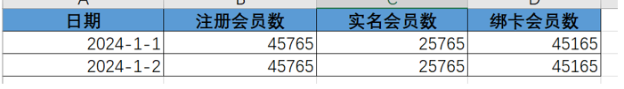
- 选择性别维度展现
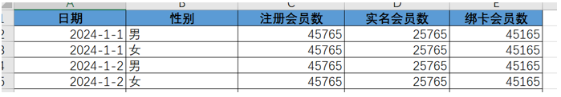
- 选择性别和地区维度展现
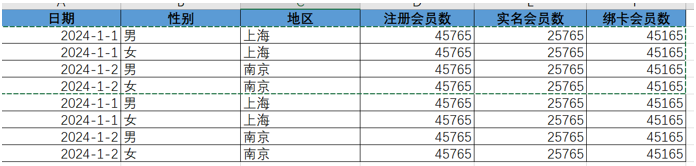

#### 2.with cube语句使用
假如，CUBE 分组列为(A, B, C)，则首先对(A,B,C)进行分组，然后依次对，（A,B,C）(B,C)、(A,C)、(A,B)、(B)、(A),(C),() 8种情况进行分组，输出为每种分组的结果集进行 UNION ALL 输出最终结果。

```sql
-- group by a,b,c with cube 等效于 group by a,b,c grouping sets((a,b,c), (a,b), (a,c), (b,c), a, b, c, ())
SELECT order_date,user_id,count(*) FROM ds_hive.ch6_t_order GROUP BY order_date,user_id GROUPING SETS ((order_date,user_id), order_date,user_id, ())
;
-- 等效于
SELECT order_date,user_id,count(*) FROM ds_hive.ch6_t_order GROUP BY order_date,user_id
with cube
;
```

#### 3.with rollup语句使用
```sql
-- GROUP BY age, sex with rollup 等效于 GROUP BY age, sex GROUPING SETS ( (age,sex),age,() )
-- 相当于按右侧递减的顺序group by
-- group by a,b,c grouping sets((a,b,c), (a,b), (a), ())
SELECT user_id
 ,product_id
 ,order_date
 ,count(id) FROM
ds_hive.ch6_t_order
GROUP BY user_id
 ,product_id
 ,order_date
with rollup;
--等于
SELECT user_id
 ,product_id
 ,order_date
 ,count(id) FROM
ds_hive.ch6_t_order
GROUP BY user_id
 ,product_id
 ,order_date
GROUPING SETS ( (user_id,product_id,order_date),(user_id,product_id),user_id,())
;
```
例如：`group by a,b,c with rollup`

#### 4.GROUPING__ID使用
grouping sets 中的每一种粒度，都对应唯一的 grouping__id 值，其计算公式与 group by 的顺序、当前粒度的字段有关。
```sql
SELECT
      grouping__id
      ,order_date
      ,user_id
      ,count(*)
FROM ds_hive.ch6_t_order
GROUP BY order_date,user_id
GROUPING SETS ((order_date,user_id), order_date,user_id, ())
```
示例结果：
grouping__id | order_date  | user_id | count
-------------|------------|---------|------
0            | 2026-02-14 | 1       | 5      -- 明细：2月14日用户1
0            | 2026-02-14 | 2       | 3      -- 明细：2月14日用户2
0            | 2026-02-15 | 1       | 4      -- 明细：2月15日用户1
1            | 2026-02-14 | (null)  | 8      -- 小计：2月14日合计
1            | 2026-02-15 | (null)  | 4      -- 小计：2月15日合计
2            | (null)     | 1       | 9      -- 小计：用户1合计
2            | (null)     | 2       | 3      -- 小计：用户2合计
3            | (null)     | (null)  | 12     -- 总计
---

### 6.2.3 Having语句
**having与where不同点：**
1. <span style="color:red">where后面不能写分组聚合函数，而having后面可以使用分组聚合函数。</span>
2. <span style="color:red">having只用于group by分组统计语句</span>。

**案例实操：**
1. 求每个类别中商品的平均价格。
```sql
select
category
,avg(price) as avg_p
from ds_hive.ch6_t_goods
group by category
;
```
2. 求每个类别中商品的平均价格大于100的类别。
```sql
select
category
,avg(price) as avg_p
from ds_hive.ch6_t_goods
group by category
having avg_p>=100
;
```

---

### 6.2.4 聚合原理及优化思路
#### 1.聚合原理
HiveHQL执行过程：
1. `FROM ds_hive.ch6_t_goods`：该句执行后，应该结果和表1一样，就是原来的表
2. `Group BY category`：该句执行后，我们想象生成了虚拟表3，如下所图所示，生成过程是这样的：group by category，那么找category那一列，具有相同category值的行，合并成一行，所有的id值写到一个单元格里面。
如果执行select category的话，那么返回的结果应该是虚拟表3的category，可是id中有的单元格里面的内容是多个值的，而关系数据库就是基于关系的，<span style="color:red">单元格中是不允许有多个值的，这个时候就需要聚合函数，聚合函数就用来输入多个数据，输出一个数据的。</span>如cout(id)，sum(price)，而每个聚合函数的输入就是每一个多数据的单元格。

其基本实现原理如下图：
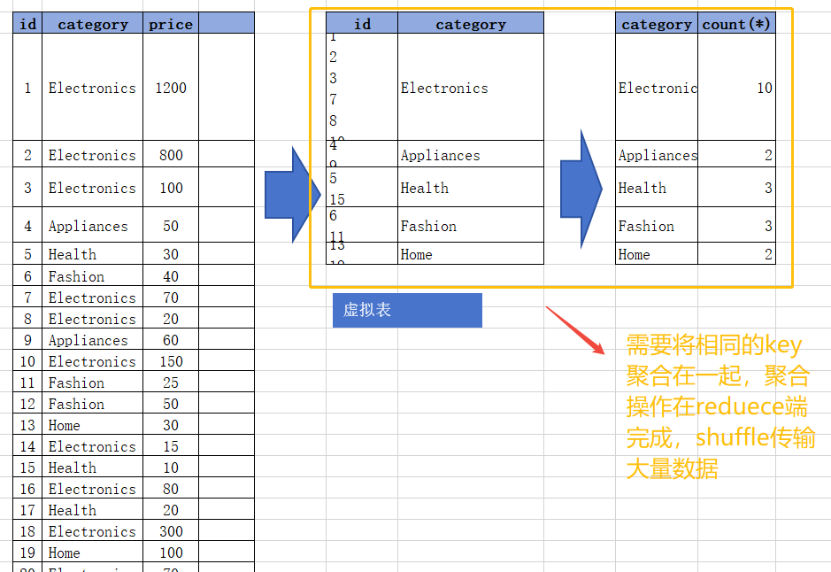

#### 2.Map端聚合
Hive中未经优化的分组聚合，是通过一个MapReduce Job实现的。Map端负责读取数据，并按照分组字段分区，通过Shuffle，将数据发往Reduce端，各组数据在Reduce端完成最终的聚合运算。

<span style="color:red">Hive对分组聚合的优化主要围绕着减少Shuffle数据量进行，具体做法是map-side聚合。所谓map-side聚合，在Hive的Map阶段开启预聚合，先在Map阶段预聚合，然后在Reduce阶段进行全局的聚合。map-side聚合能有效减少shuffle的数据量，提高分组聚合运算的效率。</span>
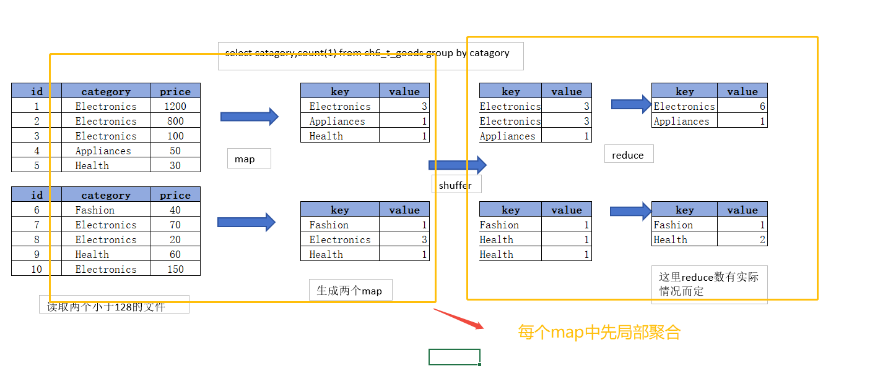


map-side 聚合相关的参数如下：
```sql
--启用map-side聚合，一般默认开启
set hive.map.aggr=true;
--用于检测源表数据是否适合进行map-side聚合。检测的方法是：先对若干条数据进行map-side聚合，若聚合后的条数和聚合前的条数比值小于该值，则认为该表适合进行map-side聚合；否则，认为该表数据不适合进行map-side聚合，后续数据便不再进行map-side聚合。
set hive.map.aggr.hash.min.reduction=0.5;
--用于检测源表是否适合map-side聚合的条数。
set hive.groupby.mapaggr.checkinterval=100000;
--map-side聚合所用的hash table，占用map task堆内存的最大比例，若超出该值，则会对hash table进行一次flush。
set hive.map.aggr.hash.force.flush.memory.threshold=0.9;
```
**优化案例**
示例SQL：
```sql
hive (default)> set hive.map.aggr=true;
explain
select t1.province_id,count(*) as cnt from ds_hive.ch6_order_detail_orc t1
group by t1.province_id
;
```

#### 3.Count Distinct 的优化
在Hive中，DISTINCT关键字用于对查询结果进行去重，以返回唯一的值。其主要作用是消除查询结果中的重复记录，使得返回的结果集中每个值只出现一次。

具体而言，<mark>当你在Hive中使用SELECT DISTINCT时，系统会对指定的列或表达式进行去重操作。尽管Hive中的DISTINCT关键字对于去重查询是非常有用的，但在某些情况下可能存在一些缺点：性能开销、数据倾斜、内存需求等。</mark>

**实例说明distinct的问题:**
```sql
select count(distinct province_id) from ds_hive.ch6_order_detail_orc ;
```
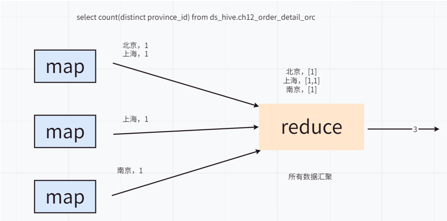
我们总结distinct之前，我们不得不先来看一下group by操作的具体实现原理。
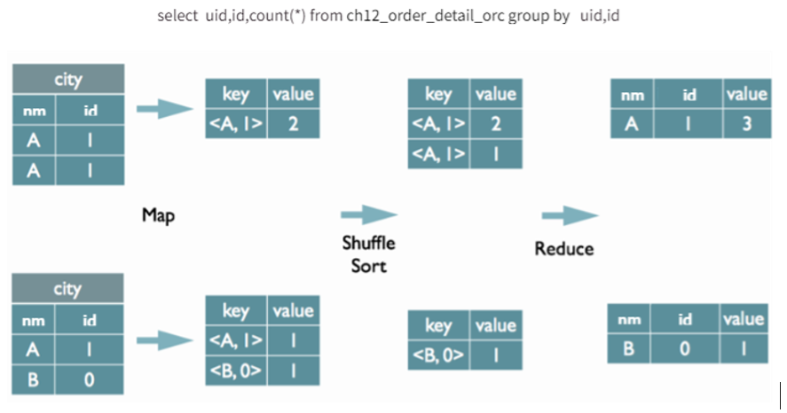


1. map阶段，将group by后的字段组合作为一个key，如果group by单个字段，那么key就一个。将group by之后要进行的聚合操作字段作为值，如果要进行count，则value是赋1；如要sum另一个字段，那么value就是该字段。

2. <span style="color:red">shuffle阶段，按照key的不同分发到不同的reducer</span>。注意此时可能因为key分布不均匀而出现数据倾斜的问题。这个问题是我们处理数据倾斜比较常规的查找原因的方法之一，也是我们解决数据倾斜的处理阶段。

3. reduce阶段，如果是count将相同key的值累加,如果是其他操作，按需要的聚合操作，得到结果。

上面我们可以清晰的明白group by的流程，那么接下来我们再来讲一下distinct的具体实现，当执行Distinct操作时，Hive会将操作转化为一个MapReduce作业，并按照指定的列进行分组。在Map阶段，每个Mapper会读取输入数据，并将指定的列作为输出的key，然后，通过Shuffle过程将具有相同key的数据发送到同一个Reducer中。
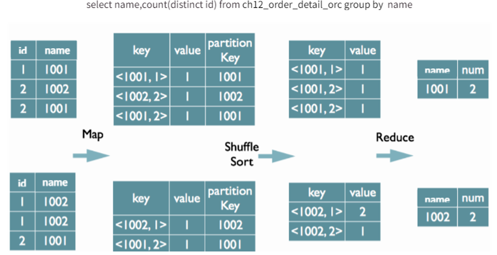


<span style="color:red">当distinct一个字段时，这里会将group by的字段和distinct的字段组合在一起作为map输出的key，value设置为1，同时将group by的字段定为分区键</span>，这一步非常重要，这样就可以将GroupBy字段作为reduce的key，在reduce阶段，利用mapreduce的排序，输入天然就是按照组合key排好序的。根据分区键将记录分发到reduce端后，按顺序取出组合键中的distinct字段，这时distinct字段也是排好序的。依次遍历distinct字段，每找到一个不同值，计数器就自增1，即可得到count distinct结果。

<mark>count(distinct)全局合操作的时候，即使我们设定了reduce task的具体个数，例如set mapred.reduce.tasks=100；hive最终也只会启动一个reducer。这就造成了所有map端传来的数据都在一个tasks中执行，这唯一的Reduce Task需要Shuffle大量的数据，并且进行排序聚合等处理，这使得这个操作成为整个作业的IO和运算瓶颈。</mark>

 针对上述说的问题，我们可以修改对应的sql来进行优化，<span style="color:red">count+groupby 或者sum+groupby的方案来优化，在第一阶段选出全部的非重复的字段id，在第二阶段再对这些已去重的id进行计数</span>
```sql
-- 原SQL
select
count(distinct id) as cnt
from ds_hive.ch6_order_detail_orc
;
-------------------优化，数据量越大越能体现效果；预聚合：每个id只输出一行，数据量大大减少
select count(id)
from
(
select
id
,count(*) as cnt
from ds_hive.ch6_order_detail_orc
group by id --这一步做了两件事：1.去重：GROUP BY id相当于 DISTINCT id ; 2.预聚合：每个id只输出一行，数据量大大减少
) t1
;
```
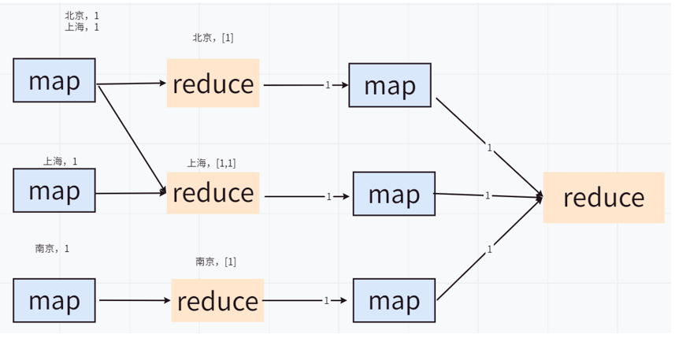
第一阶段我们可以通过增大Reduce的并发数，并发处理Map输出。在第二阶段，由于id已经消重，因此COUNT(*)操作在Map阶段不需要输出原id数据，只输出一个合并后的计数即可。这样即使第二阶段Hive强制指定一个Reduce Task的时候，极少量的Map输出数据也不会使单一的Reduce Task成为瓶颈。

其实在实际运行时，Hive还对这两阶段的作业做了额外的优化。它将第二个MapReduce作业Map中的Count过程移到了第一个作业的Reduce阶段。这样在第一阶Reduce就可以输出计数值，而不是消重的全部id。这一优化大幅地减少了第一个作业的Reduce输出IO以及第二个作业Map的输入数据量。最终在同样的运行环境下优化后的语句可以说是大大提升了执行效率。

#### 4.distinct多字段原理及优化
**1.原理**
对于mult-distinct，如果我们仍然按照上面一个distinct字段的方法，即下图这种实现方式，无法根据uid和date分别排序，也就无法通过LastKey去重，仍然需要在reduce阶段在内存中通过Hash去重。

select  pro,count(distinct userid),count(distinct city) from tmp1 group by  pro
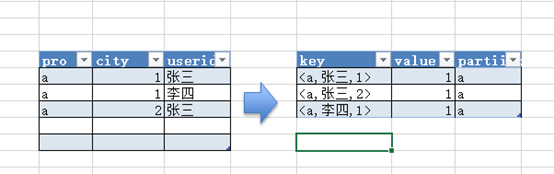

所以hive会使用另外一种处理方式，如果查询中有多个 distinct-expression，同一条record，会生成多条记录进行Shuffle，增大Shuffle量；假设有N个distinct，处置数据有M条，处置后的输出是N*M条数据（这里产生数据膨胀，也是数据倾斜产生的阶段），所以尽量在MAP端过滤尽可能多的数据。<span style="color:red">处理方法是对所有的distinct字段编号，那么相同字段就会分别排序，这时只需要在reduce阶段记录LastKey即可去重。这种实现方式很好的利用了MapReduce的排序，节省了reduce阶段去重的内存消耗，但是缺点是增加了shuffle的数据量。</span>需要注意的是，在生成reduce value时，除第一个distinct字段所在行需要保留value值，其余distinct数据行value字段均可为空。
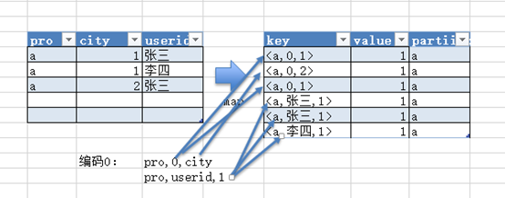

对于这种多重distinct的操作，我们也会经常遇见，就比如上面的的sql，这个的sql我们可以按照3步走的步骤进行优化。

1. 预处理，去重汇总，将能去重的重复的数据先去重，并且尽量过滤数据，收敛数据。
2. <span style="color:red">以空间换时间</span>，我们的磁盘空间是非常容易获取到，我们可以用union all的把数据根据distinct的字段扩充起来，假如有4个distinct，相当于数据扩充4倍，用rownumber=1来达到间接去重的目的，这里的union all只走一个job。
3. 嵌套查询，得到最终结果，这里没有一个distinct，全部走的是普通sum，可以在mapper端提前聚合，同样可以调节reduce数，这个会快很多。

```sql
-- 原SQL
select
province_id
,count(distinct user_id) as user_cnt
,count(distinct product_id) as product_cnt
from ds_hive.ch6_order_detail_orc
group by province_id
;
---------------------------------------------------
-- 优化SQL
SELECT
province_id
,SUM(user_cnt) AS user_cnt
,SUM(product_cnt) AS product_cnt
FROM
(
select
province_id
,count(distinct user_id) as user_cnt
,0 as product_cnt --用0占位
from ds_hive.ch6_order_detail_orc
group by province_id

UNION ALL
select
province_id
,0 as user_cnt --用0占位
,count(distinct product_id) as product_cnt
from ds_hive.ch6_order_detail_orc
group by province_id
)
T1
GROUP BY province_id
;
```
COUNT(DISTINCT) 优化步骤结果展示

原始数据
```
北京  u1  p1
北京  u1  p2  
北京  u2  p1
北京  u2  p3
上海  u3  p1
上海  u3  p2
上海  u4  p1
广东  u5  p4
```

原SQL结果
```
省份  user_cnt  product_cnt
北京  2         3
上海  2         2  
广东  1         1
```

优化SQL分步结果

第一步：计算user_id去重
```
省份  user_cnt  product_cnt
北京  2         0
上海  2         0
广东  1         0
```

第二步：计算product_id去重  
```
省份  user_cnt  product_cnt
北京  0         3
上海  0         2
广东  0         1
```

第三步：UNION ALL合并
```
省份  user_cnt  product_cnt
北京  2         0
上海  2         0
广东  1         0
北京  0         3
上海  0         2
广东  0         1
```

第四步：GROUP BY汇总
```
省份  user_cnt  product_cnt
北京  2         3
上海  2         2
广东  1         1
```

✅ **最终结果与原SQL一致**

## 6.3 JOIN 操作详解

### 6.3.1 JOIN 的类型

#### 1. 等值 INNER JOIN
Hive 支持等值连接和外连接。旧版 Hive 不支持非相等的 JOIN 条件，但后续版本已支持。Hive 可以 JOIN 两个以上的表。

订单表：
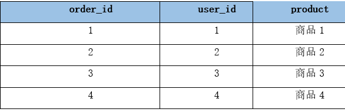
用户表：
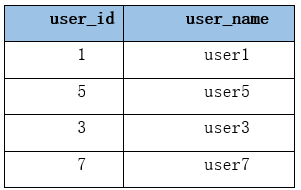
案例实操：
<span style="color:red">内连接</span>：只有进行连接的两个表中都存在与连接条件相匹配的数据才会被保留下来。如下图：
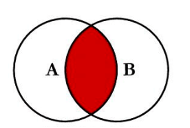
（1）查询每个用户的订单。

```sql
hive (default)>
select t1.id
       ,t2.username
from ds_hive.ch6_t_order t1
join ds_hive.ch6_t_user t2
    on t1.user_id=t2.id;
```
最终只会保留两张表中 user_id 都存在的数据。

order_id | user_id | product  | user_name
---------|---------|----------|----------
1        | 1       | 商品1    | user1
3        | 3       | 商品3    | user1

#### 2. 外关联 LEFT JOIN、RIGHT JOIN
<span style="color:red">左外连接</span>：JOIN 操作符左边表中符合 WHERE 子句的所有记录将会被返回。如下图：
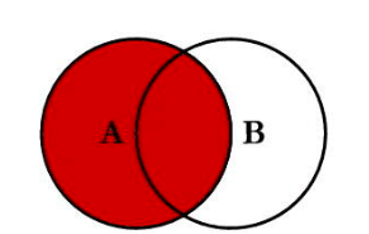
```sql
hive (default)>
select t1.id
       ,t2.username
from ds_hive.ch6_t_order t1
Left join ds_hive.ch6_t_user t2
    on t1.user_id=t2.id
;
```
最终左表的数据全部保留，右边保留 user_id 存在左表中的数据。

order_id | user_id | product  | user_name
---------|---------|----------|----------
1        | 1       | 商品1    | user1
2        | null    | 商品2    | null
3        | 3       | 商品3    | user3
4        | null    | 商品4    | null

<span style="color:red">右外连接</span>：JOIN 操作符右边表中符合 WHERE 子句的所有记录将会被返回。
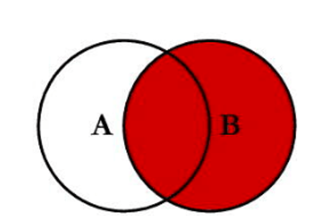
```sql
hive (default)>
select t1.id
       ,t2.username
from ds_hive.ch6_t_order t1
right join ds_hive.ch6_t_user t2
    on t1.user_id=t2.id
;
```
最终右表的数据全部保留，左边保留 user_id 存在左表中的数据。

order_id | user_id | product  | user_name
---------|---------|----------|----------
1        | 1       | 商品1    | user1
null     | 5       | null     | user5
3        | 3       | 商品3    | user3
null     | 7       | null     | user7

#### 3. 实现非等值连接
查询 test_a 有，test_b 没有，用 LEFT JOIN + IS NULL
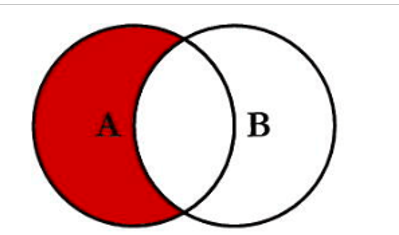
```sql
select t1.id
       ,t2.username
from ds_hive.ch6_t_order t1
left join ds_hive.ch6_t_user t2
    on t1.user_id=t2.id
where t2.id is null
;
```

#### 4. 满外连接
满外连接：将会返回所有表中符合 WHERE 语句条件的所有记录。如果任一表的指定字段没有符合条件的值的话，那么就使用 NULL 值替代。
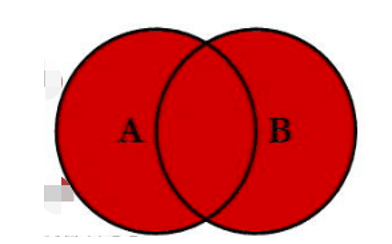
```sql
hive (default)>
select t1.id
       ,t2.username
from ds_hive.ch6_t_order t1
full join ds_hive.ch6_t_user t2
    on t1.user_id=t2.id
;
```

order_id | user_id | product  | user_name
---------|---------|----------|----------
1        | 1       | 商品1    | user1
2        | null    | 商品2    | null
3        | 3       | 商品3    | user3
4        | null    | 商品4    | null
null     | 5       | null     | user5
null     | 7       | null     | user7

#### 5. 多表连接
注意：连接 n 个表，至少需要 n-1 个连接条件。例如：连接三个表，至少需要两个连接条件。

多表连接查询

```sql
hive (default)>
select t1.id
       ,t2.username
       ,t3.product_name
       ,t3.price
from ds_hive.ch6_t_order t1
join ds_hive.ch6_t_user t2
    on t1.user_id=t2.id
join ds_hive.ch6_t_goods t3
    on t1.product_id=t3.id
;
```

#### 6. 要避免的笛卡尔集
1）笛卡尔集会在下面条件下产生：
（1）省略连接条件
（2）连接条件无效
（3）所有表中的所有行互相连接

2）案例实操

```sql
hive (default)>
select t1.id
       ,t2.username
from ds_hive.ch6_t_order t1
join ds_hive.ch6_t_user t2
    on 1=1 -- 1=1 永远为真
;
```
我们上面给大家演示了各种关联，都是一对一比如内关联的 1 对 1 最终的结果为：

order_id | user_id | product  | user_name
---------|---------|----------|----------
1        | 1       | 商品1    | user1
3        | 3       | 商品3    | user1

但是很多时候，还会存在一对多，多对一，多对多的问题。

比如一对多的情况，最终关联结果为：
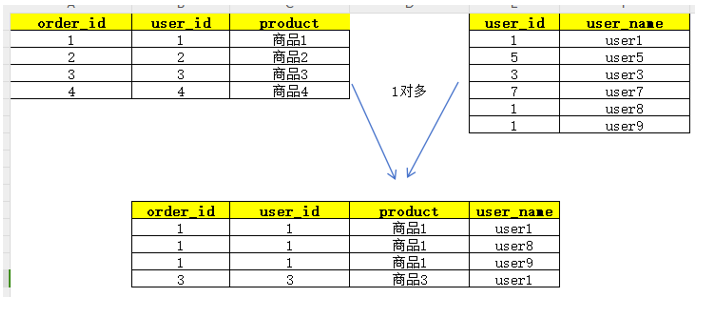
多对多的情况，最终关联结果为：
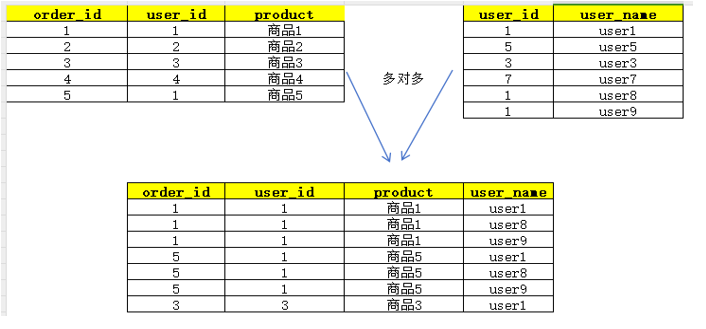
可以看出，当多对多的时候，数据是成倍数增加的，当使用了笛卡尔积时，连接条件无效，那就相当于全表的多对多，数据增加不可想象。那我们可以通过设置参数来避免这样的查询。

```sql
set hive.mapred.mode=strict;
```

<span style="color:red">设置这个参数，可以限制以下情况：
1）限制执行可能形成笛卡尔积的 SQL；
2）partition 表使用时不加分区；
3）order by 全局排序的时候不加 limit 的情况；</span>

#### 7. 联合（UNION & UNION ALL）
1）UNION & UNION ALL 上下拼接
UNION 和 UNION ALL 都是上下拼接 SQL 的结果，这点是和 JOIN 有区别的，JOIN 是左右关联，UNION 和 UNION ALL 是上下拼接。<span style="color:red">UNION 去重，UNION ALL 不去重。</span>

UNION 和 UNION ALL 在上下拼接 SQL 结果时有两个要求：
（1）两个 SQL 的结果，列的个数必须相同
（2）两个 SQL 的结果，上下所对应列的类型必须一致

2）案例实操
将用户表和订单表的用户 id，利用 UNION ALL 进行拼接显示。

```sql
hive (default)>
select t1.user_id as user_id
from ds_hive.ch6_t_order t1
union all
select t2.id as user_id
from ds_hive.ch6_t_user t2
;

select t1.user_id as user_id
from ds_hive.ch6_t_order t1
union
select t2.id as user_id
from ds_hive.ch6_t_user t2
;
```

#### 8. LEFT SEMI JOIN
<mark>LEFT SEMI JOIN 以一种高效的方式实现了不相关的 IN/EXISTS 子查询语义</mark>。在 Hive 0.13 中，IN/NOT IN/EXISTS/NOT EXISTS 操作符被支持使用子查询，所以大多数 JOIN 操作不再需要手动执行。 使用 LEFT SEMI JOIN 的限制是，右边的表只能在连接条件（ON 子句）中引用，而不能在 WHERE 或 SELECT 子句等中引用。

1、LEFT SEMI JOIN 的限制是，JOIN 子句中右边的表<span style="color:red">只能在 ON 子句中设置过滤条件</span>，在 WHERE 子句、SELECT 子句或其他地方过滤都不行。

2、<span style="color:red">因为 LEFT SEMI JOIN 是 IN(keySet) 的关系，遇到右表重复记录，左表会跳过，而 JOIN 则会一直遍历。这就导致右表有重复值的情况下 LEFT SEMI JOIN 只产生一条，JOIN 会产生多条，也会导致 LEFT SEMI JOIN 的性能更高。</span>

使用：
```sql
select  t1.id
        ,t1.user_id
        ,t1.quantity
        ,t2.id
     from ds_hive.ch6_t_order   t1
left semi join ds_hive.ch6_t_user t2
       on t1.user_id=t2.id
```
代替：
```sql
select  t1.id
        ,t1.user_id
        ,t1.quantity
     from ds_hive.ch6_t_order   t1
    where  id in (select  distinct id from ds_hive.ch6_t_user)
;
```

### 6.3.2 JOIN 底层原理
Hive 拥有多种 JOIN 算法，包括 Common Join，Map Join，Bucket Map Join，Sort Merge Buckt Map Join 等，下面对每种 JOIN 算法做简要说明：

#### 1. Common Join
<span style="color:red">Common Join 是 Hive 中最稳定的 JOIN 算法</span>，其通过一个 MapReduce Job 完成一个 JOIN 操作。Map 端负责读取 JOIN 操作所需表的数据，并按照关联字段进行分区，通过 Shuffle，将其发送到 Reduce 端，相同 key 的数据在 Reduce 端完成最终的 JOIN 操作。
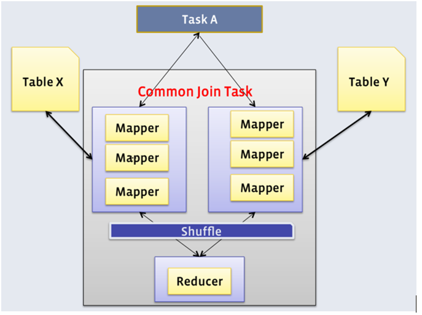
如果不指定 MapJoin 或者不符合 MapJoin 的条件，那么 Hive 解析器会将 JOIN 操作转换成 Common Join，即：在 Reduce 阶段完成 JOIN。

整个过程包含 Map、Shuffle、Reduce 阶段。

（1）Map 阶段
Step1: 读取源表的数据，<span style="color:red">Map 输出时候以 JOIN ON 条件中的列为 key，如果 JOIN 有多个关联键，则以这些关联键的组合作为 key；</span>
Step2: Map 输出的 value 为 JOIN 之后所关心的（SELECT 或者 WHERE 中需要用到的）列；同时在 value 中还会包含表的 Tag 信息，用于标明此 value 对应哪个表；
Step3: 按照 key 进行排序。

（2）Shuffle 阶段
根据 key 的值进行 hash，并将 key/value 按照 hash 值推送至不同的 reduce 中，这样确保两个表中相同的 key 位于同一个 reduce 中。

（3）Reduce 阶段
根据 key 的值完成 JOIN 操作，期间通过 Tag 来识别不同表中的数据。

举个例子：

```sql
SELECT t1.stu_id
           ,t1.score
           ,t2.sex
      from ds_hive.ch7_score_info t1
  join ds_hive.ch7_stu_info  t2
        on t1.stu_id=t2.stu_id
;
```

执行过程如下：
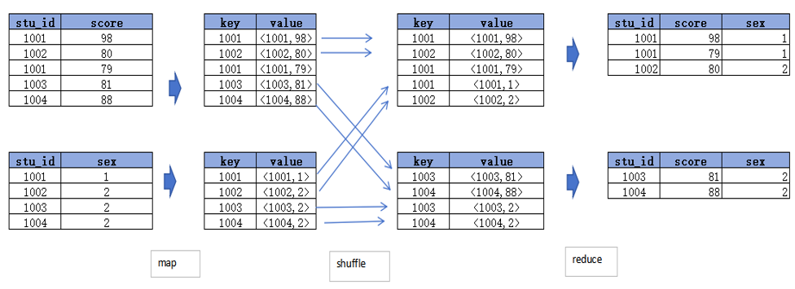
JOIN 操作涉及合并两个或多个表的数据，以便通过共同的列值将它们关联起来。这样的关联操作在处理大规模数据时可能会面临一些性能挑战，因此有必要进行优化。

性能开销：JOIN 操作通常涉及将分布在不同节点上的数据进行合并。在传统的 MapReduce 执行环境中，这意味着需要进行数据的分发、排序和聚合操作，这些操作都会带来较大的性能开销。

Shuffle 开销：在传统的 MapReduce 中，JOIN 操作的 Shuffle 阶段涉及将相同键的数据合并到一起。这个过程需要大量的网络通信和数据传输，尤其是当数据分布不均匀时。

内存消耗：处理大规模数据的 JOIN 操作可能需要大量的内存，特别是在进行排序和合并时。这可能导致内存不足的问题，进而影响性能。

复杂度：JOIN 操作可能涉及复杂的计算，特别是在关联多个表或在多列上进行关联时。这增加了查询的复杂性，可能导致较长的执行时间。

#### 2. Map Join
<span style="color:red">Map Join 算法可以通过两个只有 Map 阶段的 Job 完成一个 JOIN 操作。其适用场景为大表 JOIN 小表。</span>若某 JOIN 操作满足要求，则第一个 Job 会读取小表数据，将其制作为 hash table，并上传至 Hadoop 分布式缓存（本质上是上传至每个执行任务的 NodeManager 节点本地磁盘）。第二个 Job 会先从分布式缓存中读取小表数据，并缓存在 Map Task 的内存中，然后扫描大表数据，这样在 Map 端即可完成关联操作。
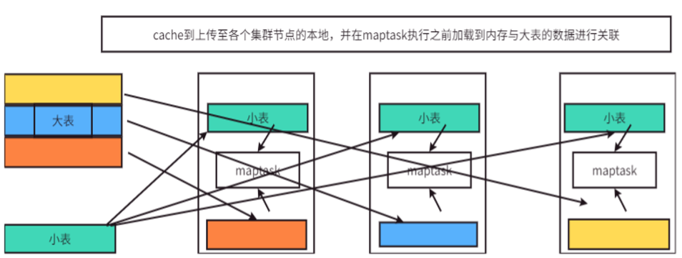
<mark>Map Join 有两种触发方式，一种是用户在 SQL 语句中增加 hint 提示，另外一种是 Hive 优化器根据参与 JOIN 表的数据量大小，自动触发。</mark>

1）Hint 提示
用户可通过如下方式，指定通过 MAP JOIN 算法，并且将作为 MAP JOIN 中的小表。这种方式已经过时，不推荐使用。

```sql
select /*+ mapjoin(ta) */
    ta.id,
    tb.id
from table_a ta
join table_b tb
on ta.id=tb.id
;
```

2）自动触发
Hive 在编译 SQL 语句阶段，起初所有的 JOIN 操作均采用 Common Join 算法实现。

<span style="color:red">之后在物理优化阶段，Hive 会根据每个 Common Join 任务所需表的大小判断该 Common Join 任务是否能够转换为 Map Join 任务，若满足要求，便将 Common Join 任务自动转换为 Map Join 任务。</span>

但有些 Common Join 任务所需的表大小，在 SQL 的编译阶段是未知的（例如对子查询进行 JOIN 操作），所以这种 Common Join 任务是否能转换成 Map Join 任务在编译阶是无法确定的。

针对这种情况，Hive 会在编译阶段生成一个条件任务（Conditional Task），其下会包含一个计划列表，计划列表中包含转换后的 Map Join 任务以及原有的 Common Join 任务。最终具体采用哪个计划，是在运行时决定的。大致思路如下图所示：
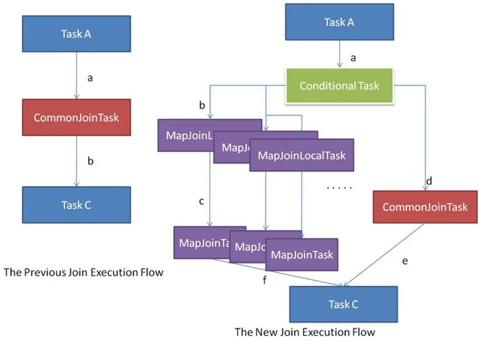
Map join 自动转换的具体判断逻辑如下图所示：
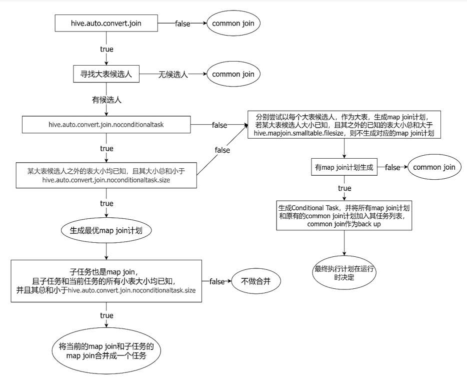
参数如下：

```sql
-- 启动 Map Join 自动转换
set hive.auto.convert.join=true;
-- 一个 Common Join operator 转为 Map Join operator 的判断条件,若该 Common Join 相关的表中,存在 n-1 张表的大小总和<=该值,则生成一个 Map Join 计划,此时可能存在多种 n-1 张表的组合均满足该条件,则 hive 会为每种满足条件的组合均生成一个 Map Join 计划,同时还会保留原有的 Common Join 计划作为后备(back up)计划,实际运行时,优先执行 Map Join 计划，若不能执行成功，则启动 Common Join 后备计划。
set hive.mapjoin.smalltable.filesize=25000000;
-- 开启无条件转 Map Join
set hive.auto.convert.join.noconditionaltask=false;
-- 无条件转 Map Join 时的小表之和阈值,若一个 Common Join operator 相关的表中，存在 n-1 张表的大小总和<=该值,此时 hive 便不会再为每种 n-1 张表的组合均生成 Map Join 计划,同时也不会保留 Common Join 作为后备计划。而是只生成一个最优的 Map Join 计划。
set hive.auto.convert.join.noconditionaltask.size= 20971520;
```

3）示例 SQL1
```sql
set hive.auto.convert.join=flase;
explain
    SELECT t1.stu_id
           ,t1.score
           ,t2.sex
      from ds_hive.ch7_score_info t1
  join ds_hive.ch7_stu_info  t2
        on t1.stu_id=t2.stu_id
;
```
优化前：
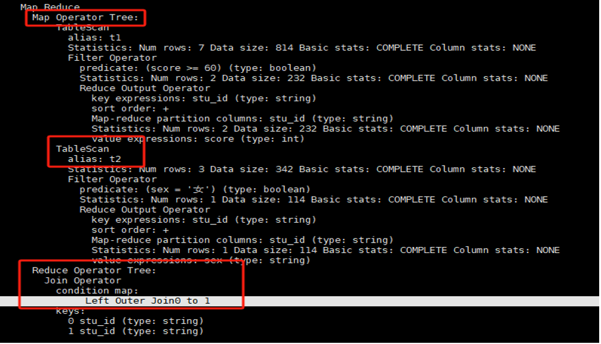
开启 MAP 端自动 JOIN：
```sql
set hive.auto.convert.join=true;
-- 大表 join 小表
 explain
    SELECT t1.stu_id
           ,t1.score
           ,t2.sex
      from ds_hive.ch7_score_info t1
left  join ds_hive.ch7_stu_info  t2
        on t1.stu_id=t2.stu_id
;
```
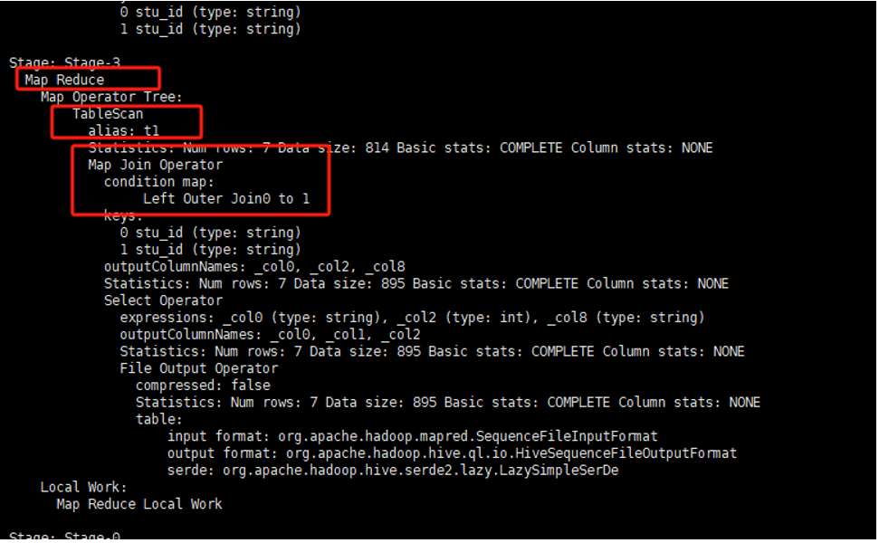
根据执行计划，可以得出下列结论：

调整完的执行计划,我们可以发现，两张表在 Map 端进行了聚合。

示例 SQL2
示例 1 的 SQL 数据太少，我们不太能观察具体效率提升的对比，也不好去测试其他参数的使用情况：

先关闭 MAP JOIN 执行，再打开 MAP JOIN 执行：
```sql
set hive.auto.convert.join=false;
set  hive.auto.convert.join=true;
SELECT t1.province_id
,count(*) as cnt
   from ds_hive.ch12_order_detail_orc t1
       join ds_hive.ch12_product_info_orc t3
         on t1.province_id=t3.id
group by t1.province_id
;
```
在大数据量的前提下两者的运行时间差了将近 100 秒，接着我们再来测试另外一个参数。

#### 3. Bucket Map Join（分桶 + Map Join）
<span style="color:red">两张表都相对较大，若采用普通的 Map Join 算法，则 Map 端需要较多的内存来缓存数据，当然可以选择为 Map 段分配更多的内存，来保证任务运行成功。但是，Map 端的内存不可能无上限的分配，所以当参与 JOIN 的表数据量均过大时，就可以考虑采用 Bucket Map Join 算法。Bucket Map Join 是对 Map Join 算法的改进，其打破了 Map Join 只适用于大表 JOIN 小表的限制，可用于大表 JOIN 大表的场景。</span>

<mark>Bucket Map Join 的核心思想是：若能保证参与 JOIN 的表均为分桶表，且关联字段为分桶字段，且其中一张表的分桶数量是另外一张表分桶数量的整数倍，就能保证参与 JOIN 的两张表的分桶之间具有明确的关联关系，所以就可以在两表的分桶间进行 Map Join 操作了。</mark>这样一来，第二个 Job 的 Map 端就无需再缓存小表的全表数据了，而只需缓存其所需的分桶即可。其原理如图所示：
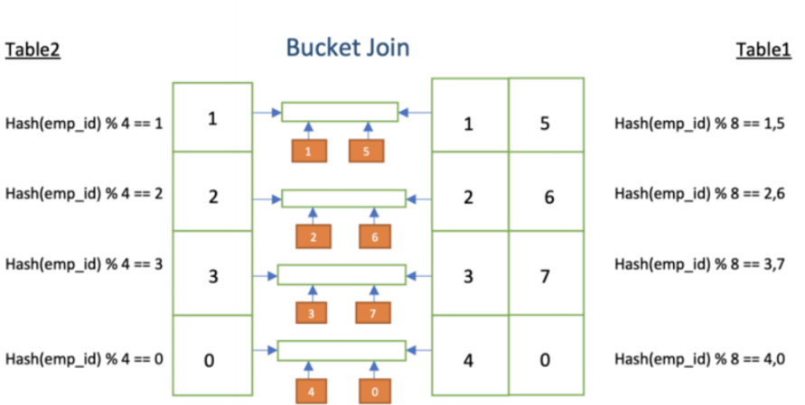
优化条件：
1） set hive.optimize.bucketmapjoin = true;
2） <span style="color:red">一个表的 bucket 数是另一个表 bucket 数的整数倍</span>
3） bucket 列 == JOIN 列
4） 必须是应用在 Map Join 的场景中

Bucket Map Join 不支持自动转换，必须通过用户在 SQL 语句中提供如下 Hint 提示，并配置如下相关参数，方可使用。

1）Hint 提示
```sql
hive (default)>
select /*+ mapjoin(ta) */
    ta.id,
    tb.id
from table_a ta
join table_b tb on ta.id=tb.id;
```

2）相关参数
```sql
-- 关闭 cbo 优化，cbo 会导致 hint 信息被忽略
set hive.cbo.enable=false;
-- map join hint 默认会被忽略(因为已经过时)，需将如下参数设置为 false
set hive.ignore.mapjoin.hint=false;
-- 启用 bucket map join 优化功能
set hive.optimize.bucketmapjoin = true;
```

1）示例 SQL
下面演示如何使用 Bucket Map Join。

首先需要依据源表创建两个分桶表，order_detail 建议分 20 个 bucket，payment_detail 建议分 10 个 bucket, 注意分桶个数的倍数关系以及分桶字段。

```sql
CREATE TABLE if not exists  ds_hive.ch12_order_detail_bucket(
  `id` string COMMENT '订单id',
  `user_id` string COMMENT '用户id',
  `product_id` string COMMENT '商品id',
  `province_id` string COMMENT '省份id',
  `create_time` string COMMENT '下单时间',
  `product_num` int COMMENT '商品件数',
  `total_amount` decimal(16,2) COMMENT '下单金额'
  )
comment '用户表'
clustered by (id) into 18 buckets
;
  
INSERT OVERWRITE TABLE  ds_hive.ch12_order_detail_bucket
select
 id        
,user_id   
,product_id
,province_id
,create_time
,product_num
,total_amount
from ds_hive.ch10_order_detail_txtfile
;
  
CREATE TABLE if not exists  ds_hive.ch12_order_detail_bucket_sm(
  `id` string COMMENT '订单id',
  `user_id` string COMMENT '用户id',
  `product_id` string COMMENT '商品id',
  `province_id` string COMMENT '省份id',
  `create_time` string COMMENT '下单时间'
  )
comment '用户表'
clustered by (id) into 9 buckets
stored as textfile
;
INSERT OVERWRITE TABLE  ds_hive.ch12_order_detail_bucket_sm
select
 id        
,user_id   
,product_id
,province_id
,create_time
from ds_hive.ch10_order_detail_txtfile
limit 3000000
;
```

然后设置以下参数：

```sql
set hive.cbo.enable=false;
set hive.ignore.mapjoin.hint=false;
set hive.optimize.bucketmapjoin=true;
```

重写 SQL 语句，如下：

```sql
explain
select /*+ mapjoin(t1) */
       *
 from  ds_hive.ch12_order_detail_bucket t1
 join   ds_hive.ch12_order_detail_bucket_sm t2
    on t1.id=t2.id
;
```

需要注意的是，Bucket Map Join 的执行计划的基本信息和普通的 Map Join 无异，若想看到差异，可执行如下语句，查看执行计划的详细信息。详细执行计划中，如在 Map Join Operator 中看到 “BucketMapJoin: true”，则表明使用的 JOIN 算法为 Bucket Map Join。

```sql
explain extended
select /*+ mapjoin(t1) */
       *
 from  ds_hive.ch12_order_detail_bucket t1
 join   ds_hive.ch12_order_detail_bucket_sm t2
    on t1.id=t2.id
;
```
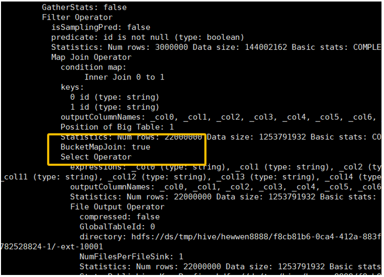
#### 4. Sort Merge Bucket Map Join（分桶+map join+桶内有序）
<span style="color:red">Sort Merge Bucket Map Join（简称 SMB Map Join）基于 Bucket Map Join。</span>SMB Map Join 要求，参与 JOIN 的表均为分桶表，且需保证分桶内的数据是有序的，且分桶字段、排序字段和关联字段为相同字段，且其中一张表的分桶数量是另外一张表分桶数量的整数倍。

SMB Map Join 同 Bucket Join 一样，同样是利用两表各分桶之间的关联关系，在分桶之间进行 JOIN 操作，不同的是，分桶之间的 JOIN 操作的实现原理。Bucket Map Join，两个分桶之间的 JOIN 实现原理为 Hash Join 算法；而 SMB Map Join，两个分桶之间的 JOIN 实现原理为 Sort Merge Join 算法。

Hash Join 和 Sort Merge Join 均为关系型数据库中常见的 JOIN 实现算法。<span style="color:red">Hash Join 的原理相对简单，就是对参与 JOIN 的一张表构建 hash table，然后扫描另外一张表，然后进行逐行匹配。Sort Merge Join 需要在两张按照关联字段排好序的表中进行</span>，其原理如图所示：
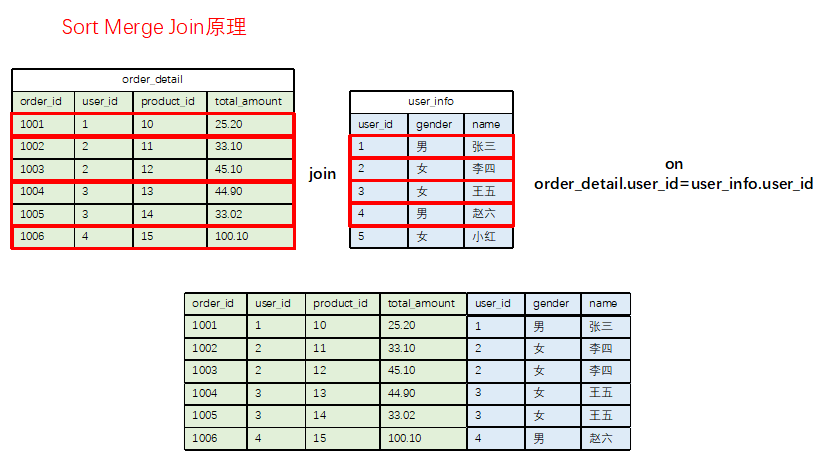
Hive 中的 SMB Map Join 就是对两个分桶的数据按照上述思路进行 JOIN 操作。可以看出，SMB Map Join 与 Bucket Map Join 相比，在进行 JOIN 操作时，Map 端是无需对整个 Bucket 构建 hash table，也无需在 Map 端缓存整个 Bucket 数据的，每个 Mapper 只需按顺序逐个 key 读取两个分桶的数据进行 JOIN 即可。

Sort Merge Bucket Map Join 有两种触发方式，包括 Hint 提示和自动转换。Hint 提示已过时，不推荐使用。下面是自动转换的相关参数：

```sql
-- 启动 Sort Merge Bucket Map Join 优化
set hive.optimize.bucketmapjoin.sortedmerge=true;
-- 使用自动转换 SMB Join
set hive.auto.convert.sortmerge.join=true;
```

两张表都相对较大，除了可以考虑采用 Bucket Map Join 算法，还可以考虑 SMB Join。相较于 Bucket Map Join，SMB Map Join 对分桶大小是没有要求的。下面演示如何使用 SMB Map Join。

<span style="color:red">首先需要依据源表创建两个的有序的分桶表</span>，order_detail 建议分 20 个 bucket，payment_detail 建议分 10 个 bucket, 注意分桶个数的倍数关系以及分桶字段和排序字段。

```sql
CREATE TABLE if not exists  ds_hive.ch12_order_detail_bucket_sort(
  `id` string COMMENT '订单id',
  `user_id` string COMMENT '用户id',
  `product_id` string COMMENT '商品id',
  `province_id` string COMMENT '省份id',
  `create_time` string COMMENT '下单时间',
  `product_num` int COMMENT '商品件数',
  `total_amount` decimal(16,2) COMMENT '下单金额'
  )
comment '用户表'
clustered by (id) sorted by(id) into 20 buckets
stored as textfile
;
INSERT OVERWRITE TABLE  ds_hive.ch12_order_detail_bucket_sort
select
 id        
,user_id   
,product_id
,province_id
,create_time
,product_num
,total_amount
from ds_hive.ch10_order_detail_txtfile;
CREATE TABLE if not exists  ds_hive.ch12_order_detail_bucket_sm_sort(
  `ids` string COMMENT '订单id',
  `user_id` string COMMENT '用户id',
  `product_id` string COMMENT '商品id',
  `province_id` string COMMENT '省份id',
  `create_time` string COMMENT '下单时间'
  )
comment '用户表'
clustered by (ids) sorted by(ids) into 10 buckets
stored as textfile;
INSERT OVERWRITE TABLE  ds_hive.ch12_order_detail_bucket_sm_sort
select
 id        
,user_id   
,product_id
,province_id
,create_time
from ds_hive.ch10_order_detail_txtfile
limit 3000000;
```

然后向两个分桶表导入数据。

```sql
-- 订单表
hive (default)>
insert overwrite table order_detail_sorted_bucketed
select
    id,
    user_id,
    product_id,
    province_id,
    create_time,
    product_num,
    total_amount 
from order_detail
where dt='2020-06-14';
-- 分桶表
hive (default)>
insert overwrite table payment_detail_sorted_bucketed
select
    id,
    order_detail_id,
    user_id,
    payment_time,
    total_amount
from payment_detail
where dt='2020-06-14';
```

然后设置以下参数：

```sql
set hive.auto.convert.sortmerge.join=true;
set hive.optimize.bucketmapjoin.sortedmerge = true;
set hive.optimize.bucketmapjoin = true;
```

最后在重写 SQL 语句，如下：

```sql
hive (default)>
explain
select
       t1.user_id
 from  ds_hive.ch12_order_detail_bucket_sort t1
 join   ds_hive.ch12_order_detail_bucket_sm_sort t2
    on t1.id=t2.ids;
```

优化后的执行计如图所示：
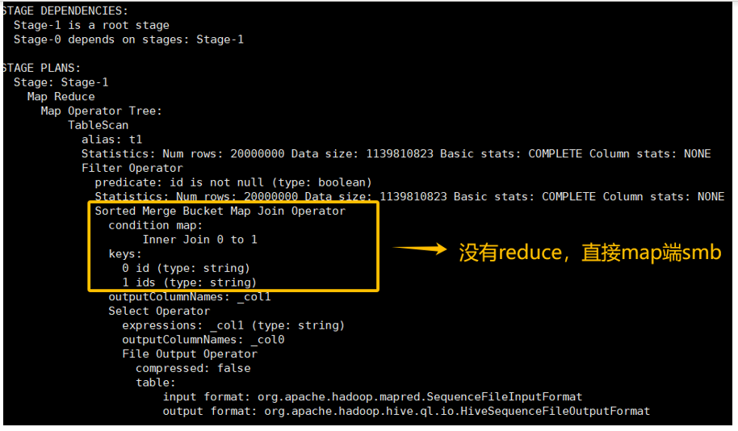
我们在结合聚合，对比一下执行性能：

```sql
select
       t1.province_id,count(*)
 from  ds_hive.ch12_order_detail_bucket_sort t1
 join   ds_hive.ch12_order_detail_bucket_sm_sort t2
    on t1.id=t2.ids
group by t1.province_id
;
```

可以发现 没启动 SMB JOIN 用了 60+秒的时间，但是启动后直接到了 20+秒。

## 6.4 排序语法 

### 6.4.1 全局排序（Order By）
- 会对输入做全局排序，因此只有一个reducer
- 设置reduce个数没用，不管设置几个reduce，最终也只会有一个reduce
- 在 `set hive.mapred.mode = strict` 模式下必须指定 `LIMIT`，否则执行会报错
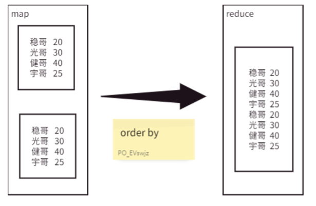
- **缺点**：当数据量特别大的时候，效率非常低
- **语法**：<span style="color:red">默认是升序排序，后面加关键字 `desc` 则为降序，Order By子句在select语句的结尾</span>

**基础案例实操**
1. 查询每个类别中的商品数，按类别升序排列
```sql
set mapreduce.job.reduces=3;
select 
    category
    ,count(*) as order_cnt
from ds_hive.ch6_t_goods
group by category
order by category
LIMIT 10;
```

2. 查询每个类别中的商品数，按类别降序排列
```sql
select 
    category
    ,count(*) as order_cnt
from ds_hive.ch6_t_goods
group by category
order by category desc;
```

3. 查询每个类别中的商品数，按商品数量排列
```sql
select 
    category
    ,count(*) as order_cnt
from ds_hive.ch6_t_goods
group by category
order by order_cnt;
```

4. 查询每个类别中的商品数，按商品类别和商品数量排列
```sql
select 
    category
    ,count(*) as order_cnt
from ds_hive.ch6_t_goods
group by category
order by category DESC, order_cnt ASC;
```

### 6.4.2 Reduce内部排序（Sort By）
- <span style="color:red"> Sort By：对于大规模的数据集order by的效率非常低。在很多情况下，并不需要全局排序，此时可以使用Sort by</span>
- Sort by为每个reduce产生一个排序文件。每个Reduce内部进行排序，对全局结果集来说不是排序

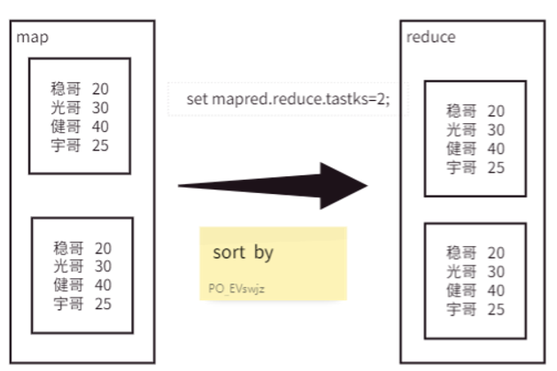

**实操**
1. 设置reduce个数
```sql
set mapreduce.job.reduces=3;
```

2. 查看设置reduce个数
```sql
set mapreduce.job.reduces;
```

3. 创建表
```sql
CREATE TABLE if not exists ds_hive.ch6_t_emp_order
as
select 
    Id, category, price
from ds_hive.ch6_t_goods
order by cast(price as int);
```

```sql
CREATE TABLE if not exists ds_hive.ch6_t_emp_sort
as
select *
from ds_hive.ch6_t_goods
sort by cast(price as int);
```

### 6.4.3 分区（Distribute By）
- Distribute By：distribute by 控制map中的输出在reducer中是如何进行划分的
- <span style="color:red">使用distribute by可以保证相同KEY的记录被划分到一个Reduce中</span>
- 在有些情况下，我们需要控制某个特定行应该到哪个Reducer，通常是为了进行后续的聚集操作
- distribute by子句可以做这件事
- <span style="color:red">distribute by类似MapReduce中partition（自定义分区），进行分区，结合sort by使用</span>
- **注意**：对于distribute by进行测试，一定要分配多reduce进行处理，否则无法看到distribute by的效果

**案例实操**
```sql
set mapreduce.job.reduces=3;
select *
from ds_hive.ch6_t_goods
distribute by category
sort by cast(price as int);
```

distribute by 前：
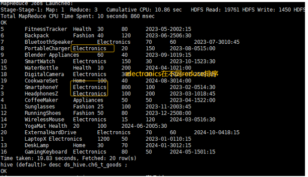

distribute by 后：
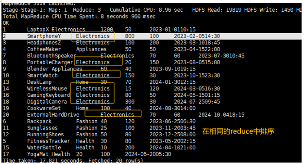

**注意**：
<span style="color:red">1. distribute by的分区规则是根据分区字段的hash码与reduce的个数进行相除后，余数相同的分到一个区
2. Hive要求distribute by语句要写在sort by语句之前</span>

### 6.4.4 分区排序（Cluster By）
- <span style="color:red">cluster by column = distribute by column + sort by column</span>
- <span style="color:red">注意，都是针对column列，且采用默认ASC，不能指定排序规则为asc或者desc</span>
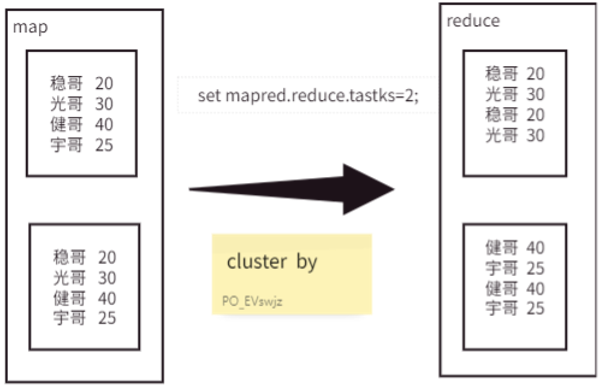

**等价写法**
以下两种写法等价：
```sql
select *
from ds_hive.ch6_t_goods
cluster by category;
```

等价于：
```sql
select *
from ds_hive.ch6_t_goods
distribute by category
sort by category;
```

### 6.4.5 重点：优化案例
用sort by + distribute by 代替全局order by

**没有优化版本，全局排序跑的很慢**
```sql
select *
from ds_hive.ch6_t_goods
order by cast(price as int)
limit 10000;
```

**优化版本**
通过使用子查询，在每个Reduce中进行排序后，各自取得前N个数据，然后再对结果集进行全局排序，最终取得结果
```sql
select *
from (
    select *
    from ds_hive.ch6_t_goods
    distribute by category
    sort by cast(price as int)
) t1
order by cast(price as int)
limit 10000;
```

## 6.5 需求分析与实战案例

### 6.5.1 需求背景
基于5.3章节，我们已经完成了母婴类产品的订单表和用户表的清洗，现在需要基于清洗好的数据做分析。

### 6.5.2 数据说明
#### 1. 用户基本信息表：tianchi_mum_baby
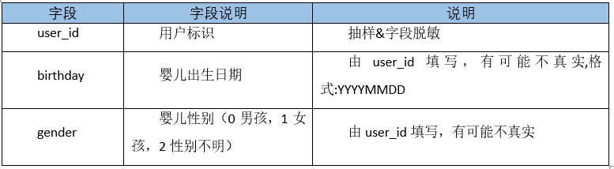

#### 2. 商品交易信息表：tianchi_mum_baby_trade_history
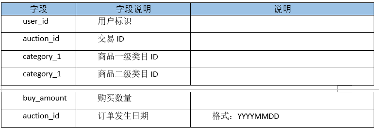
#### 建表语句
```sql
-- 用户表
create table if not exists ds_hive.ch5_sz_t_user(
    user_id   string  comment '用户标识',
    birthday  string  comment '婴儿出生日期',
    gender    string  comment '婴儿性别（0 男孩，1 女孩，2性别不明）'
)
row format delimited fields terminated by ','
stored as textfile;
 
-- 订单表
CREATE TABLE ds_hive.ch5_sz_t_order_d(
    user_id    string COMMENT '用户id',
    auction_id string COMMENT '交易ID',
    category_1 string COMMENT '商品一级类目ID',
    category_2 string COMMENT '商品二级类目ID',
    buy_amount string COMMENT '购买金额',
    order_dt   string COMMENT '订单发生日期'
)
COMMENT '母婴订单表'
PARTITIONED BY(data_dt STRING)
stored as orc;
```

### 6.5.3 需求描述
1. 统计2024年所有商品用户数、订单数；商品一级类目用户数、订单数；商品一级类目、商品二级类目每天的用户数、订单数
2. 统计2024年男、女用户购买的商品所花费的金额分别占总金额的情况
3. 统计2024年每个用户的订单数，并取出订单数前三名的用户

### 6.5.4 需求开发
#### 问题1
统计所有用户数、订单数；商品一级类目用户数、订单数；商品一级类目、商品二级类目每天的用户数、订单数
```sql
select
    category_1,
    category_2,
    count(distinct user_id) as user_cnt,
    count(1) as order_cnt,
    grouping__id
from ds_hive.ch5_sz_t_order_d
where data_dt = '2024'
group by
    category_1,
    category_2
    GROUPING SETS ((), category_1, (category_1, category_2))
order by grouping__id;
```

#### 问题2
统计男、女用户购买的商品所花费的金额分别占总金额的情况
```sql
select
    t3.gender,
    nvl(t3.sex_amt/t4.all_amt, 0) as sex_pre --nvl()函数：功能：如果第一个参数为 NULL，则返回第二个参数 0
from (
    select
        t2.gender,
        sum(buy_amount) as sex_amt
    from ds_hive.ch5_sz_t_order_d t1
    join ds_hive.ch5_sz_t_user t2
        on t1.user_id = t2.user_id
    where data_dt = '2024'
    group by t2.gender
) t3
join (
    select sum(buy_amount) as all_amt
    from ds_hive.ch5_sz_t_order_d
) t4
    on 1=1; --无条件链接，笛卡尔积
```
t3子查询结果
gender | sex_amt
0      | 5000    -- 男性用户总消费5000元
1      | 3000    -- 女性用户总消费3000元
2      | 1000    -- 未知性别用户总消费1000元

t4子查询结果
all_amt
9000    -- 2024年所有订单总消费额9000元

t3和t4 join
gender | sex_amt | all_amt
0      | 5000    | 9000
1      | 3000    | 9000
2      | 1000    | 9000

最终结果
gender | sex_pre
0      | 0.5556  -- 5000/9000 = 55.56%，男性消费占比
1      | 0.3333  -- 3000/9000 = 33.33%，女性消费占比
2      | 0.1111  -- 1000/9000 = 11.11%，未知性别消费占比
#### 问题3
统计每个用户的订单数，并取出订单数前三名的用户
```sql
select
    user_id,
    count(*) as order_cnt
from ds_hive.ch5_sz_t_order_d
where data_dt = '2024'
group by user_id
order by order_cnt desc
limit 3;
```