# 7 企业综合项目实战

## 7.1 数据准备
1. 将项目提供的4个文件，放到`/home/hewwen8888/data`（注意放到自己权限的目录下）目录下
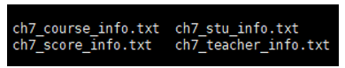
2. 建表语句：
```sql
-- 创建学生表
DROP TABLE IF EXISTS ds_hive.ch7_stu_info;
create table if not exists ds_hive.ch7_stu_info(
    stu_id string COMMENT '学生id',
    stu_name string COMMENT '学生姓名',
    sex string COMMENT '性别'
)
row format delimited fields terminated by ','
stored as textfile
;
 
-- 创建课程表
DROP TABLE IF EXISTS ds_hive.ch7_course_info;
create table if not exists ds_hive.ch7_course_info(
    course_id string COMMENT '课程id',
    course_name string COMMENT '课程名',
    tea_id string COMMENT '任课老师id'
)
row format delimited fields terminated by ','
stored as textfile;
 
-- 创建老师表
DROP TABLE IF EXISTS ds_hive.ch7_teacher_info;
create table if not exists ds_hive.ch7_teacher_info(
    tea_id string COMMENT '老师id',
    tea_name string COMMENT '老师姓名'
)
row format delimited fields terminated by ','
stored as textfile
;
-- 创建分数表
DROP TABLE IF EXISTS ds_hive.ch7_score_info;
create table if not exists ds_hive.ch7_score_info(
    stu_id string COMMENT '学生id',
    course_id string COMMENT '课程id',
    score int COMMENT '成绩'
)
row format delimited fields terminated by ','
stored as textfile
;
```
3. 插入数据
```sql
load data local inpath '/home/hewwen8888/data/ch7_stu_info.txt' overwrite into table ds_hive.ch7_stu_info;
load data local inpath '/home/hewwen8888/data/ch7_course_info.txt' overwrite into table ds_hive.ch7_course_info;
load data local inpath '/home/hewwen8888/data/ch7_teacher_info.txt' overwrite into table ds_hive.ch7_teacher_info;
load data local inpath '/home/hewwen8888/data/ch7_score_info.txt' overwrite into table ds_hive.ch7_score_info;
```

## 7.2 简单查询
1. 检索课程名称为“hadoop”且分数小于60的学生的课程信息，结果按分数降序排列
```sql
select t2.*
       ,t1.score
 from ds_hive.ch7_score_info t1
 
 join  ds_hive.ch7_course_info t2
   on t1.course_id=t2.course_id
where t1.score<60 and t2.course_name='hadoop'
order by t1.score desc
;
```
运行结果：
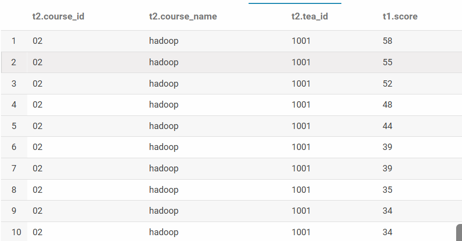
2. 查询hive成绩不及格的学生姓名和其对应的成绩，按照学生id升序排序
```sql
select t1.stu_id
       ,t3.stu_name
       ,t1.score      
 from ds_hive.ch7_score_info t1
 join  ds_hive.ch7_course_info t2
   on t1.course_id=t2.course_id
 join ds_hive.ch7_stu_info t3
    on t1.stu_id=t3.stu_id
where t1.score<60 and t2.course_name='hive'
order  by t1.stu_id
;
```
运行结果：
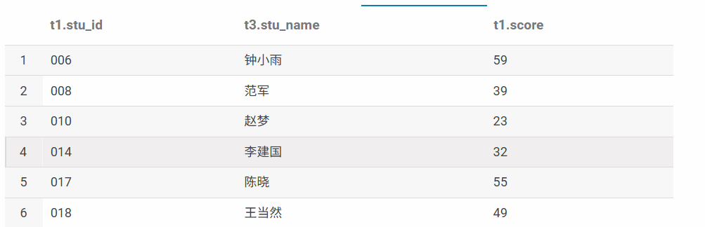
3. 查询学生“小明”的课程的总成绩
```sql
SELECT t1.stu_id
,t2.stu_name
,sum(t1.score) as sum_score
from ds_hive.ch7_score_info t1
join ds_hive.ch7_stu_info t2
on t1.stu_id=t2.stu_id
where t2.stu_name='小明'
group by t1.stu_id,t2.stu_name
;
```
运行结果：
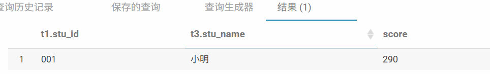
4. 查询各科成绩最高和最低的分，以如下的形式显示：课程号，最高分，最低分
```sql
SELECT t1.course_id
,max(t1.score) as max_score
,min(t1.score) as min_score
from ds_hive.ch7_score_info t1
group by t1.course_id
;
```
运行结果：
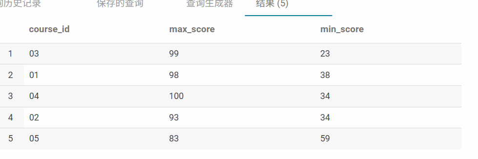
5. 查询男生、女生人数
```sql
SELECT t1.sex
,count(*) as sex_cnt
from ds_hive.ch7_stu_info t1
group by t1.sex
;
```
运行结果：
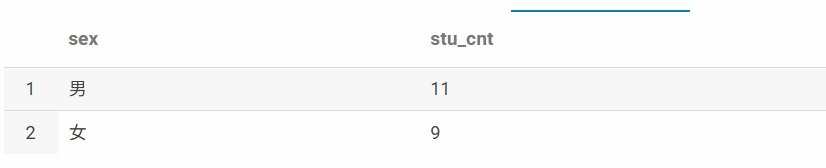
6. 查询平均成绩大于60分的学生的姓名和平均成绩
```sql
SELECT t2.stu_name
,avg(t1.score) as avg_score
from ds_hive.ch7_score_info t1
left join ds_hive.ch7_stu_info t2
on t1.stu_id=t2.stu_id
group by t2.stu_name
having avg_score>=60
;
```
运行结果：
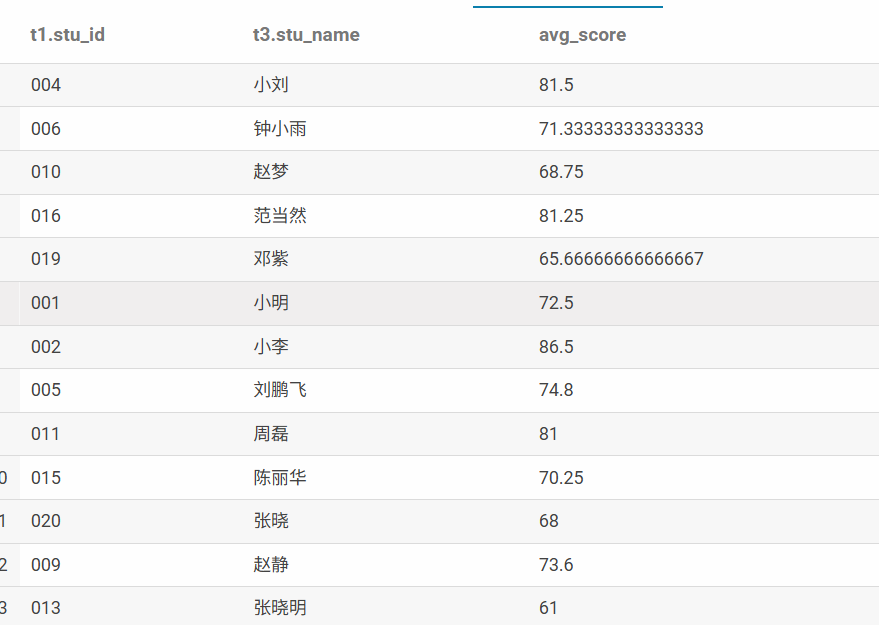
7. [课堂讲解]查询每门课程的平均成绩，结果按平均成绩升序排序，平均成绩相同时，按课程号降序排列
```sql
SELECT t1.course_id
,avg(score) as avg_s
FROM ds_hive.ch7_score_info t1
group by t1.course_id
sort by avg_s asc,t1.course_id desc
;
```
运行结果：
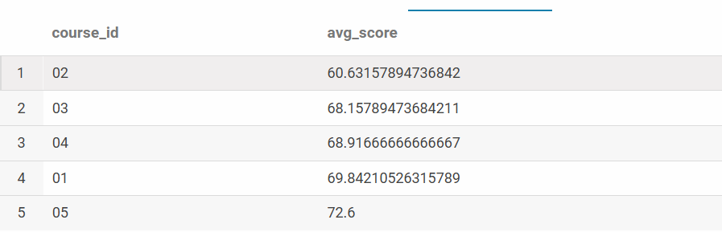
8. 查询学生的总成绩并按照总成绩降序排序
```sql
SELECT t1.stu_id
,sum(t1.score) as sum_score
from ds_hive.ch7_score_info t1
group by t1.stu_id
order by sum_score desc
;
```
运行结果：
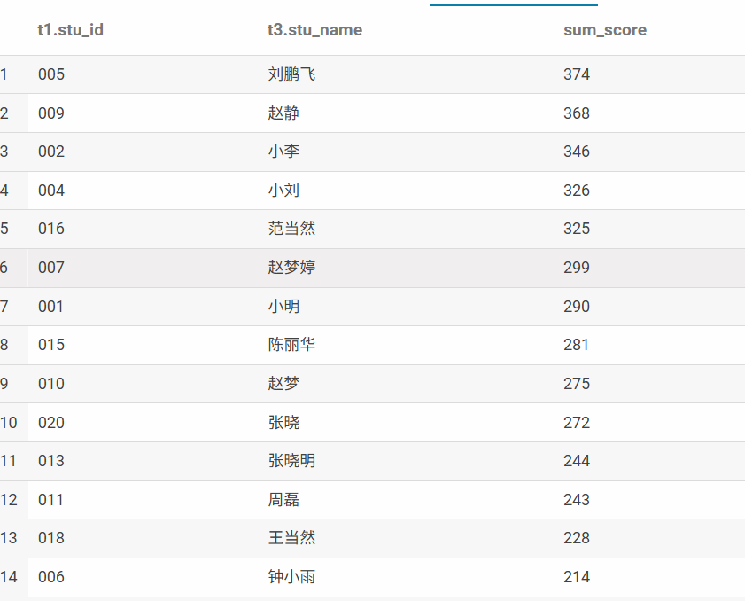
9. 按照如下格式显示学生的hive、spark、hadoop三科成绩和平均成绩，没有成绩的输出为0，按照学生平均成绩降序显示
```
Stu_name	Avg_s	Hive_s	Spark_s	Hadoop_s
001	0	89	78	...
```
分析： 行转列（后续会有专门函数讲解），平均，排序
```sql
select t1.stu_id
       ,t3.stu_name
       ,avg(t1.score)  as avg_score
       ,sum(case when t2.course_name='hive' then t1.score  end)  as f_hive
       ,sum(case when t2.course_name='spark' then t1.score  end)  as f_spark
       ,sum(case when t2.course_name='hadoop' then t1.score  end)  as f_hadoop 
 from ds_hive.ch7_score_info t1
  join  ds_hive.ch7_course_info t2
   on t1.course_id=t2.course_id
 join ds_hive.ch7_stu_info t3
    on t1.stu_id=t3.stu_id
group by t1.stu_id
       ,t3.stu_name
order  by avg_score desc 
;
```
```sql
-- with as 教学喜欢用
with  avg_score_info as(
select  t1.stu_id
       ,t3.stu_name
       ,t1.score
       ,t2.course_name
 from ds_hive.ch7_score_info t1
  join  ds_hive.ch7_course_info t2
   on t1.course_id=t2.course_id
 join ds_hive.ch7_stu_info t3
    on t1.stu_id=t3.stu_id
)
select stu_id,stu_name
      ,avg(score)  as avg_score
       ,sum(case when course_name='hive' then score end)  as f_hive
       ,sum(case when course_name='spark' then score  end)  as f_spark
       ,sum(case when course_name='hadoop' then score  end)  as f_hadoop 
 from avg_score_info
 group by stu_id,stu_name
```
**注释**：<span style="color:red">`with as`就类似于一个视图或临时表，可以用来存储一部分的sql语句作为别名，不同的是`with as`属于一次性的，而且必须要和其他sql一起使用才可以！其最大的好处就是适当的提高代码可读性，而且如果with子句在后面要多次使用到，这可以大大的简化SQL；更重要的是：一次分析，多次使用，这也是为什么会提供性能的地方，达到了“少读”的目标（未进行表缓存）。</span>

运行结果：
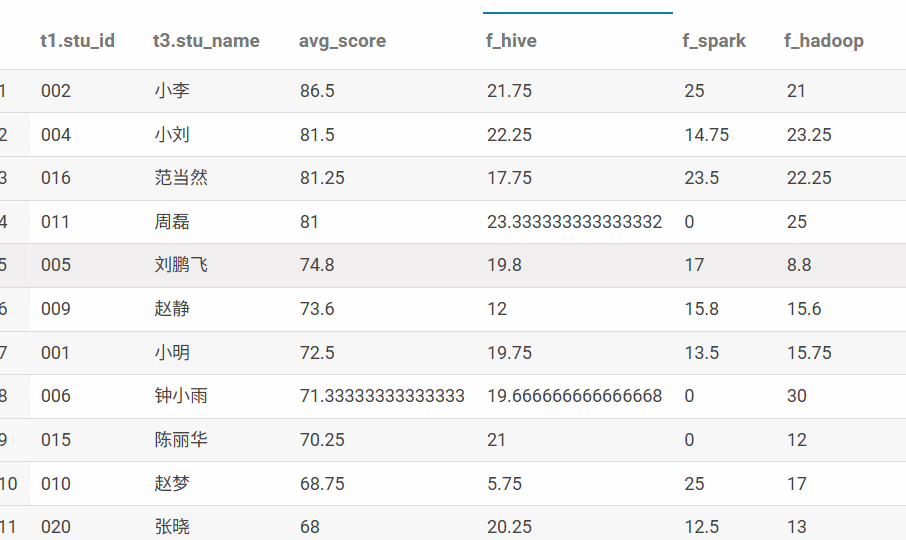
## 7.3 复杂查询
11. 查询一共参加三门课程考试，且其中一门为hive课程的学生的id和姓名
```sql
select t1.stu_id
       ,t3.stu_name
       ,count(course_id)  as course_cnt
 from ds_hive.ch7_score_info t1
  join ds_hive.ch7_stu_info t3
    on t1.stu_id=t3.stu_id
 where  t1.stu_id  in (select  distinct t1.stu_id
                                from ds_hive.ch7_score_info t1
                                join ds_hive.ch7_course_info t3
                                   on t1.course_id=t3.course_id
                                where t3.course_name='hive')
group by t1.stu_id,t3.stu_name
having course_cnt=3
;
```
```sql
-- 或者
with timu11_ch7_stu_info as (
select  distinct t1.stu_id
 from ds_hive.ch7_score_info t1
 join ds_hive.ch7_course_info t3
    on t1.course_id=t3.course_id
 where t3.course_name='hive'
 
)
select t1.stu_id
       ,t3.stu_name
       ,count(course_id)  as course_cnt
 from ds_hive.ch7_score_info t1
  join ds_hive.ch7_stu_info t3
    on t1.stu_id=t3.stu_id
 where  t1.stu_id  in (select stu_id from timu11_ch7_stu_info)
group by t1.stu_id
having course_cnt=3
;
```
运行结果：
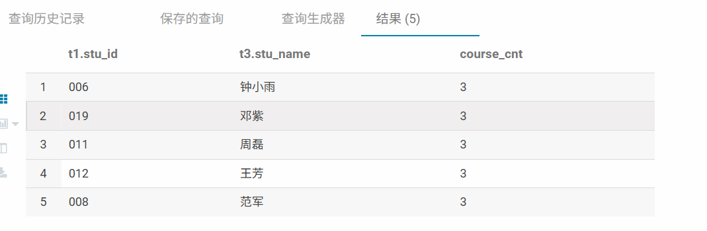
12. 查询所有课程成绩均小于60分的学生的学号、姓名
```sql
SELECT
         t1.stu_id
 ,T3.stu_name
 ,COUNT(CASE WHEN score>=60 THEN  course_id  END)  AS course_CNT --这是一个条件表达式，它会逐个检查成绩（score）：如果score >= 60，则返回课程号（course_id）。否则返回NULL。
 from ds_hive.ch7_score_info t1
  join ds_hive.ch7_stu_info t3
    on t1.stu_id=t3.stu_id
GROUP BY t1.stu_id,T3.stu_name
HAVING course_CNT=0
;
```
运行结果：
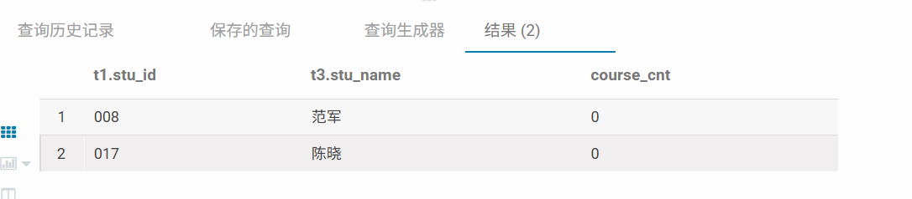
13. [课堂讲解]查询没有学全所有课的学生的学号、姓名
```sql
SELECT
T4.stu_id
,T4.stu_name
FROM
(SELECT
  t1.stu_id
 ,T3.stu_name
 ,COUNT(course_id )  AS course_CNT
 from ds_hive.ch7_score_info t1
  join ds_hive.ch7_stu_info t3
    on t1.stu_id=t3.stu_id
GROUP BY t1.stu_id,T3.stu_name) T4
JOIN(SELECT COUNT(*) course_CNT FROM ds_hive.ch7_course_info) T5
ON 1=1
WHERE T4.course_CNT<>T5.course_CNT -- <>​ 是"不等于"运算符。
;
```
```sql
-- 因为有的学生没学，如果想保留用此sql
SELECT
T4.stu_id
,T4.stu_name
,t4.course_cnt
FROM
(SELECT
  t3.stu_id
 ,T3.stu_name
 ,coalesce(count(t1.course_id),0)  as course_cnt
 from ds_hive.ch7_stu_info  t3
left join ds_hive.ch7_score_info t1
    on t1.stu_id=t3.stu_id
GROUP BY t3.stu_id,T3.stu_name) T4
JOIN(SELECT COUNT(*) course_CNT FROM ds_hive.ch7_course_info) T5
ON 1=1
WHERE T4.course_CNT<>T5.course_CNT -- <>​ 是"不等于"运算符。
;
```
运行结果：
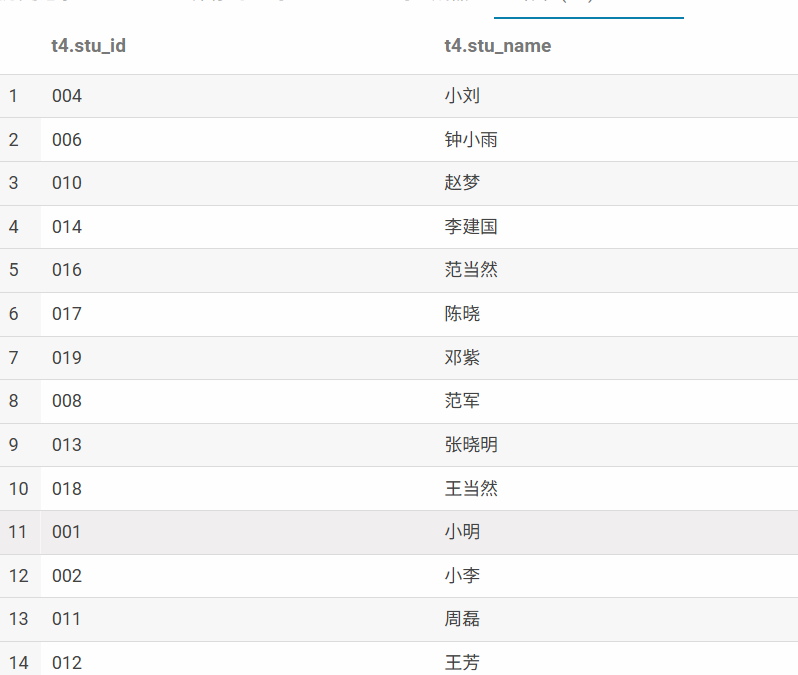
14. 查询有两门以上的课程不及格的同学的学号及其平均成绩
```sql
select stu_id
       ,count(case when score<60 then course_id end) as course_cnt
       ,avg(score)  avg_score
  from ds_hive.ch7_score_info
  group by  stu_id
 having course_cnt>=2
 ;
```
运行结果：
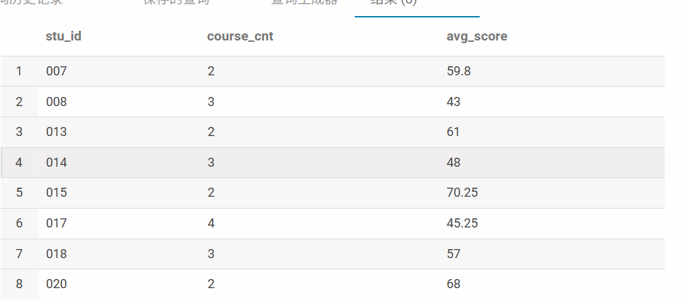
15. 查询出每门课程的及格人数和不及格人数，按课程名称展示
```sql
select  t3.course_name
,t2.pass_cnt
,t2.nopass_cnt
from
(
select t1.course_id
,count(case when t1.score>=60 then stu_id end) as pass_cnt
,count(case when t1.score<60 then stu_id end) as nopass_cnt
from ds_hive.ch7_score_info t1
group by t1.course_id) t2
join ds_hive.ch7_course_info t3
on t2.course_id=t3.course_id
;
```
运行结果：
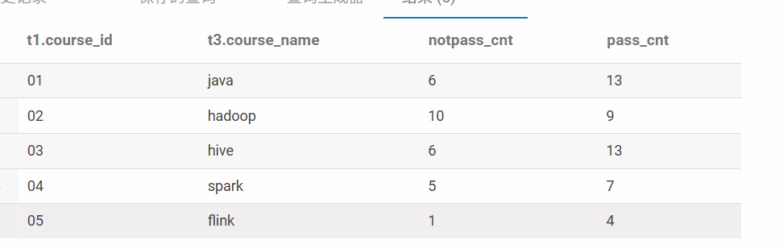
16. 查询所有课程成绩在70分以上的学生的姓名、课程名称和分数，按分数升序排列
```sql
with timu15_score_info_tmp as(
select t2.stu_id
,t2.course_id
,t2.score
from ds_hive.ch7_score_info t2
join(select t1.stu_id
,sum(case when t1.score>=70 then 0 else 1 end) as course_cnt
from ds_hive.ch7_score_info t1
group by t1.stu_id
having course_cnt=0) t3
on t2.stu_id=t3.stu_id
)
 
select t2.stu_name
,t3.course_name
,t1.score
from timu15_score_info_tmp t1
join ds_hive.ch7_stu_info t2
on t1.stu_id=t2.stu_id
join ds_hive.ch7_course_info t3
on t1.course_id=t3.course_id
order by t1.score
;
```
运行结果：
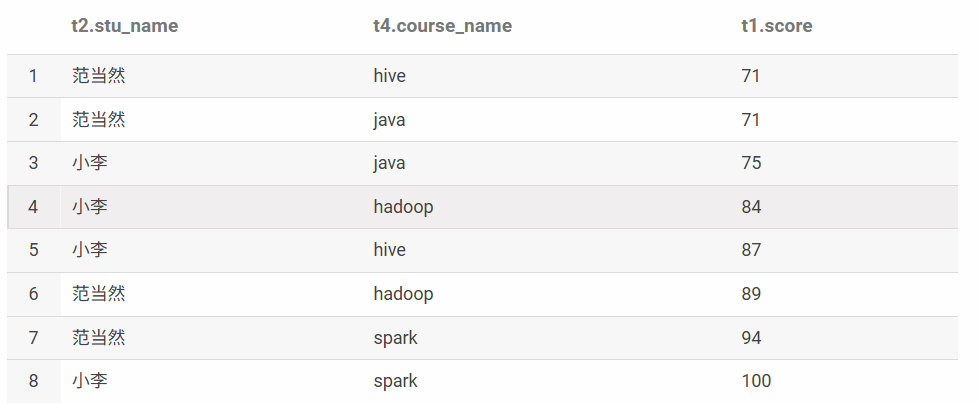
17. 查询学过编号为“01”的课程并且也学过编号为“02”的课程的学生的学号、姓名
```sql
select t2.stu_id
,t3.stu_name
from
(
select t1.stu_id
,count(course_id) as course_cnt
from ds_hive.ch7_score_info t1
where course_id in ('01','02')
group by t1.stu_id
having course_cnt=2) t2
join ds_hive.ch7_stu_info t3
on t2.stu_id=t3.stu_id
;
```
运行结果：
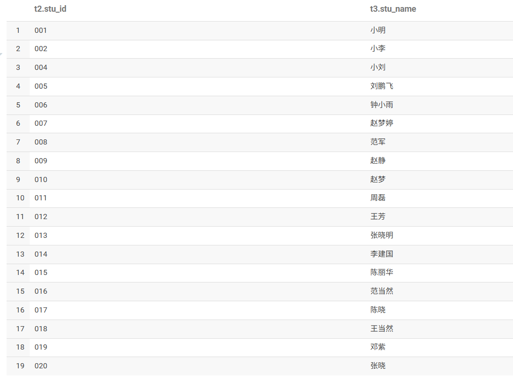
18. 查询学过“1002”老师所教的所有课的同学的学号、姓名
```sql
select
t2.stu_id
,t2.stu_name
from
(select
t1.stu_id
,t3.stu_name,count(t1.course_id) course_cnt
from ds_hive.ch7_score_info t1
join ds_hive.ch7_stu_info t3
on t1.stu_id=t3.stu_id
where t1.course_id in (select course_id from ds_hive.ch7_course_info where tea_id='1002')
group by t1.stu_id
,t3.stu_name
) t2
join (select count(course_id) as course_cnt from ds_hive.ch7_course_info where tea_id='1002') t4
on t2.course_cnt=t4.course_cnt
;
```
运行结果：
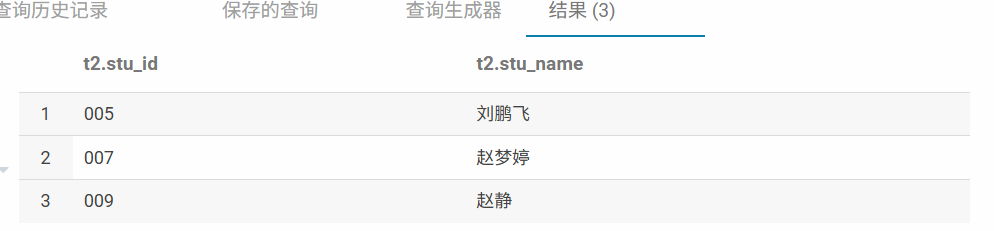
19. 查询至少有一门课与学号为“001”的学生所学课程相同的学生的学号和姓名
```sql
select t1.stu_id
,t2.stu_name
,count(t1.course_id) as c_cnt
from ds_hive.ch7_score_info t1
left join ds_hive.ch7_stu_info t2
on t1.stu_id=t2.stu_id
where t1.course_id in (select distinct course_id from ds_hive.ch7_score_info where stu_id='001')
and t2.stu_id <> '001'
group by t1.stu_id
,t2.stu_name
;
```
运行结果：
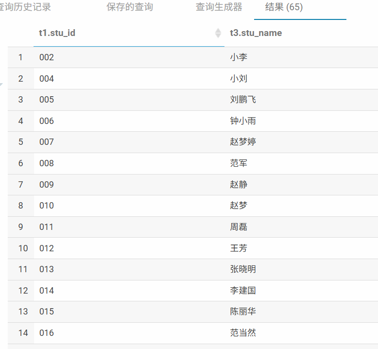
20. 按平均成绩从高到低显示所有学生的所有课程的成绩以及平均成绩
```sql
with timu2_avg_score_tmp as (
select t1.stu_id
,avg(score) as avg_score
from ds_hive.ch7_score_info t1
group by t1.stu_id
)
select t1.stu_id
,t2.stu_name
,t3.course_name
,t4.avg_score
from ds_hive.ch7_score_info t1
join ds_hive.ch7_stu_info t2
on t1.stu_id=t2.stu_id
join ds_hive.ch7_course_info t3
on t1.course_id=t3.course_id
join timu2_avg_score_tmp t4
on t1.stu_id=t4.stu_id
;
```
运行结果：
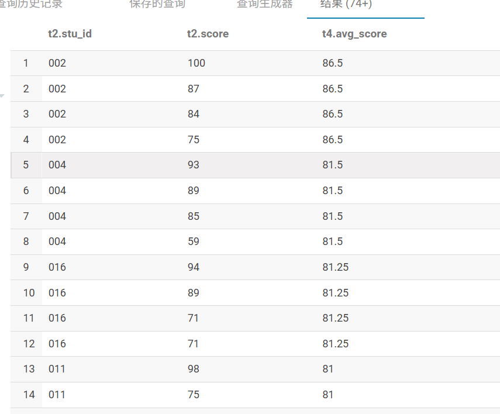