# 8. Hive函数详解

## 8.1 Hive内置函数

### 8.1.1 字符串函数

#### 1) 字符串连接函数：concat
**语法**: concat(string A, string B…)  
**返回值**: string  
**说明**: 返回输入字符串连接后的结果，支持任意个输入字符串  
**举例**:
```sql
hive> select concat('abc','def','gh');
执行结果：abcdefgh
```

#### 2) 带分隔符字符串连接函数：concat_ws
**语法**: concat_ws(string SEP, string A, string B…)  
**返回值**: string  
**说明**: 返回输入字符串连接后的结果，SEP表示各个字符串间的分隔符  
**举例**:
```sql
hive> select concat_ws(',','def','gh');
执行结果：def,gh
```

#### 3) 小数位格式化成字符串函数：format_number
**语法**: format_number(number x, int d)  
**返回值**: string  
**说明**: 将数值的小数位格式化成d位，四舍五入  
**举例**:
```sql
hive> select format_number(5.23456,3);
执行结果：5.235
```

#### 4) 字符串截取函数：substr, substring
**语法**: substr(string A, int start, int long), substring(string A, int start)  
**返回值**: string  
**说明**: 返回字符串A从start位置到结尾的字符串  
**举例**:
```sql
hive> select substr('abcde',3);
执行结果：cde
hive> select substring('abcde',3);
执行结果：cde
hive> select substr('abcde',-1); (和ORACLE相同)
执行结果：e
```

#### 5) 字符串查找函数：instr
**语法**: instr(string str, string substr)  
**返回值**: int  
**说明**: 返回字符串substr在str中首次出现的位置  
**举例**:
```sql
hive> select instr('abcdf','df');
执行结果：4
```

#### 6) 字符串转换成map函数：str_to_map
**语法**: str_to_map(text[, delimiter1, delimiter2])  
**返回值**: map<string,string>  
**说明**: 将字符串按照给定的分隔符转换成map结构  
**举例**:
```sql
hive> select str_to_map('k1:v1,k2:v2',',');
执行结果：{"k2":"v2","k1":"v1"}
```

#### 7) 字符串转大写函数：upper, ucase
**语法**: upper(string A)、ucase(string A)  
**返回值**: string  
**说明**: 返回字符串A的大写格式  
**举例**:
```sql
hive> select upper('abSEd');
执行结果：ABSED
hive> select ucase('abSEd');
执行结果：ABSED
```

#### 8) 字符串转小写函数：lower, lcase
**语法**: lower(string A) lcase(string A)  
**返回值**: string  
**说明**: 返回字符串A的小写格式  
**举例**:
```sql
hive> select lower('abSEd');
执行结果：absed
hive> select lcase('abSEd');
执行结果：absed
```

#### 9) 正则表达式替换函数：regexp_replace
**语法**: regexp_replace(string A, string B, string C)  
**返回值**: string  
**说明**: 将字符串A中的符合java正则表达式B的部分替换为C。<span style="color:red">注意，在有些情况下要使用转义字符，类似oracle中的regexp_replace函数  </span>
**举例**:
```sql
hive> select regexp_replace('foobar','oo|ar','');
执行结果：fb
```

**补充正则表达式的知识：**
正则表达式(regular expression)描述了一种字符串匹配的模式（pattern），可以用来检查一个串是否含有某种子串、将匹配的子串替换或者从某个串中取出符合某个条件的子串等。

例如：
- runoo+b，可以匹配 runoob、runooob、runoooooob 等，+ 号代表前面的字符必须至少出现一次（1次或多次）
- runoo*b，可以匹配 runob、runoob、runoooooob 等，*号代表前面的字符o可以不出现，也可以出现一次或者多次（0次、或1次、或多次）
- colou?r，可以匹配 color 或者 colour，?问号代表前面的字符u最多只可以出现一次（0次、或1次）

更多知识学习可以参考https://www.runoob.com/regexp/regexp-syntax.html

#### 10) 正则表达式解析函数：regexp_extract
**语法**: regexp_extract(string subject, string pattern, int index)  
**返回值**: string  
**说明**: 将字符串subject按照pattern正则表达式的规则拆分，返回index指定的字符。其中index的取值：0是显示与之匹配的整个字符串、1 是显示第一个括号里面的字符串、2 是显示第二个括号里面的字符串  
**举例**:
```sql
hive> select regexp_extract('foothebar','foo(.*?)(bar)',1);
执行结果：the
```

#### 11) 分割字符串函数：split
**语法**: split(string str, string pat)  
**返回值**: array  
**说明**: 按照pat字符串分割str，会返回分割后的字符串数组  
**举例**:
```sql
hive> select split('abtcdtef','t');
执行结果：["ab","cd","ef"]
```
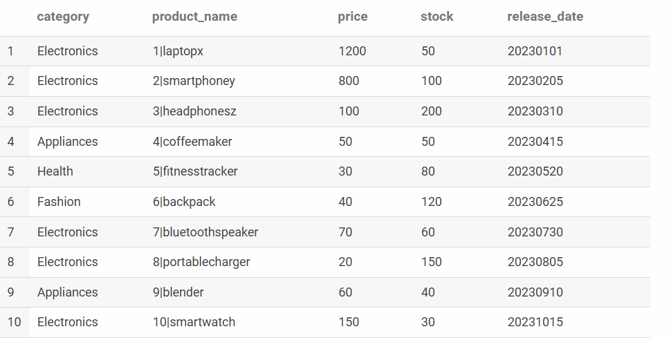
**实战练习：** 根据ds_hive.ch6_t_goods ，展示下列数据：
```sql
select
      category
      ,concat_ws('|',id,lower(product_name)) as product_name
      ,price
      ,stock       
      ,regexp_replace(substr(release_date,1,10),'-','') as release_date  
from ds_hive.ch6_t_goods
;
```

### 8.1.2 日期函数

#### 1) 获取当前UNIX时间函数：unix_timestamp
**语法**: unix_timestamp()  
**返回值**: bigint  
**说明**: 获得当前时区的UNIX时间戳。时间戳是指(从1970-01-0100:00:00UTC到指定时间的秒数)到当前时区的时间格式  
**举例**:
```sql
hive> select unix_timestamp();
执行结果：1323309615
```

#### 2) 日期转UNIX时间函数：unix_timestamp
**语法**: unix_timestamp(string date)  
**返回值**: bigint  
**说明**: 转换格式为"yyyy-MM-ddHH:mm:ss"的日期到UNIX时间戳。如果转化失败，则返回null  
**举例**:
```sql
hive> select unix_timestamp('2011-12-07 13:01:03');
执行结果：1323234063
```

#### 3) 指定格式日期转UNIX时间戳函数：unix_timestamp
**语法**: unix_timestamp(string date, string pattern)  
**返回值**: bigint  
**说明**: 转换pattern格式的日期到UNIX时间戳。如果转化失败，则返回null  
**举例**:
```sql
hive> select unix_timestamp('20111207 13:01:03','yyyyMMdd HH:mm:ss');
执行结果：1323234063
```

#### 4) UNIX时间戳转日期函数：from_unixtime
**语法**: from_unixtime(bigint unixtime[, string format])  
**返回值**: string  
**说明**: 转化UNIX时间戳  
**举例**:
```sql
hive> select from_unixtime(1323337489,'yyyyMMdd');
执行结果：20111208
```

#### 5) 日期时间转日期函数：to_date
**语法**: to_date(string timestamp)  
**返回值**: string  
**说明**: 返回日期时间字段中的日期部分  
**举例**:
```sql
hive> select to_date('2021-12-23 10:03:01');
执行结果：2021-12-23
```

#### 6) 日期转年数：year
**语法**: year(string date)  
**返回值**: int  
**说明**: 返回日期中的年  
**举例**:
```sql
hive> select year('2021-12-08 10:03:01');
hive> select year('2012-12-08');
执行结果：2021
执行结果：2012
```

#### 7) 日期转月函数：month
**语法**: month(string date)  
**返回值**: int  
**说明**: 返回日期中的月份  
**举例**:
```sql
hive> select month('2011-12-08 10:03:01');
hive> select month('2011-08-08');
执行结果：12
执行结果：8
```

#### 8) 日期转天函数：day
**语法**: day(string date)  
**返回值**: int  
**说明**: 返回日期中的天  
**举例**:
```sql
hive> select day('2021-12-08 10:03:01');
执行结果：8
```

#### 9) 日期转小时函数：hour
**语法**: hour(string date)  
**返回值**: int  
**说明**: 返回日期中的小时  
**举例**:
```sql
hive> select hour('2021-12-08 10:03:01');
执行结果：10
```

#### 10) 日期转分钟函数：minute
**语法**: minute(string date)  
**返回值**: int  
**说明**: 返回日期中的分钟  
**举例**:
```sql
hive> select minute('2021-12-08 10:03:01');
执行结果：3
```

#### 11) 日期转秒函数：second
**语法**: second(string date)  
**返回值**: int  
**说明**: 返回日期中的秒  
**举例**:
```sql
hive> select second('2021-12-08 10:03:01');
执行结果：1
```

#### 12) 日期转周函数：weekofyear
**语法**: weekofyear(string date)  
**返回值**: int  
**说明**: 返回日期在当前的周数  
**举例**:
```sql
hive> select weekofyear('2021-12-08 10:03:01');
执行结果：49
```

#### 13) 日期比较数：datediff
**语法**: datediff(string enddate, string startdate)  
**返回值**: int  
**说明**: 返回<span style="color:red">结束日期减去开始日期的天数</span>
**举例**:
```sql
hive> select datediff('2021-12-08','2021-12-01');
执行结果：7
```

#### 14) 日期增加函数：date_add
**语法**: date_add(string startdate, int days)  
**返回值**: string  
**说明**: 返回开始日期startdate增加days天后的日期  
**举例**:
```sql
hive> select date_add('2021-12-08',10);
执行结果：2021-12-18
```

#### 15) 日期减少函数：date_sub
**语法**: date_sub(string startdate, int days)  
**返回值**: string  
**说明**: 返回开始日期startdate减少days天后的日期  
**举例**:
```sql
hive> select date_sub('2021-12-08',10);
执行结果：2012-11-28
```

#### 16) 当前时间日期函数：current_date
**语法**: current_date()  
**返回值**: date  
**说明**: 返回当前时间日期  
**举例**:
```sql
hive> select current_date;
2022-01-06
```

#### 17) 当前时间日期函数：current_timestamp
**语法**: current_timestamp()  
**返回值**: timestamp  
**说明**: 返回当前时间戳  
**举例**:
```sql
hive> select current_timestamp();
2022-01-06 22：52：11.309
```

#### 18) 月份增加函数：add_months
**语法**: add_months(string start_date, int num_months)  
**返回值**: string  
**说明**: 返回当前时间下再增加num_months个月的日期  
**举例**:
```sql
hive> select add_months('1996-10-21',10);
1997-08-21
```

#### 19) 最后一天的日期函数：last_day
**语法**: last_day(string date)  
**返回值**: string  
**说明**: 返回这个月的最后一天的日期，忽略时分秒部分（HH：mm：ss）  
**举例**:
```sql
hive> select last_day(current_date());
2024-07-31
```

### 8.1.3 条件函数

#### 1) If函数：if
**语法**: if(boolean testCondition, T valueTrue, T valueFalseOrNull)  
**返回值**: T  
**说明**: 当条件testCondition为TRUE时，返回valueTrue；否则返回valueFalseOrNull  
**举例**:
```sql
hive> select if(1=2,100,200);
hive> select if(1=1,100,200);
执行结果：200
执行结果：100
```

#### 2) 非空查找函数：COALESCE
**语法**: COALESCE(T v1, T v2，…)  
**返回值**: T  
**说明**: 返回参数中的第一个非空值；如果所有值都为NULL，那么返回NULL  
**举例**:
```sql
hive> select COALESCE(null,'100',50);
执行结果：100
```

#### 3) 条件判断函数：CASE
**语法**: 
```
CASE a 
    WHEN b THEN c
    [WHEN d THEN e]*
    [ELSE f] 
END
```
**返回值**: T  
**说明**: 如果a等于b，那么返回c；如果a等于d，那么返回e；否则返回f  
**举例**:
```sql
hive> Select case 100 when 50 then 'tom' when 100 then 'mary' else 'tim' end;
hive> Select case 200 when 50 then 'tom' when 100 then 'mary' else 'tim' end;
执行结果：mary
执行结果：tim
```

**实战练习：** ds_hive.ch5_sz_t_user，统计男生人数、统计女生人数：
```
489	438
---------------------------------------------
select sum(if(gender=0,1,0)) as f_cnt
      ,sum(if(gender=1,1,0)) as f_cnt
from ds_hive.ch5_sz_t_user
-------------------------------------------------
select case when gender=0 then 'nan'
            when gender=1 then 'nv'
            else '其他' end as sex
      ,count(user_id) as user_cnt
from ds_hive.ch5_sz_t_user
group by gender
;
```

### 8.1.4 数学函数

#### 1) 取整函数：round
**语法**: round(double a)  
**返回值**: BIGINT  
**说明**: 返回double类型的整数值部分(遵循四舍五入)  
**举例**:
```sql
hive> select round(3.1415926);
hive> select round(3.5);
执行结果：3
执行结果：4
```

#### 2) 指定精度取整函数：round
**语法**: round(double a, int d)  
**返回值**: DOUBLE  
**说明**: 返回指定精度d的double类型  
**举例**:
```sql
hive> select round(3.1415926,4);
执行结果：3.1416
```

#### 3) 绝对值数：abs
**语法**: abs(double a) abs(int a)  
**返回值**: double int  
**说明**: 返回数值a的绝对值  
**举例**:
```sql
hive> select abs(-3.9);
hive> select abs(11.9);
执行结果：3.9
执行结果：11.9
```

#### 4) positive函数：positive(直接返回原值，相当于‘+’)
**语法**: positive(int a), positive(double a)  
**返回值**: int double  
**说明**: 返回a  
**举例**:
```sql
hive> select positive(-10);
hive> select positive(12);
执行结果：-10
执行结果：12
```

#### 5) negative函数：negative
**语法**: negative(int a), negative(double a)  
**返回值**: int double  
**说明**: 返回-a  
**举例**:
```sql
hive> select negative(-5);
hive> select negative(8);
执行结果：5
执行结果：-8
```

### 8.1.5 集合函数

#### 1) map类型大小：size
**语法**: size(Map<K.V>)  
**返回值**: int  
**说明**: 返回map类型的size  
**举例**:
```sql
hive> select size(map('k1','v1','k2','v2'));
执行结果：2
```

#### 2) array类型大小：size
**语法**: size(Array<T>)  
**返回值**: int  
**说明**: 返回array类型的size  
**举例**:
```sql
hive> select size(array(1,2,3,4,5));
执行结果：5
```

#### 3) 判断数组是否包含元素：array_contains
**语法**: array_contains(Array<T>, value)  
**返回值**: boolean  
**说明**: 返回Array<T>中是否包含元素value  
**举例**:
```sql
hive> select array_contains(array(1,2,3,4,5),3);
执行结果：true
```

#### 4) 获取map中所有value集合
**语法**: map_values(Map<K,V>)  
**返回值**: array<V>  
**说明**: 返回Map<K,V>中所有value的集合  
**举例**:
```sql
hive> select map_values(map('k1','v1','k2','v2'));
执行结果：["v2","v1"]
```

### 8.1.6 综合应用
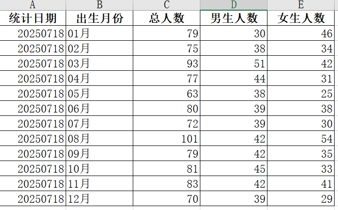
**实战练习：** ds_hive.ch5_sz_t_user，展示如下报表，统计每个出生月份（没有出生月份统一按12月份处理）的总人数、男生人数、女生人数

展示如下：统计日期、出生月份、总人数、男生人数、女生人数；

```sql
select regexp_replace(current_date,'-','') as data_dt
      ,concat(coalesce(substr(birthday,5,2),12),'月') as mon
      ,count(user_id) as all_cnt
      ,count(case when gender=0 then user_id end) as f_cnt
      ,count(case when gender=1 then user_id end) as m_cnt
from ds_hive.ch5_sz_t_user
group by concat(coalesce(substr(birthday,5,2),12),'月')
;
```

## 8.2 行列互转（☆☆☆掌握）

行转列是指多行数据转换为一个列的字段。列转行是指某一个字段转换成多行显示。分别对应：

### 8.2.1 列转行（炸裂函数）

简单地说就是把一行变成多行，一边多的依据是将其中一个单元格分割多分，然后其他列的数据重复多份。涉及函数：
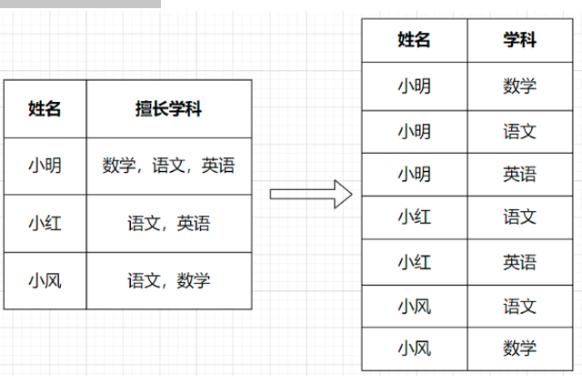
#### 1) explode和posexplode
<span style="color:red">explode和posexplode是Hive中两个常用且强大的函数，它们用于处理复杂数据类型的时候有着不可替代的作用。</span>Explode函数是Hive中一个有着魔术般的函数，它可以将array或者map复杂数据类型的列进行展开。实际上，explode函数一般会配合着Lateral view使用，这个我们后面再介绍。

**建表：**
```sql
-----------建表
create table ds_hive.ch8_stu_score(
 stu_id  string
,sub_ids array<string>
,scores  array<string>
)
stored as orc
;               
-----插入数据
insert overwrite table ds_hive.ch8_stu_score
select 1001,array('语文', '数学', '英语'),array('90','88','79')
union all
select 1002,array('语文', '地理'),array('54','97')
union all
select 1003,array(null,null),array(null,null)
;
```

基于上面的数据，我们用explode函数对学生科目列进行展开，具体sql：
```sql
select explode(sub_ids) as sub_id from ds_hive.ch8_stu_score;
```
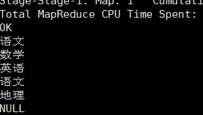
<span style="color:red">Posexplode函数除了和explode函数一样能够展开array或map类型的列，还能同时返回展开元素的位置（即索引）。</span>我们再用array_table表作为例子，这次用posexplode：
```sql
select posexplode(sub_ids) as (itemIndex, item) from ds_hive.ch8_stu_score;
```
运行结果：
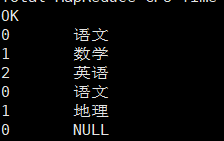
<mark>这里需要注意，explode函数只能直接查询，不能增加其他列，如果想要增加其他的列内容，需要配合lateral view [outer] 使用。</mark>
```sql
select stu_id,explode(sub_ids) as sub_id from ds_hive.ch8_stu_score;
```
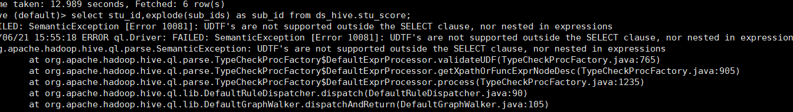
#### 2) Lateral View
上述我们已经提到了Lateral View，Lateral View的用法，这两者是在处理数据时经常遇到的操作。那么它们到底是什么呢？它们一般会配合着表生成函数（如explode）一起使用，对array或者map类型的列进行展开。<span style="color:red">Hive的lateral view是用来连接生成虚拟表的</span>。explode函数只能直接查询，不能增加其他列，所以这里满足我们上述例子讲的例子，结合Lateral View一起使用：

<span style="color:red">LATERAL VIEW explode(数组字段) 虚拟表别名 AS 列别名</span>
```sql
select
stu_id
,tmp_table.sub_id
from ds_hive.ch8_stu_score
lateral view explode(sub_ids) tmp_table as sub_id;
```
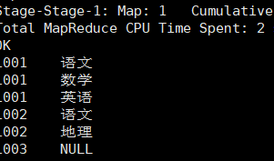
#### 3) 综合实战
在上述的数据表里，我们交代了三个字段，学生id、科目和成绩，需求：求出每一个学生的每一科成绩，按行展现。

<span style="color:red">我们使用两次lateral view explode，可以计算出两列的笛卡尔积</span>，SQL如下：
```sql
select
stu_id
,tmp_table.sub_id
,tmp_table.score
from ds_hive.ch8_stu_score
lateral view explode(sub_ids) tmp_table as sub_id
lateral view explode(scores) tmp_table as score
;
```
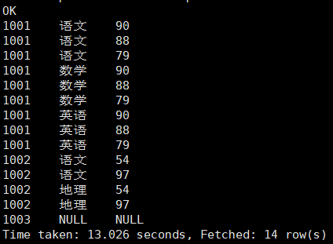
根据上面我们可以观察到：sub_id列和score两列进行了笛卡尔积计算，如果是我们需要笛卡尔积的时候，可以这样完成。但是，<span style="color:red">这个并不是我们想要的结果，我们需要的是一一对应的关系，如果我们的sub_ids和scores是有对应关系的，即 sub_ids中的语文对应scores中的0，数学对应8，英语对应79，我们就需要有对应的关系，这个时候我们就有思路了，我们前面介绍过posexplode，可以拿出他们各自的序列，那我们就拿出各自的序列，限定sub_idx和sc_idx 相等，得到我们想要的结果</span>，具体代码实现：
```sql
select
stu_id
,sub_id
,score
from ds_hive.ch8_stu_score
lateral view posexplode(sub_ids) tmp_sub as sub_idx,sub_id
lateral view posexplode(scores) tmp_sc as sc_idx,score
where sub_idx=sc_idx
;
```
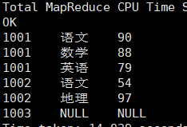
### 8.2.2 行转列：多进一出（多行传入，一个行输出）
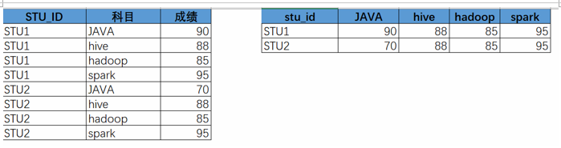
Hive行转列用到的函数：

- **collect_list(col)** -- 函数介绍：<span style="color:red">收集并返回一个非唯一元素的列表</span>，该函数是非确定性的，因为收集结果的顺序取决于行的顺序，这在经过shuffle之后可能是不确定的。
- **collect_set** 函数介绍：<span style="color:red">收集并返回一个唯一元素的集合</span>。该函数是非确定性的，因为收集结果的顺序取决于行的顺序，这在经过shuffle之后可能是不确定的。
- **sort_array** 介绍：根据数组元素的自然顺序，将输入数组排序为升序或降序。对于double/float类型，NaN值大于任何非NaN元素。在升序排序中，空元素将被放置在返回数组的开头；在降序排序中，空元素将被放置在返回数组的末尾。
- **concat_ws(sep, str1,str2)** -- 它是一个特殊形式的 CONCAT()。第一个参数是剩余参数间的分隔符。

**建表：**
```sql
create table ds_hive.ch8_stu_score_01
as
select
stu_id
,sub_id
,score
from ds_hive.ch8_stu_score
lateral view posexplode(sub_ids) tmp_sub as sub_idx,sub_id
lateral view posexplode(scores) tmp_sc as sc_idx,score
where sub_idx=sc_idx
;
插入重复数据，将表ch8_stu_score中的数据完全重复一份
insert into table ds_hive.ch8_stu_score_01
select
stu_id
,sub_id
,score
from ds_hive.ch8_stu_score
lateral view posexplode(sub_ids) tmp_sub as sub_idx,sub_id
lateral view posexplode(scores) tmp_sc as sc_idx,score
where sub_idx=sc_idx
;
```
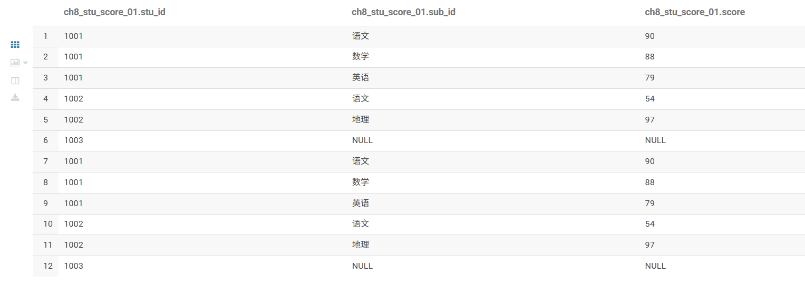
#### 1) 直接行转列
统计性别的用户姓名，结果去重
```sql
select
     stu_id
     ,collect_list(sub_id)  as  sub_ids1    
     ,collect_set(sub_id)  as  sub_ids2
     ,sort_array(collect_set(sub_id))      as  sub_ids3  --中文字符按照Unicode编码排序
     ,concat_ws(',',collect_set(sub_id))  as sub_ids4
from ds_hive.ch8_stu_score_01
group by stu_id
;
结果：
```
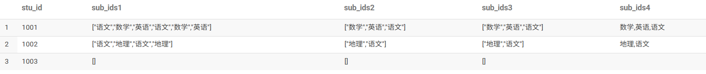
#### 2) 使用 case when 
原始数据中是一个竖表，每个学生的每个学科一行数据，对其转换成一张横表，即表中学生id为主键，包含语文、数学、英语三列，列值为对应学科分数。
```sql
select stu_id,
sum(case when sub_id = '语文' then score end) as yuwen,
sum(case when sub_id = '数学' then score end) as shuxue,
sum(case when sub_id = '英语' then score end) as yingyu
from ds_hive.ch8_stu_score_01
group by stu_id
;
```
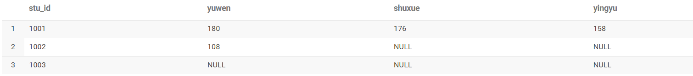

## 8.3 窗口函数(☆☆☆重中之重)

### 8.3.1 窗口函数介绍

**【函数定义】**：<span style="color:red">如果函数具有over()子句，都是窗口函数，窗口函数又名开窗函数，是指在指定的数据滑动窗口中，实现各种统计分析的操作。</span>属于分析函数的一种，用于解决复杂报表统计需求的功能强大的函数。窗口函数用来计算基于组的某种聚合值，它和聚合函数的不同之处是：<span style="color:red">窗口函数对于每个组返回多行，而聚合函数对于每个组只返回一行。</span>
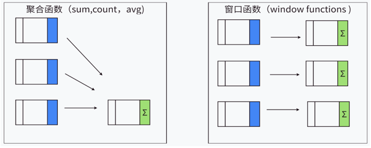
窗口函数是与分析函数一起使用，或按照专用窗口函数使用，比如：窗口聚合函数、窗口排序函数等实用函数。

常用的分析函数：sum()、max()、min()、avg()、count()、......

专用窗口函数：row_number()、rank()、dense_rank()......

### 8.3.2 窗口函数表达式

具体使用语法如下：

**分析函数/专用窗口函数 over(partition by 列名 order by 列名 rows between 开始位置 and 结束位置)**

窗口函数的3个组成部分可以单独使用，也可以混合使用，也可以全都不用，下面是三部分的详细解释。

#### 1) partition by 字段(窗口分区)
<span style="color:red">是对指定的字段进行分组，后续都会以组为单位，把每个分组单独作为一个窗口进行统计分析操作。</span>划分的范围被称为窗口，这也是窗口函数的由来。则整个结果集将作为单个窗口分区；如果没有 ORDER BY，我们则无法定义窗口帧，进而整个分区将作为单个窗口帧进行处理。

#### 2) order by 字段
大家都知道order by 是排序字段，(这里多说一句四个 by的区别理解了吗？)他用在窗口函数里会有不一样的效果

**情景一：** order by 与 partition by 连用的时候，可以对各个分组内的数据，按照指定的字段进行排序。如果没有 partition by 指定分组字段，那么会对全局的数据进行排序。

**情景二：**
当为聚合函数，如max，min，count等时，over中的order by不仅起到窗口内排序，还起到窗口内从当前行到之前所有行的聚合（多了一个范围）。
```sql
select 
         order_id
        ,user_id
        ,user_name
        ,order_date
        ,order_amount
        ,row_number() over(partition by user_id  order by order_amount desc)    as rn
   from ds_hive.ch8_t_order
;
```
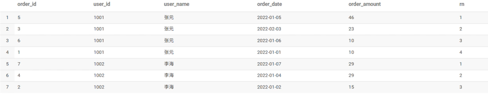
#### 3) rows|range between 开始位置 and 结束位置(窗口帧)
<span style="color:red">窗口帧用于从分区中选择指定的多条记录，供窗口函数处理</span>。Hive 提供了两种定义窗口帧的形式：ROWS 和 RANGE。两种类型都需要配置上界和下界。例如：ROWS BETWEEN UNBOUNDED PRECEDING AND CURRENT ROW 表示选择分区起始记录到当前记录的所有行。

**rows between 常用的参数如下：**
① n preceding：往前
② n following：往后
③ current row：当前行
④ unbounded：起点（一般结合preceding，following使用）
   unbounded preceding：表示该窗口最前面的行（起点）
   unbounded following：表示该窗口最后面的行（终点）

这些参数需要好好记忆，使用例子如下：
- rows between unbounded preceding and current row（表示从起点到当前行的数据进行）
- rows between current row and unbounded following（表示当前行到终点的数据进行）
- rows between unbounded preceding and unbounded following （表示起点到终点的数据）

```sql
select 
         order_id
        ,user_id
        ,user_name
        ,order_date
        ,order_amount
        ,sum(order_amount) over(partition by user_id  order by order_amount range between unbounded preceding and current row)    as rn
   from ds_hive.ch8_t_order
;
```

**必须知道：** 三个关键字都可以省略不写，partition by 省略不写，表示不分区。order by 省略不写，表示不排序。rows|range between 开始位置 and 结束位置(窗口帧)，则使用默认值，默认值如下：
over（）里包含order by ，<span style="color:red">默认值为：range between unbounded preceding and current row（表示起点到终点的数据）。</span>

**窗口函数：** 窗口函数会基于当前窗口帧的记录计算结果。Hive 提供了以下窗口函数：
- <span style="color:red">NTILE(n)</span>，用于将分组数据按照顺序切分成n片，返回当前切片值；
- ROW_NUMBER()、RANK() 会为帧内的每一行返回一个序数，区别在于存在字段值相等的记录时，RANK() 会返回相同的序数；
- LEAD(col, n), LAG(col, n) 返回当前记录的上n条或下n条记录的字段值；
- FIRST_VALUE(col), LAST_VALUE(col) 可以返回窗口帧中第一条或最后一条记录的指定字段值；
- COUNT(), SUM(col), MIN(col) 和一般的聚合操作相同。

### 8.3.3 窗口函数分类

#### 1) 数据准备
```sql
hive (default)>
create table ds_hive.ch8_t_order
(
    order_id     string, --订单id
    user_id      string, -- 用户id
    user_name    string, -- 用户姓名
    order_date   string, -- 下单日期
    order_amount int     -- 订单金额
)
row format delimited fields terminated by '\t'
stored as textfile
;

2）装载语句
load data local inpath "/home/hewwen8888/data/ch8_t_order.txt"  overwrite into table ds_hive.ch8_t_order;
```

#### 2) 排序窗口函数
##### a) ROW_NUMBER函数操作
【函数说明】<span style="color:red">ROW_NUMBER()从1开始，按照顺序，生成分组内记录的序列。</span>

比如，按照pv降序排列，生成分组内每天的pv名次。ROW_NUMBER() 的应用场景非常多，再比如，获取分组内排序第一的记录。

【执行脚本】：
```sql
------统计每个用户的订单金额排序
SELECT  
order_id, 
user_id, 
user_name,
order_date, 
order_amount,
ROW_NUMBER() OVER(PARTITION BY user_id ORDER BY order_amount desc) AS rnk  
FROM ds_hive.ch8_t_order
;
```
【执行结果】：
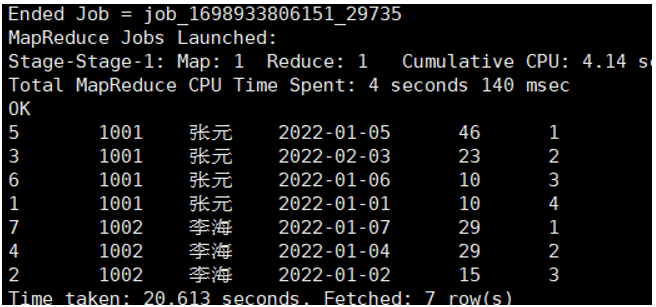

##### b) RANK和DENSE_RANK函数操作
【函数说明】：
- RANK() 生成数据项在分组中的排名，排名相等会在名次中留下空位
- DENSE_RANK() 生成数据项在分组中的排名，排名相等会在名次中不会留下空位

【执行脚本】：
```sql
SELECT  
order_id, 
user_id, 
user_name,
order_date, 
order_amount,
RANK() OVER(PARTITION BY user_id ORDER BY order_amount desc) AS rnk1,
DENSE_RANK() OVER(PARTITION BY user_id ORDER BY order_amount desc) AS rnk2,
ROW_NUMBER() OVER(PARTITION BY user_id ORDER BY order_amount desc) AS rnk3 
FROM ds_hive.ch8_t_order
;
```
【执行结果】：
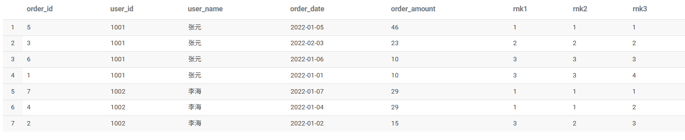

#### 3) 聚合窗口函数
count 统计条数,sum 求和,avg 求平均值,max 求最大值,min 求最小值这类的聚合函数的聚合效果都是在窗口内，并且是默认计算第一行到当前行。

##### a) sum() over()
<span style="color:red">求窗口中的累计值：我们可以使用：sum() over()</span>

案例：统计每个用户截至每次下单的累积下单总额
```sql
SELECT  
order_id, 
user_id, 
user_name,
order_date, 
order_amount,
sum(order_amount) over(partition by user_id order by order_date rows between unbounded preceding and current row) as sum_so_far
FROM ds_hive.ch8_t_order
;
```
【执行结果】：
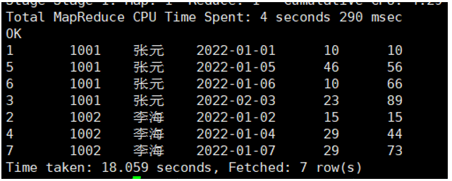

##### b) avg() over()
<span style="color:red">求窗口中的平均值：我们可以使用：sum() over()</span>

案例：统计每个用户截至每次下单的平均下单总额
```sql
SELECT  
order_id, 
user_id, 
user_name,
order_date, 
order_amount,
avg(order_amount) over(partition by user_id order by order_date rows between unbounded preceding and current row) as sum_so_far
FROM ds_hive.ch8_t_order
;
```
【执行结果】：
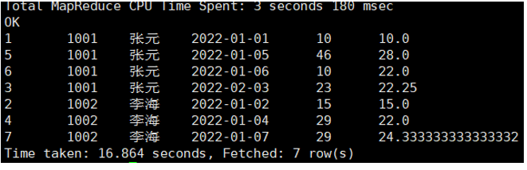

##### c) Min、max() over()
案例：统计每个用户截至每次下单的最大单额、最小单额
```sql
SELECT  
order_id, 
user_id, 
user_name,
order_date, 
order_amount,
min(order_amount) over(partition by user_id order by order_date rows between unbounded preceding and current row)  as min_so_far,
max(order_amount) over(partition by user_id order by order_date rows between unbounded preceding and current row)  as max_so_far
FROM ds_hive.ch8_t_order;
```
【执行结果】：
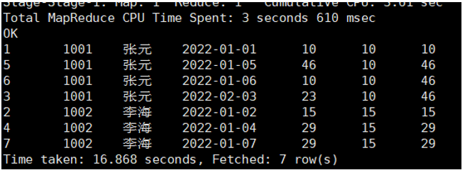

##### d) count() over()
案例：统计每个用户截至每次下单的订单数
```sql
SELECT  
user_id, 
user_name,
order_date, 
order_amount,
count(order_id) over(partition by user_id order by order_date rows between unbounded preceding and current row) as sum_so_far
FROM ds_hive.ch8_t_order
;
```
【执行结果】：
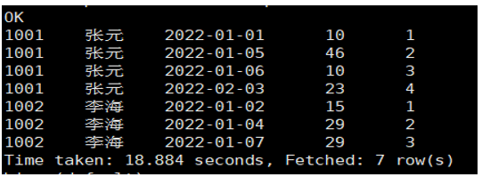

#### 4) 位移窗口函数
##### a) LAG函数操作
<span style="color:red">【函数说明】：LAG(col,n,DEFAULT) 用于统计窗口内往上第n行值</span>

第一个参数为列名，第二个参数为往上第n行（可选，默认为1），第三个参数为默认值（当往上第n行为NULL时候，取默认值，如不指定，则为NULL）。

案例：统计每个用户每次下单距离上次下单相隔的天数（首次下单按0天算）

【执行脚本】：
```sql
select
    order_id,
    user_id,
    user_name,
    order_date,
    order_amount,
    nvl(datediff(order_date,last_order_date),0) diff --nvl()函数：如果 datediff()返回 NULL（比如某个日期为 NULL），则用0替代
from(  select
        order_id,
        user_id,
        user_name,
        order_date,
        order_amount,
        lag(order_date,1,null) over(partition by user_id order by order_date) as last_order_date
    from ds_hive.ch8_t_order
)t1
;
```
【执行结果】：
t1表结果
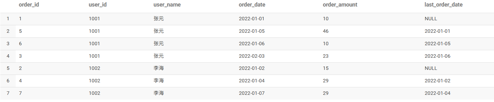
最终结果
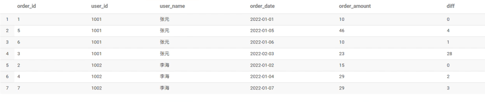

##### b) LEAD函数操作
<span style="color:red">【函数说明】：与LAG相反，LEAD(col,n,DEFAULT) 用于统计窗口内往下第n行值</span>

第一个参数为列名，第二个参数为往下第n行（可选，默认为1），第三个参数为默认值（当往下第n行为NULL时候，取默认值，如不指定，则为NULL）。

```sql
select 
         order_id
        ,user_id
        ,user_name
        ,order_date
        ,order_amount
        ,lag(order_amount,1,0) over(partition by user_id  order by order_date desc)    as rn
        ,lead(order_amount,1,0) over(partition by user_id  order by order_date desc)    as rn
   from ds_hive.ch8_t_order
 ;
```
运行结果：
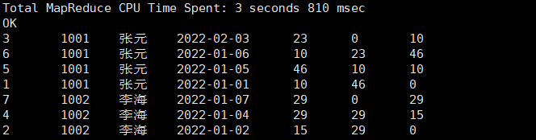

#### 5) 极值窗口函数
##### a) FIRST_VALUE函数操作
<span style="color:red">【函数说明】：取分组内排序后，截止到当前行，第一个值</span>

##### b) LAST_VALUE函数操作
<span style="color:red">【函数说明】：取分组内排序后，截止到当前行，最后一个值</span>

案例：查询所有下单记录以及每个下单记录所在月份的首/末次下单日期。

【执行脚本】：
```sql
select
    order_id,
    user_id,
    user_name,
    order_date,
    order_amount,
    first_value(order_date) over(partition by user_id,substr(order_date,1,7) order by order_date) first_date,
    last_value(order_date) over(partition by user_id,substr(order_date,1,7) order by order_date rows between unbounded preceding and unbounded following) last_date
from ds_hive.ch8_t_order
;
```
【执行结果】：
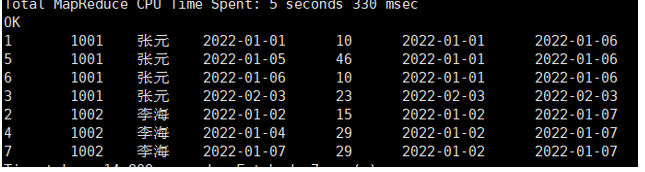

#### 6) 分箱窗口函数
##### NTILE函数操作
【函数说明】：NTILE(n)，用于将分组数据按照顺序切分成n片，返回当前切片值

<span style="color:red">NTILE不支持ROWS BETWEEN</span>，比如 

```sql
NTILE(2) OVER(PARTITION BY cookieid ORDER BY createtime ROWS BETWEEN 3 PRECEDING AND CURRENT ROW)
```

如果切片不均匀，默认增加第一个切片的分布

一般用来求百分比的操作，比如求前20%，就可以分5个箱。

需求案例：统计一个每个用户，金额最多的前1/3的订单

【执行脚本】：
```sql
SELECT  
t1.order_id,
t1.user_id,
t1.user_name,
t1.order_date,
t1.order_amount
from(
      SELECT  
      order_id,
      user_id,
      user_name,
      order_date,
      order_amount,
      NTILE(3) OVER(PARTITION BY user_id ORDER BY order_amount DESC) AS rnk  
      FROM ds_hive.ch8_t_order
) t1
where t1.rnk=1;
```
【执行结果】：
t1表结果
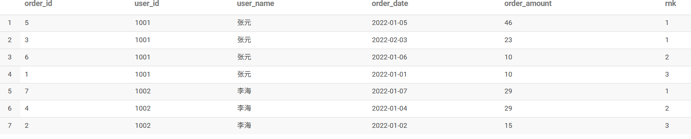
最终结果
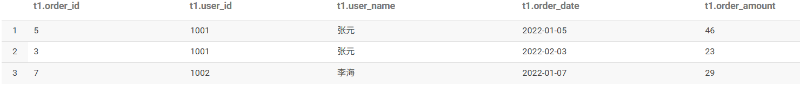

### 8.3.4 窗口函数实战

#### 1) TopN问题
TopN问题在中大厂的笔试面试中出现频率非常高，要求所有人都要掌握！TopN问题是指从数据表中查询出前N个最大或最小的数据记录，这种问题在大数据业务分析中非常常见，例如查询热门商品Top10、热门话题Top20、热门搜索Top10等。一旦题目中出现：按照指标X取前10名、前50%、后25%、第1名等等字眼，基本可以定位该问题为TopN问题。此外，TopN问题可以分为两类：全局TopN问题 和 分组TopN问题。

例如：求每个用户，金额排名前2的订单信息。
```sql
select 
        order_id
       ,user_id
       ,user_name
       ,order_date
       ,order_amount
from
(
select 
        order_id
       ,user_id
       ,user_name
       ,order_date
       ,order_amount
       ,row_number() over(partition by user_id  order by order_amount desc)    as rn
  from ds_hive.ch8_t_order
) t1
where t1.rn<=2
;
```
t1结果：
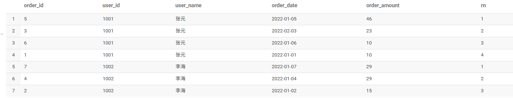
最终结果：
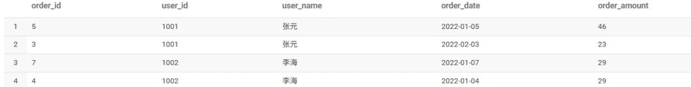
当然，上述问题可以进行一些简单的变体，例如：求每个用户，金额排名前25%的订单信息
```sql
-- 求每个用户，金额排名前25%的订单信息
select 
         order_id
        ,user_id
        ,user_name
        ,order_date
        ,order_amount
from
(
select 
         order_id
        ,user_id
        ,user_name
        ,order_date
        ,order_amount
        ,NTILE(4) over(partition by user_id  order by order_amount desc)    as rn
   from ds_hive.ch8_t_order
) t1
where t1.rn=1
;
```
t1结果：
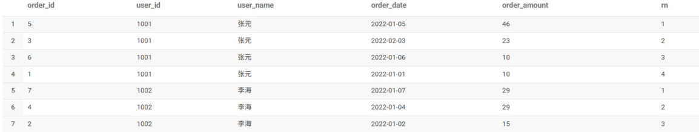
最终结果：
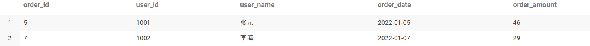

#### 2) 累加问题
需求:列出每月的订单总额以及截至到当前月的订单总额。也就是说2月份的记录要显示当月的订单总额和1,2月份订单总额的和。3月份要显示当月的订单总额和1,2,3月份订单总额的和,依此类推。
```sql
select t1.mon
       ,t1.order_amount
       ,sum(order_amount) over(order by t1.mon) as all_amt
from     
(
select
      substr(order_date,1,7) as mon
      ,sum(order_amount)     as order_amount
   from ds_hive.ch8_t_order
 group by  substr(order_date,1,7)
 ) t1
```
t1结果：
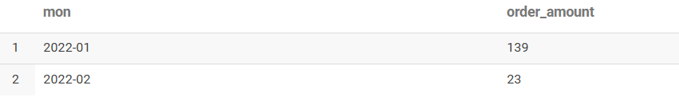
最终结果：
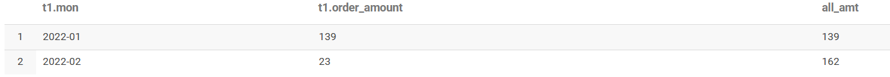
#### 3) 连续问题
连续登录问题是数据开发同学SQL面试中考察的重点，主要涉及对日期字段的处理和逻辑判断。连续登录问题的核心在于"日期连续"，一般题目中出现"求XXX连续N天登录"这种字眼时，往往就是一道连续登陆日期的题目。解决这类题目，首先要清楚什么是"连续"？

首先，就拿用户登录而言，用户在12.5登录，12.6登录，12.7也登陆，这样才算是连续3天登录。此外，倘若用户在12.5上午登录，12.5下午登录，12.6早上登录，这并不算是连续登录3天。所以我们在处理连续登录问题时，往往要保证用户每天的登录记录只有一条。最后，一个用户会出现多次连续登录的场景，例如一个用户在12.1、12.2、12.3、12.5、12.6、12.7这六天均有登录记录。那么，这个用户其实并不是连续登录了6天，而是有两次连续登录3天的情况，此时我们要分组处理。

例如：求连续2天下单的用户。

1. 首先，在确保每个用户在每天只有一条登录记录时，我们需要给每个用户的登录日期都进行排序，使用row_number()开窗函数：
```sql
row_number() over (partition by user_id order by order_date) as rn
```

2. 第二步，也是最重要的一步，我们需要构造日期差标识。构造的方法也很简单，就是用登陆日期减去第一步算出来的排序。<span style="color:red">通过观察可以发现，这个标识符在连续登录的记录里是相同的，因为日期在变化，但是排序也在变化，减去之后的结果是固定的！</span>
```sql
date_sub(dt, row_number() over (partition by user_id order by dt)) as sub_dt
```

3. 最后，按照题目要求筛选连续登录的记录即可。注意，一个用户可能存在多次连续登录的场景，所以我们需要先按照user_id + sub_dt来进行分组。如果最终要统计的是用户粒度的结果，需要再按照user_id进行二次聚合。
```sql
group by user_id, sub_dt
-- 找到连续7天登录的用户
having count(1) = 7
```

4. 完整代码展示：
```sql
select
 user_id
 ,rn
 ,count(*) as cnt
 from
 (
 select 
         order_id
        ,user_id
        ,user_name
        ,order_date
        ,order_amount
        ,date_sub(order_date,row_number() over(partition by user_id  order by order_date)) as rn
   from ds_hive.ch8_t_order
 ) t1
group by user_id
 ,rn 
having cnt=7
;
```
t1表结果：
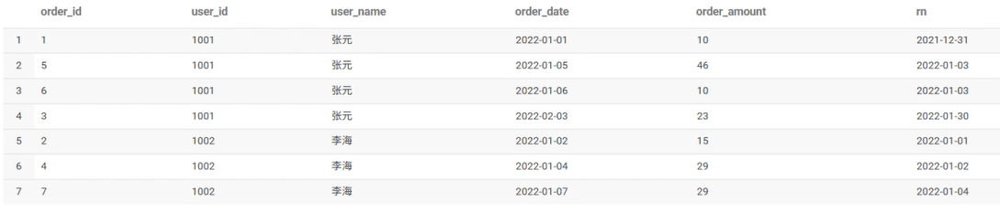
最终结果：
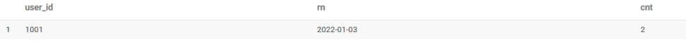
## 8.4 用户自定义函数(☆了解)

### 8.4.0 概述

**【应用背景】**：<span style="color:red">hive的系统内置函数无法解决实际的业务问题，需要开发者自己编写函数实现自身的业务实现诉求</span>。Hive自定义函数包括三种UDF、UDAF、UDTF。这三种函数的特征如下：

- **UDF(User-Defined-Function)**：用户自定义函数，<span style="color:red">一对一的输入输出</span>。
- **UDAF(User-Defined Aggregation Function)**：用户自定义聚合函数，<span style="color:red">多进一出</span>。例如：count/max/min。
- **UDTF(User-Defined Table-Generating Functions)**：用户自定义表生成函数，<span style="color:red">一对多的输入输出</span>。例如：lateral view explode。

**【使用方式】**：在HIVE会话中add 自定义函数的jar文件，然后创建function继而使用函数。具体步骤如下：

1. 编写自定义函数。
2. 打包上传到集群机器中。
3. 进入hive客户端，添加jar包：`hive> add jar /home/ds_teacher/hive_udf.jar`。
4. 创建临时函数：`hive> create temporary function getLen as 'com.ds.GetLength';`
5. 使用临时函数：`hive> select getLen('1234567');`
6. 销毁临时函数：`hive> drop temporary function getLen;`

**【数据类型】**：hive自定义函数中有几类数据类型：PrimitiveObjectInspector、ListObjectInspector、StructObjectInspector、MapObjectInspector等类型。三种自定义函数都会首先进行参数个数和参数类型检查。

### 8.4.1 UDF函数

#### 1) UDF函数介绍
**【功能说明】**：<span style="color:red">一对一的输入输出,只能输入一条记录当中的数据，同时返回一条处理结果。属于最常见的自定义函数，像cos,sin,substring,indexof等均是如此要求。</span>

**【实现方式】**：hive的udf有两种实现方式或者实现的API，当写Hive UDF时，有两个选择：一是继承 UDF类，二是继承抽象类GenericUDF。这两种实现不同之处是：GenericUDF 可以处理复杂类型参数，并且继承GenericUDF更加有效率，因为UDF class 需要Hive使用反射的方式去实现。

**实现方式1**：
如果所操作的数据类型都是基础数据类型，如（Hadoop&Hive 基本writable类型，如Text,IntWritable,LongWritable,DoubleWritable等）。那么简单的`org.apache.hadoop.hive.ql.exec.UDF`就可以做到。

具体地，需要继承`org.apache.hadoop.hive.ql.UDF`，比较简单，只需要实现evaluate函数，evaluate函数支持重载。

**实现方式2**：
如果所操作的数据类型是内嵌数据结构，如Map，List和Set，那么要采用`org.apache.hadoop.hive.ql.udf.generic.GenericUDF`。

具体地，需要继承`org.apache.hadoop.hive.ql.udf.generic.GenericUDF`，需要实现三个方法：

1. **initialize**：只调用一次，在任何evaluate()调用之前可以接收到一个可以表示函数输入参数类型的object inspectors数组。initialize用来验证该函数是否接收正确的参数类型和参数个数，最后提供最后结果对应的数据类型。
2. **evaluate**：真正的逻辑，读取输入数据，处理数据，返回结果。
3. **getDisplayString**：返回描述该方法的字符串，没有太多作用。

#### 2) UDF函数示例
**【UDF函数的说明】**
功能：将手机号脱敏，脱敏方式，前三位加后四位 ，中间位数用 **** 代替。
输入：15853456765
输出：158 **** 6765

**【具体实现步骤】**
1. 导入hadoop项目，（将前面hadoop课程项目直接拿过来使用）。
   Maven补充材料：https://www.runoob.com/maven/maven-pom.html

2. 修改xml文件，导入hive依赖
```xml
<dependency>
    <groupId>org.apache.hive</groupId>
    <artifactId>hive-exec</artifactId>
    <version>3.1.3</version>
</dependency>
```

3. 创建一个java类继承GenericUDF，并重载initialize、evaluate、getDisplayString方法
```java
package cn.com.dsinc.hive;
 
import org.apache.hadoop.hive.ql.exec.UDFArgumentException;
import org.apache.hadoop.hive.ql.io.parquet.serde.primitive.ParquetPrimitiveInspectorFactory;
import org.apache.hadoop.hive.ql.metadata.HiveException;
import org.apache.hadoop.hive.ql.udf.generic.GenericUDF;
import org.apache.hadoop.hive.serde2.objectinspector.ObjectInspector;
 
public class MyFristUDF extends GenericUDF {
    public String input;
    public String output;
 
    @Override
    public ObjectInspector initialize(ObjectInspector[] arguments) throws UDFArgumentException {
        input="";
        return ParquetPrimitiveInspectorFactory.parquetStringInspector;
    }
 
    @Override
    public Object evaluate(DeferredObject[] arguments) throws HiveException {
        input=arguments[0].get().toString();
        if(arguments.length==1) {
            output = input.substring(0, 3).concat("****").concat(input.substring(7, 11));
        }
        return output;
    }
 
    @Override
    public String getDisplayString(String[] children) {
        return "这是我开发的第一个UDF";
    }
}
```

4. 将项目打包，使用rz命令上传到集群

5. 进入hive命令行，执行以下命令：
```sql
#添加jar包 
add jar /home/hewwen8888/data/dsinc-1.0-SNAPSHOT.jar;
#设置函数与自定义函数关联  注意：com.ds.DateFormatConvert为全类名
create temporary function myftudf as 'cn.com.dsinc.hive.MyFristUDF';
#使用函数 
select mygudf('12345678912');
#删除函数
drop temporary function if exists mygudf;
```

注意：临时函数只跟会话有关系，跟库没有关系。只要创建临时函数的会话不断，在当前会话下，任意一个库都可以使用，其他会话全都不能使用。

执行效果如下：
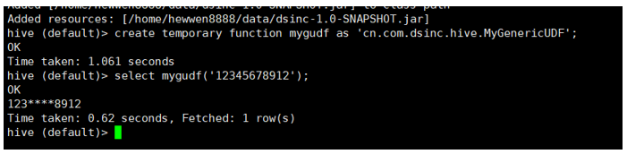

### 8.4.2 UDAF函数

#### 1) UDAF函数介绍
**【功能说明】**：<span style="color:red">多行进一行出，in:out=n:1,即接受输入N条记录当中的数据，同时返回一条处理结果。属于最常见的自定义函数，像count,sum,avg,max等均是如此要求。</span>

**【实现方式】**：
在一些旧版的教程和文档中，都会提到UDAF开发的关键是继承UDAF.java,具体实现方式：
1. 自定义一个java类，继承UDAF类。
2. 内部定义一个静态类，实现UDAFEvaluator接口。
3. 实现方法init,iterate,terminatePartial,merge,terminate，共5个方法。详见下图
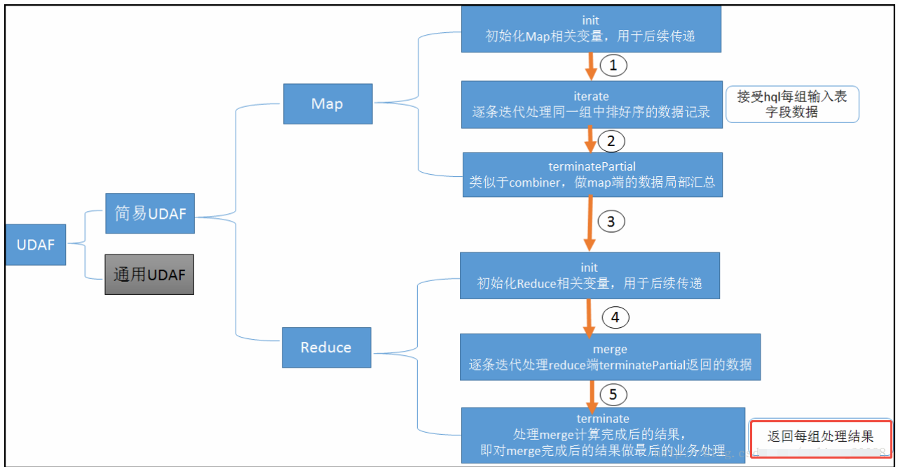
在hive中执行add jar操作，将jar加载到classpath中。
在hive中创建模板函数，使得后边可以使用该函数名称调用实际的udf函数。

打开hive-exec的1.2.2版本源码，却发现UDAF类已被注解为Deprecated，UDAF类被废弃后，推荐的替代品有两种：实现GenericUDAFResolver2接口，或者继承AbstractGenericUDAFResolver类；其中AbstractGenericUDAFResolver自身就是GenericUDAFResolver2接口的实现类，所以那个任意选。

#### 2) UDAF函数示例
**【UDAF函数的说明】**
功能：统计某个维度，所有值的长度之和
输入： 
```
user1   aaa
user1   bbb
user2   ccc
```
输出：
```
user1    6
user2    3
```

**【具体实现步骤】**
1. 打开前文新建的hiveudf工程，新建FieldLengthAggregationBuffer.java，这个类的作用是缓存中间计算结果，每次计算的结果都放入这里面，被传递给下个阶段，其成员变量value用来保存累加数据：
```java
package cn.com.dsinc.hive;
import org.apache.hadoop.hive.ql.udf.generic.GenericUDAFEvaluator;
import org.apache.hadoop.hive.ql.util.JavaDataModel;
 
public class FieldLengthAggregationBuffer extends GenericUDAFEvaluator.AbstractAggregationBuffer {
    private Integer value = 0;
 
    public Integer getValue() {
        return value;
    }
 
    public void setValue(Integer value) {
        this.value = value;
    }
    public void add(int addValue) {
        synchronized (value) {
            value += addValue;
        }
    }
    /**
     * 合并值缓冲区大小，这里是用来保存字符串长度，因此设为4byte
     * @return
     */
    @Override
    public int estimate() {
        return JavaDataModel.PRIMITIVES1;
    }
}
```

这里主要步骤与前面的案例基本一样，差异主要体现在具体的函数实现上：

新建FieldLengthUDAFEvaluator.java，里面是整个UDAF逻辑实现，关键代码已经添加了注释，核心思路是iterate将当前分组的字段处理完毕，merger把分散的数据合并起来，再由terminate决定当前分组计算结果：
```java
package cn.com.dsinc.hive;
 
import org.apache.hadoop.hive.ql.metadata.HiveException;
import org.apache.hadoop.hive.ql.udf.generic.GenericUDAFEvaluator;
import org.apache.hadoop.hive.serde2.objectinspector.ObjectInspector;
import org.apache.hadoop.hive.serde2.objectinspector.ObjectInspectorFactory;
import org.apache.hadoop.hive.serde2.objectinspector.PrimitiveObjectInspector;
 
public class FieldLengthUDAFEvaluator extends GenericUDAFEvaluator {
    PrimitiveObjectInspector inputOI;
    ObjectInspector outputOI;
    PrimitiveObjectInspector integerOI;
 
    @Override
    public ObjectInspector init(Mode m, ObjectInspector[] parameters) throws HiveException {
        super.init(m, parameters);
 
        // COMPLETE或者PARTIAL1，输入的都是数据库的原始数据
        if(Mode.PARTIAL1.equals(m) || Mode.COMPLETE.equals(m)) {
            inputOI = (PrimitiveObjectInspector) parameters[0];
        } else {
            // PARTIAL2和FINAL阶段，都是基于前一个阶段init返回值作为parameters入参
            integerOI = (PrimitiveObjectInspector) parameters[0];
        }
 
        outputOI = ObjectInspectorFactory.getReflectionObjectInspector(
                Integer.class,
                ObjectInspectorFactory.ObjectInspectorOptions.JAVA
        );
 
        // 给下一个阶段用的，即告诉下一个阶段，自己输出数据的类型
        return outputOI;
    }
 
    public AggregationBuffer getNewAggregationBuffer() throws HiveException {
        return new FieldLengthAggregationBuffer();
    }
    
    /**
     * 重置，将总数清理掉
     * @param agg
     * @throws HiveException
     */
    public void reset(AggregationBuffer agg) throws HiveException {
        ((FieldLengthAggregationBuffer)agg).setValue(0);
    }
 
    /**
     * 不断被调用执行的方法，最终数据都保存在agg中
     * @param agg
     * @param parameters
     * @throws HiveException
     */
    public void iterate(AggregationBuffer agg, Object[] parameters) throws HiveException {
        if(null==parameters || parameters.length<1) {
            return;
        }
 
        Object javaObj = inputOI.getPrimitiveJavaObject(parameters[0]);
        ((FieldLengthAggregationBuffer)agg).add(String.valueOf(javaObj).length());
    }
 
    /**
     * group by的时候返回当前分组的最终结果
     * @param agg
     * @return
     * @throws HiveException
     */
    public Object terminate(AggregationBuffer agg) throws HiveException {
        return ((FieldLengthAggregationBuffer)agg).getValue();
    }
 
    /**
     * 当前阶段结束时执行的方法，返回的是部分聚合的结果（map、combiner）
     * @param agg
     * @return
     * @throws HiveException
     */
    public Object terminatePartial(AggregationBuffer agg) throws HiveException {
        return terminate(agg);
    }
    
    /**
     * 合并数据，将总长度加入到缓存对象中（combiner或reduce）
     * @param agg
     * @param partial
     * @throws HiveException
     */
    public void merge(AggregationBuffer agg, Object partial) throws HiveException {
        ((FieldLengthAggregationBuffer) agg).add((Integer)integerOI.getPrimitiveJavaObject(partial));
    }
}
```

3. 最后是FieldLength.java，该类注册UDAF到hive时用到的，负责实例化FieldLengthUDAFEvaluator，给hive使用：
```java
package cn.com.dsinc.hive;
 
import org.apache.hadoop.hive.ql.parse.SemanticException;
import org.apache.hadoop.hive.ql.udf.generic.AbstractGenericUDAFResolver;
import org.apache.hadoop.hive.ql.udf.generic.GenericUDAFEvaluator;
import org.apache.hadoop.hive.ql.udf.generic.GenericUDAFParameterInfo;
import org.apache.hadoop.hive.serde2.typeinfo.TypeInfo;
 
public class FieldLength extends AbstractGenericUDAFResolver {
    @Override
    public GenericUDAFEvaluator getEvaluator(GenericUDAFParameterInfo info) throws SemanticException {
        return new FieldLengthUDAFEvaluator();
    }
 
    @Override
    public GenericUDAFEvaluator getEvaluator(TypeInfo[] info) throws SemanticException {
        return new FieldLengthUDAFEvaluator();
    }
}
```

4. 将项目打包，上传到集群上

5. 进入hive命令行，执行以下命令：
```sql
#添加jar包 
add jar /home/hewwen8888/data/dsinc-1.0-SNAPSHOT.jar;
#设置函数与自定义函数关联  注意：com.ds.DateFormatConvert为全类名
create temporary function udf_fieldlength as 'cn.com.dsinc.hive.FieldLength';
#使用函数 
select substr(name,1,4),udf_fieldlength(id) from ds_hive.ch4_emp group by substr(name,1,4);
```
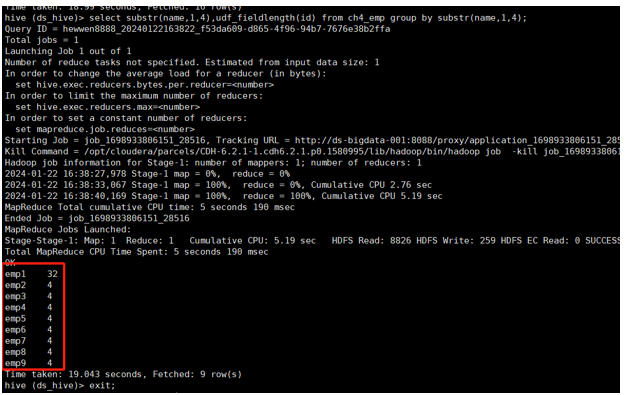
### 8.4.3 UDTF函数

#### 1) UDTF函数介绍
**【功能说明】**：udtf用来解决输入一行输出多行(On-to-many maping) 的需求。

**【实现方式】**：需要继承`org.apache.hadoop.hive.ql.udf.generic.GenericUDTF`来实现三个方法。

1. **initialize**：返回UDTF的返回行的信息（返回个数，类型）。
2. **process**：真正的处理过程在process函数中，在process中，每一次forward()调用产生一行；如果产生多列可以将多个列的值放在一个数组中，然后将该数组传入到forward()函数。【forward()传入的就是最后的结果，里面一般是数组，数组有多少个元素就代表最后一行输出的结果有多少列】
3. **close**：对需要清理的方法进行清理。

#### 2) UDTF函数示例
**【UDTF函数的说明】**
功能：<span style="color:red">将输入的一行字符串转换成多行数据。</span>
输入：`" user1#45;user2#56"`
输出：
```
user1   45
user2   56
```

**【具体实现步骤】**
1. 继承`org.apache.hadoop.hive.ql.udf.generic.GenericUDTF`，实现initialize, process, close三个方法。
2. UDTF首先会调用initialize方法，此方法返回UDTF的返回行的信息（返回个数，类型）。
3. 初始化完成后，会调用process方法，真正的处理过程在process函数中，在process中，每调用一次forward()产生一行；如果产生多列可以将多个列的值放在一个数组中，然后将该数组传入到forward()函数。
4. 最后close()方法调用，对需要清理的方法进行清理。

```java
package cn.com.dsinc.hive;
 
import java.util.ArrayList;
import java.util.List;
 
import org.apache.hadoop.hive.ql.exec.UDFArgumentException;
import org.apache.hadoop.hive.ql.metadata.HiveException;
import org.apache.hadoop.hive.ql.udf.generic.GenericUDTF;
import org.apache.hadoop.hive.serde2.lazy.LazyString;
import org.apache.hadoop.hive.serde2.objectinspector.ObjectInspector;
import org.apache.hadoop.hive.serde2.objectinspector.ObjectInspectorFactory;
import org.apache.hadoop.hive.serde2.objectinspector.PrimitiveObjectInspector;
import org.apache.hadoop.hive.serde2.objectinspector.StructObjectInspector;
import org.apache.hadoop.hive.serde2.objectinspector.primitive.PrimitiveObjectInspectorFactory;
import org.apache.hadoop.io.Text;
 
/**
 * 实现 udtf函数
 * split_udtf("name_nikename") --> 多行多列
 */
public class SplitUDTF extends GenericUDTF{
 
    @Override
    public StructObjectInspector initialize(ObjectInspector[] arguments) throws UDFArgumentException {
        // 校验函数输入参数和 设置函数返回值类型
        // 1) 校验入参个数
        if(arguments.length != 1){
            throw new UDFArgumentException("input params must one");
        }
 
        ObjectInspector inspector = arguments[0];
        // 2) 校验参数的大类
        // 大类有： PRIMITIVE（基本类型）, LIST, MAP, STRUCT, UNION
        if(! inspector.getCategory().equals(ObjectInspector.Category.PRIMITIVE)){
            throw new UDFArgumentException("input params Category must PRIMITIVE");
        }
 
        // 3) 校验参数的小类
        //      VOID, BOOLEAN, BYTE, SHORT, INT, LONG, FLOAT, DOUBLE, STRING,
        //      DATE, TIMESTAMP, BINARY, DECIMAL, VARCHAR, CHAR, INTERVAL_YEAR_MONTH, INTERVAL_DAY_TIME,
        //      UNKNOWN
        if(! inspector.getTypeName().equalsIgnoreCase(PrimitiveObjectInspector.PrimitiveCategory.STRING.name())){
            throw new UDFArgumentException("input params PRIMITIVE Category type must STRING");
        }
 
        // 4) 设置函数返回值类型(struct<name:string, nickname:string>)
        // struct内部字段的名称
        List<String> names = new ArrayList<String>();
        names.add("name");
        names.add("nickname");
 
        // struct内部字段的名称对应的类型
        List<ObjectInspector> inspectors = new ArrayList<ObjectInspector>();
        inspectors.add(PrimitiveObjectInspectorFactory.writableStringObjectInspector);
        inspectors.add(PrimitiveObjectInspectorFactory.writableStringObjectInspector);
 
        return ObjectInspectorFactory.getStandardStructObjectInspector(names, inspectors);
    }
 
    /**
     * 函数输出类型
     * 第一个参数：name
     * 第二个参数：nickname
     */
    Object[] outputs = new Object[]{new Text(), new Text()};
 
    @Override
    public void process(Object[] args) throws HiveException {
        // 核心方法 一行调用一次
        System.out.println("process()");
        Object obj = args[0];
 
        String data = null;
        if(obj instanceof LazyString){
            LazyString lz = (LazyString)obj;
            Text t = lz.getWritableObject();
            data = t.toString();
        }else if(obj instanceof Text){
            Text t = (Text)obj;
            data = t.toString();
        }else{
            data = (String)obj;
        }
 
        // name1#n1;name2#n2
        String[] arr1 = data.split(";");
        // name1#n1
        for(String data2 : arr1){
            String[] arr2 = data2.split("#");
            String name = arr2[0];
            String nickname = arr2[1];
 
            // 想输出就调用forward()
            ((Text)outputs[0]).set(name);
            ((Text)outputs[1]).set(nickname);
            System.out.println("forward()");
            forward(outputs);
        }
    }
 
    @Override
    public void close() throws HiveException {
    }
}
```

5. 进入hive命令行，执行以下命令：
```sql
#添加jar包 
add jar /home/hewwen8888/data/dsinc-1.0-SNAPSHOT.jar;
#设置函数与自定义函数关联  注意：com.ds.DateFormatConvert为全类名
create temporary function udtf_split as 'cn.com.dsinc.hive.SplitUDTF';
#使用函数 
select udtf_split('user1#45;user2#56');
```
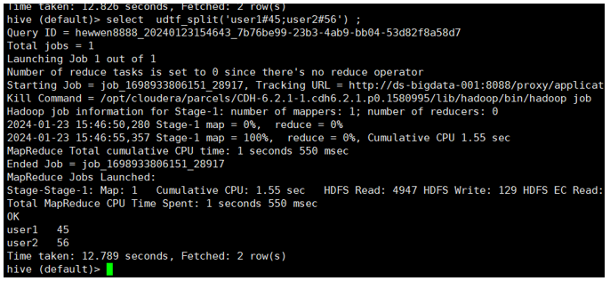
配合lateral view 一起使用：
```sql
with udtf_table as (
  select '001' as id, 'user1#45;user2#56' as name
  union all
  select '002' as id, 'user2#90;user2#98' as name
)
select t1.id, t2.name, t2.nickname
from udtf_table t1
lateral view udtf_split(name) t2 as name,nickname
;
```
