# 9. 企业综合项目实战

## 9.1 数据准备
模拟真实的电商网站的数据来统一练习。

### 1) 建表语句：
```sql
-- 创建用户表
DROP TABLE IF EXISTS ds_hive.ch9_t_member_inf;
create table if not exists ds_hive.ch9_t_member_inf(
 user_id       string COMMENT '用户id'
,idnty_name    string COMMENT '用户姓名'
,idnty_gender  string COMMENT '性别'
,prvnc_name    string COMMENT '省份'
,city_name     string COMMENT '城市'
,rgst_dt       string COMMENT '注册日期'
)
row format delimited fields terminated by '\t'
stored as textfile
;
 
-- 创建用户分区表
DROP TABLE IF EXISTS ds_hive.ch9_t_member_info_ed;
create table if not exists ds_hive.ch9_t_member_info_ed(
 user_id       string COMMENT '用户id'
,idnty_name    string COMMENT '用户姓名'
,idnty_gender  string COMMENT '性别'
,prvnc_name    string COMMENT '省份'
,city_name     string COMMENT '城市'
,rgst_dt       string COMMENT '注册日期'
)
comment '用户表'
stored as orc
;
 
-- 创建订单表
DROP TABLE IF EXISTS ds_hive.ch9_t_order;
create table if not exists ds_hive.ch9_t_order(
 order_id        string COMMENT '订单'
,product_id      string COMMENT '产品id'
,user_id         string COMMENT '用户id'
,pay_time        string COMMENT '支付时间(分)'
,amount          string COMMENT '金额'
,status          string COMMENT '状态'
,order_detial    string COMMENT '状态备注'
)
row format delimited fields terminated by '\t'
stored as textfile
;
-- 创建订单分区表
DROP TABLE IF EXISTS ds_hive.ch9_t_order_d;
create table if not exists ds_hive.ch9_t_order_d(
 order_id        string COMMENT '订单'
,product_id      string COMMENT '产品id'
,user_id         string COMMENT '用户id'
,pay_time        string COMMENT '支付时间'
,amount          string COMMENT '金额(分)'
,status          string COMMENT '状态'
,order_detial    string COMMENT '状态备注'
)
comment '订单表'
partitioned by (data_dt string)
stored as orc
;
-- 创建登录表
DROP TABLE IF EXISTS ds_hive.ch9_t_user_login;
create table if not exists ds_hive.ch9_t_user_login(
 login_id        string COMMENT 'id'
,user_id         string COMMENT '用户id'
,login_date      string COMMENT '登录时间'
)
row format delimited fields terminated by '\t'
stored as textfile
;
-- 创建登录分区表
DROP TABLE IF EXISTS ds_hive.ch9_t_user_login_d;
create table if not exists ds_hive.ch9_t_user_login_d(
 login_id        string COMMENT 'id'
,user_id         string COMMENT '用户id'
,login_date      string COMMENT '登录时间'
)
comment '登录表'
partitioned by (data_dt string)
stored as orc
;
 
-- 创建产品表
DROP TABLE IF EXISTS ds_hive.ch9_t_goods_info;
create table if not exists ds_hive.ch9_t_goods_info(
 goods_id             string COMMENT 'id'
,goods_name           string COMMENT '商品名称'
)
row format delimited fields terminated by '\t'
stored as textfile
;
```

### 2) 插入数据:
```sql
load data local inpath "/home/hewwen8888/data/t_user.txt"  overwrite into table ds_hive.ch9_t_member_inf;
load data local inpath "/home/hewwen8888/data/t_order.txt"  overwrite into table ds_hive.ch9_t_order;
load data local inpath "/home/hewwen8888/data/t_login.txt"  overwrite into table ds_hive.ch9_t_user_login;
load data local inpath "/home/hewwen8888/data/t_goods.txt"  overwrite into table ds_hive.ch9_t_goods_info;
```

### 3) 数据清洗
<span style="color:red">因为订单表和登陆表数据数据量大，必须放到分区表中</span>：
```sql
INSERT OVERWRITE TABLE  ds_hive.ch9_t_member_info_ed
select
 user_id    
,idnty_name 
,idnty_gender
,prvnc_name 
,city_name  
,rgst_dt    
from ds_hive.ch9_t_member_inf
;
 
set hive.exec.dynamic.partition.mode=nonstrict; --开启动态分区
INSERT OVERWRITE TABLE  ds_hive.ch9_t_order_d
partition (data_dt)
select
 order_id   
,product_id 
,user_id    
,pay_time   
,amount     
,status     
,order_detial
,regexp_replace(substr(pay_time,1,10),'-','') as data_dt -- 截取年月日数据作为分区依据
from ds_hive.ch9_t_order
;
 
set hive.exec.dynamic.partition.mode=nonstrict;
INSERT OVERWRITE TABLE  ds_hive.ch9_t_user_login_d
partition (data_dt)
select
 login_id 
,user_id  
,login_date
,regexp_replace(substr(login_date,1,10),'-','') as data_dt
from   ds_hive.ch9_t_user_login
;
```

## 9.2 实战练习
### 0.首先概览所有需要用到的表的结构
<span style="color:red">ds_hive.ch9_t_member_info_ed</span>
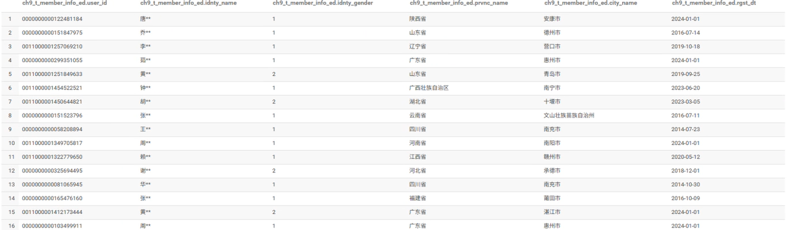
<span style="color:red">ds_hive.ch9_t_order_d</span>
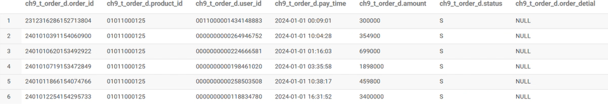
<span style="color:red">ds_hive.ch9_t_user_login_d</span>
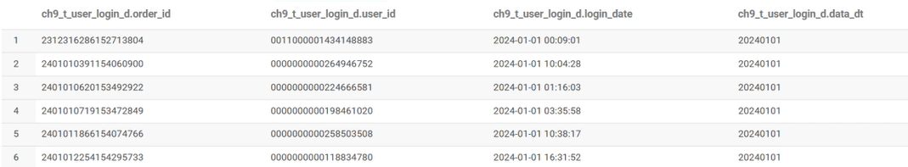
<span style="color:red">ds_hive.ch9_t_goods_info</span>
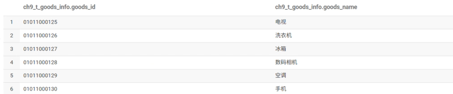

### 1. 查询2024年1月份当日注册的并且当天购物的用户数，按每天展示
```sql
select  substr(t1.pay_time,1,10) as pay_date
         ,count(distinct t1.user_id) as user_cnt
   from ds_hive.ch9_t_order_d t1
   join ds_hive.ch9_t_member_info_ed t2
     on t1.user_id=t2.user_id and substr(t1.pay_time,1,10)=t2.rgst_dt 
where t1.data_dt>='20240101'  and t1.data_dt<='20240131'
 group by substr(t1.pay_time,1,10)
 ;
```
执行结果：
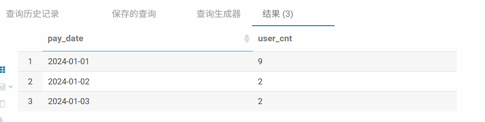

### 2. 查询2024年一月份，累积销量排名前三的商品和对应的销售量
```sql
select
t4.goods_name
,t4.user_cnt
from
(select
 t3.goods_name
 ,t3.user_cnt
 ,row_number() over(order by user_cnt desc ) as num
 from
(
 select  t2.goods_name
         ,count(distinct t1.order_id) as user_cnt
   from ds_hive.ch9_t_order_d t1
   join  ds_hive.ch9_t_goods_info t2
     on t1.product_id=t2.goods_id
where t1.data_dt>='20240101'  and t1.data_dt<='20240131'
 group by t2.goods_name
 )
 t3
 )
 t4
 where t4.num<=3
 ;
```
t3:
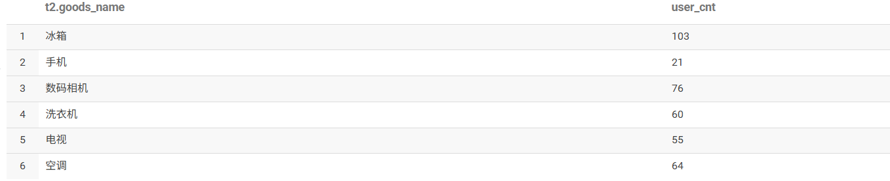
t4:
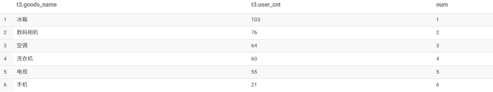
最终结果:
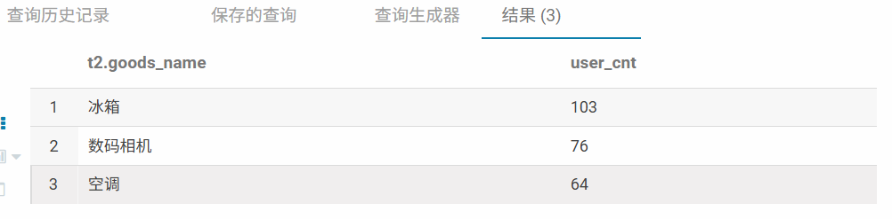
### 3. 查询至少连续三天下单的用户

```sql
------第一步，保障每天只有一条数据
with  ch9_timu3_order_01 as (
 select  substr(t1.pay_time,1,10) as pay_date
         ,t1.user_id
         ,count(*) as cnt
   from ds_hive.ch9_t_order_d t1
where t1.data_dt is not null
 group by substr(t1.pay_time,1,10) ,t1.user_id
),
----------第二步，构建等差相减
ch9_timu3_order_02 as (
  select user_id
         ,num
         ,count(*) as cnt
  from
  (select user_id
        ,pay_date
        ,date_sub(pay_date,row_number() over(partition by user_id order by pay_date)) num
   from ch9_timu3_order_01
   ) t1
   group  by
   user_id
         ,num
having count(*)>=3
 )
 select user_id from ch9_timu3_order_02
 ;
```
ch9_timu3_order_01:
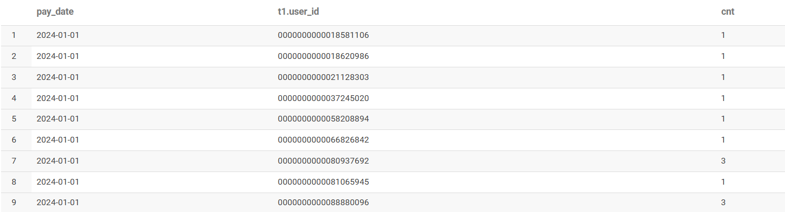
ch9_timu3_order_02:
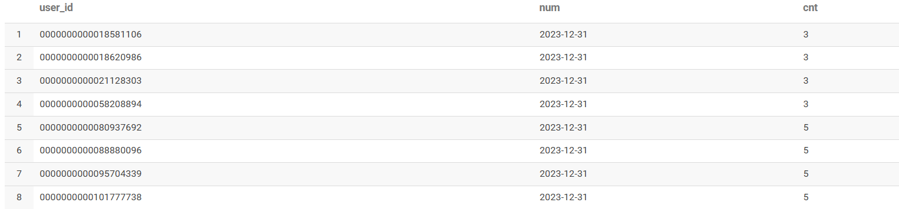
最终结果：
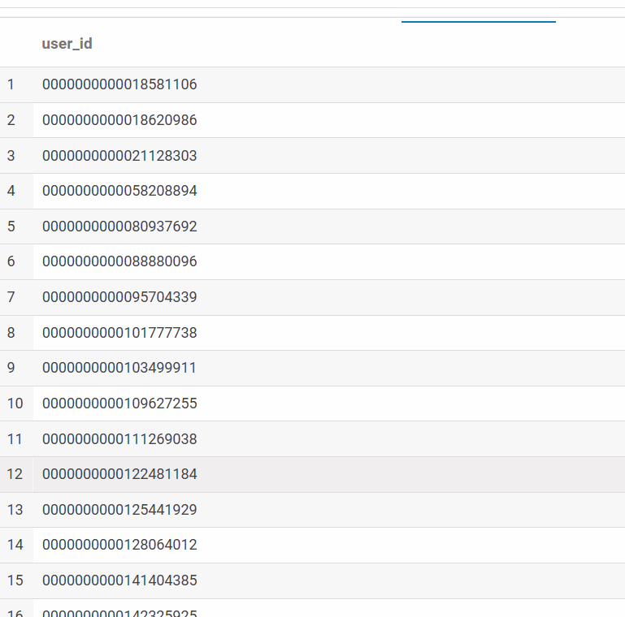
### 4. 查询用户的累计消费金额及根据销售金额算出用户等级
用户vip等级根据累积消费金额计算，计算规则如下：
设累积消费总额为X，
若0=<X<2000,则vip等级为青铜会员
若2000<=X<3000,则vip等级为白银会员
若3000<=X<5000,则vip等级为黄金会员
若5000<=X<8000,则vip为钻石会员
若8000<=X<10000,则vip等级为星耀会员
若X>=10000,则vip等级为王者会员

```sql
with ch9_timu4_01 as (
    select user_id
           ,pay_date
           ,amount
           ,sum(amount) over(partition by user_id order by pay_date) as sum_amount
    from (
        -- 每个用户每天的金额
        select substr(t1.pay_time,1,10) as pay_date
               ,t1.user_id
               ,sum(amount) as amount
        from ds_hive.ch9_t_order_d t1
        where t1.data_dt is not null
        group by substr(t1.pay_time,1,10), t1.user_id
    ) t2
),
user_total as (
    -- 计算每个用户的总消费额（即最大累计金额）
    select user_id, max(sum_amount) as total_amount
    from ch9_timu4_01
    group by user_id
)
select user_id
       ,total_amount
       ,case when 0 <= total_amount and total_amount < 2000 then '青铜会员'
             when 2000 <= total_amount and total_amount < 3000 then '白银会员'
             when 3000 <= total_amount and total_amount < 5000 then '黄金会员'
             when 5000 <= total_amount and total_amount < 8000 then '钻石会员'
             when 8000 <= total_amount and total_amount < 10000 then '星耀会员'
             else '王者会员'
        end as level
from user_total;
```
ch9_timu4_01:
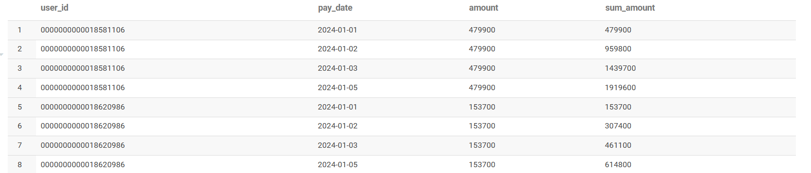
最终结果：
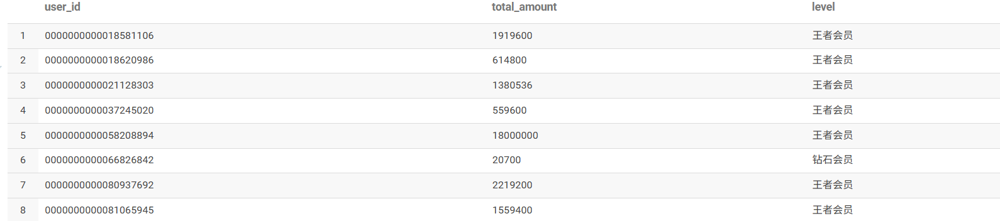
### 5. 查询2024年1月份每个用户，每天购买的商品，按单个用户展现
```sql
select   t4.pay_date
          ,t4.idnty_name
          ,concat_ws('|',collect_set( t4.goods_name)) goods_name
 from  
 (select  substr(t1.pay_time,1,10) as pay_date
         ,idnty_name
         ,goods_name
         ,count(*) as cnt
   from ds_hive.ch9_t_order_d t1
   join ds_hive.ch9_t_member_info_ed t2
     on t1.user_id=t2.user_id
   join  ds_hive.ch9_t_goods_info t3
     on t1.product_id=t3.goods_id
where t1.data_dt>='20240101'  and t1.data_dt<='20240131'
 group by substr(t1.pay_time,1,10)
         ,idnty_name
         ,goods_name
 ) t4
 group by
 t4.pay_date
          ,t4.idnty_name
 ;
```
t4:
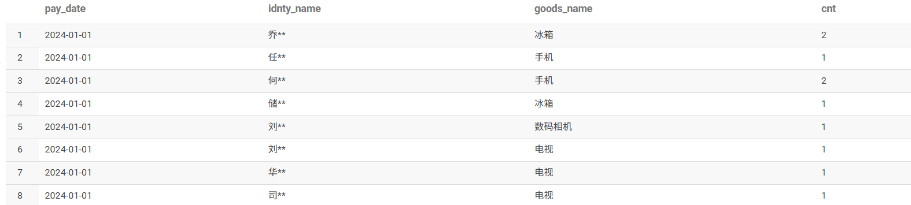
最终结果：
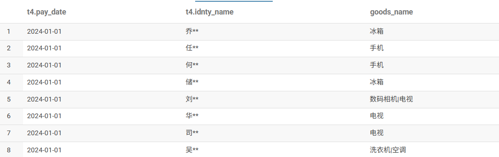
### 6. 统计2024年1月份每个商品的销金额最高的日期，如果销售金额相同，取最小日期
```sql
select
t3.product_id
,t3.pay_date
,t3.amount
from
(select
   product_id
   ,pay_date
   ,amount
   ,row_number() over(partition by product_id order by amount desc,pay_date asc) as num
   from
(
select  substr(t1.pay_time,1,10) as pay_date
         ,product_id
         ,sum(amount) as amount
   from ds_hive.ch9_t_order_d t1
where t1.data_dt>='20240101'  and t1.data_dt<='20240131'
group   by
substr(t1.pay_time,1,10)
         ,product_id
) t2
) t3
where t3.num=1
;
```
t2:
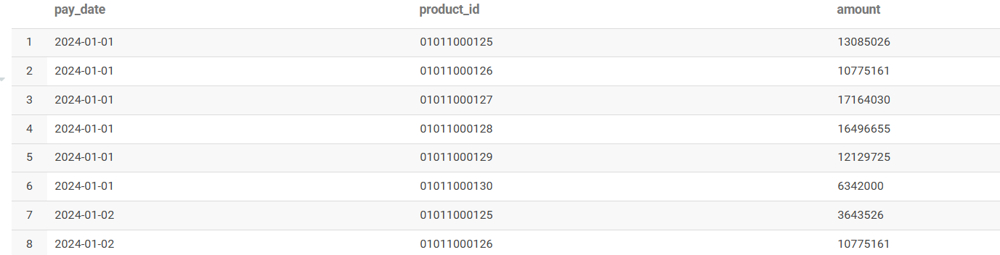
t3:
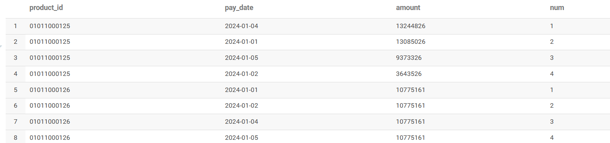
最终结果：
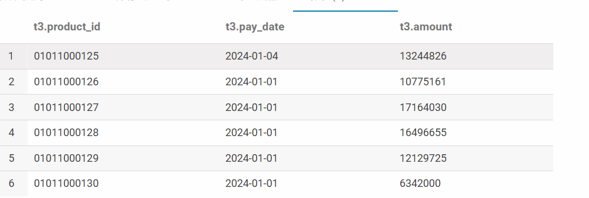
### 7. 查询2024年1月份所有用户的连续登录三天及以上的日期区间
```sql
with timu7_table_tmp1 as(
select t1.user_id
,substr(login_date,1,10) as login_date
from ds_hive.ch9_t_user_login_d t1
where t1.data_dt is not null
group by substr(login_date,1,10),t1.user_id
)
select
t3.user_id
,min(t3.login_date) as min_login_date
,max(t3.login_date) as max_login_date
from
(
select user_id
,login_date
,date_add(login_date,row_number() over(partition by user_id order by login_date desc)) as dt_flag
from timu7_table_tmp1
) t3
group by t3.user_id,t3.dt_flag
having count(*)>=3
;
```
timu7_table_tmp1：
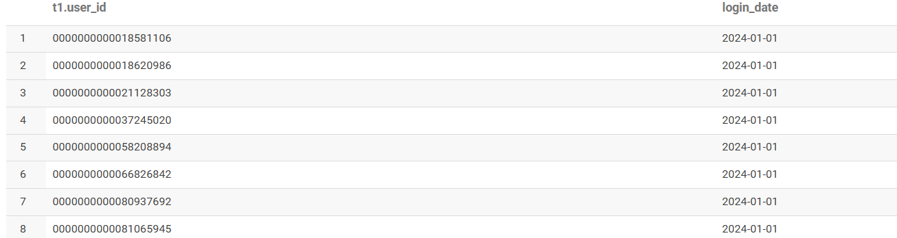
t3:
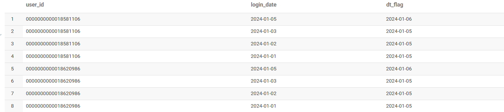
最终结果：
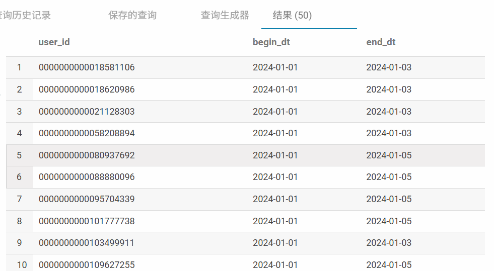
### 8. 查询2024年1月每个用户的最近一笔订单的日期和金额
```sql
select
 user_id
 ,Order_id
 ,pay_date
 ,amount
 from
(
 select  substr(t1.pay_time,1,10) as pay_date
         ,t1.user_id
         ,t1.Order_id
         ,t1.amount
         ,row_number() over(partition by user_id order by pay_time  desc) num
   from ds_hive.ch9_t_order_d t1
where t1.data_dt>='20240101'  and t1.data_dt<='20240131'
)
t1
where num=1
;
```
t1:
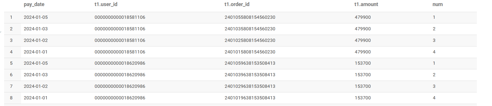
最终结果：
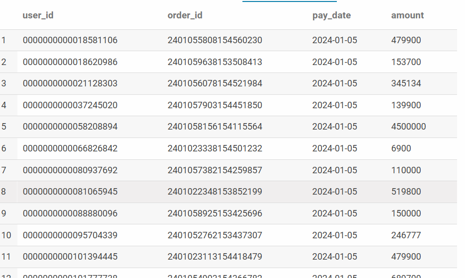
### 9. 查询查询2024年1月每个产品每天的历史累计金额总和以及历史累计日平均值
```sql
with timu9_table_tmp1 as(
select t1.product_id
,substr(pay_time,1,10) as order_dt
,cast(sum(amount/100) as decimal(10,2)) as goods_amt
from ds_hive.ch9_t_order_d t1
where t1.data_dt<='20240131'
group by substr(pay_time,1,10),t1.product_id
)
select product_id
,order_dt
,sum(goods_amt) over(partition by product_id order by order_dt asc) as sum_all
,avg(goods_amt) over(partition by product_id order by order_dt asc) as avg_all
from timu9_table_tmp1
;
```
timu9_table_tmp1：
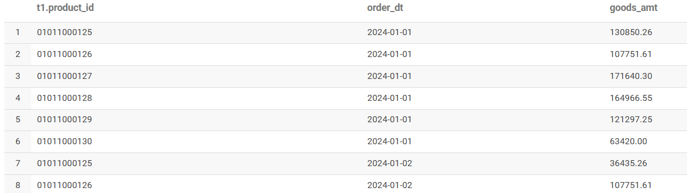
最终结果：
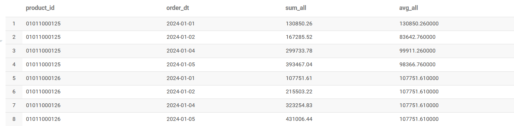

### 10. 查询每天的首购和复购用户数，首购是第一次购买商品，复购是第二次购物或者二次以上购物
```sql
select
 t3.all_dt   as pay_dt
 ,count(case when t3.all_dt=t4.First_dt  then   t3.user_id end )  as First_dt_cnt
 ,count(case when t3.all_dt<>t4.First_dt  then  t3.user_id end )  as last_dt_cnt
 from
(
select  user_id
         ,substr(t1.pay_time,1,10)  as all_dt
   from ds_hive.ch9_t_order_d t1
where t1.data_dt>='20240101'  and t1.data_dt<='20240131'
group   by user_id
           ,substr(t1.pay_time,1,10)
) t3
left join
(select  user_id
         ,min(substr(t1.pay_time,1,10) )  as First_dt
   from ds_hive.ch9_t_order_d t1
where t1.data_dt>='20240101'  and t1.data_dt<='20240131'
group   by user_id
) t4
on t3.user_id=t4.user_id
group by t3.all_dt
;
```
t3:
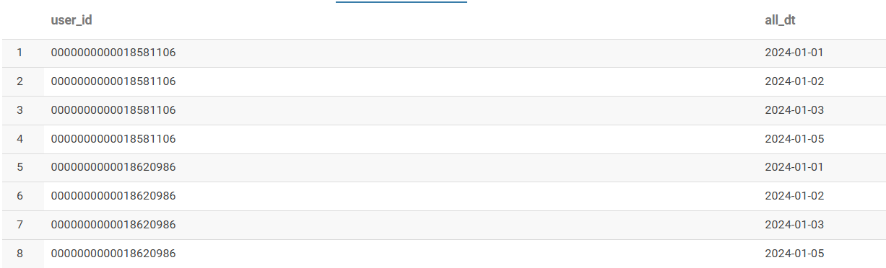
t4:
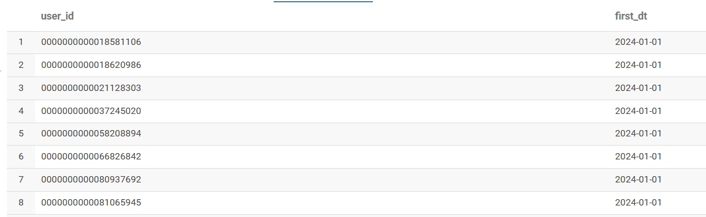
最终结果：
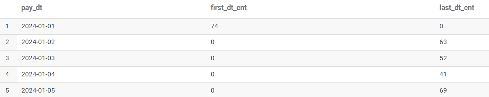