# Hive章节测试（标准）-李秀锦

## 测试提醒：

1.  该课程的知识点常以问答题、手写场景化SQL脚本的形式出现在面试过程中，因此本测试题可视为面试、笔试题库，以简答题为主。
2.  为了测试大家的真实水平，给出学习建议与辅导，请大家务必按照真实面试要求回答。
3.  题目作答时间150分钟，试卷总分150分。

---

## 一、基础类简答题（每题5分，总计5*10=50分）

1.  请说出传统数据库和数据仓库的区别(至少5点)。

<style>
/* 只缩小表格字体并允许单元格内换行 */
table {
  font-size: 7pt;               /* 调小字体，可根据需要改为 8pt 或 10pt */
  border-collapse: collapse;
  width: 100%;
}
td, th {
  border: 1px solid #ccc;        /* 保留边框，便于阅读 */
  padding: 6px;
  word-wrap: break-word;         /* 长单词自动换行 */
  overflow-wrap: break-word;
}
</style>

<table>
  <thead>
    <tr>
      <th>对比项</th>
      <th>Hive</th>
      <th>MySQL</th>
    </tr>
  </thead>
  <tbody>
    <tr>
      <td>数据规模</td>
      <td>大数据pb及以上</td>
      <td>数据量小一般百万左右到达单表极限</td>
    </tr>
    <tr>
      <td>数据存储</td>
      <td>HDFS</td>
      <td>所在安装文件系统磁盘</td>
    </tr>
    <tr>
      <td>数据格式</td>
      <td>没有定义专门的数据格式</td>
      <td>不同的数据库有不同的存储引擎，而且定义了自己的数据格式</td>
    </tr>
    <tr>
      <td>计算引擎</td>
      <td>大多数查询的执行是通过Hadoop提供的MapReduce来实现的（类似select * from的查询可以不需要MapReduce，Fetch抓取参数设置）</td>
      <td>有自己的执行引擎</td>
    </tr>
    <tr>
      <td>索引</td>
      <td>不使用或少使用索引，不适合在线数据查询</td>
      <td>有索引，适合在线查询</td>
    </tr>
    <tr>
      <td>执行延迟</td>
      <td>高</td>
      <td>低</td>
    </tr>
    <tr>
      <td>定位</td>
      <td>数据仓库</td>
      <td>业务数据库</td>
    </tr>
    <tr>
      <td>查询语言</td>
      <td>HQL</td>
      <td>sql</td>
    </tr>
    <tr>
      <td>常见操作</td>
      <td>批量导入数据、查询聚合统计，不支持对数据的改写和添加</td>
      <td>增删改查</td>
    </tr>
  </tbody>
</table>

2.  请简要描述hive体系架构的组成、底层hive脚本的执行过程。

**hive体系结构：**

**客户端组件：**
- CLI: Command Line Interface命令行接口；
- Web GUI: Hive客户端提供了一种通过网页访问Hive所提供的服务的方式。

**服务端组件：**
- Driver组件：该组件包括解析器、编译器、优化器、执行器，其作用是完成HiveQL（类SQL）查询语句的词法分析、语法分析、编译、优化及查询计划的生成；
- MetaStore组件：元数据服务组件，这个组件存储Hive的元数据；
- hiveServer2服务：hiveServer2服务是Facebook开发的一个软件框架，它用来进行可扩展且跨语言服务的开发。Hive集成了该服务，可以让不同的编程语言调用Hive的接口；

**底层hive脚本的执行过程：**
- 【阶段1】词法、语法解析: Antlr 定义HQL 的语法规则, 完成HQL 词法, 语法解析, 将HQL 转化为抽象语法树 AST Tree;
- 【阶段2】语义解析：遍历AST Tree，抽象出查询的基本组成单元QueryBlock；
- 【阶段3】生成逻辑执行计划：遍历QueryBlock，翻译为执行操作树OperatorTree；
- 【阶段4】优化逻辑执行计划：逻辑层优化器进行OperatorTree变换，合并Operator，达到减少MapReduceJob，减少数据传输及shuffle数据量；
- 【阶段5】生成物理执行计划：遍历OperatorTree，翻译为MapReduce任务；
- 【阶段6】优化物理执行计划：物理层优化器进行MapReduce任务的变换，生成最终的执行计划。

3.  为什么MapReduce的执行效率很低？

- Map 和 Reduce 之间要做 Shuffle（排序、分区、网络传输），数据量大时网络和磁盘 I/O 都很重，容易成为瓶颈；
- MR 只有 Map → Shuffle → Reduce 这种固定模式，难以像 Tez/Spark 那样用 DAG 做更细的优化（如链式执行、少落盘），所以执行效率相对较低；

4.  请描述一下hive安装模式：内嵌模式、本地模式、远程模式这三种模式的差异。

- **内嵌模式**：默认模式，元数据存储在内嵌的Derby数据库中，一次只支持一个客户端的连接，不适合生产环境只适合练习，只适合测试环境
- **本地模式**：metastore使用独立数据库存储元数据，这里的独立数据库通常使用MySQL数据库，支持多个客户端同时链接
- **远程模式**：数据库存储在远端，metastore服务在本地独立出来自己在一个单独JVM中运行，俩者分离，也支持多个客户端同时访问

5.  请简要阐述一下元数据数据库存储了哪些基础数据，这些数据在工作中会有哪些应用场景。

元数据数据库（MetaStore）存储表名、表的列与类型、分区及属性、表属性（如是否外部表）、表数据所在目录等；工作中用于 SQL 编译与类型检查、分区裁剪、定位数据路径、多客户端共享与权限管理，以及元数据校验与运维排查。

6.  请说说hive中常用的数据类型有哪些。

- **基础数据类型**：整数类型(tinyint,smallint,int,bigint)，浮点数类型(float,double,decimal)，字符串类型(varchar,char,string)，日期与时间戳(date,timestamp)
- **集合数据类型**：array,map,struct

7.  请举例说明集合数据类型的应用场景。

```json
"subordinates": ["Mary Smith", "Todd Jones"],  //列表Array, subordinates[1]="Todd Jones"
"deductions": {              //键值Map, deductions['Federal Taxes']=0.2      
  "Federal Taxes": 0.2, 
  "State Taxes": 0.05, 
  "Insurance": 0.1 
}, 
"address": {                                     //结构Struct, address.city="Chicago" 
  "street": "1 Michigan Ave.", 
  "city": "Chicago", 
  "state": "IL", 
  "zip": 60600 
}
```

- **ARRAY**：存储同类型列表，例如员工的下属名单、topN 列表；访问方式为下标，如 arr[0]。
- **MAP**：存储键值对，例如扣款项与比例、账号与登录信息；访问方式为 key，如 m['key']。
- **STRUCT**：存储多字段的嵌套对象，例如地址（街道、城市、邮编）；访问方式为点语法，如 address.city。

<span style="color:red">8. 请简要说明一下Hive读写文件的机制。</span>

Hive 读写文件的机制可简要概括为：

**读文件：**
- 通过 InputFormat 从 HDFS 读取文件，得到 <key, value>。
- 再通过 Deserializer 把 <key, value> 转成 Hive 的行对象，供查询使用。

**写文件：**
- 通过  Serializer 把行对象转成 <key, value>。
- 再通过 OutputFormat 以指定存储格式（如 TextFile、ORC）写出到 HDFS。
(SerDe:Serializer+Deserializer)

9.  <span style="color:red">请讲一下内部表与外部表的定义、区别、使用场景</span>。

内部表
- Hive 既管元数据，又管真实数据，数据默认存在 Hive 仓库目录。
- 删表时：元数据 + 真实数据 一起删掉，数据就没了。
 
外部表
- 关键字：建表带 EXTERNAL，指定 LOCATION 路径。
- Hive 只管元数据，不管真实数据。
- 删表时：只删元数据，HDFS 上的真实数据还在。
 
场景
- 内部表：临时表、中间结果表、用完就可以删的表。
- 外部表：原始日志、多引擎共用、怕误删数据的场景。

10. 请讲一下对分区、分桶的理解；静态分区、动态分区的区别。

**分区**：按业务维度（如日期、地域）把表数据存到不同目录，每个目录是一个分区；查询时指定分区可减少扫描范围。

**分桶**：在表或分区内，按指定列的 hash 对桶数取模，把数据散列到多个文件中，每个文件是一个桶；分区管"目录"，分桶管"文件"。

**静态分区**：插入时分区值在 SQL 里写死，一条语句只写一个分区。

**动态分区**：分区值由 SELECT 结果列（多为最后一列）决定，一条 INSERT 可写入多个分区，由 Hive 自动建分区；strict 模式要求至少一个分区为静态，nonstrict 可全动态。

## 二、设计类简答题（每题5分，总计5*10=50分）

<span style="color:red">11. 请讲一下如何处理大表join大表的问题。(使用分桶回答)</span>

**问题**：大表 join 大表时，Common Join 易产生大量 shuffle 和倾斜，Map Join 又无法缓存单独一张大表。

**用分桶的处理方式**：

- **Bucket Map Join**：两表都按 JOIN 列分桶，且桶数成整数倍，这样两表桶一一对应；在每个对应桶上做 Map Join（hash join），Map 端只加载对应桶的数据进内存。

- **Sort Merge Bucket Map Join（SMB）**：在分桶基础上，分桶内按 JOIN 列排序，桶间用 Sort Merge Join，Map 端无需为整个桶建 hash 表，无需加载对应桶的数据进内存，对桶内数据量更宽容。

12. 请讲一下union和union all的区别。

- UNION 会对最终结果去重，UNION ALL 不去重，重复行全部保留；

<span style="color:red">13. 请讲一下order by、sort by、distribute by、Cluster by的区别。</span>

- **Order By**：全局排序，单 Reducer，数据量大时慢；严格模式需加 limit。
- **Sort By**：每个 Reducer 内排序，多 Reducer 并行，全局无序；常与 Distribute By 一起用，且 Distribute By 写在 Sort By 前。
- **Distribute By**：按列 hash 分区，相同 key 进同一 Reducer，不负责排序；用于控制数据分布。
- **Cluster By**：等价于 Distribute By 某列 + Sort By 该列（默认升序），不能指定 asc/desc。

<span style="color:red">14. 请讲一下left join、right join、inner join、left semi join关联结果的差异，描述它们各自的特性。</span>

- **INNER JOIN**：只保留两表 ON 条件都能匹配上的行；结果只含"两边都有的 key"，行数最少。
- **LEFT JOIN**：保留左表全部行，右表能匹配则显示否则 NULL；
- **RIGHT JOIN**：保留右表全部行，左表能匹配则显示否则 NULL；
- **LEFT SEMI JOIN**：只输出左表列，只保留"左表 key 在右表 key 集合中存在"的行，等价于 IN/EXISTS 。

```sql
select t1.id, t1.user_id, t1.product
from order_t t1
left semi join user_t t2 on t1.user_id = t2.id;
-- 等价于用 IN
select id, user_id, product
from order_t
where user_id in (select id from user_t);
```

<span style="color:red">15. 举例说一下join的MR实现过程(可简要描述)。</span>

以common join为例：

- **Map**：读两张表，以 关联列为 key，需要的列 + 表标记为 value，按 key 排序后输出。
以student表，sorce表为例：
关联列：stu_id ；表标识：student表为0，sorce为1
student表记录(1，'Alice') -> 输出 <1,(0，'Alice')>
score表记录(1，'Math',90) -> 输出 <1,(1，'Math',90)>
- **Shuffle**：按 key 的 hash 分区，相同 key 发到同一 Reduce，保证同一关联键的两表数据在同一 Reduce。
- **Reduce**：对同一 key 下的数据按**表标识**区分两表，做 Join 拼接，写出最终结果。


16. 请说一下hive中的三类用户自定义函数，并描述一下他们的区别、简要概括他们的核心实现过程(指明需要重写哪些核心方法)。

**三类**：UDF（一对一）、UDAF（多对一聚合）、UDTF（一对多表生成）。

**区别**：
- UDF 一行进一行出；
- UDAF 多行进一行出（聚合函数）；
- UDTF 一行进多行出（炸裂函数）；

**核心实现与重写方法**：
- **UDF**：继承 UDF 时重写 evaluate；继承 GenericUDF 时重写 initialize、evaluate、getDisplayString。
- **UDAF**：实现 Resolver（如 AbstractGenericUDAFResolver）+ Evaluator（GenericUDAFEvaluator）；Evaluator 中重写 init、getNewAggregationBuffer、reset、iterate、terminatePartial、merge、terminate。
- **UDTF**：继承 GenericUDTF，重写 initialize、process、close；在 process 中通过 forward 输出多行。

17. 说说row_number()、rank() 、dense_rank()的区别。

- **ROW_NUMBER()**：分组内按顺序从 1 开始编号，即使排序值相同也给不同序号，序号连续唯一。
- **RANK()**：相同排序值给相同排名，下一名次跳号（如 1,1,3,4）。
- **DENSE_RANK()**：相同排序值给相同排名，下一名次不跳号（如 1,1,2,3）。

18. 请讲一下常见的hive数据存储格式，以及他们的特点。

**行式存储**：
- **TEXTFILE**：Hive 默认文本格式，默认每一行就是一条记录，可以指定任意的分隔符进行字段间的分割
- **SequenceFile，AVRO**：行式二进制

**列式存储**：
- **RCFile**：先按行再按列的混合存储，既保证同一行在同一块，又能按列压缩和裁剪，适合早期 Hive 列存
- **ORC**：对 RCFile 优化，压缩率高、查询性能好
- **Parquet**：列式二进制，跨引擎支持好、对嵌套结构友好，常用于 Spark/Impala/Presto 等多引擎共享场景。

<span style="color:red">19. 请讲一下常见的数据压缩格式，以及他们的特点。</span>

**Gzip**，**Bzip2**，**LZO**，**Snappy**
- 按压缩率从高到低排序：
Bzip2 > Gzip > LZO > Snappy
- 按压缩/解压速度排序就是反过来；
- Bzip2支持切片，LZO建索引后支持切片，其他俩个不支持
使用场景：主要就是在压缩率（影响内存和IO传输速度）和压缩速度上做考量！

<span style="color:red">20. 请讲一下什么是数据倾斜？什么情况下会出现数据倾斜？请讲一下在实际工作过程中遇到的一个数据倾斜的案例，并说明是如何排查解决的。</span>

**定义**：数据倾斜指数据在节点/任务间分布严重不均，部分 key 数据量过大，经 Shuffle 后集中到<span style="color:red">少数 Reduce</span>，使这些 Reduce 成为瓶颈。

**排查**：YARN UI 看 Reduce 数据量/耗时 → 点进慢的 Reduce 的 Logs → 找到倾斜 key。

**出现场景及解决思路**

**(1)-(4):join导致的数据倾斜**
- （1）**大表 join 小表**：开启 Map Join，让小表进内存，在 Map 端完成 join，无 Shuffle、无 Reduce，从根上避免 Reduce 倾斜。
- （2）**两表都大、但倾斜 key 在较小表侧且数据量不大，走map join能加载进内存**：开启 Skew Join：对超过阈值的倾斜 key 单独起一个 Map Join，其余 key 走普通 Common Join。
- （3）和（4）是SQL语句本身的修改
- （3）**空值导致的倾斜**：把空值 key 打散：在 Join 条件里用 CASE WHEN 将 null 转成随机值（类型与 key 一致），使原本集中到一个 Reduce 的空值分散到多个 Reduce。
- （4）**热点 key**：拆分倾斜 key 与正常 key，分别 join 再把两段结果 union all。
- <span style="color:red"> 补充：Bucket Map Join、SMB Join 是大表 join 大表、数据均匀时的性能优化，不解决数据倾斜。
它们要求分桶、（排序）、表结构改造，成本高、维护麻烦，不适合快速处理空值、热点 key 这类倾斜。</span>

**(5) Group By 导致的数据倾斜**
- Map 端聚合：在 Map 端做部分聚合，减少发往 Reduce 的数据量，往往能缓解甚至消除倾斜。
- 开启负载均衡：启动两个MR任务，第一个MR按照随机数分区(原key+随机数(比如0-9))，分成多个(10个)分区，将数据分散发送到Reduce，完成部分聚合，第二个MR按照分组字段分区，完成最终聚合。

**(6) Count Distinct 导致的数据倾斜**
- 避免单层 count(distinct 列) 导致全量数据进一个 Reduce；
- 改为先按该列 group by，再 count(*)，让去重在多个 Reduce 中完成。

## 三、编程应用类简答题（合计50分）

**注意1.** 编程题的数据已经存放在我们阿里云数据仓库里了，数据统一存放库：`ds_hiveclass_test`;

**注意2.** 学员可以使用阿里云Hive户端进入编程测试，也可以使用我们数据探查平台直接编程，只需要使用select实现即可；

**注意3.** 最后需要提交代码以及代码运行截图。

21. 有如下的订单明细表，该表主键是：订单主键（15分）
    
    表名：`ds_hiveclass_test.ods_sales_orders`。表结构如下，详细请探查数据。
    
    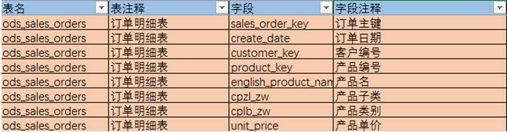
    
    **需求分析与编程：**
    
    1.  求每天产生的订单里，每个产品类别(`cplb_zw`)下订单数量最大的前3类产品，并统计这3类产品的订单数量。
        
        **代码：**
        ```sql
        with t1 as(
        select substr(create_date,1,10) as date_info,
        cplb_zw,cpzl_zw,
        count(*) as num
        from ds_hiveclass_test.ods_sales_orders
        group by create_date,cplb_zw,cpzl_zw
        )

        select *
        from 
        (
        select date_info,cplb_zw,cpzl_zw,num,
        rank() over (partition by date_info,cplb_zw order by num desc) as rk
        from t1
        ) as t2
        where rk<=3
        order by 
            date_info, cplb_zw, rk
        ```
        
        **代码运行截图：**
        
        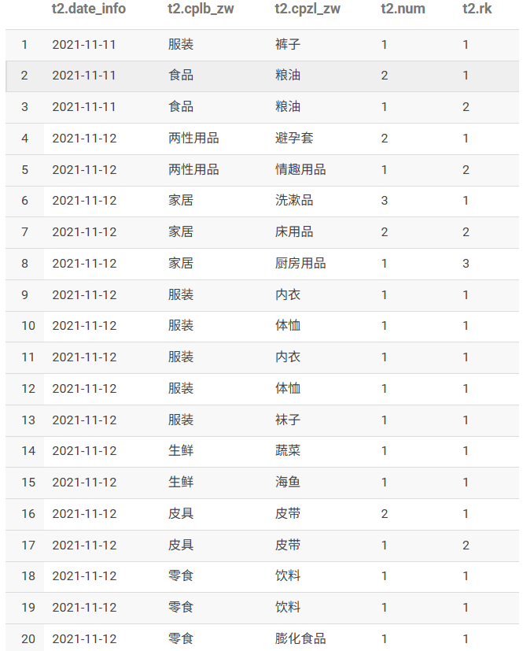
    
    2.  统计连续4天下单的客户，统计指标：客户编号，下单笔数，购买金额，平均每单购买金额。
        
        **代码：**
        ```sql
        with t1 as(
        select substr(create_date,1,10) as date_info,
        customer_key,
        date_add(substr(create_date, 1, 10),row_number() over (partition by customer_key order by substr(create_date,1,10) desc)) as date_flag
        from ds_hiveclass_test.ods_sales_orders
        group by substr(create_date, 1, 10),customer_key
        )
        ,
        t2 as(
        select customer_key,date_flag,
        count(*) as num1
        from 
        t1
        group by customer_key,date_flag
        having num1>=4
        )
        ,
        t3 as (
        select customer_key,sales_order_key,unit_price,
        avg(unit_price) over (partition by customer_key) as avg_price,
        count(sales_order_key) over (partition by customer_key) as order_num
        from ds_hiveclass_test.ods_sales_orders
        group by customer_key,sales_order_key,unit_price
        ) 


        select t3.customer_key,t3.unit_price,t3.avg_price,t3.order_num
        from t3
        left semi join t2
        on t3.customer_key=t2.customer_key
        ```
        
        **代码运行截图：**
        
        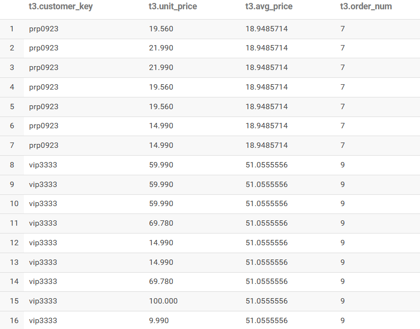
        
22. 集群数仓有表`ds_hiveclass_test.dataexchange_test` 有如下数据，通过行列转换（10分）
    
    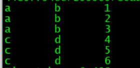
    
    1.  **需求1**：要求将表的数据转换变为如下数据结果集1：
        
        ```
        a       b       1,2,3
        c       d       4,5,6
        ```
        
        **代码：**
        ```sql
        SELECT str1,str2,collect_list(id)
        FROM ds_hiveclass_test.dataexchange_test
        GROUP BY str1, str2;
        ```
        
        **代码运行截图：**
        
        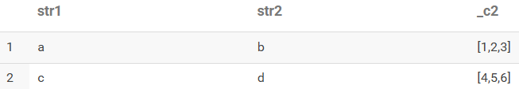
    
    2.  **需求2**：使用子查询，将上面的数据结果集1的结果作为源表，进行复原实现如下效果。
        
        **代码：**
        ```sql
        with t1 as (
        SELECT str1,str2,collect_list(id) as id_array
        FROM ds_hiveclass_test.dataexchange_test
        GROUP BY str1, str2
        )

        select str1,str2,id
        from t1
        lateral view explode(id_array) temp_table as id;
        ```
        
        **代码运行截图：**
        
        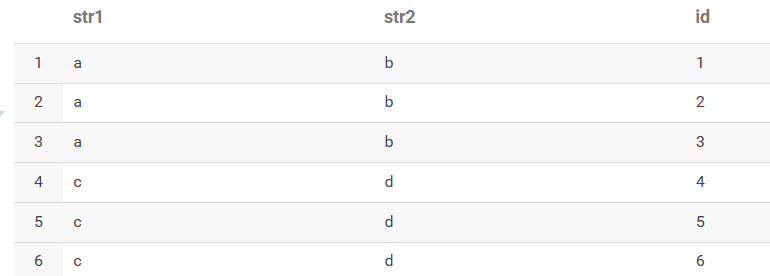

23. 我们有如下的用户访问数据，存储到对应的`ds_hiveclass_test.dws_user_action_01`表，表与数据结构如下(10分)。
    
    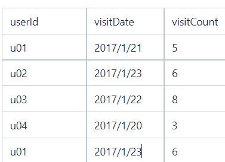
    
    **要求**：使用SQL统计出每个用户的累积访问次数，如下表所示：
    
    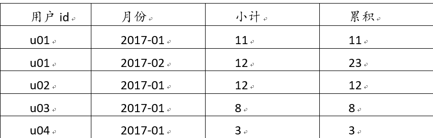
    
    **代码：**
    ```sql
    with t1 as (
    SELECT DISTINCT userid,substr(visitdate,1,6) as date_info,
    sum(visitcount) over(partition by userid,substr(visitdate,1,6) order by substr(visitdate,1,6) ) as sum1
    FROM ds_hiveclass_test.dws_user_action_01
    )
    select userid,
    CONCAT_WS('-', 
            substr(date_info, 1, 4),  -- 年份
            LPAD(substr(date_info, 6), 2, '0')  -- 月份并补零
            ),
    sum1,
    sum(sum1) over(partition by userid order by date_info ) as sum2
    from t1
    ```
    
    **代码运行截图：**
    
    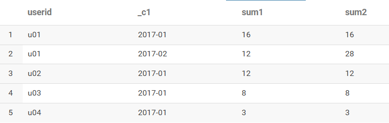

24. 已知数仓表:`ds_hiveclass_test.dww_china_national_population_census_7th` 表结构如下（15分）
    
    表中数据为真实第7次全国人口普查数据；
    
    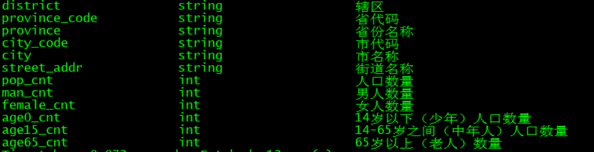
    
    1.  按照省份、城市、地区这三个维度的任意组合，统计出对应的人口数量和男，女人数，请写出对应的统计脚本。
        
        **代码：**
        ```sql
        SELECT 
        province,
        city,
        street_addr,
        SUM(pop_cnt) AS pop_cnt,
        SUM(man_cnt) AS man_cnt,
        SUM(female_cnt) AS female_cnt
        FROM ds_hiveclass_test.dww_china_national_population_census_7th
        GROUP BY province, city, street_addr
        WITH CUBE
        ```
        
        **代码运行截图：**
        
        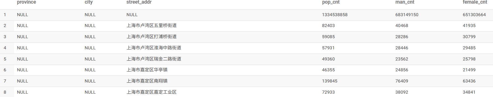
    
    2.  查看按照省份、省份+城市、城市+地区这三组维度的组合，统计出对应的人口数量和男女人数，请写出对应的统计脚本。
        
        **代码：**
        ```sql
        SELECT 
        province,
        city,
        street_addr,
        SUM(pop_cnt) AS pop_cnt,
        SUM(man_cnt) AS man_cnt,
        SUM(female_cnt) AS female_cnt
        FROM ds_hiveclass_test.dww_china_national_population_census_7th
        GROUP BY province, city, street_addr
        GROUPING SETS (
            (province, city),         -- 省-市组合
            (city, street_addr),      -- 市-街道组合
            (province)               -- 省级汇总
        )
        ```
        
        **代码运行截图：**
        
        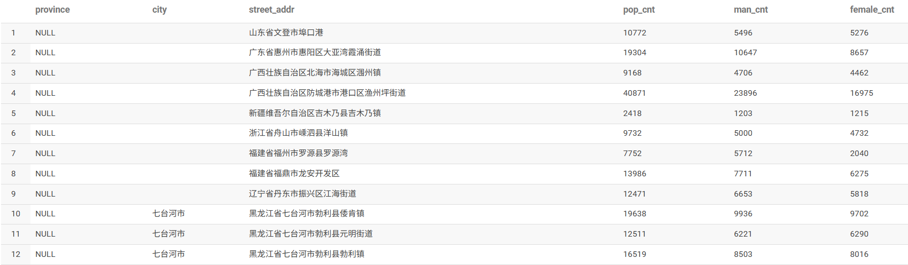
    
    3.  按女人数排序，统计展示前10%女人最多的的地区是哪些、以及获取这些地区对应的省份和城市？
        
        **代码：**
        ```sql
        WITH t1 AS (
            SELECT 
                street_addr,
                female_cnt,
                RANK() OVER (ORDER BY female_cnt) AS rk
            FROM ds_hiveclass_test.dww_china_national_population_census_7th
        ),
        t2 AS (
            SELECT 
                COUNT(*) AS num
            FROM ds_hiveclass_test.dww_china_national_population_census_7th
        ),
        t3 AS (
            SELECT 
                t1.street_addr
            FROM t1
            INNER JOIN t2 
            WHERE t1.rk <= ROUND(t2.num * 0.1)
        )

        SELECT 
            t4.province,
            t4.city,
            t4.street_addr,
            t4.female_cnt
        FROM ds_hiveclass_test.dww_china_national_population_census_7th t4
        LEFT SEMI JOIN t3 ON t4.street_addr = t3.street_addr
        ORDER BY t4.female_cnt DESC
        ```
        
        **代码运行截图：**
        
        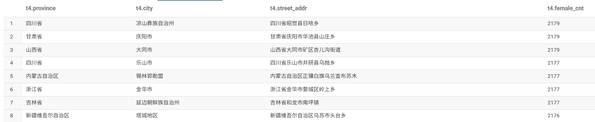

补充：
详细 MapReduce的shuffle过程是什么？shuffle过程有几次排序和数据落盘？（10分）

从 map 任务到 reduce 任务之间的数据流称为shuffle。
shuffle 在 MapReduce 整个阶段中所处的工作阶段是 map 输出后到 reduce 接收前，具体可以分为 map 端和 reduce 端前后两个部分。

map端：
（1）memory buffer（环形内存缓冲区）：每个 map 任务都有一个环形内存缓冲区，用于存储输出结果
（2）数据分区和排序：在写入磁盘之前，线程首先根据数据最终要传递给的 reducer 将数据划分成相应的分区。在每个分区中，后台线程按键（key）进行内存中的排序操作。--第一次排序
（3）combiner函数运行（如果有），在排序后的输出上运行，降低后续写入磁盘和传递给reducer的数据量
（4）到达阈值，Spill到磁盘，将缓冲区中的内容写入到指定目录下的溢出文件 --第1次落盘
（5）多个溢出文件合并（merge），被合并成一个已分区且已排序的输出文件，并写入磁盘。（这一个过程最终写入前，可以有Combiner 函数再次运行，压缩等操作）--第二次排序，第二次落盘

reduce端：
（1）copy:拉取map任务的输出数据，复制到 Reduce 任务的 JVM 内存中
（2）merge 和 sort 阶段：当内存缓冲区中的数据量达到一定阈值时，会触发 spill 操作，将内存中的数据溢写到磁盘，同时写入前对这些数据做一次排序
（当来自不同 Map Task 的数据时，需要合并排序 merge-sort，也可再次进行Combiner操作【这里是对不同maptask的输出进行的combiner，前面map过程是做不到的】）。-- 第三次排序，第三次落盘
（3）将具有相同key的数据结果作为Reduce函数的输入

